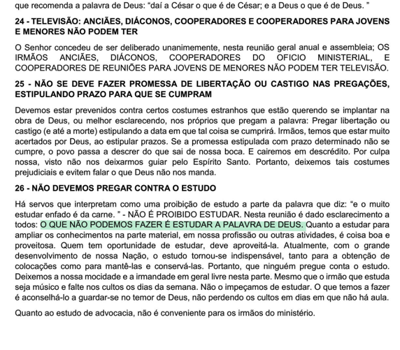
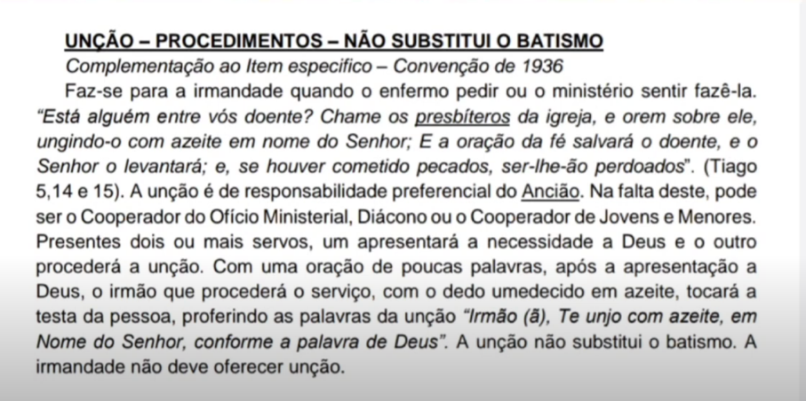
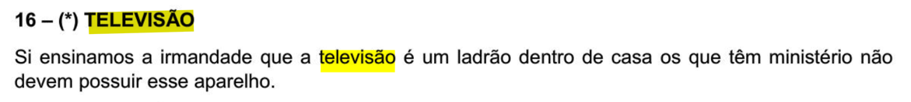
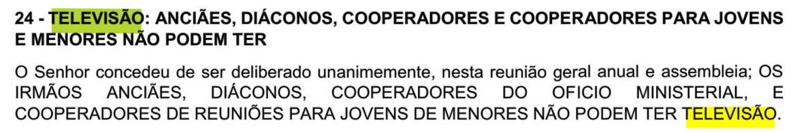
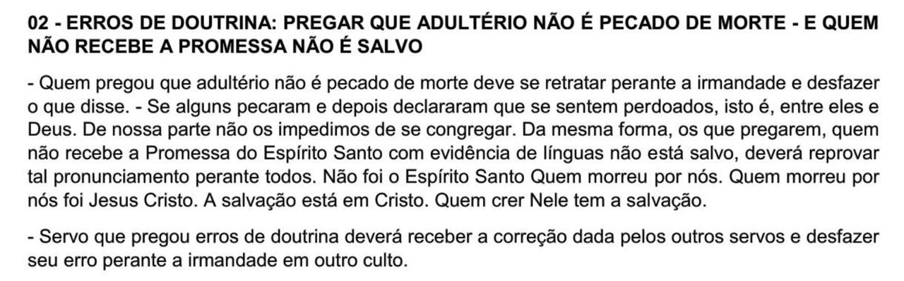

# Análise Crítica dos Principais Problemas Doutrinários da Congregação Cristã no Brasil (CCB)

## Introdução

Este estudo tem como objetivo analisar criticamente os principais pontos doutrinários e práticas da Congregação Cristã no Brasil (CCB) que geram controvérsia. A análise será dividida em duas categorias principais:
- **Problemas Principais:** Distorções graves do Evangelho e da Palavra de Deus que, ao serem compreendidas, justificariam a saída de um membro da instituição.
- **Problemas Secundários:** Questões que, embora possam ser consideradas erros ou práticas equivocadas, admitem diferentes pontos de vista e não necessariamente invalidam a totalidade da fé professada pela instituição, caso os pontos principais fossem corretos.

---

## I - Problemas Doutrinários Principais (Distorções do Evangelho)

### 1. A Doutrina da Escritura: A Bíblia "Contém" a Palavra de Deus
- Crítica à visão de que a Bíblia "contém" a palavra de Deus, em oposição à doutrina da inspiração verbal e plenária ("é" a Palavra de Deus), o que abre espaço para "novas revelações" e subjetivismo.

A base de qualquer análise doutrinária de uma igreja deve começar por sua visão sobre as Escrituras. No caso da Congregação Cristã no Brasil (CCB), o problema fundamental já se apresenta em seu primeiro e mais importante ponto de doutrina oficial:

> "1. Nós cremos na inteira Bíblia Sagrada e aceitamo-La como **contendo** a infalível Palavra de Deus, inspirada pelo Espírito Santo. A Palavra de Deus é a única e perfeita guia da nossa fé e conduta, e a Ela nada se pode acrescentar ou d'Ela diminuir. É, também, o poder de Deus para salvação de todo aquele que crê."

A palavra-chave nesta declaração é **"contendo"**. Teologicamente, existe uma diferença abissal entre afirmar que a Bíblia "contém" a Palavra de Deus e afirmar que a Bíblia **"é"** a Palavra de Deus.

A visão histórica e ortodoxa do Cristianismo (reafirmada na Reforma Protestante pelo princípio do *Sola Scriptura*) é que a Bíblia, em sua totalidade, **é** a Palavra de Deus. Cada palavra e toda a sua extensão foram "sopradas por Deus" (2 Timóteo 3:16), tornando-a infalível, inerrante e, acima de tudo, **suficiente**.

A declaração da CCB, ao usar o termo "contendo", cria uma contradição interna fatal. Se a Bíblia apenas "contém" a Palavra de Deus, isso implica que existem partes dela que **não são** a Palavra de Deus. Isso levanta a pergunta inevitável: quem decide o que é e o que não é a Palavra de Deus dentro da Bíblia?

A resposta, na prática da CCB, é o ministério, através da "palavra revelada". Isso significa que:
1.  **A Autoridade Final é Subjetiva:** A autoridade se desloca do texto bíblico objetivo para a interpretação e "revelação" subjetiva do pregador. A Bíblia deixa de ser a autoridade final e se torna uma fonte da qual a "verdadeira" palavra é extraída por revelação espontânea.
2.  **A Suficiência da Escritura é Anulada:** A segunda parte da declaração ("nada se pode acrescentar ou d'Ela diminuir") torna-se vazia. Se um novo ensinamento ou uma nova regra é introduzida como "revelação", isso é, na prática, um acréscimo à Palavra. O ministério assume uma autoridade profética que deveria ter cessado com o fechamento do cânon bíblico.
3.  **A Invalidação do Estudo Teológico:** Se a verdade é recebida por revelação espontânea, o estudo diligente das Escrituras, da gramática original e do contexto histórico torna-se não apenas desnecessário, mas um sinal de falta de fé ou de dependência da "letra que mata". Essa lógica justifica o Anti-intelectualismo por exemplo, já que, se o estudo se torna desnecessário, logo a forma correta de "entender" a bíblia só podem ser acessadas por revelação no momento do culto.

Essa abordagem cria uma dependência perigosa da experiência subjetiva e da autoridade do ministério, em vez de firmar o crente na rocha objetiva da Palavra escrita.

Em contraste direto com essa visão, a Reforma Protestante reafirmou a doutrina bíblica da Escritura, que pode ser resumida em alguns pontos chave:

**A Doutrina Bíblica da Escritura (Sola Scriptura)**

*   **Inspiração Verbal e Plenária:** A Bíblia **é** a Palavra de Deus. Cada palavra (verbal) e toda a sua extensão (plenária) foram "sopradas por Deus" (2 Timóteo 3:16). Os autores humanos escreveram sob a superintendência do Espírito Santo, de modo que o produto final é, simultaneamente, obra de homens e a Palavra infalível de Deus. Não há partes mais ou menos inspiradas.
*   **Inerrância e Infalibilidade:** Porque Deus é seu autor, a Escritura em seus manuscritos originais é isenta de erro (inerrante) em tudo o que afirma e é totalmente confiável e verdadeira (infalível).
*   **Suficiência:** As Escrituras contêm tudo o que precisamos para a salvação e para viver uma vida que agrada a Deus (2 Timóteo 3:17). Não precisamos de novas revelações, profecias ou ensinamentos que adicionem ou contradigam o que já foi revelado. A Palavra é suficiente.

A visão da CCB enfraquece esses três pilares. Ao colocar a "palavra revelada" no mesmo nível ou acima da Bíblia, ela nega a suficiência das Escrituras. Ao permitir que a interpretação subjetiva defina o que é ou não a Palavra de Deus, ela abre mão da inerrância e da autoridade objetiva do texto. Este erro fundamental é a raiz de quase todos os outros problemas doutrinários que serão analisados a seguir.

Portanto, o primeiro ponto de doutrina da CCB, apesar de sua aparência de "guia de Deus", é um "cavalo de Troia". A palavra "contendo" mina todo o restante da declaração, fornecendo a base doutrinária para a desvalorização da Bíblia como a Palavra final e suficiente, e elevando a experiência subjetiva (o sentir) e a autoridade ministerial a um status igual ou superior ao das Escrituras. Este erro fundamental é a raiz de quase todos os outros problemas doutrinários da instituição.

A questão da autoridade, natureza e suficiência das Escrituras é o alicerce sobre o qual todas as demais doutrinas cristãs são construídas. Se não é Deus quem falou por meio da Bíblia, nada do que pregamos ou defendemos tem fundamento. Qualquer desvio nesse ponto inicial levará, inevitavelmente, a erros em cascata por todo o sistema teológico.

### 2. Hermenêutica e Exegese Problemática
- Análise do método de interpretação bíblica da CCB, que leva a conclusões doutrinárias equivocadas.
- O uso de textos fora de contexto como base para doutrinas (ex: Mateus 7:23), sendo a causa-raiz de muitas outras heresias.

Uma visão defeituosa sobre a natureza da Bíblia (Ponto #1) leva, inevitavelmente, a um método defeituoso de interpretá-la. Se a Escritura não é a Palavra de Deus em sua totalidade, mas apenas "contém" verdades a serem entendidas pela revelação, então os princípios de interpretação bíblica (hermenêutica) e a extração do sentido do texto (exegese) são abandonados. Em seu lugar, surge uma metodologia baseada no subjetivismo, na intuição e na autoridade do pregador.

O método hermenêutico da CCB pode ser caracterizado como uma forma de experiências ou doutrinas preconcebidas. Isso se opõe à busca de extrair do texto o significado que o autor original, inspirado pelo Espírito Santo, pretendia comunicar levando em conta pra quem ele estava falando e qual o contexto histórico do texto. Na prática, isso se manifesta de várias formas:

1.  **Desprezo pelo Contexto:** Versículos são frequentemente arrancados de seu contexto imediato, do livro em que estão e da aliança a que pertencem. Um texto do Antigo Testamento, por exemplo, pode ser aplicado diretamente aos crentes da CCB sem qualquer consideração pela obra de Cristo, quase um como aconteceu com tal personagem, deus vai fazer com você também. 
    a. Um exemplo clássico é o uso de Mateus 7:23 ("Nunca vos conheci; apartai-vos de mim, vós que praticais a iniquidade") para condenar pecados sexuais específicos, quando o contexto imediato trata de falsos profetas que confiavam em suas próprias obras.
    b. **A Promessa a Abraão (Gênesis 12):** A promessa de Deus de abençoar Abraão e engrandecer seu nome é frequentemente aplicada como uma garantia de prosperidade material e sucesso pessoal para o crente. Ignora-se o contexto da aliança Abraâmica, cujo clímax é a vinda de Cristo como a "semente" que abençoaria todas as nações (Gálatas 3:16, 29). A promessa não é sobre riqueza individual, mas sobre a redenção através de Cristo.
    c. **Davi e Golias (1 Samuel 17):** A história é comumente apresentada como um manual de autoajuda para o crente "derrotar os gigantes" da sua vida (doenças, problemas financeiros, etc.). Essa interpretação ignora a tipologia bíblica, onde Davi é uma figura de Cristo, o verdadeiro Rei que derrota o inimigo (Satanás, pecado e morte) em nome do Seu povo, que é incapaz de lutar por si mesmo. A história não é primariamente sobre a nossa coragem, mas sobre a vitória do nosso Salvador.
    d. **O Salmo 23 ("Nada me faltará"):** Este salmo de confiança na provisão e cuidado de Deus é frequentemente interpretado como uma garantia de prosperidade material e ausência de qualquer dificuldade financeira. A frase "nada me faltará" é retirada de seu contexto poético de contentamento em Deus e transformada em uma promessa de que o crente nunca enfrentará necessidades materiais, o que contradiz a experiência de Cristo e dos apóstolos.
    e. **O Salmo 91 ("O Escudo Protetor"):** É frequentemente tratado como um amuleto ou um encantamento que garante proteção física total contra doenças, acidentes e perigos. Embora seja uma poderosa declaração de fé e confiança na soberania de Deus, não é uma promessa incondicional de invulnerabilidade. O próprio Satanás usou este salmo para tentar Jesus (Mateus 4:6), mostrando como ele pode ser distorcido quando retirado de um contexto de submissão à vontade soberana de Deus.
    f. **"Onde estiverem dois ou três reunidos" (Mateus 18:20):** Este versículo é usado para validar qualquer pequena reunião ou grupo de oração, afirmando a presença de Cristo de forma especial. No entanto, o seu contexto imediato (Mateus 18:15-20) é o processo de disciplina eclesiástica. A promessa da presença de Cristo aqui confere autoridade ao julgamento da igreja (representada por "dois ou três" testemunhas) ao lidar com o pecado, não sendo uma fórmula genérica para qualquer tipo de encontro.

2.  **Alegorização Excessiva:** Textos que são claramente narrativas históricas ou instruções são transformados em alegorias místicas. Detalhes de uma história — o nome de uma pessoa, um número, um lugar — recebem significados "espirituais" que não têm qualquer base no texto em si, dependendo inteiramente da revelação ou criatividade do pregador. 
    a. **Numerologia como Fórmula Espiritual:** A prática de transformar números bíblicos em fórmulas para obter bênçãos. Por exemplo, oração de "7 dias" consecutivos, baseadas nas 7 voltas de Jericó, onde a repetição do número se torna um gatilho místico para a vitória, ignorando o contexto histórico e teológico único desses eventos.
    b. **Frases Bíblicas como Amuletos:** O uso de frases teológicas como amuletos místicos. A expressão "cobre-me com teu sangue", por exemplo, é retirada de seu profundo contexto soteriológico (a expiação e o perdão dos pecados) e transformada em um encantamento para proteção física contra acidentes ou perigos, tratando o sangue de Cristo como um talismã.
    c. **Criação de Rituais com Poder Especial:** A crença de que certos horários ou práticas, como a "oração das 3 horas da manhã", possuem um poder espiritual superior. Isso se baseia em interpretações alegóricas de momentos em que personagens bíblicos oraram, transformando a oração em uma fórmula mágica em vez de um relacionamento com Deus, acessível a qualquer momento.

Veja algumas provas sobre o tema nos vídeos abaixo:

https://www.youtube.com/watch?v=DO66z59xX58 (marçola: oração do pobre abençoa)
Quem: Presidente da CCB Marçola
Transcrição: Até pouco tempo atrás, e em alguns lugares isso já está acontecendo, está faltando comida, e não é só na casa da irmandade. A situação está muito grave. Há uma semana, ou alguns dias atrás, uma irmãzinha ligou para a mãe dela dizendo, me traz comida, porque eu já não tenho mais nada em casa.  Então, você que chora, irmão, você que chora. Se você tem um recursosinho, olhe para a piedade, bem aventurado é quem ajuda o pobre. Gente, guardem isso. A oração do pobre abençoa. O Deus te abençoe que vem da boca do pobre, irmão, não sai mais da tua vida.  Eu vou fazer uma comparação simples aqui, mas é interessante. Os irmãos já viram quando o pé da chiclete gruda no cabelo? Não tem jeito de tirar aquilo com crença nenhuma. Irmão, quando o pobre fala, Deus te abençoe, meu irmão, isso fica colado na tua vida, não sai mais. Irmão, quem tem uma reserva, quem é abastado, não sente falta. Para um dar cinco reais, ele precisa economizar. Outro, para dar dois, precisa deixar de pegar o ônibus. Mas tem alguém? É só passar o caixão e a senha. Cela com amém. Amém.

https://www.youtube.com/watch?v=Aq-dlm070Lg (jesus ressucitou mas, não entrou no reino)
Quem: Presidente da CCB Marçola
Transcrição: E ainda, o filho de Deus, morreu e ressucitou, mas no reino ele ainda não entrou, no reino ele vai entrar, junto com a igreja, que é a esposa, apresentar ao pai: Pai a minha esposa da terra tá chegando.

https://www.instagram.com/p/DKureh8AI69/ (jesus veio purificar os anjos)
Transcrição: Esse homem chamado Jesus, Ele abrigava o Espírito do nosso Cristo, do nosso Senhor, que foi tão grande que veio purificar a terra. E o que é mais maravilhoso, e pouco conhecido pela igreja, é que Ele veio purificar até a memória dos anjos. Vocês sabiam disso? Vocês sabiam que os anjos, houve um tempo na história da criação em que, lá em cima no céu, aconteceu uma rebelião, e essa rebelião ocorreu por causa da vaidade?  Se nós víssemos Deus na plenitude, não teríamos mais como pecar, o pecado estaria excluído da nossa agenda, mas também não teríamos exercício de livre escolha, o livre arbítrio estaria excluído. Por isso, lá em cima no céu, no princípio, Deus deixou a glória dEle bem pequena, reduzida, restrita. E foi nesse ambiente restrito de glória que aconteceram, então, as rebeliões.  Quando acabou aquela rebelião, Deus estendeu a glória dEle para todos os anjos e mostrou, está aqui a minha glória. Nós ficamos do lado de Deus na guerra, na batalha que houve no céu, nós ficamos do lado de Deus. Mas foi criada uma raiz de dúvida, de incredulidade, de pecado no nosso coração, mesmo estando do lado de Deus.  Então Deus teve uma ideia genial. Ele criou um planeta e enviou todos esses anjos contaminados para esse planeta. E, ao nascermos aqui, Ele apagou a nossa memória. E agora, nesse planeta, com a nossa memória apagada, você vai revelar de que lado você está realmente. Se você estava mentindo quando disse que estava do lado de Deus, ou se você era um verdadeiro anjo que estava contaminado, mas que de fato está do lado de Deus, esse mundo vai revelar quem é quem.  Cada um tem um grau de contaminação diferente, e o grau de contaminação que você tem é o grau de sofrimento que você vai ter aqui nesse planeta. Quanto mais contaminado, maior é o nível de sofrimento. Mas é claro que o sofrimento também está ligado à hierarquia que você tinha no céu. Se você era um anjo graduado, então você sofre ataques mais graduados.  Ele vai dizer que os homens são anjos que foram contaminados, mas não passaram a contaminação para frente, por isso você nasce homem aqui. Agora, se você é uma mulher, você é um anjo que foi contaminado e passou a contaminação para frente, por isso você gera outro anjo caído aqui embaixo, você gera filhos. Porque você foi contaminado, ouviu a proposta de Satanás e passou isso para frente, e então gerou outro contaminado.

3.  **"Proof-texting" (Uso de Textos-prova):** A prática de encontrar versículos isolados para "provar" uma doutrina ou uma "nova revelação" é generalizada. Não importa o que o versículo significa em seu contexto; o que importa é que algumas palavras ou frases parecem apoiar a ideia que o ministério deseja ensinar.
    a. **"Não toqueis nos meus ungidos" (Salmo 105:15):** Este versículo é frequentemente usado pela liderança para se blindar contra qualquer crítica ou questionamento. O contexto, no entanto, é a proteção de Deus sobre os patriarcas (Abraão, Isaque, Jacó) contra os reis pagãos. Não é uma ordem para que os membros da igreja se submetam cegamente a uma liderança sem prestação de contas.
    b. **"Tudo posso naquele que me fortalece" (Filipenses 4:13):** É usado como um lema para sucesso pessoal, profissional ou financeiro. O contexto, porém, é o apóstolo Paulo falando sobre sua capacidade de se contentar em qualquer situação, seja de fartura ou de fome, de abundância ou de necessidade. É uma declaração de suficiência em Cristo em meio ao sofrimento, não uma promessa de conquistas mundanas.
    c. **"A letra mata, mas o Espírito vivifica" (2 Coríntios 3:6):** Este é o principal "proof-text" usado para justificar o anti-intelectualismo. O contexto real é o contraste entre a Antiga Aliança da Lei (a "letra" que condena) e a Nova Aliança do Espírito (que dá vida). É distorcido para se tornar uma arma contra o estudo bíblico formal, tratando o conhecimento como algo que "mata" a fé.
    d. **"Não julgueis, para que não sejais julgados" (Mateus 7:1):** É usado para blindar a liderança de qualquer crítica. O versículo é aplicado para proibir que os membros "julguem" os ensinamentos, enquanto a própria instituição mantém um discurso altamente julgador sobre os de fora e sobre os membros que desviam dos costumes. Ignora-se o restante do ensino de Jesus sobre o "julgar com reto juízo" (João 7:24).

As consequências dessa hermenêutica problemática são graves:
- **Criação de Doutrinas Humanas:** Sem as amarras do contexto e da exegese fiel, é possível "provar" praticamente qualquer coisa com a Bíblia. É assim que surgem doutrinas como o "pecado de morte", a anjolatria e a hierarquia de pecados que serão analisadas mais adiante.
- **Insegurança e Dependência:** O membro comum se torna incapaz de ler e entender a Bíblia por si mesmo. A "verdadeira" interpretação depende sempre da última "revelação" ouvida no púlpito, criando uma dependência total do ministério.
- **Analfabetismo Bíblico Funcional:** Os membros podem ser capazes de citar dezenas de versículos, mas não compreendem a grande história da redenção que a Bíblia conta, de Gênesis a Apocalipse.
- Muitas vezes, um pregador entra em contradição com outros pregadores, pois cada um pode criar sua própria alegoria a partir do mesmo texto.
  - https://www.youtube.com/shorts/Kp0yM5XA9d0 (Ancião fala sobre a certeza da salvação outro fala sobre a incerteza)
  - - https://youtube.com/shorts/8yFWrNLnEr4?si=7mHivrvJV8mDtqLX (Primeiro fala que deus não força ninguem, passa uma ideia arminiana)
  - https://youtube.com/shorts/FQdTzwmz3s4?si=iJ1DmZXa77ijh175 (Depois fala que a Graça não é o perdão imerecido e passa uma ideia calvinista, sobre a graça ser o poder de deus que opera no crente, depois fala que é o perdão sim, e que não há salvação por obras)
  - https://www.youtube.com/watch?v=nKnsiBWdQ4o (Marçola, nós somos salvos pelas obras)
  - - https://www.youtube.com/shorts/dlrG943D5Oc (Tem muita gente boa, mas não é da CCB, passando uma ideia de que obras salvas)
  - https://www.youtube.com/watch?v=jvVMy3Jb8OU (CCB é a graça depois CCB não é a graça)
  - estamos tão acostamos com essas maluquises que temos até a ideia de ter o bolso furado, pras coisas que não boas (https://www.instagram.com/p/DMOnr2_uaZQ/?img_index=2)

Esse videos acima, mostra a completa bagunça teologia que é a pregação da ccb, cada hora falam uma coisa, e não há um consenso, e o pior, não há um corpo doutrinário que possa ser consultado. Tudo isso é fruto dessa interpretação alegórica e freestyle da biblia, sem nenhum estudo ou embasamento, que cria essas distorções. A hermenêutica bíblica sadia, em contraste, segue princípios claros: busca entender o texto em seu contexto histórico-gramatical, permite que as Escrituras interpretem as próprias Escrituras (comparando passagens claras com as mais obscuras) e submete a interpretação individual à sabedoria da igreja ao longo da história. Ao abandonar esses princípios, a CCB abre as portas para o erro e se afasta da verdade objetiva da Palavra de Deus.

### 3. Demonização da Teologia (Culto ao Anti-intelectualismo)

O desprezo pelo estudo teológico formal não é apenas uma característica cultural da CCB, mas uma doutrina funcional que deriva diretamente dos dois primeiros erros: a visão de que a Bíblia apenas "contém" a Palavra de Deus e a hermenêutica baseada na "revelação" espontânea. Se a verdade não está no texto em si, mas é "revelada" no momento da pregação, então qualquer esforço para estudar a Bíblia de forma sistemática, aprender sobre seu contexto histórico, suas línguas originais ou a história da interpretação da igreja se torna, na melhor das hipóteses, inútil, e na pior, um ato de carnalidade e incredulidade.

Veja algumas provas sobre como isso é amplamente falado, e algumas contradições que vão servir de base para nosso tema do Anti-intelectualismo
- https://www.youtube.com/shorts/RvEh3zoVK6g (marçola presidente da CCB diz que poe "ler" sim, que é preciso ler)
  mas... https://youtube.com/shorts/MCWSY3KqfAY?si=hPcJPEsJCjnNmXDz (paulinho do paulista, um ancião muito "apreciado") diz que estudar a biblia não é de Deus, de quem não se contenta com o que Deus deu (pregação do pupito) até o dia de hoje
- https://www.youtube.com/watch?v=tbsvUJNkb2I Outro ancião diz que o "Espirito de estudar" a biblia é lepra, e vai expulsar o demonio do estudo biblico
- Isso é antigo, veja um topico de ensinamento de 1971
   mas está bem claro "Não podemos estudar a palavra de Deus"
- https://www.youtube.com/watch?v=LH19k6WAlBw (Claudio codonha, outro ancião muito apreciado, fala sobre pregar conhecimento), mas Deus vai fazer a limpeza na "obra" e fala que a palabra boa é a palabra da CCB.
- https://www.instagram.com/p/DGjNo6SSm_M/, outro ancião fala que devemos rejeitar o conhecimento e buscar o conhecimento que está guardado no céu
- Ancião fala contra grupo de estudo biblico: https://www.instagram.com/p/DGp4MREO-vV/?img_index=2
- ancião fala para fujir do estudo biblico: https://www.instagram.com/p/DGq8btAysFi/?img_index=2
- ancião fala que biblia de estudo precisa ser orientada a nossa forma de fé, não a verdade: https://www.instagram.com/p/DHE6uYsym8t/
- https://www.instagram.com/p/DLDEajeOlOE/ "Deus revelou" a palavra na página em branco entre o novo e o antigo testamento
  https://www.instagram.com/p/DMRFI8yyxCI/

Essa "demonização da teologia" se manifesta de várias formas:

1.  **A Teologia como Inimiga da Fé:** O estudo teológico é frequentemente retratado como "letra" que "mata" o espírito, em oposição à "palavra viva" recebida por revelação. Usa-se o texto de 2 Coríntios 3:6 ("a letra mata, mas o Espírito vivifica") fora de seu contexto (problema 2) para criar uma falsa dicotomia entre conhecimento e fé, como se fossem mutuamente exclusivos. O conhecimento é visto como orgulho humano, soberba e conhecimento humano, enquanto a ignorância é exaltada como simplicidade, humildade e espiritual.
    *   Exemplos práticos dessa pregação podem ser vistos em vídeos que circulam entre a membresia, onde o estudo bíblico é abertamente desincentivado em favor da "experiência" momentânea do culto.

2.  **Criação de Dependência e Controle:** Ao proibir ou desincentivar o estudo, o ministério garante (mesmo que involuntariamente) que os membros não tenham as ferramentas críticas para analisar e questionar os ensinamentos recebidos. O crente médio se torna completamente dependente da interpretação do púlpito, incapaz de "examinar as Escrituras" por si mesmo para ver se as coisas são de fato assim (Atos 17:11). Isso cria um sistema fechado em si mesmo, onde a liderança não precisa prestar contas de seus ensinos, pois qualquer questionamento é rotulado como "duvidar da revelação". 

3.  **A Justificativa para a Incoerência Doutrinária:** A falta de uma base teológica sólida permite que ensinamentos contraditórios coexistam sem problemas. Um pregador pode dizer algo em uma reunião, e outro pode dizer o oposto em outra, e ambos são validados como "palavra revelada" para aquele momento específico. Não há um corpo doutrinário consistente para o qual apelar, exceto os vagos e maleáveis "pontos de doutrina".

Em contraste, a visão bíblica exalta o conhecimento de Deus e Sua Palavra como um caminho para a maturidade espiritual e a verdadeira adoração.
*   **A Bíblia Ordena o Estudo:** Paulo instrui Timóteo a se apresentar a Deus "aprovado, como obreiro que não tem de que se envergonhar, que maneja bem a palavra da verdade" (2 Timóteo 2:15). O verbo "manejar bem" (orthotomeo) implica cortar reto, dividir corretamente - uma tarefa que exige diligência e estudo.
*   **O Amor Cresce com o Conhecimento:** Paulo ora para que o amor dos filipenses "aumente mais e mais em pleno conhecimento e toda a percepção" (Filipenses 1:9), para que possam discernir o que é excelente. O amor e o conhecimento andam juntos.
*   **A Mente é Parte da Adoração:** Jesus resume o maior mandamento como amar a Deus com todo o coração, alma, força e **entendimento** (Marcos 12:30). A mente não é descartada na adoração; ela é consagrada a Deus.

Portanto, o anti-intelectualismo da CCB não é uma marca de espiritualidade superior, mas uma estratégia de controle (mesmo que involuntária) que mantém os membros em um estado de infância espiritual (Efésios 4:14), vulneráveis a "todo vento de doutrina" que sopra do púlpito. É uma barreira que impede os crentes de crescerem na graça e no **conhecimento** de nosso Senhor e Salvador Jesus Cristo (2 Pedro 3:18).

Nunca vamos chegar nem perto de entender a beleza das linguas originais, e como isso apontava pra jesus: https://youtube.com/shorts/dGL-NPbpV50?si=Ojhsd6DhViIQc7-b

### 4. Substituição do Evangelho pela Experiência Subjetiva

Quando a autoridade final é removida da Palavra de Deus (Ponto #1), a interpretação se torna uma questão de intuição (Ponto #2), e o estudo é demonizado (Ponto #3), o que resta para o crente se apegar? A resposta na CCB é, invariavelmente, a **experiência subjetiva**.

O Evangelho, a boa notícia objetiva sobre a vida, morte e ressurreição de Jesus Cristo para a salvação dos pecadores, é sutilmente colocado em segundo plano. Em seu lugar, a ênfase é transferida para o que o indivíduo **sente** durante o culto ou a oração. A validação da fé e a segurança da salvação não são mais encontradas na promessa de Deus em Cristo, mas em um conjunto de experiências emocionais e místicas.

Essa substituição se manifesta da seguinte forma:

1.  **A busca pelo "Sentir":** A pergunta mais comum após um culto não é "O que a Palavra de Deus nos ensinou?", mas sim: "Você sentiu Deus hoje? Ou você entrou do mesmo jeito que entrou? A pior prova é a prova espiritual, quando não sentimos Deus".

O "sentir" a presença, uma emoção forte, choro ou uma "palavra" recebida — torna-se o termômetro da espiritualidade e da aprovação divina. Se não há "sentir", o culto foi "frio" e a fé do indivíduo é questionada.

Veja o ancião paulinho dizendo, para pararem de pedir pra ele falar de falar em jesus: https://www.instagram.com/p/DJc8vizN8PH/, ou seja, alguem queria um culto mais cristocentrico, e ele não gostou do pedido.

2.  **Segurança baseada em Sentimentos:** A segurança da salvação, que biblicamente repousa na obra consumada de Cristo na cruz (Hebreus 10:10-14), é transferida para a instabilidade das emoções humanas. O crente vive em um ciclo vicioso de dúvida e busca por reafirmação. Ele está "salvo" no dia em que "sente" a presença de Deus, mas questiona sua salvação no dia em que as emoções não correspondem.

3.  **A "Palavra Revelada" como Fonte de Direção:** Em vez de buscar sabedoria e direção no estudo consistente das Escrituras, o membro é ensinado a esperar por uma "palavra revelada" específica para cada decisão de sua vida. Isso transforma a relação com Deus em uma busca por "dicas" místicas, em vez de um crescimento em santidade e sabedoria através da Palavra.

4.  **A zona de conforto da Intensidade Emocional:** Como resultado, o critério para um "bom lugar para congregar" deixa de ser a fidelidade na pregação da Palavra e passa a ser a intensidade da experiência oferecida. O crente é levado a buscar cultos "Top" ou "astronômicos", com muitas manifestações emocionais ("foguinhos"), pois sua sobrevivência espiritual passa a depender desses picos de sentimento, e não da nutrição pela verdade do Evangelho. Um crente da CCB quando para de sentir essa falsa precensa, se sente morto espiritualmente, e precisa de um "renovo" para voltar a sentir Deus, e isso vira um ciclo vicioso de dependência emocional sem fim.

**O Fundamento Bíblico da Segurança Cristã**

A fé cristã não é um salto no escuro; ela se baseia em fatos históricos e promessas objetivas. A segurança do crente não está em seus sentimentos vacilantes, mas na rocha inabalável da Palavra de Deus e na obra de Cristo.

*   **A Promessa Objetiva:** "Em verdade, em verdade vos digo que quem ouve a minha palavra e crê naquele que me enviou tem a vida eterna e não entra em juízo, mas já passou da morte para a vida" (João 5:24). A promessa é ligada ao ato de ouvir e crer, não de sentir.
*   **O Testemunho da Escritura:** "Estas coisas vos escrevi, a vós que credes no nome do Filho de Deus, **para que saibais** que tendes a vida eterna" (1 João 5:13). A certeza (saber) vem da Palavra escrita, não de uma experiência.
*   **O Testemunho Interno do Espírito:** "O próprio Espírito testifica com o nosso espírito que somos filhos de Deus" (Romanos 8:16). É crucial notar que o Espírito testifica *com* nosso espírito, confirmando a verdade objetiva do Evangelho que cremos, e não substituindo-a por um sentimento isolado.

Ao substituir o Evangelho pela experiência, a CCB cria uma fé centrada no homem, e não em Deus. O foco se desloca da obra de Cristo *para nós* para a nossa experiência *em nós*. O resultado é uma espiritualidade instável, ansiosa e, em última análise, idólatra, pois o objeto de confiança se torna a própria experiência, e não o Deus da experiência.

### 5. Legalismo e o Papel das Obras na Salvação

A transição de uma fé baseada na verdade objetiva do Evangelho para uma fé fundamentada na experiência subjetiva (Ponto #4) cria um vácuo de autoridade e certeza. É preciso ter uma métrica visivel, além do "sentir", logo surge o ponto: "como um membro pode provar a si mesmo e aos outros que sua experiência é genuína e que ele está no caminho certo?" A resposta encontrada na CCB é o legalismo. Um sistema rígido de regras visíveis — os "usos e costumes" — é erguido para preencher esse vácuo, oferecendo um padrão de justiça mensurável que serve para validar a experiência subjetiva. Assim, o foco inevitavelmente se desloca da fé em Cristo para um conjunto de obras e meritocracia.

O legalismo é um dos desvios mais sutis e perigosos do Evangelho. Ele não nega a Cristo abertamente, mas adiciona à Sua obra consumada um conjunto de regras e performances humanas como condição para a aceitação e manutenção da salvação. Embora os defensores argumentem que são apenas "conselhos" para uma vida de santidade, na prática, eles funcionam como uma lei não escrita, mas rigidamente aplicada, que define a espiritualidade e a justiça de um membro.

Isso cria alguns problemas, como:

1.  **A Criação de um Padrão de Justiça Humano:** O sistema de "usos e costumes" — que inclui proibições como mulheres usarem calças, homens terem barba, o uso de maquiagem, ir à praia, assistir televisão, entre outros — torna-se a régua pela qual a santidade é medida. A obediência a essas regras externas é frequentemente confundida com a verdadeira santificação, que é uma obra interna do Espírito Santo transformando o coração do crente à imagem de Cristo (2 Coríntios 3:18).

2.  **Obras como Manutenção da Salvação:** A mensagem implícita (e por vezes explícita) é que a desobediência a essas regras pode levar à perda da salvação. O foco da segurança do crente se desloca da fé na justiça de Cristo imputada a ele (Romanos 4:5) para o seu próprio desempenho em guardar os costumes. Isso contradiz frontalmente o princípio da *Sola Gratia* (Salvação somente pela Graça). A graça deixa de ser um dom imerecido e se torna algo que precisa ser mantido por obras.
    *   Vídeos de pregações frequentemente associam a "graça" à própria instituição e ao cumprimento de suas normas, sugerindo que quem está fora da CCB ou de seus costumes está fora da graça.

teologia do medo: https://youtube.com/shorts/Ao-ywWtLRn0?si=NOL58LACRoc_Vfbq
ccb é a graça: https://www.youtube.com/shorts/ZStO4xr1gPE
Exclusivismo: https://youtube.com/shorts/lkA_HDOGFTA?si=fvE04TgGeGZH9zu4
salvação pelas obras: https://www.youtube.com/watch?v=nKnsiBWdQ4o
coleta faz parte da nossa salvação: https://www.youtube.com/shorts/0gqItDJnyrM

3.  **Orgulho Espiritual e Julgamento:** O legalismo invariavelmente produz dois frutos amargos: orgulho naqueles que conseguem seguir as regras e julgamento sobre aqueles que não conseguem (ou não querem). Cria-se uma mentalidade farisaica, onde a justiça própria floresce e a compaixão pela fraqueza alheia desaparece, como na parábola do fariseu e do publicano (Lucas 18:9-14).

**O Evangelho da Graça vs. o Fardo do Legalismo**

A mensagem do Novo Testamento, especialmente nas cartas de Paulo (como Gálatas e Colossenses), é uma batalha constante contra o legalismo que os judaizantes tentavam impor aos primeiros cristãos.

*   **A Liberdade em Cristo:** "Foi para a liberdade que Cristo nos libertou. Permanecei, pois, firmes e não vos submetais, de novo, a jugo de escravidão" (Gálatas 5:1). Paulo chama o legalismo de "jugo de escravidão". As regras da CCB, na prática, funcionam como este jugo, anulando a liberdade cristã.
*   **A Suficiência de Cristo:** "Tende cuidado para que ninguém vos venha a enredar com sua filosofia e vãs sutilezas, segundo a tradição de homens, segundo os rudimentos do mundo e não segundo Cristo" (Colossenses 2:8). Paulo adverte contra regras baseadas em "tradição de homens" que desviam a atenção da suficiência de Cristo. O foco do crente deve estar em Cristo, "em quem todos os tesouros da sabedoria e do conhecimento estão ocultos" (Colossenses 2:3), e não em uma lista de proibições.

Portanto, o sistema de usos e costumes da CCB, embora possa ter a intenção de promover a santidade, acaba por perverter o Evangelho. Ele estabelece um caminho de salvação baseado em obras humanas, obscurece a suficiência da obra de Cristo e impõe um fardo pesado que nem os próprios líderes conseguem carrega    r, afastando os membros da simplicidade e da liberdade da fé em Jesus.

### 6. A Doutrina do Pecado: "Pecado de Morte" e a Minimização da Natureza do Pecado

A salvação por obras e o legalismo (Ponto #5) criam inevitavelmente uma visão distorcida do pecado, resultando em dois grandes erros: a elevação desproporcional da gravidade de alguns pecados (geralmente os que causam escândalo público) e a minimização da gravidade de outros (como os pecados do coração). Um sistema legalista precisa dessa hierarquia para funcionar, definindo quais transgressões quebram o código e justificam a exclusão e quais são só erros e falhas. É nesse contexto que a CCB desenvolve sua própria doutrina, marcada pela invenção do "pecado de morte" e por uma compreensão superficial da natureza radical do pecado como um todo.

1.  **A Invenção do "Pecado de Morte":** A CCB criou uma categoria teológica extra-bíblica chamada "pecado de morte", geralmente aplicada a pecados de natureza sexual (fornicação, adultério). A doutrina ensinada é que, uma vez que um membro comete tal pecado, ele perdeu sua salvação de forma praticamente definitiva, não havendo mais possibilidade de perdão ou restauração à comunhão, mesmo que haja arrependimento.
    *   Essa ideia é frequentemente (e erroneamente) baseada em uma interpretação isolada de 1 João 5:16. No entanto, o consenso teológico histórico é que este é um texto de difícil interpretação que muito provavelmente se refere à apostasia final e impenitente, e não a um pecado específico que anula o poder do sangue de Cristo para um crente arrependido.
    *   Na prática, essa doutrina se torna uma poderosa ferramenta de controle e medo. Ela mantém os membros sob constante terror de cometer um erro fatal e irremediável, e serve como justificativa para a exclusão sumária e permanente de membros, muitas vezes sem o processo bíblico de disciplina que visa à restauração (Mateus 18:15-17).
  
*   **As consequências pastorais são devastadoras:** A teologia não é um exercício abstrato e suas distorções geram frutos amargos. Ao acreditarem que cometeram um "pecado de morte" e não têm mais chance com Deus, muitos perdem a fé e afundam em desespero, com relatos trágicos que chegam até ao suicídio. Essa doutrina do medo é reforçada por um folclore de "testemunhos" e pregações que incluem:
    *   Histórias sobre um "anjo" que agora guarda a porta da igreja, impedindo fisicamente o pecador "caído" de entrar.
    *   Relatos sobre encontrar ex-membros como mendigos na rua, que servem de "aviso" sobre como "não se pode sair da graça".
    *   Ameaças diretas de maldições, doenças e sofrimento para aqueles que ousam deixar a instituição.
    
    Isso demonstra como uma distorção teológica se torna uma ferramenta de abuso espiritual, aprisionando almas pelo medo, em vez de libertá-las no perdão completo de Cristo.

2.  **A Minimização do Pecado:** O outro lado dessa moeda é a minimização de todos os outros pecados. Se apenas alguns pecados específicos levam à "morte espiritual", então os demais são rebaixados à categoria de "fraquezas" ou "falhas" sem grandes consequências. Pecados do coração, como orgulho, inveja, avareza, fofoca e falta de amor — que Jesus e os apóstolos trataram com extrema seriedade — são frequentemente tolerados, desde que não causem escândalo público.
    *   Isso cria uma moralidade superficial, focada em aparências. É mais grave uma irmã usar maquiagem (uma quebra de costume) do que ter um coração cheio de amargura.

**A Doutrina Bíblica da Radicalidade do Pecado e da Graça**

A Bíblia apresenta uma visão muito mais radical tanto do pecado quanto da graça.

*   **Todo Pecado é Mortal:** Biblicamente, todo e qualquer pecado é uma ofensa contra a santidade infinita de Deus e, portanto, digno de morte. "O salário do pecado é a morte" (Romanos 6:23). "Aquele que tropeçar em um só ponto da Lei torna-se culpado de todos" (Tiago 2:10). Não existe uma hierarquia que torne certos pecados perdoáveis e outros não para o crente arrependido.
*   **A Suficiência do Sangue de Cristo:** A boa nova do Evangelho é que a graça de Deus em Cristo é maior do que todo o nosso pecado. "O sangue de Jesus, seu Filho, nos purifica de **todo** pecado" (1 João 1:7). "Se confessarmos os nossos pecados, ele é fiel e justo para nos perdoar os pecados e nos purificar de **toda** injustiça" (1 João 1:9).
*   **A Santidade é do Coração:** A verdadeira santidade não é a conformidade a uma lista externa de regras, mas a transformação do coração pelo Espírito Santo. Jesus condenou os fariseus por limparem o exterior do copo enquanto o interior estava cheio de ganância e maldade (Mateus 23:25).

Ao criar o "pecado de morte", a CCB usurpa a autoridade de Cristo como único juiz, nega o poder do Seu sacrifício para perdoar todo pecado e estabelece um falso padrão de justiça que, ironicamente, leva os membros a ignorarem a verdadeira profundidade de sua própria pecaminosidade e a magnitude da graça de Deus.

### 7. A Doutrina do Batismo e sua Centralidade

Após estabelecer uma visão de pecado hierárquica e aterrorizante (Ponto #6), a questão lógica que se segue é: como, então, uma pessoa é limpa de seus pecados e entra no estado de "graça" para começar a obedecer ao sistema legalista? A resposta da CCB a essa pergunta revela um dos seus mais graves erros soteriológicos: a elevação do batismo a um ato indispensável e causal para a salvação.

Em vez de ser um sinal externo da graça já recebida pela fé, o batismo na CCB assume um poder sacramental em si mesmo, tornando-se o evento que, de fato, perdoa os pecados.

1.  **Batismo como Causa do Perdão:** O ensino predominante é que o batismo nas águas é o meio pelo qual os pecados de uma pessoa são efetivamente lavados. A salvação não é plenamente recebida no momento da fé em Cristo, mas no momento em que a pessoa desce às águas. Isso confunde o *sinal* (o batismo) com a *realidade* significada (a purificação pelo sangue de Cristo, recebida pela fé). Essa visão está perigosamente próxima da heresia da **regeneração batismal**. Podemos ver isso até nos hinos: "Eu jamais esquecerei, do dia em que me chamou, minha alma lavou"

2.  **Ofuscamento da *Sola Fide* (Fé Somente):** Se o batismo é o que perdoa os pecados, então a fé sozinha não é suficiente para a salvação. A justificação deixa de ser "pela fé, sem as obras da lei" (Romanos 3:28) e passa a ser "pela fé mais o batismo". A obra do homem (o ato de se batizar) é adicionada como uma condição necessária à obra consumada de Cristo, comprometendo o pilar da Reforma Protestante, *Sola Fide*.

3.  **Jargões e a Teologia do Medo:** A pressão para o batismo é reforçada por uma série de jargões e ameaças veladas que geram um profundo senso de urgência e medo, especialmente nos mais jovens:
    *   **Ameaça da condenação:** "Se você morrer hoje sem o batismo, não será salvo".
    *   **A imagem do "trem partindo":** "O trem da salvação vai partir e você vai ficar para trás".
    *   **A validação pelo "sentir":** A chamada para o batismo não é baseada na compreensão do Evangelho, mas na pressão de "sentir" que "Deus está te chamando" naquele momento.
    *   **O dilema da "Idade da Razão":** A CCB estabelece, sem nenhuma base bíblica, a idade de 12 anos como a "idade da razão", a partir da qual o jovem pode se batizar. A justificativa é uma interpretação forçada de Lucas 2:42, onde Jesus, aos 12 anos, é encontrado no templo. Essa regra cria um paradoxo teológico e psicológico: ensina-se que a criança antes dos 12 anos "não tem pecado" (negando a doutrina do pecado original) e, ao mesmo tempo, pressiona-se o jovem a se batizar o quanto antes após essa idade, sob o medo da condenação eterna caso morra, e ao mesmo tempo, caso cometa um "pecado de morte", gerando uma cultura de procrastinação  pelo medo.
    *   **Brincadeiras reveladoras:** A teologia se revela até nas brincadeiras, como: "Fulano acabou de batizar; se morrer agora, vai direto para o céu", mostrando que a pureza é vista como momentânea e ligada ao rito.

4.  **O "Tempo de Crente" como Tempo de Batismo:** A cultura da CCB revela essa teologia em sua linguagem. A pergunta "Quanto tempo de crente você tem?" não se refere ao tempo de conversão ou fé, mas invariavelmente ao tempo de batismo. Isso reforça a ideia de que a vida cristã autêntica só começa com o rito da igreja, diminuindo a importância da regeneração pelo Espírito e da fé que o precede.

5.  **A Fórmula "em Nome de Jesus Cristo":** A CCB insiste que o único batismo válido é aquele realizado exclusivamente "em nome de Jesus Cristo", rejeitando a fórmula trinitária de Mateus 28:19 ("em nome do Pai, e do Filho, e do Espírito Santo"). Essa ênfase em uma fórmula específica, além de ter nuances da heresia modalista (que nega a distinção das pessoas da Trindade), atribui um poder quase mágico às palavras exatas, em vez de ao significado teológico do ato, e gera um exclusivismo, que vamos ver mais a frente.

**O Batismo na Perspectiva Bíblica**

A visão bíblica do batismo é profundamente significativa, mas diferente da praticada pela CCB.

*   **Sinal e Selo da Aliança:** Assim como a circuncisão era o sinal da aliança no Antigo Testamento, o batismo é o sinal da Nova Aliança. Ele é um sinal visível da união do crente com Cristo em Sua morte e ressurreição (Romanos 6:3-4) e um selo da justiça que vem pela fé (Romanos 4:11). Ele aponta para uma realidade espiritual, não a cria.
*   **A Fé Precede o Batismo:** O padrão consistente no Novo Testamento é que as pessoas primeiro creem e depois são batizadas. O etíope eunuco perguntou: "Que impede que eu seja batizado?", e Filipe respondeu: "**É lícito, se crês de todo o coração**" (Atos 8:36-37). A fé é a condição, o batismo é a confissão pública dessa fé.
*   **O Perdão está em Cristo, não na Água:** A Bíblia é clara que o perdão dos pecados é obtido através do sacrifício de Cristo (Efésios 1:7) e recebido pela fé Nele (Romanos 3:25), não por um ritual. O batismo simboliza essa lavagem, mas não a efetua.

Ao transformar o batismo em um ato que confere salvação, a CCB diminui a suficiência da obra de Cristo na cruz e o papel central da fé. A segurança do crente é sutilmente deslocada da confiança total em Cristo para a confiança em ter participado de um rito institucional.

### 8. A Visão sobre a Santidade e o Perfeccionismo

Uma vez que o perdão dos pecados foi supostamente "garantido" pelo ato do batismo (Ponto #7), a jornada do crente na CCB se torna uma busca ansiosa pela manutenção desse estado de graça. Essa busca, no entanto, não é guiada pela liberdade do Evangelho, mas por uma visão de santidade que é a consequência direta do legalismo (Ponto #5) e da distorcida doutrina do pecado (Ponto #6): o perfeccionismo externo.

1.  **Santidade como Performance Externa:** A ênfase é colocada na aparência. Ser "santo" significa seguir à risca a lista de regras visíveis: o cabelo da mulher, a ausência de barba no homem, a vestimenta, etc. Isso cria uma cultura onde é mais importante *parecer* santo para a comunidade do que *ser* santo diante de Deus. A luta contra o pecado interior é ignorada, desde que a fachada de perfeição seja mantida.

2.  **A Cultura do Perfeccionismo e do Fingimento:** Como ninguém consegue atingir a perfeição, e a vulnerabilidade não é encorajada, o sistema gera uma cultura de fingimento. Os membros vivem com medo de que suas lutas e fraquezas reais sejam expostas, pois isso os tornaria alvo de julgamento. Em vez de uma comunidade de pecadores salvos pela graça que se ajudam mutuamente, a igreja se torna um palco onde todos se apresentam com uma mascara de perfeição. Isso cria uma vida dupla, como se vestise um avatar de crente. Porém no dia a dia, vive fazendo coisas escondidas, como ir ao cinema, ir a praia, tomar uma cerveja e até coisas coisas jogar bala de bermuda vira uma atividade perigosa, já que não pode ser visto por outros irmãos.

3.  **Controle e Remoção da Liberdade em vez de Pastoreio:** O objetivo desse sistema não é o pastoreio bíblico, que visa cuidar, nutrir e disciplinar para restaurar (Gálatas 6:1). O foco principal é o **controle** da comunidade através da **remoção da liberdade cristã**. As regras não são ferramentas para ajudar o crente a crescer, mas cercas para mantê-lo dentro de um padrão institucional. A liderança não pastoreia o indivíduo em suas lutas; ela policia o grupo para garantir a conformidade.

**A Doutrina Bíblica da Santificação Progressiva**

A Bíblia ensina um caminho de santidade muito diferente, baseado na graça e na transformação real.

*   **Santificação é um Processo:** A santificação não é um estado de perfeição sem pecado alcançado de uma vez por todas. É um **processo** que dura a vida inteira, no qual o Espírito Santo gradualmente nos liberta do poder do pecado e nos conforma à imagem de Cristo (2 Coríntios 3:18). A Bíblia está repleta de heróis da fé que lutaram e tropeçaram, mas continuaram a jornada pela graça de Deus.
*   **A Base é a Gratidão, não o Medo:** A busca pela santidade no Novo Testamento não nasce do medo de punição, mas da gratidão pela salvação que já recebemos em Cristo. Porque fomos libertos, desejamos viver de uma forma que agrada Àquele que nos libertou (Romanos 12:1-2).
*   **Foco no Coração, não na Aparência:** Deus está primariamente preocupado com a condição do nosso coração. A verdadeira santidade começa de dentro para fora. Jesus criticou os fariseus por se preocuparem com regras externas enquanto seus corações estavam cheios de pecado (Mateus 23).

Ao impor um ideal de perfeccionismo externo, a CCB cria um ambiente de culpa, medo e hipocrisia. Ela troca o processo de santificação progressiva, operado pela graça, por um sistema de controle legalista que sufoca a liberdade e impede o verdadeiro crescimento espiritual.

### 9. Exclusivismo Soteriológico e Rejeição ao Ecumenismo

Tendo estabelecido um caminho único para o perdão dos pecados através de seu batismo (Ponto 7) e um conjunto exclusivo de regras para a manutenção da santidade (Ponto 5 e 8), a conclusão teológica inevitável para a CCB é o exclusivismo. Se apenas o seu caminho é o correto, então todos os outros estão errados. Essa doutrina não é um mero detalhe, mas o muro que cerca todo o sistema, protegendo-o de qualquer influência externa e reforçando a identidade do grupo.

1.  **A CCB como a Única "Graça":** O ensino fundamental é que a Congregação Cristã no Brasil não é *uma* igreja, mas *a* Igreja; não prega *a* graça, mas *é* a própria "graça" manifesta na Terra. Todas as outras denominações evangélicas são coletivamente designadas como "seitas" ou "o mundo", e seus membros, por mais sinceros que sejam, são vistos como enganados ou perdidos.
    *   Isso se manifesta na prática pela proibição de seus membros visitarem outras igrejas, na recusa em aceitar a validade do batismo de qualquer outra denominação e no uso de saudações e jargões para identificar quem pertence ao grupo (mesmo que involuntariamente).

2.  **Jargões e Frases do Exclusivismo:** A mentalidade de "única igreja verdadeira" é reforçada constantemente por uma linguagem própria que cria e mantém os muros em relação ao mundo exterior.
    1.  **"A Graça":** Usado como sinônimo para a própria instituição. Ex: "aqui é a Graça", "Estou firme na Graça", "Nasci na graça".
    2.  **"A sã doutrina":** Termo usado para se referir exclusivamente aos ensinamentos da CCB.
    3.  **"Primos":** Frase que designa membros de todas as outras igrejas evangelicas.
    
3.  **Rejeição a Todo e Qualquer Ecumenismo:** A rejeição ao ecumenismo na CCB vai além de uma simples recusa em participar de eventos interdenominacionais. É uma negação teológica da existência do Corpo de Cristo fora de suas próprias fronteiras institucionais. Não há comunhão possível porque, em sua visão, não há outros cristãos verdadeiros com quem ter comunhão.

https://www.youtube.com/shorts/kMTqoZahv0Q
https://www.youtube.com/shorts/ezOlkaieHxk
https://www.youtube.com/shorts/vC29ErswuFk
https://www.youtube.com/shorts/FgMq3GmsElM
https://www.youtube.com/watch?v=HG0omE7DtRM
https://www.youtube.com/shorts/or3atZKUxBI
https://www.youtube.com/shorts/GFjeu3Kv_as
https://www.youtube.com/shorts/fsKCH9cSdBU
https://www.youtube.com/shorts/M0hmtWvvYCo
https://www.instagram.com/p/DHaKzcSsCvO/
quem tem a graça tem o poder: https://www.instagram.com/p/DJb1AUjAFfe/

3.  **Ferramenta de Controle Psicológico:** O exclusivismo é uma poderosa ferramenta de controle. Ao ensinar que "fora da Congregação não há salvação", a liderança cria uma barreira psicológica que impede os membros de saírem, mesmo quando percebem os erros. O medo de deixar o "único caminho da salvação" e se perder no "mundo lá fora" é um dos mais fortes grilhões que prendem as pessoas à instituição.

**A Doutrina Bíblica da Igreja Universal**

A visão da CCB está em conflito direto com o ensinamento do Novo Testamento sobre a natureza da Igreja.

*   **Um Só Corpo, Muitos Membros:** A Bíblia ensina que a Igreja, o Corpo de Cristo, é universal (ou católica, no sentido original da palavra). Ela é composta por todos os que, em todos os tempos e lugares, foram regenerados pelo Espírito Santo através da fé em Jesus Cristo, independentemente de sua placa denominacional. "Pois todos nós fomos batizados em um só Espírito, formando um só corpo, quer judeus, quer gregos, quer servos, quer livres" (1 Coríntios 12:13).
*   **A Unidade do Espírito:** A unidade pela qual Jesus orou (João 17) e que Paulo defende (Efésios 4:1-6) é uma unidade espiritual no Evangelho, e não uma uniformidade institucional. A existência de "um só Senhor, uma só fé, um só batismo" transcende qualquer organização humana.
*   **As Ovelhas de Outros Apriscos:** O próprio Jesus afirmou: "Ainda tenho outras ovelhas que não são deste aprisco; também me convém agregar estas, e elas ouvirão a minha voz, e haverá um rebanho e um Pastor" (João 10:16). Ele mesmo previu que Seu rebanho seria maior do que um único grupo visível.

Ao reivindicar para si a exclusividade da salvação, a CCB comete o grave erro do sectarismo. Ela nega a obra soberana do Espírito Santo ao longo da história e ao redor do mundo, e troca a grandiosa realidade da Igreja universal de Cristo por uma visão empobrecida e autocentrada de sua própria instituição.

### 10. A Doutrina da Ceia do Senhor

Assim como o batismo, a Ceia do Senhor na CCB é tratada com uma solenidade que ultrapassa o memorial bíblico e se aproxima de uma visão sacramentalista, onde os próprios elementos parecem carregar um poder inerente. Essa abordagem é consistente com os erros anteriores: se a salvação depende de atos rituais, então os sacramentos se tornam veículos de graça em si mesmos, e não apenas sinais dela.

1.  **A Ceia como um Evento de Poder Místico:** A preparação para a Ceia e a participação nela são cercadas por uma atmosfera de temor que sugere que o ato tem poder para purificar o participante. Embora não seja formalmente chamada de "transubstanciação" (a doutrina católica da transformação dos elementos), a prática e a ênfase dão a entender que o pão e o vinho se tornam mais do que símbolos, adquirindo uma qualidade sagrada que confere bênçãos ou maldições diretas. A CCB até enterra o pão, como se sepultassem o corpo de Cristo.

2.  **Exame Próprio como Condição de Mérito:** A ênfase em "examinar-se a si mesmo" (1 Coríntios 11:28) é distorcida. Em vez de ser um chamado ao arrependimento e à confiança renovada na graça de Cristo, torna-se um exercício de autojustificação. O membro deve se sentir "digno" ou "limpo" por seus próprios méritos e por seguir os costumes para poder participar como pedir perdão ao Irmão. Isso transforma a Ceia, que é um evangelho para pecadores arrependidos, em um prêmio para os que se consideram justos. Aquele que se sente em "falta" é instruído a não participar, perdendo a oportunidade de confessar seu pecado e ser lembrado do perdão em Cristo.

3.  **Reforço do Exclusivismo:** A participação na "Santa Ceia" é restrita apenas aos membros batizados na CCB, reforçando a doutrina do exclusivismo (Ponto #9). É um ato que sela a identidade do grupo e exclui todos os outros cristãos, negando a comunhão do Corpo de Cristo universal.

**A Visão Bíblica da Ceia do Senhor**

O Novo Testamento apresenta a Ceia com um propósito claro e profundo, centrado na obra de Cristo e na comunhão dos santos.

*   **Um Memorial:** A ordem de Jesus foi: "Fazei isto em **memória de mim**" (Lucas 22:19). A Ceia é primariamente um ato de lembrança. Olhamos para trás, para o sacrifício de Cristo na cruz, proclamando "a morte do Senhor, até que ele venha" (1 Coríntios 11:26). O poder não está nos elementos, mas na verdade que eles representam.
*   **Comunhão (Koinonia):** A Ceia é também um ato de comunhão horizontal com os outros membros do Corpo de Cristo. "Porventura, o cálice da bênção que abençoamos não é a comunhão do sangue de Cristo? O pão que partimos não é a comunhão do corpo de Cristo? Porque nós, embora muitos, somos unicamente um pão, um só corpo; porque todos participamos do único pão" (1 Coríntios 10:16-17).
*   **Anúncio do Evangelho:** Ao participar, a Igreja proclama visivelmente o coração do Evangelho: a morte de Cristo pelos nossos pecados. É uma pregação silenciosa e poderosa da graça de Deus.

A visão da CCB sobre a Ceia do Senhor desvia o foco do memorial da obra de Cristo para o mérito e a dignidade do participante. Ela transforma um meio de graça e comunhão em um ritual de exclusão e autoavaliação, onde a confiança corre o risco de ser depositada no ato de participar, e não no Salvador que a instituiu.

### 11. A Unção com Azeite para Perdão de Pecados

A lógica sacramentalista da CCB, que atribui poder inerente aos rituais, atinge um de seus pontos mais problemáticos na prática da unção com azeite. O que nas Escrituras é um ato simbólico ligado à oração pela cura dos enfermos, na CCB é transformado em mais um ritual com suposto poder para perdoar pecados, colocando-o perigosamente no mesmo patamar do sacrifício de Cristo.

https://www.youtube.com/watch?v=l54D9-wtiUY

1.  **Unção como Meio de Perdão:** O erro central é ensinar ou dar a entender que a unção com azeite, realizada por um ancião, pode purificar o crente de seus pecados. Isso confunde o símbolo (o azeite) com a substância (o sangue de Cristo). A prática sugere que existe uma concessão de favor especial que pode perdoar pecados. Essa prática é reforçada por uma hierarquia sem base bíblica, onde a unção é realizada preferencialmente pelo ancião. Apenas em sua ausência, e como uma exceção, um diácono ou cooperador pode realizar o ato, o que demonstra o peso hierárquico atribuído ao rito, em vez de focar na oração da fé.

2.  **Usurpação da Suficiência de Cristo:** Se um ritual com óleo pode perdoar pecados, então o sacrifício de Jesus na cruz já não é totalmente suficiente. A declaração bíblica de que "o sangue de Jesus, seu Filho, nos purifica de **todo** pecado" (1 João 1:7) é enfraquecida. A unção com azeite se torna uma "obra" adicional, um recurso extra que o crente deve buscar para obter o perdão que, na verdade, já está plenamente disponível pela fé em Cristo.

3.  **Interpretação Fora de Contexto de Tiago 5:** A principal base para essa prática é uma leitura de Tiago 5:14-16 que ignora completamente o contexto histórico e cultural.
    *   **O Azeite como Medicina da Época:** No primeiro século, o azeite de oliva era um remédio comum, usado para limpar feridas e aliviar dores (como na parábola do Bom Samaritano, Lucas 10:34). A instrução de Tiago para "ungir com óleo" era o equivalente a dizer "orem pelo enfermo e apliquem os melhores recursos medicinais disponíveis". O ato combinava o cuidado prático com a dependência de Deus através da oração. Seria o equivalente a, hoje, orar por alguém e dar-lhe um analgésico (Orem pelo doente e deem a ele uma dipirona). O foco nunca esteve no azeite como um elemento místico.
    *   **O Poder está na Oração, não no Óleo:** A CCB inverte completamente essa lógica. Ela remove o contexto medicinal, transforma o azeite em um objeto sacramental com poder inerente e, pior, desvia seu propósito do cuidado e da oração pela cura para o perdão de pecados. O próprio texto de Tiago é claro ao afirmar que **"a oração da fé salvará o doente"**, não o óleo. Logo A unção não perdoa pecados!!!
    *   **A Confissão é Mútua, não Sacramental:** A menção do perdão de pecados ("*e, se houver cometido pecados, ser-lhe-ão perdoados*") está ligada à confissão mútua ("*Confessai as vossas culpas uns aos outros*") como um ato de restauração comunitária que remove obstáculos espirituais à cura, e não como um poder sacramental do óleo para perdoar.

Ao atribuir poder de perdão à unção com azeite, a CCB cria mais um intermediário entre o pecador e Cristo, promove uma visão supersticiosa dos elementos físicos e, mais grave, atenta contra a doutrina da suficiência do sacrifício expiatório de Jesus. O perdão dos pecados foi comprado por um preço altíssimo na cruz e é oferecido gratuitamente a todos os que se arrependem e creem, sem a necessidade de rituais adicionais.

### 12. A Doutrina sobre a Pessoa e a Obra do Espírito Santo

Todos os erros que vimos até aqui — a Bíblia como um livro que apenas "contém" a Palavra, a hermenêutica da "revelação" espontânea, o evangelho da experiência subjetiva — são alimentados por uma doutrina defeituosa sobre a Pessoa e a obra do Espírito Santo. Na prática da CCB, o Espírito Santo deixa de ser a terceira Pessoa soberana da Trindade para se tornar uma força impessoal, e Sua obra é confundida com manifestações específicas.

1.  **A Redução do Espírito a uma Força Impessoal:** A linguagem comum na CCB raramente se refere ao Espírito Santo como uma Pessoa. Fala-se em "entrar na comunhão", "receber o dom de Deus", "sentir a virtude" ou "ser visitado pelo poder". O Espírito não é Aquele que habita, guia e ensina, mas *aquilo* que vem, causa uma experiência e depois vai embora, negando Sua habitação permanente no crente (João 14:16-17).

2.  **Confusão na Obra do Espírito (Batismo, Selo e Dons):** A CCB adota uma visão pentecostal clássica, porém distorcida, que cria uma hierarquia espiritual entre os membros.
    *   **O Batismo *no* Espírito:** Ensina-se que o "batismo no Espírito Santo" é uma segunda experiência, posterior à conversão, e que o sinal obrigatório desse batismo é o falar em línguas estranhas. Isso contradiz 1 Coríntios 12:13, que afirma que **todos** os crentes, no momento da conversão, foram batizados *pelo* Espírito *no* corpo de Cristo. O batismo no Espírito é a entrada na vida cristã, não um segundo nível para uma elite espiritual.
    *   **O "Selo da Promessa" como Dom de Línguas:** O "selo" que o crente recebe é frequentemente equiparado a essa experiência de falar em línguas, também misturando os termos, batismo com selado, é uma bagunça. Se o membro não fala em línguas, ele vive na dúvida se foi ou não "selado". Biblicamente, o selo não é uma experiência ou um dom; o selo **é** o próprio Espírito Santo, que habita em **todo** crente a partir do momento da fé, como garantia da nossa herança (penhor) (Efésios 1:13-14).
    *   **A Supervalorização do Dom de Línguas:** O dom de línguas se torna o "dom", a prova definitiva de espiritualidade e do favor de Deus. Isso cria duas classes de crentes: os que "são selados" e os que não são. Isso ignora o ensino de Paulo de que há diversidade de dons, distribuídos soberanamente pelo Espírito, e que o dom mais excelente é o amor (1 Coríntios 12-13).

   3.  **O Combustível para o Subjetivismo:** Se o Espírito é uma força e Sua presença é provada por manifestações específicas, qualquer experiência emocional forte ou pensamento intuitivo pode ser rotulado como "a guia de Deus". A "palavra revelada" do pregador é justificada porque o "gloria" se manifestou, anulando a necessidade de discernimento à luz da Palavra.

**A Doutrina Bíblica da Pessoa e Obra do Espírito Santo**

A Bíblia afirma a divindade e personalidade do Espírito e descreve Sua obra de forma clara e objetiva.

*   **O Espírito Santo é Deus:** Uma Pessoa divina, co-igual ao Pai e ao Filho.
*   **Sua Obra na Salvação é Universal para os Crentes:** No momento da fé, todo crente é regenerado (Tito 3:5), batizado no corpo de Cristo (1 Coríntios 12:13), habitado (1 Coríntios 6:19) e selado (Efésios 1:13-14) pelo Espírito Santo. Não há crentes de "primeira" e "segunda" classe.
*   **Sua Obra é Centrada em Cristo e na Palavra:** A principal obra do Espírito é glorificar a Cristo (João 16:14) e nos guiar em toda a verdade, que é a Palavra de Deus (João 16:13).

Ao distorcer a obra do Espírito, a CCB cria uma base falsa e instável para a segurança da salvação, baseada em experiências subjetivas e dons específicos, em vez de na promessa objetiva do Evangelho e na habitação garantida do Espírito em todos os que creem.

### 13. Anjolatria (Culto aos Anjos)

Quando a doutrina sobre Cristo é enfraquecida e a Pessoa do Espírito Santo é reduzida a uma força menor (Ponto #12), cria-se um vácuo na necessidade humana de mediação e de interação com o mundo espiritual. Na CCB, esse vácuo é frequentemente preenchido por uma ênfase exagerada e antibíblica na figura dos anjos, que se desvia para uma forma de culto velado (anjolatria).

1.  **Anjos como Mediadores e Protagonistas:** Em muitos testemunhos e pregações, os anjos assumem um papel de protagonismo que deveria pertencer a Cristo e ao Espírito Santo. Ouve-se mais sobre "o anjo que chegou na igreja", "o anjo da libertação" ou "deus vai mandar o anjo agitar as aguas" do que sobre a graça sustentadora de Cristo. Os anjos se tornam os mediadores primários da ação de Deus no mundo e não mensageiros.
    *   **O Tanque de Betesda (João 5):** Um exemplo clássico é a interpretação da passagem do Tanque de Betesda. O foco da pregação muitas vezes recai sobre a crença de que um anjo agitava as águas, e a esperança se torna que "Deus mande o anjo agitar as águas, para um milagre hoje" para que um milagre aconteça. Essa interpretação ignora completamente o ponto central da narrativa: Jesus chega e demonstra que Ele é superior a qualquer método ou mediador. Ele não espera o anjo; Ele cura o homem com Sua própria palavra e autoridade. É teologicamente absurdo sugerir que Jesus, o Deus encarnado, estava em competição ou à espera da ação de um anjo.

2.  **Folclore Angelical:** Desenvolve-se um verdadeiro folclore em torno dos anjos, como as histórias do "anjo na porta" que impede o pecador de entrar, ou o "anjo do volante" que assume a direção do carro em perigo. Embora possam parecer testemunhos de fé, na prática eles desviam a confiança do crente da soberania de Deus para a intervenção de seres criados.

3.  **Desvio da Adoração e Foco:** A fascinação com manifestações angelicais pode se tornar uma distração perigosa. A busca por querer ter visões de anjos ou mensagens deles desvia o foco do crente de buscar a face de Deus em Cristo e de ouvir Sua voz através da Palavra. A atenção se volta para o mensageiro, e não para o Rei que o enviou.

**A Visão Bíblica sobre os Anjos**

A Bíblia é clara sobre o papel dos anjos e adverte severamente contra qualquer forma de culto a eles.

*   **São Seres Criados e Conservos:** Os anjos não são divinos. São seres criados por Deus para servi-Lo. Em Apocalipse, quando João tenta adorar um anjo, a resposta é imediata e enfática: "**Vê, não faças isso; sou conservo teu e de teus irmãos... Adora a Deus**" (Apocalipse 19:10; 22:9).
*   **Cristo é o Único Mediador:** A Bíblia afirma que existe "um só Deus e um só Mediador entre Deus e os homens, Jesus Cristo, homem" (1 Timóteo 2:5). Atribuir um papel de mediação a anjos é atentar diretamente contra a singularidade e a suficiência de Cristo.
*   **São Ministros a nosso Favor:** A função dos anjos em relação a nós é de serviço, não de senhorio. Eles são "espíritos ministradores, enviados para serviço, a favor dos que hão de herdar a salvação" (Hebreus 1:14). Eles nos servem sob o comando de Deus; nós não os buscamos nem os esperamos.
*   **A Advertência Contra o Culto de Anjos:** O apóstolo Paulo adverte especificamente contra essa prática: "Ninguém vos domine a seu bel-prazer, com pretexto de humildade e culto dos anjos, metendo-se em coisas que não viu, estando debalde inchado na sua carnal compreensão" (Colossenses 2:18).

A ênfase desproporcional em anjos na CCB, embora possa parecer inofensiva ou até mesmo menor, pode ser vista no enorme foco que tem esse tema, nos hinos avulsos. 

- https://www.cifraclub.com.br/hinos-avulsos-ccb/anjo-da-cancao/ (Anjo da Canção)
- https://www.cifraclub.com.br/hinos-avulsos-ccb/anjo-do-amor/ (Hoje eu te mando um anjo para provar o quanto eu te amo)
- https://www.cifraclub.com.br/hinos-avulsos-ccb/anjo-gabriel/ (Anjo gabriel e Arcanjo miguel)
- https://www.cifraclub.com.br/hinos-avulsos-ccb/culto-da-madrugada/ (Anjo vai terra! O anjo chegou, Era o anjo da canção)
- https://www.cifraclub.com.br/hinos-avulsos-ccb/um-anjo-aqui-desceu/ (Um Anjo Aqui Desceu)
- https://www.cifraclub.com.br/hinos-avulsos-ccb/pega-pela-fe-na-mao-do-anjo/ (Pega Pela Fé Na Mão do Anjo)
- https://www.cifraclub.com.br/hinos-avulsos-ccb/mande-um-anjo-me-salvar/ (Mande Um Anjo Me Salvar)
- https://www.cifraclub.com.br/hinos-avulsos-ccb/coracao-de-anjo/ (Coração de anjo)
- https://www.cifraclub.com.br/hinos-avulsos-ccb/comeca-cantarcanto-do-anjo/ (Começa a cantar (canto do anjo))
- https://www.cifraclub.com.br/hinos-avulsos-ccb/anjo-mensageiro/ (Anjo mensageiro)
- https://www.cifraclub.com.br/hinos-avulsos-ccb/agora-mande-um-anjo/ (Agora Mande Um Anjo)

e muitos e muitos outros:

Sem contar os hinos que não tem anjo no título, mas fala sobre anjo:

Isso é um sintoma de doutrinas deficientes sobre Deus e um desvio perigoso que pode levar à idolatria. O foco do cristão deve estar fixo "em Jesus, autor e consumador da fé" (Hebreus 12:2), e não nos Seus mensageiros.

### 14. A Escolha do Ministério por Revelação Divina

Toda a estrutura teológica da CCB, baseada em revelações espontâneas e subjetivismo, culmina na forma como sua liderança é escolhida e perpetuada. Se a verdade é acessada por "revelação" e não pelo estudo, e se a guia de Deus é primariamente uma experiência mística, então a escolha dos líderes (anciãos, diáconos, coperadores etc) não poderia seguir outro caminho. O ministério da CCB não é selecionado com base em qualificações bíblicas objetivas, mas através de "revelações divinas".

1.  **O Método da "Revelação":** O processo de escolha de um novo ministro é envolto em mistério. Na melhor das hipótestes, Deus "revela" o nome do escolhido a um ou mais anciãos, muitas vezes durante em um momento de oração. Essa "revelação" depois, é então anunciada à igreja como a vontade soberana de Deus, tornando-se indiscutível.

2.  **O Abandono das Qualificações Bíblicas:** Este método intencionalmente ignora as listas detalhadas de qualificações bíblicas (1 Timóteo 3, Tito 1). Na prática, a CCB substitui os critérios de caráter e aptidão para ensinar por um único critério próprio: o "bom testemunho", que nada mais é do que a conformidade do candidato aos usos e costumes da instituição (Ponto 5). A avaliação se o candidato é "apto para ensinar" a Palavra de Deus é completamente descartada, já que o ensino formal é demonizado (Ponto 3).

3.  **Criação de uma Autoridade Inquestionável:** O resultado é a criação de uma classe ministerial com autoridade absoluta. Se um ancião foi colocado no cargo por revelação direta de Deus, qualquer questionamento a suas decisões ou ensinamentos é visto não como uma busca por responsabilidade e verdade, mas como uma rebelião contra o próprio Deus.

4.  **A Fachada da Revelação e a Realidade da Corrupção:** Na pior das hipóteses, o método da "revelação" se torna uma fachada para encobrir a sujeira que corre solta por trás das cortinas. São inúmeros os casos e relatos de "revelações" que convenientemente apontam para parentes (nepotismo), para homens ricos que podem ajudar financeiramente a "obra", ou para pessoas a quem a liderança deve favores. A suposta voz de Deus se torna uma ferramenta para justificar a manutenção do poder e a troca de interesses, minando qualquer traço de legitimidade espiritual do processo.

**O Modelo Bíblico de Escolha de Líderes**

A Bíblia mostra um processo onde a chamada de Deus é reconhecida e confirmada pela igreja, com base em critérios objetivos.

*   **Reconhecimento pela Igreja:** Em Atos 6, quando os primeiros diáconos foram escolhidos, os apóstolos instruíram a congregação: "**Escolhei**, pois, irmãos, dentre vós, sete homens de boa reputação, cheios do Espírito Santo e de sabedoria". A igreja avaliou e escolheu, e os apóstolos confirmaram com oração e imposição de mãos.
*   **Nomeação com Critérios:** Em Atos 14:23, Paulo e Barnabé "promoveram-lhes, em cada igreja, a eleição de presbíteros". O termo grego (*cheirotoneo*) implica um processo de seleção e designação, que era feito à luz das qualificações que Paulo mais tarde detalharia.

Ao abandonar o modelo bíblico, a CCB cria uma estrutura de poder perigosa, onde a liderança não precisa prestar contas à Palavra de Deus ou à congregação. A autoridade se baseia em uma experiência mística, o que abre o caminho para todo tipo de abuso espiritual e administrativo.

### 15. Estrutura de Poder, Hierarquia e a Cultura do Silêncio

A soma de todos os problemas doutrinários e estruturais discutidos anteriormente — uma autoridade baseada em revelações subjetivas, a demonização do questionamento e uma liderança que ignora as qualificações bíblicas — culmina em uma estrutura de poder rigidamente hierárquica, projetada para se autoperpetuar. As acusações de má gestão e os abusos não são falhas isoladas, mas um sintoma claro e previsível de um sistema onde a prestação de contas é impossível.

1.  **A Pirâmide de Poder Inquestionável:** A CCB opera sob uma pirâmide de poder clara e inflexível. No topo, está o presidente e um pequeno grupo de 5 anciãos mais antigos (o conselho, centrado no Brás), que detém poder de a quem Deus revela sua vontade para toda a igreja. Suas deliberações e "conselhos" são transmitidos de cima para baixo aos anciãos do GDI, depois aos regionais e, por fim, aos anciãos locais. Não existe um caminho de baixo para cima. A congregação não tem voz nem voto nas decisões administrativas ou doutrinárias em larga escala.

2.  **A Cultura do Silêncio: O Respeito como Submissão:** O pilar que sustenta essa hierarquia é uma distorção cultural profunda do conceito de respeito. Na CCB, "respeitar os mais velhos" ou "respeitar o ministério" é, na prática, sinônimo de **não questionar**. Qualquer tentativa de um membro (ou mesmo de um ministro de posição inferior) de pedir esclarecimentos, apontar contradições, sugerir uma interpretação diferente ou solicitar transparência é imediatamente rotulada como:
    *   Insubordinação e rebeldia.
    *   Carnalidade e falta de espiritualidade.
    *   Soberba e falta de humildade.

    Essa cultura cria um ambiente de medo e silêncio. Os membros aprendem que, para sobreviver e ser considerados "de bom testemunho", precisam concordar passivamente, mesmo quando veem erros claros. Questionar é arriscar ser marginalizado, disciplinado ou até mesmo expulso.

3.  **O Terreno Fértil para Abusos:** É dentro dessa estrutura blindada e dessa cultura de silêncio que os abusos de poder e financeiros florescem. Sem a possibilidade de questionamento, a liderança não precisa prestar contas de suas decisões. Isso explica como podem surgir e persistir problemas como:
    *   **Decisões Arbitrárias:** Regras e "novos ensinamentos" são impostos de cima para baixo sem qualquer debate ou fundamentação bíblica sólida, até por que eles mudam, e o que era proibido antes, com base biblica, passa a não ser mais proibido e vice e versa.
    *   **Falta de Transparência Financeira:** O sistema de coletas anônimas e a ausência total de relatórios financeiros para a irmandade criam um ambiente onde o desvio de fundos pode ocorrer sem detecção. Denúncias sobre o uso de "cartões corporativos" por anciãos da cúpula ou o superfaturamento de obras prosperam nesse ambiente de sigilo, e sempre são abafados para evitar "escandalizar a irmandade".
    *   **Perpetuação do Poder:** A "revelação" para novos ministérios dificilmente apontará para alguém que pense diferente da liderança atual, garantindo que o sistema e a mentalidade se perpetuem, como visto em casos notórios onde a antiguidade de ministério foi ignorada em favor de nomes alinhados ao poder vigente. O histórico da instituição demonstra que qualquer pessoa, incluindo ministros, que pensou diferente ou tentou promover alguma mudança foi sistematicamente perseguida, perdeu sua liberdade ou foi forçada a deixar a instituição, consolidando um ambiente onde apenas a conformidade é recompensada.

Enquanto a Bíblia ensina um modelo de liderança servidora e de mútua submissão (Efésios 5:21), a estrutura da CCB cria uma casta ministerial intocável. A falta de transparência, justificada como "discrição", na prática serve para ocultar a má administração e o possível abuso dos recursos que os membros ofertam com sinceridade e sacrifício.

---

## II - Problemas Doutrinários e de Prática Secundários

Estes são erros e práticas que, embora problemáticos e contribuam para a cultura de desvios da CCB, são de natureza secundária em comparação com as distorções do Evangelho analisadas na primeira parte. Eles admitem um grau maior de debate e não necessariamente, por si sós, invalidariam a fé de uma instituição, mas no contexto da CCB, servem para reforçar os erros principais.

### 1. Sono da Alma (Doutrina sobre o Estado Intermediário)
- A crença de que os mortos estão inconscientes ("dormindo") até a ressurreição, em contraste com a visão bíblica da comunhão imediata com Cristo após a morte (2 Coríntios 5:8).

A CCB ensina a doutrina do "sono da alma", a crença de que, após a morte, a alma do crente entra em um estado de total inconsciência, "dormindo" até a ressurreição final. Embora o termo "dormir" seja usado na Bíblia como uma metáfora para a morte (referindo-se à aparência do corpo no descanso), a CCB o interpreta literalmente como a condição da alma.

Essa doutrina, embora não seja central como um desvio soteriológico, empobrece a esperança cristã e contradiz passagens bíblicas claras que indicam uma existência consciente e imediata com Cristo após a morte:
*   **A Promessa de Jesus na Cruz:** Ao ladrão arrependido, Jesus promete: "Em verdade te digo que **hoje** estarás comigo no Paraíso" (Lucas 23:43). A palavra "hoje" indica uma transição imediata, não um longo sono inconsciente. Existe uma discussão acadêmica sobre a ortografia dos originais quanto à posição da palavra "hoje". A maior parte das interpretações mantém a leitura tradicional já mencionada, mas há uma corrente que defende uma vírgula após o "hoje". Infelizmente, essa é uma discussão da qual a CCB está distante, dada sua ampla desconexão com o ambiente acadêmico — e, por isso, acaba defendendo algumas interpretações engessadas, sem qualquer argumento relevante e contato com os debates exegéticos mais sérios e atualizados. https://www.youtube.com/watch?v=-kqivJpBOHg
*   **O Desejo de Paulo:** O apóstolo Paulo expressa seu anseio de "partir e estar **com Cristo**, o que é infinitamente melhor" (Filipenses 1:23). Ele também afirma preferir "deixar o corpo e **habitar com o Senhor**" (2 Coríntios 5:8). Para Paulo, a morte não era um estado de inconsciência, mas o ganho de uma comunhão mais íntima e imediata com o Salvador.
*   **A Parábola do Rico e Lázaro:** Em Lucas 16:19-31, tanto Lázaro quanto o rico estão plenamente conscientes imediatamente após a morte, um em consolo e outro em tormento.

O "sono da alma" retira do crente a gloriosa e confortadora esperança de encontrar o Senhor no momento da morte, substituindo-a por um vácuo de inexistência. Além disso, a doutrina torna incoerente a própria noção bíblica de inferno como um lugar de tormento consciente para os ímpios. Se todos, salvos e perdidos, simplesmente "dormem", não haveria diferença prática no estado intermediário, esvaziando a seriedade das advertências de Cristo sobre o destino eterno.

### 2. "Busca da Palavra": O Culto como Oráculo Pessoal

Buscar a palavra na CCB é a principal motivação com que os membros frequentam o culto. O objetivo de "ir buscar a palavra" é obter uma confirmação ou revelação profética para decisões pessoais de todos os tipos: mudar de emprego, casar-se, fazer uma viagem, comprar um bem, etc. Embora a motivação aparente seja a de buscar a vontade de Deus, na prática, essa cultura gera consequências teológicas e espirituais devastadoras.

1.  **A Privatização do Culto:** A pregação, que deveria ser um ato corporativo de exposição das Escrituras para a edificação de toda a igreja, é transformada em uma experiência radicalmente individualista. Cada ouvinte está, na verdade, isolado em sua própria "busca", filtrando a mensagem em busca de algo que se aplique à sua vida pessoal. O foco deixa de ser "o que Deus está dizendo à Sua Igreja?" para se tornar "o que Deus está dizendo para *mim* e para o *meu* problema?".

2.  **A Relação Utilitária com Deus:** Essa prática fomenta uma relação utilitária com Deus. Ele deixa de ser o Soberano a ser adorado por quem Ele é, e se torna uma ferramenta cósmica para validar decisões e garantir o sucesso pessoal. A fé se transforma em uma busca ansiosa por garantias, onde o crente se torna dependente de "confirmações" externas para cada passo, em vez de ser encorajado a crescer em sabedoria, prudência e maturidade pela aplicação dos princípios gerais da Palavra de Deus.

3.  **A Dependência Emocional:** A cultura de "buscar a palavra" cria uma profunda dependência emocional. O membro se acostuma tanto a navegar a vida com base nessas "confirmações" que, quando elas não vêm, ele entra em crise. Esse silêncio é interpretado como uma "prova espiritual", um período em que o crente sente que Deus o abandonou ou não está falando com ele. Em vez de encontrar segurança e paz na Palavra escrita e na constância do caráter de Deus, sua estabilidade espiritual passa a depender inteiramente do fluxo de experiências subjetivas. A ausência dessa experiência gera angústia e um sentimento de morte espiritual, o que o impulsiona a buscar o próximo culto com ainda mais afinco, não pela verdade, mas pela necessidade de aliviar a abstinência do "sentir". Não é raro ouvir testemunhos onde o membro declara: "Se Deus não falar comigo hoje, este é o último culto que participo", revelando o quão condicional e frágil essa fé se torna.

4.  **A Pressão sobre o Pregador e a Competição Ministerial:** Essa cultura também coloca uma pressão esmagadora e cria uma armadilha para o pregador. Ele sabe que a congregação está esperando por essas "revelações" e "confirmações". Com isso, ele se sente tentado a usar os velhos jargões (Exemplo: Vai que eu sou contigo) e com isso, conseguir "fazer o culto virar", ou seja, a provocar uma resposta emocional da igreja. O "glória" da irmandade se torna um termômetro que mede o sucesso da sua mensagem.
    *   Um pregador que é "muito usado por Deus" com profecias e revelações torna-se extremamente requisitado e prestigiado.
    *   Em contraste, um pregador que tenta se ater a uma exposição bíblica fiel, focada no Evangelho, é frequentemente visto como "frio", "travado" ou "só doutrina", ou seja "pouco usado por Deus".
    *   Isso força os pregadores a focarem em entregar profecias e revelações, e não na centralidade de Cristo, gerando uma sutil (e por vezes aberta) competição e comparação dentro do próprio ministério para ver quem é "mais usado por Deus".

5.  **A Anulação do Evangelho:** O resultado final é o completo desvio do foco da mensagem central do cristianismo. Os grandes temas da santidade de Deus, da pecaminosidade humana, da obra redentora de Cristo na cruz, da justificação pela fé e da esperança da vida eterna são marginalizados. Em seu lugar, o que se busca é a resolução de problemas temporais e a melhoria da vida terrena. A Bíblia deixa de ser a grande narrativa da redenção para se tornar um manual de soluções rápidas e místicas para os dilemas da vida.

6.  **A Hermenêutica do "Eu como Herói":** A Bíblia é lida de forma egocêntrica, onde todas as narrativas são interpretadas como um espelho para a vida do membro, mas sempre com um viés positivo e autocentrado. Se Davi venceu Golias, você vencerá seu "gigante" (doença, dívida). Se José foi vendido mas se tornou governador, você que foi traído também será exaltado. Se Deus preparou uma esposa para Isaque, Ele preparará uma para você. Crucialmente, o membro nunca é confrontado com a possibilidade de ser o Davi que pecou, os irmãos que venderam José, ou os amigos de Jó. A identificação é sempre com o herói vitorioso. Essa hermenêutica ignora que o propósito dessas histórias é apontar para a obra redentora de Cristo e chamar a todos ao arrependimento.

Essa prática é o fruto direto de um sistema que valoriza a experiência subjetiva acima da verdade objetiva, transformando o relacionamento com Deus em uma busca incessante por sinais, em vez de uma caminhada de fé baseada em Sua Palavra já revelada — fé esta que, biblicamente, é "a certeza de coisas que se esperam, a convicção de fatos que se não veem" (Hebreus 11:1).

### 3. Uso do Nome de Deus em Vão: A Chancela Divina para Tudo

Na Congregação Cristã no Brasil, a expressão mais poderosa e final é o tal do "Deus mandou". Esse é o mecanismo de controle que permeia e valida todas as esferas da vida da igreja, desde as decisões mais importantes até as regras mais triviais. Escolhas de ministério, novos ensinamentos, a imposição de usos e costumes — tudo é apresentado à irmandade como vindo diretamente de uma "revelação da parte de Deus".

Essa prática é uma forma de violação do "Não tomarás o nome do SENHOR, teu Deus, em vão", pois atribui a autoridade e o nome de Deus a decisões, interpretações e tradições que são, na realidade, humanas. O problema se torna ainda mais evidente quando "Deus muda de ideia" de acordo com a conveniência do tempo em questão ou da liderança. Alguns exemplos notórios:

*   **O Cálice na Santa Ceia:** Por décadas, a CCB defendeu o uso de um cálice único, baseando-se em uma interpretação literal do "deste cálice". "Surpreendentemente", após a pandemia de COVID-19, "Deus revelou" que Sua nova vontade era o uso de copinhos individuais, uma mudança claramente motivada por questões sanitárias, mas apresentada como revelação.

*   **A Proibição da Televisão:** Por muito tempo, ensinou-se que era proibido ter televisão em casa. Coincidentemente, após a instituição dos cultos online, "Deus revelou" que a proibição não era mais necessária.

*   **A Doutrina do "Pecado de Morte":** Talvez o exemplo mais flagrante. A liderança defendeu por anos a doutrina do "pecado de morte", chegando a emitir circulares (como a da imagem fornecida) para que pregadores que ensinassem o contrário fossem repreendidos publicamente. Hoje, de forma conveniente, "Deus revelou" que tal doutrina não é bem assim. 

*   **A Proibição da Cremação:** Seguindo o mesmo padrão, um ensinamento de 1981 falava que não podia "cremar os corpos", a recomendação divina era clara. Com o tempo e a mudança de costumes, essa orientação foi completamente flexibilizada, mostrando mais uma vez que os "ensinamentos divinos" se adaptam às conveniências sociais.

A vontade de Deus, ao que parece, muda de acordo com a época e a pressão. Ao usar o nome de Deus como um carimbo para validar suas próprias decisões e correções de curso, a liderança da CCB se isola de qualquer crítica e exerce um poder absoluto sobre a consciência dos fiéis. A autoridade se desloca da Escritura, que pode ser examinada por todos, para a "revelação" privada e mutável do ministério, que deve ser aceita sem questionamento.

### 4. Bibliomancia: O Uso da Bíblia como Amuleto
A prática da bibliomancia — o ato de abrir a Bíblia aleatoriamente na esperança de que o primeiro versículo que se vê seja uma "resposta" ou um sinal direto de Deus para uma questão pessoal — é uma consequência natural da cultura de "buscar a palavra" e da desvalorização do estudo bíblico.

Essa prática, embora comum e vista como um ato de fé por muitos, é teologicamente perigosa:
*   **Trata a Bíblia como um Oráculo Pagão:** Em vez de ser a revelação coerente e progressiva de Deus, a ser lida, estudada e compreendida em seu contexto, a Bíblia é rebaixada à condição de um livro de feitiços ou um baralho de tarô. É, na prática, o equivalente a ler o "horóscopo do dia", mas usando versículos bíblicos. A autoridade se desloca do significado do texto para o ato supersticioso de abri-lo ao acaso.
*   **Ignora o Contexto e a Intenção do Autor:** Um versículo arrancado de seu contexto pode significar qualquer coisa. Essa prática desonra o trabalho do autor original (inspirado pelo Espírito Santo) e a mensagem que ele pretendia transmitir a uma audiência específica, em um momento histórico específico.
*   **Incentiva o Subjetivismo:** A "resposta" encontrada depende inteiramente da interpretação subjetiva de quem lê. É uma porta aberta para justificar qualquer decisão com um versículo fora de contexto, tornando-se uma forma de autoengano com aparência de espiritualidade.

A orientação de Deus não vem através de uma roleta russa de versículos, mas através da iluminação do Espírito Santo à medida que o crente, de forma diligente e humilde, estuda a totalidade do conselho de Deus revelado nas Escrituras. A bibliomancia troca a sabedoria pela sorte.

### 5. O Uso do Véu
O uso obrigatório do véu pelas mulheres durante os momentos de oração e culto é uma das marcas visuais mais distintivas da CCB e um pilar de seu sistema legalista. A instituição trata a instrução de Paulo em 1 Coríntios 11 como um mandamento universal e atemporal, em vez de uma orientação específica para a cultura da igreja de Corinto.

O erro aqui é primariamente hermenêutico (de interpretação) e resulta em legalismo:
*   **A Falha em Distinguir Princípio de Cultura:** A maioria dos teólogos concorda que o princípio subjacente em 1 Coríntios 11 é a importância da ordem, da submissão e da distinção de papéis no culto. Na cultura greco-romana de Corinto, o cabelo de uma mulher era um símbolo de sua glória e, para uma mulher casada, cobri-lo era um sinal de sua submissão e fidelidade ao seu marido. Uma mulher orando com a cabeça descoberta poderia ser associada à imoralidade ou à rebelião. O véu era a *aplicação cultural* daquele princípio.
*   **Transformando a Aplicação em Lei Universal:** A CCB ignora essa distinção. Ela pega a aplicação cultural (o véu) e a transforma em uma lei divina e eterna, obrigatória para todas as mulheres, em todas as culturas e em todos os tempos. Se o uso do véu fosse um mandamento de caráter universal, seria de se esperar que Paulo o mencionasse em outras cartas pastorais destinadas a diferentes igrejas (como Efésios, Filipenses, etc.), o que não acontece. A menção restrita a Corinto reforça a natureza local e contextual da instrução.
*   **Um Pilar do Legalismo:** Como resultado, o uso do véu deixa de ser uma questão de consciência e se torna uma obra de justiça. A espiritualidade e a submissão de uma mulher são visualmente julgadas por sua adesão a essa regra. Não usar o véu é visto como um ato de rebeldia, não contra uma interpretação cultural, mas contra o próprio Deus.

Ao transformar um costume em um mandamento, a CCB cria mais um fardo desnecessário e um critério externo para medir a santidade, desviando a atenção da verdadeira adoração em espírito e em verdade.

### 6. O Ósculo Santo
A prática do "ósculo santo" (beijo no rosto) é outro exemplo de como a CCB transforma uma expressão cultural do Novo Testamento em um ritual formal e obrigatório. A exortação de Paulo para que os crentes se saúdem com um "ósculo santo" (ex: Romanos 16:16) era um incentivo para que a saudação comum da época fosse feita com sinceridade e pureza, como um sinal de amor fraternal e união em Cristo.

Na CCB, no entanto, essa saudação é ritualizada e perde seu significado espontâneo:
*   **De Saudação a Ritual:** O ósculo deixa de ser uma saudação espontânea para se tornar um rito formal, praticado em momentos específicos (geralmente na chegada e na saída do culto). A ênfase se desloca do sentimento de comunhão para o cumprimento de uma formalidade.
*   **Segregação e Regras Adicionais:** A prática é rigidamente segregada por gênero (homens com homens, mulheres com mulheres) e cercada de regras não escritas, além de não "saudar" pessoas de outras denominações, o que mostrar mais um ponto do seu exclusivismo e que adiciona um peso de formalidade que não existia no conceito original.
*   **Esvaziamento do Significado:** Ao se tornar obrigatório e ritualístico, o gesto corre o risco de se tornar vazio. Em vez de ser uma expressão genuína de amor cristão, pode se tornar uma mera performance, um costume a ser seguido para manter as aparências de comunhão, mesmo que o sentimento não seja real.
*   **Ferramenta de Validação Social:** A prática se torna um termômetro para relacionamentos sociais. Um membro que se recusa a saudar outro com o ósculo, ou que não é saudado, interpreta o ato como uma quebra de comunhão pessoal (Tal irmã não me saudou hoje). O ritual vira uma ferramenta para expressar aprovação ou desaprovação, afastando-se completamente do seu propósito de celebrar a unidade incondicional em Cristo.

Assim como o véu, o ósculo santo na CCB é um exemplo de como uma aplicação cultural é transformada em regras, onde o foco se move da atitude interna do coração para a execução externa de um ritual.

### 7. Regras de Vestimentas e Vaidade
O conjunto de regras sobre aparência, vestimenta e adornos é talvez o pilar mais visível e onipresente do legalismo da CCB. A instituição impõe um código de conduta estrito que é apresentado não como uma sugestão de modéstia, mas como um requisito para a verdadeira santidade e como termometro de "bom testemunho".

As regras incluem, mas não se limitam a:

1.  **Vestimenta Feminina:** Proibição do uso de calças compridas, devendo as mulheres usar saia ou vestido. Manga precisa cobrir o cotovelo.
2.  **Cabelo Feminino:** Proibição de cortar o cabelo, que deve ser comprido como sinal de glória e submissão.
3.  **Uso do Véu:** Obrigatoriedade do uso do véu pelas mulheres durante os cultos e orações.
4.  **Proibição de Cosméticos:** Proibição ou forte desincentivo ao uso de maquiagem.
5.  **Proibição de Adornos:** Proibição do uso de joias como brincos, anéis, colares e pulseiras.
6.  **Aparência Masculina:** Proibição do uso de barba e cabelo comprido para os homens. O bigode é tolerado.
7. **Aparência geral:** Proibição de tatuagens, piercings, pintar o cabelo, e qualuqer outra alteração fósica da aparência.
8.  **Vestimenta Masculina:** Não pode usar bermuda, e durante o culto só pode usar trajes formais (terno e gravata).
9.  **Ósculo Santo:** Prática obrigatória da saudação com um beijo no rosto entre pessoas do mesmo sexo. (vamos detalhar mais a frente)
10. **Separação de Assentos:** Homens e mulheres sentam-se em lados opostos do salão de culto.
11. **Proibição da Televisão:** Proibição de ter aparelhos de televisão em casa.
12. **Proibição de Lazer:** Proibição de frequentar cinemas, teatros, praias, piscinas públicas e eventos esportivos.
13. **Música na Igreja:** O louvor é restrito aos hinos do hinário oficial, tocados pela orquestra. Ritmos e instrumentos "modernos" (bateria, guitarra) são proibidos.
14. **Não entrar em outras igrejas:** Proibição de visitar ou participar de cultos em outras denominações.
15. **Postura de Oração:** Imposição da oração de joelhos como a forma mais correta e reverente de se dirigir a Deus.

Essa ênfase em regras externas gera vários problemas doutrinários e práticos:
1.  **Confusão entre Santidade e Aparência:** O sistema iguala santidade a um padrão estético. A obediência a essas regras visíveis é confundida com a verdadeira santificação, que é a obra interna do Espírito Santo para transformar o coração do crente à imagem de Cristo. Isso contradiz a ênfase bíblica de que Deus "não vê como vê o homem. O homem vê o exterior, porém o SENHOR, o coração" (1 Samuel 16:7).
2.  **Criação de Orgulho e Julgamento:** O legalismo produz inevitavelmente orgulho espiritual naqueles que seguem as regras e um espírito de julgamento para com aqueles que não as seguem (sejam membros que falham, ou crentes de outras denominações). Cria-se uma mentalidade farisaica, onde a justiça própria floresce com base na aparência externa.
3.  **Fardo de Mandamentos Humanos:** Essas regras são mandamentos de homens que são elevados ao mesmo peso da Palavra de Deus. Isso impõe um fardo desnecessário sobre os crentes e os distrai da essência do Evangelho, que é a liberdade em Cristo. A Bíblia adverte contra focar em adornos externos, apontando que a verdadeira beleza está "no homem interior do coração, no incorruptível traje de um espírito manso e tranquilo" (1 Pedro 3:3-4).

Ao estabelecer um código de vestimenta como doutrina, a CCB cria um falso padrão de justiça, promove uma cultura de julgamento e desvia o foco da transformação do coração para a conformidade da aparência.

### 8. A Saudação "A Paz de Deus"
A saudação "A Paz de Deus" também funcionam como uma senha de identificação na Congregação Cristã no Brasil. Na pratica, não há nada de errado com o termo em si, a questão é que no imaginário da CCB essa é a unica forma correta (verdadeira), e também embora desejar a paz de Deus a alguém seja um gesto nobre, na prática da CCB ele é transformado em um marcador de identidade que reforça a mentalidade exclusivista.

*   **Ferramenta de Identificação:** A saudação é usada para rapidamente identificar quem "é da graça" e quem não é. Um membro que saúda outro com "A Paz de Deus" e recebe outra resposta que não seja o "Amém" esperado, imediatamente entende que o outro não pertence ao grupo.
*   **Reforço do Exclusivismo:** Ao ter uma saudação exclusiva, a CCB cria mais uma barreira sutil entre "nós" (a irmandade) e "eles" (os de fora, incluindo outros cristãos). Isso desincentiva a comunhão e a fraternidade com crentes de outras denominações, que não compartilham do mesmo código.

O problema não está na saudação em si, mas em sua aplicação como um mecanismo de separação, que serve para reforçar a doutrina problemática de que a CCB é a única e verdadeira igreja.

### 9. Música na Igreja
A abordagem musical na CCB é extremamente restritiva e serve como mais um elemento de distinção e exclusividade. O louvor congregacional é limitado exclusivamente aos hinos do hinário oficial, tocados por uma orquestra com instrumentos específicos (cordas, madeiras, metais).

Essa rigidez cria vários questões:
*   **Limitação da Expressão de Adoração:** Ao proibir vários instrumentos que não sejam os tradicionais, a CCB impõe uma forma única de adoração, como se Deus só pudesse ser louvado através de um estilo musical específico. Isso empobrece a expressão de louvor e ignora a diversidade de dons e formas de adoração que a Bíblia encoraja (Salmo 150).
*   **Criação de um Cânon Extra-Bíblico:** O hinário da CCB, na prática, funciona como um cânon fechado e intocável de louvor. A narrativa interna é a de que os hinos do hinário são "inspirados por Deus", o que os torna especiais e superiores a qualquer outra composição. Em contraste, os hinos e cânticos de outras denominações são vistos como mera "letra de homem". Isso desconsidera a riqueza da música cristã produzida ao longo de dois milênios de história da Igreja, em diferentes culturas e estilos, como se nenhuma outra música fosse digna de ser cantada no culto.
*   **Subjetividade do "Mundano":** A condenação de certos ritmos e instrumentos como "mundanos" ou "barulhentos" não se baseia em princípios bíblicos, mas em gostos e tradições humanas. A musica sacra é entendida como superior as outras. É uma forma de legalismo musical que julga a espiritualidade de uma canção por sua forma, e não por seu conteúdo teológico e pela atitude do coração.
*   **Algumas Letras São Problemáticas:** Embora a maioria dos hinos do hinário da CCB sejam teologicamente ricos e biblicamente sãos, outros contêm letras que refletem e reforçam os problemas doutrinários da instituição, como a ênfase na experiência subjetiva, no exclusivismo do grupo ou em outros problemas que falamos até agora, contribuindo para a manutenção da teologia distorcida.

A música é um dom de Deus para a expressão da fé. Ao restringi-la a um único formato, a CCB não apenas se isola do resto do corpo de Cristo, mas também limita a forma como seus próprios membros podem adorar a Deus em toda a sua diversidade e liberdade.

### 10. Exclusão Sistemática das Mulheres do Serviço na Igreja
Esse é um tema complexo, e existem diversas opniões sobre o tema. Porém a questão da CCB vai além do debate teológico sobre a permissão para pregar; trata-se de uma exclusão sistemática das mulheres de quase todas as áreas de serviço e administração da igreja. Essa prática revela um extremismo que supera em muito o de outras denominações conservadoras.

*   **Restrição Radical de Funções:** Enquanto em muitas igrejas o debate se centra no pastorado, na CCB a exclusão é generalizada. Praticamente todos os cargos de responsabilidade são restritos aos homens: anciãos, diáconos, cooperadores, músicos da orquestra (com exceção do órgão), administração, tesouraria, etc.
*   **Papéis Designados e Limitados:** Às mulheres são designados papéis extremamente limitados e tradicionalmente domésticos: a limpeza da igreja, o ensino de crianças no espaço infantil (quando há), o serviço na "Obra da Piedade" e tocar órgão nos cultos.
*   **Anulação dos Dons:** Essa exclusão sistemática ignora completamente o fato de que o Espírito Santo distribui uma vasta gama de dons (administração, serviço, contribuição, misericórdia, etc.) a todos os membros do Corpo, incluindo as mulheres. Ao limitar suas áreas de atuação de forma tão drástica, a CCB impede que esses dons sejam usados para a edificação da igreja, criando um corpo que funciona com apenas metade de sua capacidade.

O problema, portanto, não é apenas a adesão a uma teologia complementar restritiva, mas a aplicação dessa teologia de forma radical e punitiva, criando uma estrutura onde as mulheres, apesar de serem a maioria numérica, são tratadas como membros de segunda classe, com oportunidades de serviço mínimas e controladas.

### 11. Proibição de Comemorações (Natal e Páscoa)
A CCB proíbe seus membros de celebrarem as duas datas mais importantes do calendário cristão: o Natal, que comemora a encarnação de Cristo, e a Páscoa, que celebra Sua ressurreição. A justificativa principal para essa proibição é a alegação de que essas datas têm "origens pagãs".

Essa postura, embora possa parecer um zelo pela pureza da fé, é problemática:
*   **Confunde Origem com Significado (Falácia Genética e Seletividade):** O argumento foca na suposta origem pagã das datas, ignorando o significado redentor que a Igreja atribuiu a elas. Essa lógica, além de ser uma falácia, é aplicada de forma seletiva. A CCB não proíbe outras práticas que também têm origens não-cristãs, como o uso de alianças, o vestido branco de noiva ou a própria celebração de aniversários. O critério da "origem pagã" é usado convenientemente para proibir o Natal e a Páscoa, mas ignorado em outros casos, o que revela a inconsistência do argumento.
*   **Perde Oportunidades de Evangelismo e Ensino:** Natal e Páscoa são as duas épocas do ano em que a cultura secular está mais aberta a ouvir sobre Jesus. Ao se recusar a participar, a CCB se isola e perde oportunidades imensas de ensinar suas próprias crianças e de testemunhar ao mundo sobre o nascimento e a ressurreição de Cristo, que são o cerne do Evangelho.
*   **Legalismo e Foco no Negativo:** A proibição é uma forma de legalismo que se concentra no que "não se pode fazer". Em vez de celebrar a liberdade de focar em Cristo em qualquer dia, cria-se mais uma regra que distingue "nós" (os puros que não comemoram) dos "outros" (os contaminados pelo paganismo).

Embora a Bíblia não ordene a celebração dessas datas específicas, a liberdade cristã permite que a Igreja o faça para a glória de Deus. A proibição total da CCB é um fardo desnecessário que priva os membros da alegria da celebração corporativa dos maiores atos redentores da história.

### 12. Regras sobre Posturas de Oração
A CCB impõe uma regra rígida sobre a postura corporal durante as orações coletivas no culto: todos devem se ajoelhar. Embora orar de joelhos seja uma bela e bíblica expressão de humildade e reverência, a instituição a transforma em uma obrigação, como se fosse a única forma correta ou a mais espiritual de se dirigir a Deus.

Essa regra é problemática porque:
*   **Ignora a Liberdade Bíblica:** A Bíblia mostra o povo de Deus orando em uma variedade de posturas, de acordo com a situação e a disposição do coração: de pé (Neemias 9:5), prostrados com o rosto em terra (Mateus 26:39), sentados, e até mesmo deitados. A CCB frequentemente usa passagens como Filipenses 2:10 ("...para que ao nome de Jesus se dobre todo joelho...") como justificativa, mas ignora que o contexto se refere ao reconhecimento universal e final da soberania de Cristo, e não a uma prescrição de postura para a oração no culto. Não há nenhum mandamento que prescreva uma única postura universal para a oração.
*   **Foca no Externo, não no Interno:** Ao tornar a postura de joelhos uma regra, a ênfase se desloca da atitude do coração (humildade, contrição, gratidão) para a conformidade física. Uma pessoa pode estar de joelhos com um coração orgulhoso, enquanto outra pode estar de pé com uma atitude de profunda reverência. Deus se preocupa com o coração, não com a posição do corpo.
*   **Cria mais um Critério de Julgamento:** Alguém que, por qualquer motivo (limitação física, por exemplo), não se ajoelha, pode ser visto como menos reverente ou menos comprometido. Isso se agrava quando combinado com as regras de vestimenta, criando um "combo" legalista: para a oração ser "aceitável", é preciso estar de joelhos e com a "roupa correta" (homem não pode usar bermuda, mulher não pode usar calça), transformando um ato de devoção em uma performance pública de piedade.

A imposição de uma postura de oração específica é mais um exemplo de como o legalismo na CCB opera, criando fardos que a Bíblia não impõe e focando a atenção dos membros na aparência externa da religiosidade, em detrimento da realidade interna da fé.

### 13. Proibição de Expressões de Louvor
Dentro da cultura de rigidez e formalismo da CCB, manifestações de louvor que envolvem expressões corporais de alegria, como bater palmas, são estritamente proibidas. A justificativa para tal regra é a manutenção de um ambiente de "reverência", "ordem" e "solenidade".

Essa proibição, no entanto, é mais um exemplo de legalismo que empobrece a experiência de culto:
*   **Contraria o Exemplo Bíblico:** A própria Bíblia, especialmente o livro de Salmos, está repleta de convites para uma adoração expressiva e alegre. O Salmo 47:1, por exemplo, ordena: "**Aplaudi** com as mãos, todos os povos; cantai a Deus com voz de triunfo". Outros salmos falam em dançar, gritar de alegria e celebrar diante do Senhor. A proibição da CCB ignora essa rica tradição bíblica de louvor jubiloso.
*   **Confunde Reverência com Silêncio:** A CCB opera sob uma falsa dicotomia, equiparando reverência a silêncio, quietude e solenidade. Embora a reverência seja um aspecto crucial da adoração, ela não exclui a alegria, o júbilo e a celebração. É perfeitamente possível ser reverente e alegre ao mesmo tempo. A proibição da CCB acaba por sufocar a expressão de gratidão e alegria que o Evangelho produz no coração do crente.
*   **Impõe um Temperamento Único:** A regra impõe um único "temperamento" de adoração a todos os membros, desconsiderando as diferentes personalidades e as variadas formas como as pessoas expressam suas emoções diante de Deus. É mais uma regra que visa a uniformidade externa em detrimento da autenticidade interna.

Ao proibir expressões de louvor que são biblicamente válidas, a CCB limita a liberdade do adorador e impõe um padrão de solenidade que pode ser confundido com a verdadeira espiritualidade, quando na verdade pode ser apenas formalismo.

### 14. O Jugo Desigual Aplicado a Outros Cristãos
A CCB aplica uma interpretação particular e exclusivista ao conceito bíblico de "jugo desigual", encontrado em 2 Coríntios 6:14 ("Não vos prendais a um jugo desigual com os infiéis..."). Enquanto o consenso histórico da igreja interpreta essa passagem como uma advertência contra a união íntima (especialmente o casamento) entre um crente e um incrédulo, a CCB expande essa definição.

Para a CCB, o "jugo desigual" também se aplica ao casamento entre um membro da instituição e um crente de qualquer outra denominação evangélica. Essa distorção é teologicamente problemática e serve a um propósito de controle:
*   **Redefine "Incrédulo":** Na prática, essa interpretação redefine o termo "infiel" ou "incrédulo". Se um cristão devoto de outra igreja — frequentemente chamado de pessoa de "estranha fé" — é considerado "jugo desigual", ele está sendo implicitamente colocado na mesma categoria de alguém que não tem fé em Cristo. Isso é uma consequência direta da doutrina do exclusivismo (Problema Principal #9), que não reconhece a validade da fé fora da CCB.
*   **Mecanismo de Isolamento Social:** A regra funciona como um poderoso mecanismo de controle e isolamento social. Ao proibir o casamento "misto" (com outros evangélicos), a liderança garante que as famílias se formem e permaneçam dentro dos muros da instituição, minimizando a influência de "fora" e garantindo que as futuras gerações sejam criadas sob a mesma doutrina.
*   **Cria Fardos e Angústia:** Essa proibição cria um fardo de angústia para os jovens da CCB, que têm seu círculo de potenciais cônjuges drasticamente reduzido. Isso pode levar a decisões precipitadas dentro do grupo ou a um sentimento de culpa e conflito para aqueles que se apaixonam por alguém de "fora".

Ao distorcer o significado de "jugo desigual", a CCB não está apenas interpretando mal um versículo, mas usando essa interpretação como uma ferramenta para reforçar seu isolamento e exclusividade, negando a unidade do Corpo de Cristo.

### 15. Supressão da Liberdade Cristã
O efeito cumulativo de todas as regras secundárias — sobre vestimenta, lazer, relacionamentos, comemorações, música, etc. — culmina em um sistema que sufoca a liberdade cristã. O apóstolo Paulo, em sua carta aos Gálatas, combate ferozmente a tentativa de colocar os crentes de volta sob o jugo da lei. Ele declara: "Foi para a liberdade que Cristo nos libertou. Permanecei, pois, firmes e não vos submetais, de novo, a jugo de escravidão" (Gálatas 5:1). A mensagem de Paulo é que a vida cristã não é baseada em um conjunto de regras, mas em um relacionamento com Deus motivado pelo amor e pela gratidão pela graça recebida. A cultura da CCB, no entanto, faz exatamente o oposto: ela substitui o jugo da lei mosaica por um novo e pesado jugo de mandamentos humanos.

*   **De Graça a Lei:** O Evangelho liberta o crente da necessidade de guardar a lei para ser salvo. A vida cristã deve ser motivada pela gratidão, e não pelo medo da punição. O sistema da CCB, com sua infinidade de regras, reverte essa dinâmica. O membro vive sob constante vigilância e medo de "errar" e transgredir alguma das muitas regras, perdendo o "bom testemunho" ou, em sua visão, a própria "graça".
*   **Controle da Consciência:** A liberdade cristã implica que, em áreas onde a Bíblia não dá um mandamento explícito, o crente é livre para agir de acordo com sua consciência diante de Deus (Romanos 14). A CCB remove essa liberdade, ditando regras para quase todos os aspectos da vida. A consciência do membro é aprisionada não à Palavra de Deus, mas às tradições e interpretações da liderança.
*   **Foco no Exterior:** O sistema legalista força o membro a gastar uma enorme quantidade de energia mental e espiritual se preocupando com questões externas e secundárias. A grande questão deixa de ser "Como posso amar mais a Deus e ao meu próximo?" para se tornar "Será que posso ir a este lugar? Posso vestir esta roupa? O que a irmandade vai pensar? Tomara que ninguém me veja".

A supressão da liberdade cristã é a consequência inevitável de um sistema que não confia na obra do Espírito Santo para guiar e santificar o crente. Em vez de cultivar a maturidade espiritual que sabe aplicar os princípios bíblicos com sabedoria, a CCB opta por um sistema de controle infantilizador que trata seus membros como incapazes de viver sem uma lista interminável de proibições.

### 16. A Rejeição ao Evangelismo Estruturado e Missões
A Congregação Cristã no Brasil possui uma visão passiva e reativa em relação ao evangelismo. A Grande Comissão, o mandamento explícito de Jesus para "ir por todo o mundo e pregar o evangelho a toda criatura" (Marcos 16:15), é reinterpretada. A ênfase não está no "ir", mas em esperar que Deus, de forma soberana, "traga" as pessoas até a porta da igreja.

Essa postura é problemática por vários motivos:
*   **Desobediência a um Mandamento Claro:** A ordem de Jesus é ativa e centrífuga (de dentro para fora). O modelo da igreja primitiva, visto no livro de Atos, é o de apóstolos e crentes que saíam intencionalmente para pregar em novas cidades e regiões. A postura da CCB de "esperar" é uma forma de desobediência a esse mandamento claro.
*   **Justificativa Teológica para o Isolamento:** A doutrina de que "Deus é quem traz" serve como uma justificativa teológica conveniente para o isolamento e o exclusivismo da igreja. Se a CCB é a única igreja verdadeira, não há necessidade de sair, pois Deus, em sua soberania, se encarregará de guiar os "escolhidos" até ela. Isso ignora o fato de que Deus usa meios, e o principal meio que Ele ordenou para a salvação é a pregação da Palavra por Seus servos.
*   **Falta de Iniciativa Missionária:** Consequentemente, a CCB tem uma estrutura missionária praticamente inexistente em comparação com outras denominações de porte semelhante. Não há um esforço organizado e sistemático para plantar novas igrejas em regiões não alcançadas ou para enviar missionários a outras culturas, pois a mentalidade predominante é a de cuidar apenas de quem já está "dentro".

Ao reinterpretar a Grande Comissão, a CCB troca a obediência ativa por uma passividade conveniente, negligenciando um dos mandamentos centrais de Cristo para Sua Igreja.

### 17. Ministério não remunerado
A CCB adota como doutrina a prática de um ministério estritamente voluntário e não remunerado. Anciãos, diáconos e cooperadores exercem suas funções ministeriais enquanto mantêm suas profissões seculares para o sustento de suas famílias. Embora a intenção possa ser a de evitar a profissionalização da fé e promover um serviço abnegado, essa política tem implicações práticas significativas.

*   **Contrasta com o Princípio Bíblico:** A prática contradiz o princípio bíblico, ensinado tanto por Jesus quanto por Paulo, de que "digno é o trabalhador do seu salário" (Lucas 10:7) e que "aos que pregam o evangelho, que vivam do evangelho" (1 Coríntios 9:14). A Bíblia permite e até incentiva que a igreja sustente financeiramente aqueles que se dedicam em tempo integral ao ministério da Palavra e ao pastoreio.
*   **Limitação do Tempo e Preparo:** Um ministro que precisa trabalhar em tempo integral para se sustentar terá, inevitavelmente, tempo e energia limitados para se dedicar ao estudo aprofundado das Escrituras, à preparação de sermões e ao cuidado pastoral das ovelhas. Isso contribui para a cultura de pregação sem preparo e para um pastoreio muitas vezes superficial.

Embora o serviço voluntário seja louvável, a proibição total do sustento pastoral não é uma exigência bíblica e, na prática, pode comprometer a qualidade do ensino e do cuidado pastoral que a igreja recebe.

### 18. Gestão Financeira e a Falta de Transparência
A Congregação Cristã no Brasil opera com um sistema de coletas voluntárias e anônimas para diversos fins: manutenção, construções, viagens e a "obra da piedade" (assistência social). Saber como dinheiro é usado, já é bem mais complicado. Embora a intenção de proteger quem recebe ajuda, seja válida, o problema não reside no método em si, mas na cultura de sigilo absoluto que ele fomenta, resultando em uma total falta de transparência e prestação de contas.

*   **Ausência de Prestação de Contas (Transparência):** O problema central é que os membros, que sustentam financeiramente toda a estrutura, não têm absolutamente nenhum acesso a relatórios financeiros, balanços ou qualquer registro de como o dinheiro é gasto. Não há um mecanismo acessível para consultar como os fundos são administrados, seja em nível local ou nacional. A congregação é ensinada a simplesmente "confiar no ministério".
*   **A Caixa-Preta da "Obra da Piedade":** O caso da coleta da piedade é o mais emblemático. A justificativa para o sigilo total na distribuição desses recursos é a de proteger a identidade e a dignidade de quem recebe a ajuda. Embora a motivação pareça nobre, na prática, ela cria uma "caixa-preta" financeira. Ninguém, a não ser o ministério mais alto nível envolvido, sabe quem é ajudado, com que frequência ou com quais valores.
    *   **Critérios Subjetivos e o Uso como Ferramenta de Controle:** Pior ainda, não existem critérios objetivos e transparentes para a distribuição da ajuda. A decisão fica a cargo da suposta "revelação" ou "confirmação" que o diácono recebe para atender a um necessitado. Na prática, isso transforma a caridade em uma poderosa ferramenta de controle social e doutrinário. Membros que não estão em total conformidade com os usos e costumes, que questionam a liderança ou que cometeram algum "pecado" (segundo a ótica da instituição) são frequentemente preteridos, independentemente de sua necessidade real. A frase "Deus não confirmou a ajuda" torna-se uma justificativa espiritual para o abandono e a punição, pervertendo completamente o conceito de graça e misericórdia cristã. Desnecessário dizer que essa barreira se torna intransponível para crentes de outras denominações, que jamais são considerados para qualquer tipo de auxílio, reforçando a visão exclusivista do grupo.
    *   **Ambiente Propício à Corrupção:** Esse sistêmica, especialmente na obra da piedade, cria um ambiente perigosamente fértil para a má gestão, o favoritismo e até mesmo a corrupção. Sem qualquer forma de auditoria ou prestação de contas à congregação, decisões financeiras podem ser tomadas de forma arbitrária, beneficiando amigos ou familiares, sem que a irmandade que contribui tenha qualquer conhecimento ou recurso para questionar.

A Bíblia ensina o princípio da boa mordomia e da transparência para evitar qualquer suspeita (2 Coríntios 8:20-21). A estrutura da CCB, ao contrário, remove todos os mecanismos de responsabilidade, exigindo uma fé cega não apenas em Deus, mas na infalibilidade administrativa de seus líderes.

### 19. Posição Apolítica
A Congregação Cristã no Brasil ensina e exige de seus membros uma postura estritamente apolítica. Isso se traduz na proibição de filiação a partidos, candidaturas a cargos públicos e, em muitos casos, até mesmo o debate sobre temas políticos é desincentivado. A justificativa para essa doutrina é a de que o envolvimento com a política mundana poderia corromper a fé e o testemunho do crente.

Embora a intenção de se manter separado da corrupção seja compreensível, essa posição gera consequências problemáticas:

*   **Omissão do Dever Cívico e Social:** A Bíblia ensina que os crentes devem ser "sal da terra e luz do mundo" (Mateus 5:13-16). Essa metáfora implica uma influência ativa e preservadora na sociedade, o que inclui a esfera pública. Ao se retirar completamente da arena política, o crente se omite de seu dever de buscar a justiça, o bem-estar da cidade (Jeremias 29:7) e de ser uma voz profética contra a iniquidade.
*   **Contradição com Exemplos Bíblicos:** As Escrituras estão repletas de exemplos de homens de Deus que se envolveram diretamente com estruturas de poder político para cumprir os propósitos de Deus: José no Egito, Daniel na Babilônia, Ester na Pérsia e Neemias em Jerusalém são exemplos claros. Eles não se corromperam, mas usaram suas posições de influência para o bem do povo de Deus e da sociedade em geral.
*   **Criação de uma Falsa Dicotomia:** A postura da CCB cria uma falsa dicotomia entre a vida "espiritual" e a vida "secular". A soberania de Deus se estende sobre todas as áreas da vida, incluindo o governo e a política. O cristão é chamado a viver sua fé de forma integral, aplicando os princípios bíblicos em sua profissão, em sua família e também em sua responsabilidade como cidadão.
*   **A Hipocrisia na Prática: O Apoio Velado:** A suposta neutralidade política se revela hipócrita na prática. Embora a regra oficial proíba o envolvimento, em períodos eleitorais é comum que haja um forte incentivo informal e velado por parte do ministério e da irmandade em favor de determinados candidatos ou espectros ideológicos que se alinham com a agenda conservadora da instituição. Como observado em eleições recentes, a proibição de "falar de política" muitas vezes se traduz em "é proibido apoiar candidatos que nós não apoiamos", enquanto o apoio ao candidato preferido da liderança é disseminado por meios não-oficiais. Isso revela que a doutrina apolítica é, na verdade, uma ferramenta de controle para manter a uniformidade de pensamento e garantir que o rebanho se mova na direção política que o ministério julga correta.

### 20. A Supressão da Liberdade Cristã (Consequência Cumulativa)
Este ponto final dos "Problemas Secundários" serve como uma conclusão para todos os anteriores. Individualmente, cada regra sobre vestimentas, comemorações, lazer ou costumes sociais poderia ser debatida. No entanto, o problema mais profundo reside no efeito cumulativo de todas elas. Juntas, elas formam um sistema denso e pesado que sufoca a liberdade que Cristo conquistou para os crentes na cruz.

O apóstolo Paulo, em sua carta aos Gálatas, trava uma batalha feroz contra a imposição de regras humanas como complemento à fé em Cristo. Ele declara de forma inequívoca: **"Foi para a liberdade que Cristo nos libertou. Permanecei, pois, firmes e não vos submetais, de novo, a jugo de escravidão" (Gálatas 5:1)**. A cultura da CCB, ao criar uma longa lista de proibições e obrigações que vão muito além das Escrituras, impõe exatamente o tipo de jugo que Paulo condenava.

Essa supressão da liberdade se manifesta de várias formas:

*   **A Mudança do Foco do Evangelho para a Performance:** O centro da vida cristã deixa de ser a gratidão pela obra redentora de Cristo e a busca por santidade motivada pelo amor. Em seu lugar, surge uma preocupação constante com a performance externa e a observância de um código de conduta. A pergunta central deixa de ser "Como posso glorificar a Deus?" e passa a ser "Estou seguindo todas as regras para não ser disciplinado ou malvisto?".
*   **O Cultivo de uma Consciência Culpada e Ansiosa:** Em vez de encontrar descanso na graça de Deus, o membro vive sob uma constante ansiedade de transgredir alguma das inúmeras regras não escritas. A alegria da salvação é substituída pelo medo e dúvida, e pelo julgamento da comunidade. A comunhão com os irmãos torna-se condicionada à conformidade com o padrão do grupo.
*   **A Anulação da Graça na Prática:** A enfase esmagadora é na obediência aos "usos e costumes" comunica uma mensagem que na prática, ensina que a aceitação da vida diária do membro, tanto por Deus quanto pela igreja, depende de seu desempenho em seguir o molde institucional. Isso é, funcionalmente, um evangelho de obras.
*   **A Criação de Farisaísmo e Orgulho Espiritual:** O sistema inevitavelmente produz dois tipos de pessoas: os que se orgulham de sua capacidade de seguir as regras (fariseus modernos) e os que se desesperam por não conseguirem atingir o padrão (os "fracos na fé"). Ambos os grupos perdem de vista o evangelho, que declara que todos, sem exceção, dependem inteiramente da justiça de Cristo.

Em resumo, o conjunto de tradições e regras humanas na CCB, embora talvez iniciado com boas intenções, evoluiu para um sistema que obscurece o evangelho, infantiliza o crente e o prende a um ciclo de legalismo que é o exato oposto da liberdade para a qual Cristo o chamou.

## Conclusão

Este estudo se propôs a analisar criticamente as doutrinas e práticas da Congregação Cristã no Brasil, separando os desvios em duas categorias: principais e secundários. A análise revelou uma verdade fundamental: os problemas secundários não são questões isoladas para CCB, mas sim os frutos inevitáveis de desvios teológicos muito mais profundos, identificados como os problemas principais.

O coração da distorção na CCB reside na sua soteriologia deficiente e em sua hermenêutica problemática. Ao abandonar a autoridade final e a suficiência das Escrituras (Sola Scriptura) em favor de "novas revelações" e interpretações subjetivas, a instituição abriu as portas para um sistema onde a salvação deixa de ser unicamente pela graça, mediante a fé em Cristo (Sola Gratia e Sola Fide). Em seu lugar, foi construído um evangelho híbrido, que depende perigosamente das obras, da obediência a costumes, do batismo institucional e da permanência em um grupo exclusivo. O impacto cumulativo na vida do crente é a troca da paz que excede todo entendimento por uma ansiedade constante de "não cair da graça", de seguir as regras e de buscar incessantemente confirmações subjetivas.

Fica evidente o imenso perigo de uma fé fundamentada em experiências, sentimentos e tradições humanas. Quando a voz de Deus na Escritura é condicionada ou substituída pela "palavra revelada" no púlpito, pela "busca da palavra" para decisões pessoais ou pelos ensinamentos transmitidos oralmente pelo ministério, o fundamento da fé se torna instável e suscetível a todo tipo de erro. A autoridade se desloca de Deus para o homem.

Portanto, este estudo se encerra com um chamado sincero e respeitoso ao retorno ao Evangelho bíblico. Um chamado para redescobrir a beleza da salvação que é inteiramente pela graça, recebida por meio da fé somente em Jesus Cristo, o único mediador entre Deus e os homens. Um chamado para submeter toda e qualquer doutrina, ensinamento ou experiência ao crivo da Palavra de Deus, a única regra infalível de fé e prática. A verdadeira liberdade, alegria e segurança do crente não se encontram na conformidade a um sistema religioso, mas no relacionamento vivo e pessoal com o Cristo revelado nas páginas da Bíblia Sagrada.

exemplos:

teologia do medo: https://youtube.com/shorts/Ao-ywWtLRn0?si=NOL58LACRoc_Vfbq

ccb é a graça: https://www.youtube.com/shorts/ZStO4xr1gPE

Exclusivismo: https://youtube.com/shorts/lkA_HDOGFTA?si=fvE04TgGeGZH9zu4

salvação pelas obras: https://www.youtube.com/watch?v=nKnsiBWdQ4o
coleta faz parte da nossa salvação: https://www.youtube.com/shorts/0gqItDJnyrM

evangelho das barganhas: https://www.instagram.com/p/DMjQ3BlOmMH/?utm_source=ig_web_copy_link&igsh=MzRlODBiNWFlZA==
ccb não pede dinheiro? https://www.instagram.com/p/DMS1q9yMlFu/

sono da alma: https://www.instagram.com/p/DKAozpOyjVC/
teologia do medo: https://www.instagram.com/p/DKLgiOso_uM/?img_index=4

as duas sacolas: https://www.instagram.com/p/DMOnr2_uaZQ/?img_index=2

https://www.youtube.com/watch?v=wUQcyrPe0ik REUNIÃO COMPLETA DAS ORGANISTAS
https://www.youtube.com/watch?v=TeztDMKBMZk helio bianco fala sobre circular para não ter redes sociais

https://www.youtube.com/watch?v=XK2xx0Q2_JI Parecem profecia *Lendo meu Diário de quando era criança na CCB
