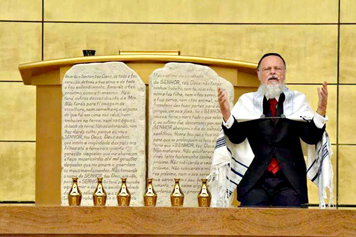
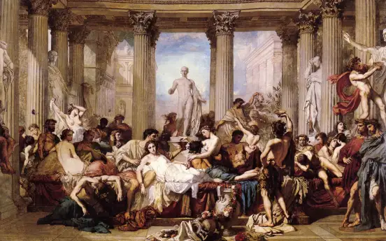
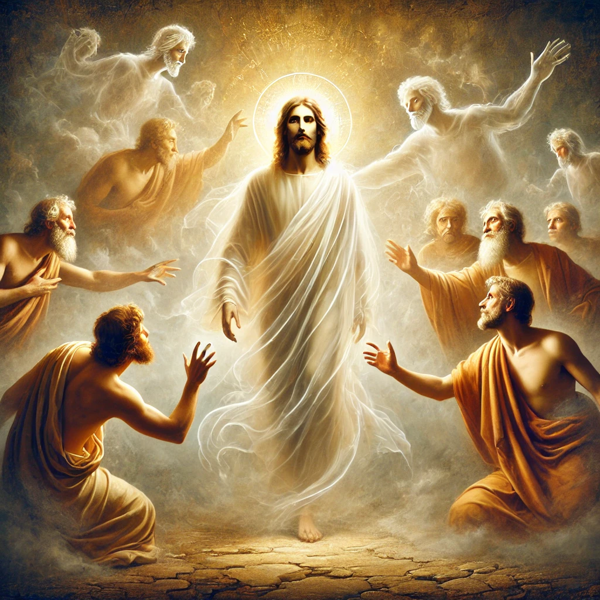
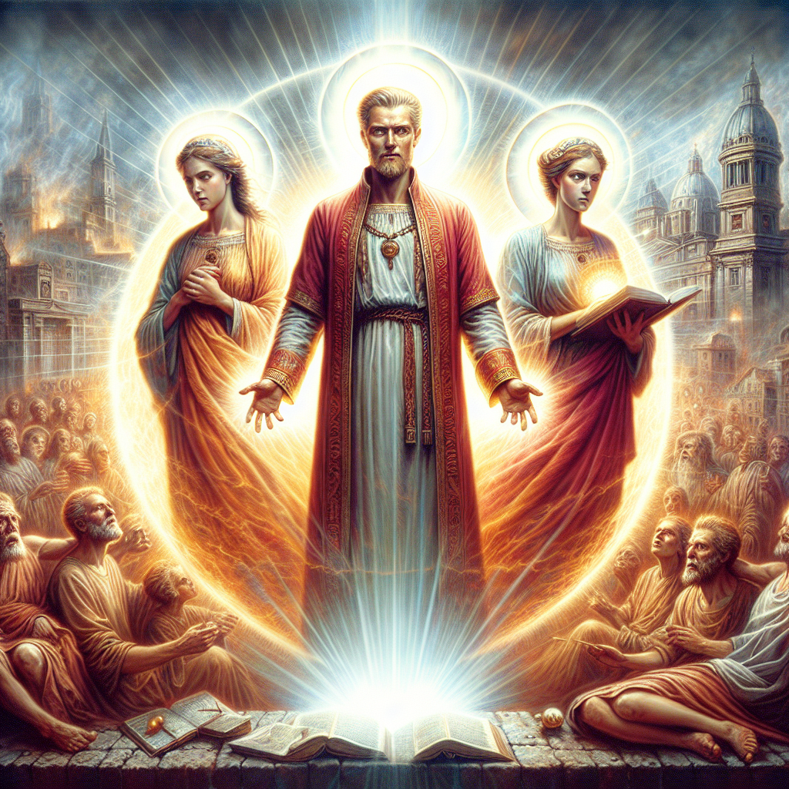
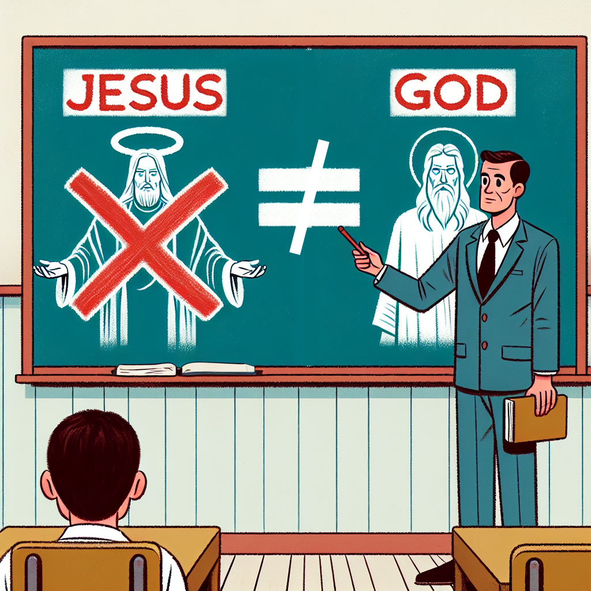
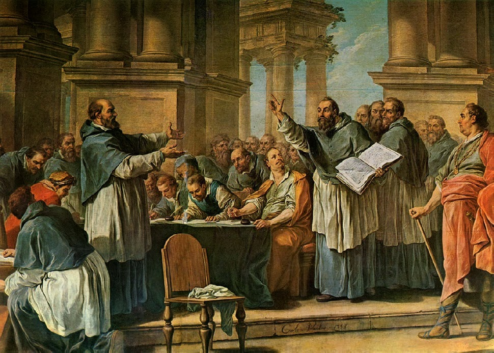
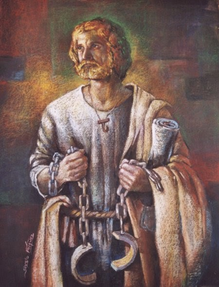
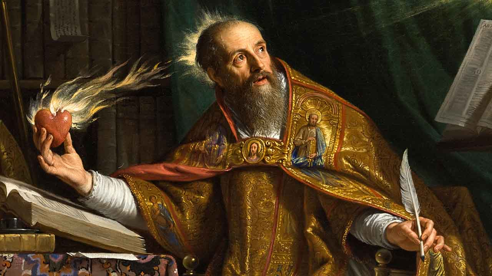

# Heresia

---

## Introdução

O conceito de heresia tem raízes profundas na história da religião, da filosofia e até da política. No sentido mais tradicional, uma heresia é uma crença ou doutrina que diverge da ortodoxia (ou seja, do ensino oficial) de uma determinada tradição, seja religiosa, política ou filosófica. Esse termo ganhou especial relevância no cristianismo, onde foi usado para descrever interpretações divergentes da fé cristã ao longo dos séculos.

---

### Origens e Significado

A palavra **"heresia"** vem do grego **hairesis** (αἵρεσις), que significa **"escolha"** ou **"facção"**.

No contexto filosófico e religioso da Grécia Antiga, esse termo era neutro e designava simplesmente uma escola de pensamento.

Com o cristianismo primitivo, entretanto, a palavra passou a ter uma conotação pejorativa, referindo-se a doutrinas que desviavam da verdade revelada por Deus.

No cristianismo, o conceito de heresia se consolidou com o desenvolvimento da teologia e da organização da Igreja. O Novo Testamento já contém advertências contra ensinamentos considerados falsos, como na carta de Paulo aos Gálatas:

> "Se alguém vos anunciar um evangelho diferente daquele que vos temos anunciado, seja anátema."  
> *(Gálatas 1:8)*

---

## Uso Moderno e Secular

Atualmente, o termo "heresia" pode ser usado de forma metafórica para descrever qualquer ideia que desafia um conjunto estabelecido de crenças, não apenas no campo religioso. Por exemplo:

- **Na ciência:** A teoria heliocêntrica de Copérnico e Galileu foi considerada herética pelas autoridades da época.
- **No mundo político:** Ideias revolucionárias frequentemente são vistas como "heréticas" dentro de certos regimes ou ideologias.
- **Na cultura pop:** Fãs podem chamar de "heresia" mudanças drásticas em franquias queridas (como um remake de um filme alterando a história original).

Em resumo, heresia é um conceito historicamente carregado de implicações religiosas, mas que também pode ser aplicado a qualquer ideia que desafie dogmas e normas estabelecidas.

## Heresias no Cristianismo

Com o crescimento da Igreja, o combate às heresias se tornou mais organizado. Diversos concílios foram realizados para definir a [ortodoxia](../glosario/termos_e_conceitos.md#ortodoxia---ortodóxo) e condenar doutrinas divergentes.

Abaixo estão exemplos de algumas das heresias mais famosas no cristianismo, organizadas por ordem cronológica:

1. **[Heresias Judaizantes](https://pt.wikipedia.org/wiki/Judaizantes) (séc. I - Bíblia: Gálatas, Atos, etc.)**  
   - **Relevância:** Mencionada no Novo Testamento, gerou os primeiros debates doutrinários da Igreja Primitiva.
   - **O que era:** Ensinavam que os cristãos gentios deveriam seguir os costumes e a Lei de Moisés (como circuncisão e práticas cerimoniais) para serem salvos. Paulo combateu fortemente essa doutrina, especialmente na carta aos Gálatas (Gálatas 2:16-21) e no Concílio de Jerusalém (Atos 15).
   - **Persistência:** Persiste até hoje, em movimentos modernos que tentam reintegrar práticas judaicas ao cristianismo.

<small>Edir macedo em um culto na igreja universal</small>

2. **[Gnosticismo](https://pt.wikipedia.org/wiki/Gnosticismo) (séc. I-III - Bíblia: 1 João, Colossenses, etc.)**
    - **Relevância:** Uma das heresias mais influentes da Igreja Primitiva, misturando doutrinas cristãs e filosofia helenística.
    - **O que era:** Defendia que a salvação não era obtida através da fé, mas por meio de um conhecimento secreto, ou seja, "gnose". Esse conhecimento revelava verdades espirituais "ocultas" sobre a origem divina da alma humana e a natureza do cosmos. Era praticamente como uma teoria da conspiração. Foi combatida por autores bíblicos, como em 1 João 4:2-3 e Colossenses 2:8, no qual alertam contra filosofias enganosas.
    - **Persistência:** Hoje, ideias gnósticas aparecem em movimentos místicos e "esotéricos."

---

3. **[Nicolaitas](https://pt.wikipedia.org/wiki/Nicola%C3%ADsmo) (séc. I - Bíblia: Apocalipse 2:6, 2:15)**
    - **Relevância:** Contestado no contexto das sete igrejas da Ásia e associado a práticas imorais.
    - **O que era:** Segundo o Apocalipse, os nicolaítas promoviam comportamentos libidinósos e toleravam práticas pagãs, como idolatria e imoralidade sexual. Essas práticas geralmente eram ligadas a cultos pagãos da época, onde rituais sexuais faziam parte do culto religioso.
      Jesus, na carta à igreja de Éfeso, afirma odiar as obras dos nicolaítas (Apocalipse 2:6).
    - **Persistência:** Não mais existente atualmente.

---

4. **[Docetismo](https://pt.wikipedia.org/wiki/Docetismo) (séc. I-II - Bíblia: 1 João 4:2-3, 2 João 1:7)**
    - **Relevância:** Uma das primeiras heresias cristológicas combatidas pelos apóstolos.
    - **O que era:** Afirmava que Jesus não tinha realmente um corpo humano, mas apenas parecia ter um (uma "ilusão"). João combateu diretamente os docetistas em 1 João 4:2-3, dizendo que "todo espírito que confessa que Jesus Cristo veio em carne é de Deus."
    - **Persistência:** Extinta, mas alguns pontos ressurgem em pensamentos místicos.

---

5. **[Marcionismo](https://pt.wikipedia.org/wiki/Marcionismo) (séc. II)**
   - **Relevância:** Influenciou debates teológicos significativos sobre o cânone bíblico.
   - **O que era:** Fundado por Marcião de Sinope por volta de 144, que defendia que o Deus do Antigo Testamento e o Deus do Novo Testamento eram entidades diferentes. Ele se considerava um seguidor do apóstolo Paulo, a quem ele acreditava ter sido o único verdadeiro apóstolo de Jesus. O cânone de Marcião, possivelmente o primeiro cânone cristão já compilado, consistia em onze livros: um evangelho, que era uma versão mais curta do evangelho segundo Lucas, e dez epístolas paulinas. Marcião rejeitou todo o Antigo Testamento, junto com todas as outras epístolas e evangelhos do que se tornaria o cânon do Novo Testamento de 27 livros. O marcionismo foi denunciado como heresia e contestado pelos primeiros Padres da Igreja — notadamente por Tertuliano em seu tratado de cinco livros Adversus Marcionem (Contra Marcião), por volta de 208.
   - **Persistência:** Foi amplamente combatido e desapareceu por volta do século V.

---
6. **[Montanismo](https://pt.wikipedia.org/wiki/Montanismo) (séc. II-VIII)**
    - **Relevância:** Considerado uma das primeiras divisões significativas dentro do cristianismo primitivo.
    - **O que era:** Criado por Montano, ele afirmava possuir o dom da profecia, e que havia sido enviado por Jesus Cristo para inaugurar a era do Paráclito. Duas mulheres que o acompanhavam, e afirmavam que o Espírito Santo falava através delas. Durante os seus êxtases anunciavam o fim iminente do mundo, conclamando os cristãos a reunirem-se na cidade de Pepusa, na Frígia, onde surgiria a Jerusalém celeste, uma vez que uma nova era cristã se iniciava com esta nova revelação divina. O seu adepto mais famoso foi Tertuliano (c. 170-212), autor de inúmeras obras em defesa da Cristandade. Em torno de 210, insatisfeito com o pensamento cristão e suas práticas, uniu-se ao montanismo, sendo considerado herético. Sim o mesmo que combateu a Heresía anterior, acabou se tornando um herége também. 
    - **Persistência:** Perdeu força após o século III, com alguns poucos adéptos a essa ideia até século VIII.

---

7. **[Arianismo](https://pt.wikipedia.org/wiki/Arianismo) (séc. IV)**
    - **Relevância:** Provocou intensos debates sobre a divindade de Cristo, gerando o Concílio de Niceia (325 d.C.).
    - **O que era:** Foi uma visão cristológica anti-trinitária (Trindade) que defendia que Jesus não era Deus, mas uma criação divina inferior ao Pai (Filho de Deus, mas não Deus, ou também um deus menor). Foi defendia pelos seguidores de Ário, da igreja de Alenxandria. Ele afirmava que Deus seria um grande eterno mistério, oculto em Si mesmo, e que nenhuma criatura conseguiria revelá-lo. Ário foi expulso da comunhão eclesiástica de Alexandria, que condenou seus ensinamentos. 
    - **Persistência:** Foi enfraquecido após o século VII, mas influenciou movimentos posteriores e persistem até hoje. Esse movimentos defendem que não existe a trindade, e são conhecidos na atualidade como "Semiarianismo". Exemplo mais forte dentro do nosso contexto cultural são as Testemunhas de Jeová, os Mórmons (Igreja de Jesus Cristo dos Santos dos Últimos Dias) e alguns grupos adventistas menores.

---

8. **[Donatismo](https://pt.wikipedia.org/wiki/Donatismo) (séc. IV)**
    - **Relevância:** Importante no Norte da África, dividiu profundamente a comunidade cristã local.
    - **O que era:** Donatistas sustentavam que a Igreja não devia perdoar e admitir pecadores, e que os sacramentos, como o batismo, administrados pelos cristãos que negaram sua fé durante a perseguição de Diocleciano de 303 d.C. a 305 d.C. e posteriormente foram perdoados e readmitidos na Igreja, eram inválidos. Em oposição, a crença da Igreja na época, defendiam que eles poderiam voltar ao corpo ritualístico e ministrar os sacramentos, desde que o fizessem seguindo o "ritual correto", sem a necessidade de rebatismo ou da reordenação. Um dos nomes a combater essa heresía foi Agostinho.
    - **Persistência:** Foi suprimido após o século VI.

---

9. **[Priscilianismo](https://pt.wikipedia.org/wiki/Priscilianismo) (séc. IV-V)**
    - **Relevância:** Movimento ascético (filosofia de vida na qual se realizam certas práticas visando ao desenvolvimento espiritual) influente na Península Ibérica.
    - **O que era:** Pregada por Prisciliano, com base nos ideais de austeridade, pobreza e derivada de doutrinas gnóstico-maniqueístas, ele defendia práticas severas de controle corporal e rejeitava formalidades eclesiásticas. Dentre as práticas, incluía jejuns rigorosos, rejeição de prazeres mundanos e práticas de autocontrole. Essa visão buscava purificar o indivíduo, afastando-o dos "desejos corruptos" do mundo material. O movimento promovia um tipo de ensino secreto ou reservado apenas aos "iniciados", e tinha uma forte influência do Gnosticismo, de forma que via o mundo material como mal, e diferente de um mundo bom criado por Deus. Também não acreditavam na redenção e na restauração de toda a criação.
   - **Persistência:** Desapareceu após ser reprimido.

---

10. **[Nestorianismo](https://pt.wikipedia.org/wiki/Nestorianismo) (séc. V)**
    - **Relevância:** Significativo na formação da teologia da Igreja Oriental.
    - **O que era:** Proposta por Nestório, Patriarca de Constantinopla, como uma tentativa dedutiva e emocional de explicar e entender a encarnação. Afirmava que Cristo possuía duas naturezas completamente separadas, uma divina e outra humana, ou seja, **duas naturezas (divina e humana)** estavam **unidas no homem Jesus**, mas de forma distinta e separada, sem uma **união completa ou inseparável** em uma única pessoa. Ele rejeitava o termo **Theotokos** ("Mãe de Deus") para Maria, preferindo chamá-la de **Christotokos** ("Mãe de Cristo"), pois acreditava que Maria dera à luz à natureza humana de Jesus, mas não à divina. 
    - **Persistência:**  Acabou por provocar o cisma nestoriano, no qual as igrejas que apoiavam Nestório deixaram o corpo da Igreja. Suas ideias, ainda persistem até hoje, em algumas comunidades cristãs orientais.

---

11. **[Pelagianismo](https://pt.wikipedia.org/wiki/Pelagianismo) (séc. V)**
    - **Relevância:** Importante por tópicos teológicos relacionados ao pecado original e à graça divina.
    - **O que era:** Negava a doutrina do pecado original e enfatizava o esforço humano na salvação, ou seja, nega a corrupção da natureza humana, e nega a necessidade da graça divina para a salvação.
    - **Persistência:** Suas ideias influênciam doutrinas até hoje, sendo uma base para a salvação por obras, ou seja, você precisa ser bom para ser salvo. Embora a Igreja Católica também condene o pelagianismo como heresia e afirme o pecado original, sua ênfase na cooperação humana por meio de boas obras dentro do processo de santificação pode ser vista como uma ideia parecida do pelagianismo.

---

12. **[Monofisismo](https://pt.wikipedia.org/wiki/Monofisismo) (séc. V)**
    - **Relevância:** Protagonizou divisões internas na Igreja Oriental.
    - **O que era:** Parecida com o Nestorianismo, porém diz que Cristo tinha apenas uma natureza divina, e não uma união entre o humano e o divino.
    - **Persistência:** Sobrevive na Igreja Ortodoxa Copta e outras comunidades orientais.

---

13. **[Adocionismo](https://pt.wikipedia.org/wiki/Adocionismo) (séc. VIII)**
    - **Relevância:** Impactou julgamentos teológicos no contexto do Império Carolíngio.
    - **O que era:** Acreditava que Jesus era um homem comum "adotado" como Filho de Deus. É uma visão teológica não trinitária do cristianismo primitivo, que professa que Jesus nasceu humano, tornando-se posteriormente divino por ocasião do seu batismo, ponto em que foi ""adotado"" como filho de Deus.
    - **Persistência:** Foi amplamente rejeitado e extinto como movimento.

---

## A Contradição da Igreja Católica: Combater Heresias com Heresias

A Igreja Católica, especialmente na Idade Média, utilizou a Inquisição como ferramenta para combater as heresias, porém aplicando o conceito de maneira extrema. Os tribunais inquisitoriais julgavam os suspeitos de heresia e podiam impor penas que variavam de penitências a execuções, incluindo a fogueira. Esses processos marcaram profundamente a história, impactando a relação entre Igreja, poder e controle teológico.

Durante os séculos que precederam e sucederam a Reforma Protestante, a Igreja Católica tornou-se conhecida por sua severidade na repressão de movimentos e doutrinas que ela própria considerava hereges. No entanto, a grande diferença é que, o referêncial para determinar se uma doutrina era uma heresia ou não, deixou de ser a bíblia, e passou a ser a tradição. Ao perseguir ferozmente os reformadores protestantes sob o pretexto de preservar a ortodoxia cristã, a Igreja Católica cometeu o que muitos protestantes descrevem como uma heresia em si mesma: o uso abusivo de poder, violência e opressão, distanciando-se dos ensinamentos de Cristo e do evangelho.

### 1. A Contradição: Defender a Verdade com Práticas Antibíblicas

Inúmeros protestantes da época da Reforma, como Martinho Lutero, João Calvino e William Tyndale, foram denunciados como hereges pela Igreja Católica por desafiar suas doutrinas e práticas. No entanto, o método usado para combatê-los revela uma contradição:

- **Prática Antibíblica da Violência**: A perseguição dos reformadores violou diretamente os princípios cristãos de amor, misericórdia e compaixão. Jesus ensinou:
  > "Amai os vossos inimigos e orai pelos que vos perseguem" (Mateus 5:44).  
  No entanto, a Igreja instituiu tribunais inquisitoriais e aplicou punições cruéis, incluindo tortura e execuções, na tentativa de silenciar aqueles que ela considerava "hereges".

- **Abuso de Poder Religioso e Político**: A aliança entre a Igreja Católica e os governos seculares permitiu que ela utilizasse o poder político para suprimir qualquer dissidência. Reformadores não apenas enfrentavam excomunhões, mas também ordens de prisão e morte emitidas pelos governantes em cumplicidade com a Igreja.

### 2. Perseguições Contra os Reformadores

Dentre os atos mais conhecidos de perseguição, destacam-se:

#### 2.1. O Caso de William Tyndale
William Tyndale, um dos primeiros a traduzir a Bíblia para o inglês, foi acusado de heresia por tornar as Escrituras acessíveis às pessoas comuns. A Igreja Católica considerava perigoso que a Bíblia fosse lida sem a mediação de seus líderes. Por causa disso:

- Tyndale foi traído, preso e estrangulado até a morte, com seu corpo posteriormente queimado em 1536.
- A acusação de heresia contra ele baseava-se em sua tradução, algo que hoje muitos considerariam um serviço ao evangelho.

#### 2.2. A Noite de São Bartolomeu
Em 1572, milhares de huguenotes (protestantes franceses) foram assassinados na chamada "Noite de São Bartolomeu". Esse massacre foi patrocinado por líderes da Igreja Católica e pela monarquia francesa, sob a justificativa de eliminar a "heresia protestante". Mulheres, crianças e pastores foram mortos, em uma cruzada descrita por líderes católicos como um ato divinamente inspirado.

#### 2.3. Os Tribunais da Inquisição
Os tribunais da Inquisição foram utilizados como ferramenta para identificar e punir aqueles que desafiassem os dogmas católicos. Reformadores, como os seguidores de Lutero e Calvino, eram frequentemente levados a julgamento:

- Métodos de tortura eram usados para forçar confissões.
- Execuções públicas eram realizadas para "dar exemplo", frequentemente acompanhadas pela queima de livros de teologia reformada, incluindo traduções das Escrituras.

### 3. A Heresia Católica na Perseguição

Embora a Igreja Católica reivindicasse que estava protegendo a fé cristã, sua perseguição aos reformadores protestantes carregava elementos que, claramente eram heréticos:

- **Violação do Princípio da Escritura Sagrada**: Ao perseguir aqueles que buscavam retornar aos ensinamentos bíblicos puros, a Igreja Católica demonstrou sua dependência de tradições humanas e sua rejeição à autoridade direta das Escrituras. Reformadores como Lutero argumentaram que a verdadeira heresia era negar o evangelho central estabelecido pela Palavra de Deus.
- **Autoridade Espúria e Desvio de Cristo**: Ao colocar sua própria instituição acima de Cristo, a Igreja Católica, segundo os protestantes, afastou-se da verdadeira igreja visível, descrita como "o corpo de Cristo". Para muitos, a perseguição violenta foi uma prova de que a instituição havia se afastado do espírito do evangelho.
- **A Grande Contradição**: O uso de métodos não cristãos, como violência, mentira e manipulação, para "defender" a fé cristã, contradizia diretamente os próprios ensinamentos de Cristo e dos apóstolos.

### 4. A Perspectiva Protestante: O Testemunho dos Perseguidos

Para os protestantes, a perseguição durante a Reforma foi vista como um reflexo do que Jesus afirmou:

> "Se o mundo vos odeia, sabei que, primeiro do que a vós, odiou a mim" (João 15:18).

Os reformadores e seus seguidores eram lembrados de que o próprio Cristo e os apóstolos enfrentaram perseguições por defender a verdade. Assim, muitos dos que foram martirizados pela Igreja Católica se tornaram testemunhas vivas (do grego "mártires") da autenticidade do evangelho.

### Conclusão

A perseguição dos reformadores protestantes pela Igreja Católica não só expôs o autoritarismo antibíblico da instituição, mas também destacou a importância do retorno aos fundamentos das Escrituras. Para os protestantes, a heresia maior foi usar o nome de Cristo como justificativa para a opressão, violando os próprios princípios do evangelho que a Igreja dizia defender.

Nas palavras de Lutero:

> "A consciência não pode se dobrar às tradições dos homens, mas é cativa à Palavra de Deus."

## Catolicismo: a maior heresia de todos os tempos

A visão protestante traz uma crítica profunda à doutrina e práticas da Igreja Católica, especialmente no período que antecedeu a Reforma Protestante (séculos XV e XVI). Para muitos líderes protestantes, a Igreja Católica Romana poderia ser vista como uma “seita” e um conglomerado de heresias que se afastaram dos ensinamentos bíblicos fundamentais. Neste estudo, exploramos alguns dos argumentos apresentados por figuras-chave da reforma protestante, que questionaram a legitimidade doutrinária desta instituição.

### 1. O conceito de "Seita" no Modelo Protestante

No contexto protestante, o termo "seita" é usado para indicar um grupo que reivindica a exclusividade da salvação, mas se afasta ou distorce os princípios essenciais das Escrituras. Líderes da Reforma protestante acusaram a Igreja Católica do seguinte:

- **Exclusividade e Controle da Salvação**: A Igreja Católica afirmava que fora de sua estrutura não existia a salvação (*extra Ecclesiam nulla salus*). Para os protestantes, isso contradizia o ensino bíblico da justificação pela fé somente (**Sola Fide**) e da mediação exclusiva de Cristo (1 Timóteo 2:5).
- **Dependência em Tradições Humanas**: Protestantes argumentaram que a Igreja Católica havia se tornado uma autoridade autônoma, colocando tradições humanas e o legalismo, acima da Palavra de Deus. Passagens como Marcos 7:8-9 eram frequentemente usadas para denunciar isso.

---

### 2. A Igreja Católica como "Coleção de Heresias"

Os primeiros protestantes identificaram várias doutrinas e práticas da Igreja Católica que consideravam não apenas erradas, mas heréticas por se desviarem da fé apostólica. Entre estas, destacam-se:

#### 2.1. Papado e Infalibilidade Papal
Os protestantes rejeitaram totalmente a autoridade papal, considerando o título de “vigário de Cristo” como uma violação do senhorio exclusivo de Jesus Cristo sobre a Igreja. Para Martinho Lutero, o papado representava o “anticristo”, pois colocava a figura papal no lugar de Cristo (2 Tessalonicenses 2:3-4).

- **Infalibilidade Papal**: Definida oficialmente no Concílio Vaticano I (século XIX), mas presente na prática desde muito antes, os protestantes consideravam inaceitável a ideia de que um homem pudesse estar livre de erro em questões de fé e moral.

#### 2.2. Doutrina da Justificação
A questão central da Reforma Protestante foi a doutrina da justificação pela fé. A Igreja Católica ensinava que a salvação dependia da fé + obras (Concílio de Trento), enquanto os protestantes defendiam que:

> "O justo viverá pela fé" (Romanos 1:17).

Esta diferença teológica levou os líderes protestantes a considerarem o ensino católico sobre a justificação uma negação do evangelho bíblico.

#### 2.3. Sacramentalismo e Missa
Os protestantes criticaram grandemente a teologia sacramental e especialmente a missa por questões como:

- **Transubstanciação**: A crença de que o pão e o vinho literalmente se transformam no corpo e no sangue de Cristo foi vista como uma heresia, sendo condenada por negar a suficiência do sacrifício de Cristo na cruz (Hebreus 10:11-14).
- **Re-Sacrifício de Cristo**: Os protestantes acusavam a missa de representar um “sacrifício contínuo”, algo que contradizia claramente o evangelho bíblico.

#### 2.4. Indulgências e Purgatório
Outro ponto fortemente combatido foi o comércio de indulgências e a doutrina do purgatório:

- **Indulgências**: A venda de indulgências foi considerada uma afronta ao evangelho, tratando a salvação como um “produto comercial”.
- **Purgatório**: Protestantes argumentaram que não há base bíblica para a doutrina do purgatório, considerando-a um desvio que minimiza a suficiência da expiação de Cristo.

---

### 3. Resposta Protestante: Retorno à Sola Scriptura

Os protestantes apresentaram um chamado para retornar às Escrituras como única regra de fé e prática cristã. Este princípio, conhecido como **Sola Scriptura**, foi a resposta direta ao que consideravam ser a multiplicidade de heresias acumuladas pela Igreja Católica Romana ao longo dos séculos.

> "Toda a Escritura é inspirada por Deus e útil para o ensino, para a repreensão, para a correção e para a instrução na justiça." (2 Timóteo 3:16)

Do ponto de vista protestante, a Igreja Católica Romana foi vista como uma instituição desviada do cristianismo apostólico, consolidando doutrinas e práticas que não apenas se afastaram das Escrituras, mas as contradisseram diretamente. No entanto, esta crítica vem acompanhada de um chamado ao arrependimento e a um retorno genuíno à simplicidade e pureza do evangelho de Cristo.

---

## Conclusão

Ao examinarmos a história das heresias que permearam o caminho da fé cristã ao longo dos séculos, chegamos a uma profunda reflexão sobre nossa própria jornada espiritual. Estas divergências doutrinárias, mais que simples desvios históricos, revelam a contínua luta do coração humano para compreender e, muitas vezes, recriar Deus conforme nossas próprias concepções.

As heresias nos confronta com uma verdade fundamental: como seres humanos, temos a tendência de moldar Deus segundo nossos desejos, conveniências e limitações de compreensão. No entanto, a mensagem central do Evangelho permanece inabalável: Deus não se deixa confinar em nossas interpretações humanas. Ele busca uma relação genuína conosco, fundamentada na verdade revelada nas Escrituras.

A salvação não é encontrada em doutrinas elaboradas por homens, em tradições desviadas ou em interpretações convenientes. O caminho para a reconciliação com Deus é claro nas Escrituras: reconhecer nossa condição de pecadores diante de um Deus santo, arrepender-nos sinceramente e depositar nossa fé completa em Jesus Cristo como único Salvador e Senhor.

> "Porque Deus amou o mundo de tal maneira que deu o seu Filho unigênito, para que todo aquele que nele crê não pereça, mas tenha a vida eterna." (João 3:16)

O arrependimento verdadeiro não é meramente um sentimento passageiro de remorso, mas uma transformação profunda de mente e coração que nos leva a abandonar caminhos errados e voltar-nos inteiramente para Deus. É reconhecer que nenhuma obra humana, tradição religiosa ou esforço pessoal pode nos salvar – apenas a graça de Deus manifestada no sacrifício de Jesus Cristo.

Ao concluirmos este estudo olhar mais atento as heresias do passado, somos chamados não ao julgamento arrogante dos outros, mas ao autoexame humilde. Devemos nos perguntar: estamos buscando conhecer o Deus verdadeiro revelado nas Escrituras, ou criando nossas próprias heresias?

A jornada cristã autêntica é um contínuo retorno às Escrituras, um constante arrependimento pelos desvios e uma renovada submissão à verdade revelada. É através desta postura de humildade e busca sincera que encontramos não apenas a doutrina correta, mas o relacionamento vivo com o Deus que nos criou, nos redimiu e nos convida a uma vida transformada pela Sua graça.

Que possamos, então, cultivar corações abertos à correção divina, mentes ancoradas na verdade bíblica e vidas que testemunhem o poder transformador do verdadeiro Evangelho, livre das distorções que a história nos mostrou serem tão danosas à fé genuína.

---