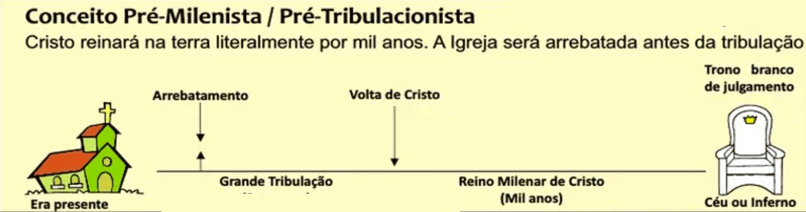
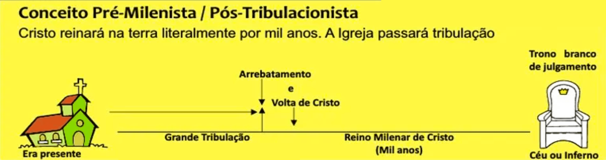

# Escatologia do Juízo Final (Apocalipse 20.11-15)

---

## Introdução

No início do capítulo 20, um anjo desce do céu com a chave do abismo e uma grande corrente, prendendo o diabo. Durante o milênio, ele permanece confinado no abismo, que é selado para impedir que engane as nações.

O propósito deste reinado terreno milenar de Cristo é duplo:

1. Justificação e exaltação dos santos, proporcionando uma transição de seu sofrimento terreno para sua glória celestial.
2. A prova definitiva da depravação eterna dos pecadores que, mesmo após uma única vida sob a influência de Satanás e 14 vidas sob o reinado de Cristo (considerando aproximadamente 70 anos uma vida, e 1.000 anos sendo mais de 14 vezes o tempo de vida durante o milênio), eles ainda assim retornam ao seu domínio no momento em que ele é libertado. 

Isso evidencia a necessidade da punição eterna mencionada nos versículos 11–15. A ideia central é que, independentemente do tempo transcorrido, aqueles dominados pelo pecado continuarão a negar Cristo.

Próximo do final do reinado de Cristo no milênio, Satanás será solto para sua última e breve rebelião. Após Deus derrotar nosso inimigo, os versículos 11 a 15 descrevem o dia do Juízo Final, que abordarei neste texto.

## Quem é o Juiz?

O Senhor Jesus está assentado como Juiz como em João 5:22,27

> *"Além disso, o Pai não julga ninguém, mas delegou todo julgamento ao Filho"* (João 5:22 NVI)
>
> *"e deu‑lhe autoridade para julgar, porque é o Filho do homem."* (João 5:27 NVI)

## Onde vai acontecer o Juízo Final?

Antes que a nova era possa começar, esta era atual deve chegar ao fim. Assim, a expressão do verso 11: “a terra e o céu fogem de sua presença, e não há lugar para eles”. indica que o julgamento do Juízo Final, ocorrerá na eternidade, depois da destruição da criação presente (2Pe 3:10).

> *"O dia do Senhor, porém, virá como ladrão. Os céus desaparecerão com um grande estrondo, os elementos serão desfeitos pelo calor, e a terra, e tudo o que nela há, será desnudada."* (2 Pedro 3.10 NVI)

Isto é corroborado por Isaías 51.6, que diz:

> *"[...] os céus desaparecerão como fumaça, a terra se gastará como uma roupa[...]"* (Isaías 51.6 NVI)

Também ecoa essa ideia em Salmos 102.25-26 e Ezequiel 32.7–8:

> *"No princípio firmaste os fundamentos da terra, e os céus são obras das tuas mãos. Eles perecerão, mas tu permanecerás; envelhecerão como vestimentas. Como roupas tu os trocarás e serão jogados fora."* (Salmos 102.25-26 NVI)

> *"Quando eu o extinguir, cobrirei o céu e escurecerei as suas estrelas; cobrirei o sol com uma nuvem, e a lua não dará a sua luz. Todas as estrelas que brilham nos céus, escurecerei sobre você, e trarei escuridão sobre a sua terra. Palavra do Soberano, o SENHOR."* (Ezequiel 32.7–8 NVI)

## Salvos e condenados

Depois do milênio, João vê pessoas no céu com autoridade para governar. São os santos da era da Igreja que reinarão com Cristo como sua noiva. O apóstolo também vê um grupo de mártires que se recusaram a receber a marca da besta.

O "restantes dos mortos" é uma referência aos incrédulos de todas as eras que serão ressuscitados no final do milênio a fim de comparecerem ao julgamento do grande trono branco, o Juízo Final.

Existe algumas interpretações sobre quando esses fatos vão acontecer, a ideia nesse nesto não é discutir essas interpretações, então vou colocar somente as duas principais. A visão pré-tribulacionista e a visão pós-tribulacionista.

<small>Essa não é a visão com a qual concordo, mas não irei argumentar aqui o porque. Trata-se, no entanto, de uma perspectiva válida: Jesus retorna antes da grande tribulação, a igreja vive um período com Ele, e esse momento seria a primeira ressurreição. Depois em um outro evento separado desus volta uma segunda vêz, com a igreja para iniciar o período do milênio</small>

<small>Outra visão amplamente aceita é que a igreja não será poupada da grande tribulação e que Jesus retornará ao seu término. Nesse momento, ocorre a primeira ressurreição e arrebatamento e tem início o milênio. Tudo em um único evento da volta de Jesus</small>

Independente a visão tribulacionista, a expressão “Esta é a primeira ressurreição” remete ao versículo 4 desse capítulo 20, referindo-se à ressurreição dos justos, e pode ser usada tanto na visão pré como na pós. Ela faz parte do evento da volta de Jesus, onde ressucitará os mortos em Cristo (crentes verdadeiros) e também arrebatar a Igreja. A totalidade dos salvos será composta por aqueles que foram ressuscitados na primeira ressurreição, junto dos que foram arrebatados (aqueles que estiverem vivos no momento do retorno de Cristo). Veja que isso é bem explicado em (1Ts 4:13–18).

> *"Irmãos, queremos que vocês saibam a verdade a respeito dos que já morreram, para que não fiquem tristes como ficam aqueles que não têm esperança. Nós cremos que Jesus morreu e ressuscitou; e assim cremos também que, depois que Jesus vier, Deus o levará de volta e, junto com ele, levará os que morreram crendo nele. De acordo com o ensinamento do Senhor, afirmamos a vocês o seguinte: nós, os que estivermos vivos no dia da vinda do Senhor, não iremos antes daqueles que já morreram. Porque haverá o grito de comando, e a voz do arcanjo, e o som da trombeta de Deus, e então o próprio Senhor descerá do céu. Aqueles que morreram crendo em Cristo ressuscitarão primeiro. Então nós, os que estivermos vivos, seremos levados nas nuvens, junto com eles, para nos encontrarmos com o Senhor no ar. E assim ficaremos para sempre com o Senhor. Portanto, animem uns aos outros com essas palavras.*" (1Tessalonicenses 4:13-18 NTLH)

Aquele que tem parte na primeira ressurreição é bem-aventurado, pois está isento da segunda morte, quando todos os incrédulos serão lançados no lago de fogo (v. 14). 

A ideia que quero mostrar, é que os verdadeiros cristãos serão sacerdotes de Deus e de Cristo e reinarão com ele os mil anos.
Assim, os crentes experimentam a primeira ressurreição enquanto os incrédulos experimentam apenas a “segunda morte”. Essa ideia se baseia em vários fundamentos, começando pela identidade dos “mortos” no versículo 12, que não ressuscitaram na primeira ressurreição.

> *"Vi também os mortos, grandes e pequenos, em pé diante do trono, e livros foram abertos. Outro livro foi aberto, o livro da vida. Os mortos foram julgados de acordo com o que tinham feito, segundo o que estava registrado nos livros*" (Apocalipse 20:12 NVI)

Para entender melhor quem são esses mortos, podemos ver a passagem da colheita no capítulo 14, onde a colheita dos grãos da terra (14.14–16) são os santos e a colheita das uvas (14.17–20) os pecadores. Veja:

> *"Olhei, e eis que diante de mim havia uma nuvem branca e, sentado sobre a nuvem, alguém semelhante a um filho de homem. Ele estava com uma coroa de ouro na cabeça e uma foice afiada na mão. Então, outro anjo saiu do templo, bradando em alta voz àquele que estava sentado sobre a nuvem: ― Tome a sua foice e faça a colheita, pois a safra da terra está madura; chegou a hora de colhê‑la. Assim, aquele que estava sentado sobre a nuvem passou a foice pela terra, e a terra foi ceifada. Outro anjo saiu do templo dos céus, trazendo também uma foice afiada. E ainda outro anjo, que tem autoridade sobre o fogo, saiu do altar e bradou em alta voz àquele que tinha a foice afiada: ― Tome a sua foice afiada e ajunte os cachos da videira da terra, porque as suas uvas estão maduras! O anjo passou a foice pela terra, ajuntou as uvas e as lançou no grande lagar da ira de Deus. Elas foram pisadas no lagar, fora da cidade, e correu sangue do lagar, chegando à altura dos freios dos cavalos, em uma distância de mil e seiscentos estádios.*" (Apocalipse 14:14-20 NVI)

- A altura dos freios dos cavalos refere-se às rédeas ou arreios usados para controlar os cavalos. O versículo descreve uma cena simbólica de juízo, onde o sangue derramado chega até a altura dos freios, algo em torno de dois metros. O estádio era uma unidade de medida de comprimento usada na Grécia e em Roma antigas com aproximadamente 185 metros por estádio. De maneira semelhante ao que fazemos hoje ao comparar algo grande com um estádio de futebol, por exemplo: podemos imaginar o Canal da Mancha, que separa a Inglaterra da França, com aproximadamente 33,8 km de comprimento. Para ilustrar isso visualmente, falamos que esse canal tem a distância de 338 campos de futebol do Maracanã lado a lado, considerando que cada campo tem apróx. 100 metros de comprimento. A distância mencionada no fim do verso 20, de 1.600 estádios, portanto resulta em uma distância de quase 300 quilômetros, com cerca de 2 metros de profundidade, simbolizando a grandeza e intensidade do derramamento de sangue na ira divina.
  

- O termo "um semelhante ao Filho do Homem", que descreve o Anjo com a coroa de ouro na cabeça e a foice afiada na mão, lembra bastante a visão de Daniel 7:13-14, uma descrição que se refere a Jesus.

> *“Eu estava olhando nas minhas visões da noite, e eis que vinha com as nuvens do céu um como o Filho do Homem, e dirigiu-se ao Ancião de Dias, e o fizeram chegar até ele. Foi-lhe dado domínio, e glória, e o reino, para que os povos, nações e homens de todas as línguas o servissem; o seu domínio é domínio eterno, que não passará, e o seu reino jamais será destruído."* (Daniel 7:13-14 ARA)

O texto de Apocalipse 14 é claramente uma parábola, simbolizando duas colheitas. Na primeira, é mencionado que, quando chegou o momento, a terra foi ceifada. Na segunda, há um contraste, pois algo que não ocorre na primeira é explicitamente revelado: essa segunda colheita foi reservada para a ira de Deus. A interpretação sugere que as colheitas representam a ressurreição: a primeira colheita, referindo-se aos salvos, sendo a "primeira ressurreição", enquanto a segunda colheita é uma referência à "segunda morte", destinada aos pecadores. Essa ideia é corroborada por Daniel 12:

> *"Muitos dos que dormem no pó da terra ressuscitarão, uns para a vida eterna, e outros para vergonha e horror eterno.*" (Daniel 12.1–2 Ara)

Os mortos, os grandes e os pequenos estão postos em pé diante de Deus, portanto, são os incrédulos de todas as eras. Vários livros são abertos, o Livro da Vida contém o nome de todos os que foram remidos pelo sangue precioso de Cristo. Os outros livros contêm um registro detalhado das obras dos incrédulos. Nenhum dos presentes no julgamento encontra-se registrado no Livro da Vida. O fato de seu nome não estar nesse Livro os condena.

Esse entendimento se dá, pela interpretação desses vários textos em conjunto, junto a descrição dos justos, no verso 4 a 6:

> *"Vi tronos nos quais se sentaram aqueles a quem havia sido dada autoridade para julgar. Vi as almas dos que foram decapitados por causa do testemunho de Jesus e da palavra de Deus. Eles não tinham adorado a besta nem a sua imagem, tampouco tinham recebido a sua marca na testa ou nas mãos. Eles ressuscitaram e reinaram com Cristo durante mil anos. O restante dos mortos não voltou a viver até se completarem os mil anos. Esta é a primeira ressurreição. Bem-aventurados e santos os que participam da primeira ressurreição! A segunda morte não tem poder sobre eles; serão sacerdotes de Deus e de Cristo e reinarão com ele durante mil anos."* (Apocalipse 20:4-6 NVI)

A passagem "Vi as almas dos que foram decapitados por causa do testemunho de Jesus e da palavra de Deus" refere-se aos mártires descritos no quinto selo, em Apocalipse 6:9-11.

> *"Quando ele abriu o quinto selo, vi debaixo do altar as almas daqueles que haviam sido mortos por causa da palavra de Deus e do testemunho que deram. Eles clamavam em alta voz: “Até quando, ó Soberano, santo e verdadeiro, esperarás para julgar os habitantes da terra e vingar o nosso sangue?” Então cada um deles recebeu uma veste branca, e foi-lhes dito que esperassem um pouco mais, até que se completasse o número dos seus conservos e irmãos, que deveriam ser mortos como eles." (Apocalipse 6:9-11 NVI)

Esses mártires estão clamando por vingança, pelo dia do Juízo Final, que é o dia da condenação. Por fim, a frase de abertura no versículo 4 — "Vi tronos em que se assentaram aqueles a quem havia sido dada autoridade para julgar" — refere-se aos salvos como um todo, fazendo uma referência ao que João vê em Apocalipse 7:9.

> *"Depois disso, olhei, e eis que diante de mim havia uma grande multidão que ninguém podia contar, de todas as nações, tribos, povos e línguas, em pé, diante do trono e do Cordeiro, com vestes brancas e folhas de palmeira nas mãos."* (Apocalipse 7:9 NVI)

Também a passagem "Vi tronos em que se assentaram" faz referência aos capítulos 2 e 3.

> *“Ao vencedor darei o direito de sentar-se comigo em meu trono, assim como eu também venci e sentei-me com meu Pai em seu trono."* (Apocalipse 3.21 NVI)

> *“Àquele que vencer e fizer a minha vontade até o fim darei autoridade sobre as nações."* (Apocalipse 2.26 NVI)

Essas duas passagens também transmitem a mesma ideia de Mateus 19:28 e 1 Coríntios 6:2-3.

> *"Jesus lhes disse: “Digo-lhes a verdade: Por ocasião da regeneração de todas as coisas, quando o Filho do homem se assentar em seu trono glorioso, vocês que me seguiram também se assentarão em doze tronos, para julgar as doze tribos de Israel"* (Mateus 19.28 NVI)

> *"Vocês não sabem que os santos hão de julgar o mundo? Se vocês hão de julgar o mundo, acaso não são capazes de julgar as causas de menor importância? Vocês não sabem que haveremos de julgar os anjos? Quanto mais as coisas desta vida!"* (1Coríntios 6.2–3 NVI)

Nessa parte dos anjos, é um texto interessante.

## Por que vamos julgar os Anjos e quando isso acontece?

A Bíblia ensina que Jesus veio ao mundo como homem para salvar a humanidade, não os anjos. Isso é afirmado em Hebreus 2:16, que diz:

> *"Pois é claro que não é a anjos que ele ajuda, mas aos descendentes de Abraão."* (Hebreus 2:16 NVI)

Essa passagem enfatiza que a obra redentora de Cristo é voltada para os seres humanos, especificamente aqueles que têm fé como Abraão. Isso não significa que apenas os descendentes físicos de Abraão (os judeus) sejam salvos, mas sim todos aqueles que compartilham da fé dele, como explicado em Gálatas 3:7:

> *"Estejam certos, portanto, de que os que são da fé é que são filhos de Abraão."* (Gálatas 3:7 NVI)

Sobre os anjos, a Bíblia ensina que os anjos, servem a deus, e um dos seus objetivos, é nos ajudar. Também que os anjos caídos não têm redenção, pois eles fizeram sua escolha definitiva contra Deus. Em 2 Pedro 2:4, lemos:

> *"Deus nunca disse a nenhum dos seus anjos: “Sente-se do meu lado direito, até que eu ponha os seus inimigos como estrado debaixo dos seus pés. Então, o que são os anjos? Todos eles são espíritos que servem a Deus, os quais ele envia para ajudar os que vão receber a salvação. (Hebreus 1:13-14 NTLH)

> *"Pois Deus não poupou aos anjos que pecaram, mas os lançou no inferno, prendendo-os em abismos tenebrosos a fim de serem reservados para o juízo."* (2 Pedro 2:4 NVI)

Veja que o lugar onde os anjos estão é o inferno, onde aguardam o Juízo Final.

Conclui-se que Jesus veio para salvar os seres humanos, não os anjos, pois o plano de redenção foi preparado exclusivamente para a humanidade. Fica claro que, no dia do Juízo, os anjos caídos serão julgados para a condenação, pois não têm redenção. Esse julgamento contará com a participação dos que foram salvos.

No caso dos pecadores humanos destinados à segunda morte, o fator decisivo no julgamento será à ausência do nome inscrito no Livro da Vida. Se o nome da pessoa estiver inscrito nesse Livro, ela participará da primeira ressurreição. Esse versículo se aplica, portanto, apenas àqueles que estarão diante do grande no Juízo Final.

No versículo 13, o mar entregará os corpos nele sepultados, e as sepulturas, aqui representadas pela morte, devolverão os corpos de todos os que morreram em incredulidade. O corpo e a alma serão reunidos para comparecerem perante o Juiz, sendo aqueles que não foram ressuscitados na volta de Cristo.

No versículo 14, a declaração de que a morte e o inferno serão lançados no lago de fogo indica a condenação da pessoa completa — espírito, alma e corpo. O texto explica que essa é a segunda morte: o lago de fogo.

## A diferença entre o "além vida", paraíso e o inferno

O pós-morte, ou além-vida, é um estado desencarnado no qual há duas possibilidades:

### Inferno

Para os incrédulos, o pós-morte é um estado desencarnado, mas consciente, de castigo. Trata-se de uma condição intermediária, uma espécie de área de espera, onde aguardam o julgamento final para a condenação. Esse lugar é conhecido como inferno, ou Hades, dependendo da tradução.

O inferno, também pode ser entendido como:

- Um lugar de sofrimento consciente – Na parábola do rico e Lázaro, Jesus descreve o rico em tormento no Hades, clamando por alívio (Lc 16:23-24). Isso indica que, mesmo antes do julgamento final, os ímpios experimentam sofrimento consciente.

> *"No inferno, estando em tormentos, levantou os olhos e viu ao longe a Abraão e Lázaro no seu seio. Então, clamando, disse: Pai Abraão, tem misericórdia de mim! E manda a Lázaro que molhe em água a ponta do dedo e me refresque a língua, porque estou atormentado nesta chama."* (Lucas 16:23-24 ARA)

- Uma condição de separação total de Deus – Diferente do paraíso, onde há comunhão com Deus, o inferno é caracterizado pela ausência de Sua graça e presença. Essa separação é vista em 2Ts 1:9, que fala de eterna exclusão da presença do Senhor.

> *"[...] quando do céu se manifestar o Senhor Jesus com os anjos do seu poder, em chama de fogo, tomando vingança contra os que não conhecem a Deus e contra os que não obedecem ao evangelho de nosso Senhor Jesus. Estes sofrerão penalidade de eterna destruição, banidos da face do Senhor e da glória do seu poder"

- O estado de aprisionamento dos anjos caídos – Judas 6 e 2Pe 2:4 mencionam que certos anjos caídos já estão presos em "abismos de trevas", aguardando o juízo.

> *"e a anjos, os que não guardaram o seu estado original, mas abandonaram o seu próprio domicílio, ele tem guardado sob trevas, em algemas eternas, para o juízo do grande Dia"* (Judas 1:6 ARA)

> *"Ora, se Deus não poupou anjos quando pecaram, antes, precipitando-os no inferno, os entregou a abismos de trevas, reservando-os para juízo"* (2Pedro 2:4 ARA)

- O precursor do Lago de Fogo – Assim como o paraíso antecede a Nova Jerusalém, o inferno (Hades) antecede o castigo final. Em Apocalipse 20:14, a morte e o inferno são lançados no Lago de Fogo, indicando que este será o destino final dos condenados.

- Um lugar de trevas e desespero – Jesus frequentemente descreve o inferno como um local de "trevas exteriores" e "choro e ranger de dentes" (Mt 8:12; 22:13; 25:30), destacando a angústia daqueles que ali estão.

> *"Mas as pessoas que deviam estar no Reino serão jogadas fora, na escuridão. Ali vão chorar e ranger os dentes de desespero.* (Mateus 8:12 NTLH)
>
> *"Então o rei disse: ‘Amarrem-lhe as mãos e os pés e lancem-no para fora, na escuridão, onde haverá choro e ranger de dentes’."* (Mateus 22:13 NVT)
>
> *"Lançai o servo inútil nas trevas exteriores; ali haverá choro e ranger de dentes.* (Mateus 25:30 A21)

- Um estado sem possibilidade de redenção – Diferente dos salvos no paraíso, que aguardam a ressurreição para a glória, os ímpios aguardam apenas a condenação definitiva, o dia do Juízo, sem chance de arrependimento ou mudança de destino (Hb 9:27).

> *"E, como aos homens está ordenado morrerem uma vez, vindo, depois disso, o juízo"* (Hebreus 9:27 ARC)

O inferno, portanto, é um estado real de sofrimento e espera para os condenados, que culminará na punição eterna no Lago de Fogo.

### Paraíso

Para os cristãos, o além-vida também é um estado desencarnado, porém, em um lugar chamado paraíso, onde aguardam não o julgamento, mas a ressurreição e a glorificação do corpo.

Quando Jesus salva o ladrão na cruz, ele o leva para o paraíso (Lc 23:43), o mesmo lugar que Paulo descreve como o terceiro céu (2Co 12:2,4).

> *"Jesus lhe respondeu: “Eu lhe garanto: Hoje você estará comigo no paraíso"* (Lucas 23.43)

> *"Conheço um homem em Cristo que há catorze anos foi arrebatado ao terceiro céu. Se foi no corpo ou fora do corpo, não sei; Deus o sabe. E sei que esse homem [...] foi arrebatado ao paraíso e ouviu coisas indizíveis, coisas que ao homem não é permitido falar."* (2Coríntios 12.2–4)

O paraíso portanto significa:

- A presença imediata de Deus – Um lugar onde os salvos desfrutam da comunhão plena com Deus enquanto esperam a restauração final. Paulo expressa essa esperança ao dizer que estar ausente do corpo é estar presente com o Senhor (2Co 5:8; Fp 1:23).

> *"Portanto, estamos sempre confiantes, sabendo que, enquanto presentes no corpo, estamos ausentes do Senhor; porque vivemos pela fé e não pelo que vemos. Assim, estamos confiantes e preferimos estar ausentes do corpo e presentes com o Senhor."* (2Coríntios 5:6-8 A21)
>
> *"Pois para mim viver é Cristo, e morrer é lucro. Mas, se eu continuar vivendo, poderei ainda fazer algum trabalho útil. Então não sei o que devo escolher. Estou cercado pelos dois lados, pois quero muito deixar esta vida e estar com Cristo, o que é bem melhor.*" (Filipenses 1:21-23 NTLH)

- Um estado de descanso e consolo – Diferente do sofrimento dos ímpios no Hades, o paraíso é descrito como um lugar de paz e alegria, como visto na parábola do rico e Lázaro, onde este último está "no seio de Abraão" (Lc 16:22-25).

> O Lázaro morreu e foi levado pelos anjos para junto de Abraão, na festa do céu. O rico também morreu e foi sepultado. [...]
> *"— Mas Abraão respondeu ao rico: “Meu filho, lembre que você recebeu na sua vida todas as coisas boas, porém Lázaro só recebeu o que era mau. E agora ele está feliz aqui, enquanto você está sofrendo."* (Lucas 16:22,25 NTLH)

- O antecessor da Nova Jerusalém – Embora o paraíso seja uma condição gloriosa, ainda não é o estado final dos redimidos. Após a ressurreição, os crentes herdarão novos corpos e viverão eternamente na Nova Jerusalém, a cidade celestial mencionada em Apocalipse cap 21 e 22.

### Destino pós morte

Esses dois lugares, paraíso e inferno, são os destinos onde todos os que morreram aguardam o fim dos tempos. Quando jesus voltar, ele vai ressucitar os que estiverem no paraíso, ou seja, os que morreram em cristo, os da primeira ressureição. Os que estão no inferno, aguardando a condenação, serão ressucitados somente no dia do Juízo final, para a condenação.

Veja que outra coisa corrobora essa ideia, no verso 14, é dito que a morte e o "inferno" será lançado no lago de fogo. São 2 coisas diferentes.

> *"E a morte e o inferno foram lançados no lago de fogo. Esta é a segunda morte."* (Apocalipse 20:14 ARC)

O fato da morte ser lançado no lago de fogo é interessante e faz todo o sentido, pois para os salvos, a morte é “o último inimigo” que é destruído veja:

> *"inimigos sejam postos debaixo de seus pés. O último inimigo a ser destruído é a morte"* (1Coríntios 15.26)
> *"Quando, porém, o que é corruptível se revestir de incorruptibilidade, e o que é mortal, de imortalidade, então se cumprirá a palavra que está escrita: “A morte foi destruída pela vitória”."* (1Coríntios 15.54)

Os crentes experimentam a primeira morte, que termina sua existência terrena, mas recebem a coroa da vida em vez da segunda morte (2.10–11) A segunda morte não tem poder sobre o salvo:

> *"Não tenha medo do que você está prestes a sofrer. O Diabo lançará alguns de vocês na prisão para prová-los, e vocês sofrerão perseguição durante dez dias. Seja fiel até a morte, e eu lhe darei a coroa da vida. Aquele que tem ouvidos ouça o que o Espírito diz às igrejas.* <strong>O vencedor de modo algum sofrerá a segunda morte.</strong>" (Apocalipse 2.10–11 NVI)

## O Julgamento

A expressão do verso 12: Os mortos foram julgados de acordo com o que tinham feito, segundo o que estava registrado nos livros.
Também tem uma outra interpretação: Os salvos são “julgados de acordo com suas obras”. Esta é uma definição de galardão, ou recompensas. Tudo o que temos feito para Deus e pelos outros nos será devolvido e será nosso por toda a eternidade.

> *"""Eis que venho em breve! A minha recompensa está comigo, e eu retribuirei a cada um de acordo com o que fez."* (Apocalipse 22:12 NVI)

O galardão, é retratado como um retorno sobre o investimento, com nossas ações colocadas no banco do céu e depois nos sendo dadas quando entramos lá. Este tema é encontrado com frequência no Antigo Testamento (Jó 34.11; Sl 28.4; Jr 17.10; Ez 18.20) e no Novo Testamento (Mt 16.27; Rm 14.12; 2Co 5.10; 1Pe 1.17).

> *"Ele retribui ao homem conforme o que este fez, e lhe dá o que a sua conduta merece"* (Jó 34.11)
> 
> *"Não me dês o castigo reservado para os ímpios e para os malfeitores, que falam como amigos com o próximo, mas abrigam maldade no coração. Retribui-lhes conforme os seus atos, conforme as suas más obras;"* (Salmo 28.3-4)
> 
> *"Eu sou o Senhor que sonda o coração e examina a mente, para recompensar a cada um de acordo com a sua conduta, de acordo com as suas obras.” (Jeremias 17.10)
> 
> *"Aquele que pecar é que morrerá. O filho não levará a culpa do pai, nem o pai levará a culpa do filho. A justiça do justo lhe será creditada, e a impiedade do ímpio lhe será cobrada."* (Ezequiel 18.19–20)
> 
> *"Pois o Filho do homem virá na glória de seu Pai, com os seus anjos, e então recompensará a cada um de acordo com o que tenha feito."* (Mateus 16.27)
> 
> *"Assim, cada um de nós prestará contas de si mesmo a Deus."* (Romanos 14.11)
> 
> *"Pois todos nós devemos comparecer perante o tribunal de Cristo, para que cada um receba de acordo com as obras praticadas por meio do corpo, quer sejam boas quer sejam más" (2Coríntios 5.10)
> 
> *"Uma vez que vocês chamam Pai aquele que julga imparcialmente as obras de cada um, portem-se com temor durante a jornada terrena de vocês"* (1Pedro 1.17)

É importante separar isso da salvação, que é justificação pela fé. Efésios 2 (v. 8–9) deixa claro que somos salvos pela graça, não por obras. No entanto, os crentes irão, no fim “prestar contas” bem como receber as recompensas pelo que fizeram para Deus e pelos outros, ou receber a sua condenação.

> *"Pois vocês são salvos pela graça, por meio da fé, e isto não vem de vocês, é dom de Deus; não por obras, para que ninguém se glorie."* (Efésios 2.8–9)

Por fim o que finaliza essa linha de pensamento, que a segunda ressureição será para condenação, se da no fim do cap 20, no verso 15, onde ele justifica a ação do verso anterior, de lançar o inferno no lago de fogo: "Aqueles cujos nomes não foram encontrados no livro da vida (Primeira ressureição) foram lançados no lago de fogo.

## Escolhas

O caminho para o paraíso ou para o inferno é definido, pelas escolhas feitas durante a vida na Terra, Existem passagens que abordam claramente como nossas decisões, crenças e ações impactam nosso destino eterno:

- O Caminho Estreito e o Caminho Largo (Mateus 7:13-14) – Jesus diz: "Entrem pela porta estreita. Pois a porta é larga e o caminho é espaçoso que leva à perdição, e muitos entram por ele. Mas a porta é estreita e o caminho é apertado que leva à vida, e poucos a encontram." Este ensino deixa claro que as escolhas feitas na vida terrena determinam se uma pessoa caminhará para o paraíso ou para o inferno.

- A Fé em Jesus Cristo (João 14:6) – Jesus afirma: "Eu sou o caminho, a verdade e a vida. Ninguém vem ao Pai, senão por mim." Essa passagem destaca que a fé em Jesus Cristo é o único meio de alcançar o paraíso, pois Ele é o caminho para a salvação eterna.

- A Decisão de Seguir a Cristo (João 3:16-18) – Jesus explica que "Deus amou o mundo de tal maneira que deu seu Filho unigênito, para que todo aquele que nele crê não pereça, mas tenha a vida eterna." Aqueles que não cré em Cristo são condenados, mas aqueles que O aceitam têm acesso à vida eterna com Deus.

- A Condição do Coração (Romanos 10:9-10) – O apóstolo Paulo ensina que "se você confessar com a sua boca que Jesus é Senhor e crer no seu coração que Deus o ressuscitou dentre os mortos, será salvo." A decisão de aceitar a salvação por Cristo é a chave para o paraíso, enquanto o coração endurecido em rejeição leva à condenação.

## E quem não conhece Jesus?

É importante também, pensarmos sobre aqueles que não conhecem a Jesus. Pauli diz que eles são indesculpáveis, refletindo a responsabilidade de todos de responderem ao convite da salvação. Mesmo para aqueles que nunca ouviram o evangelho de forma explícita, a revelação de Deus é evidente e suficiente para que possam reconhecer Sua existência e a necessidade de um relacionamento com Ele.

- A Revelação de Deus na Criação (Romanos 1:18-20) – "A ira de Deus se revela do céu contra toda a impiedade e perversão dos homens que suprimem a verdade pela injustiça, pois o que de Deus se pode conhecer está manifesto entre eles, porque Deus lhes manifestou. Pois os atributos invisíveis de Deus, o seu eterno poder e a sua natureza divina, claramente se veem desde a criação do mundo, sendo percebidos por meio das coisas que foram criadas, de modo que eles são indesculpáveis." Esta passagem deixa claro que todos têm acesso a uma revelação de Deus através da criação e que ninguém tem desculpa por rejeitar essa verdade, mesmo sem conhecer o evangelho diretamente.

- O Chamado Universal (Atos 17:30-31) – "Deus, porém, não levou em conta os tempos de ignorância, mas agora manda que todos os homens, em todos os lugares, se arrependam. Pois estabeleceu um dia em que há de julgar o mundo com justiça, por meio do homem que ele designou." Aqui, o apóstolo Paulo explica que, embora Deus tenha tolerado a ignorância no passado, agora Ele exige que todos se arrependam, evidenciando que a salvação é uma responsabilidade universal, e a ignorância não serve como desculpa diante de Deus.

- Jesus como o Único Caminho (João 14:6) significa que, independentemente das circunstâncias ou do entendimento de uma pessoa, a única maneira de alcançar o Pai e a salvação eterna é por meio de Jesus Cristo. A rejeição ou ignorância de Cristo não isenta ninguém da responsabilidade diante de Deus. Uma analogia pertinente seria a legislação: a falta de conhecimento sobre a ilegalidade de uma ação não livra a pessoa de ser responsabilizada e condenada.

Esses ensinamentos reforçam a ideia de que o caminho para o paraíso ou para o inferno começa enquanto ainda estamos vivos, aqui na Terra, e é determinado pelas nossas escolhas de fé, arrependimento e relacionamento com Deus.

## Conclusão

As implicações para nós são profundas e urgentes. Aqueles que, ao longo de suas vidas, escolhem rejeitar Cristo, acreditando que poderão tomar uma decisão por Ele em um momento de emergência, ou preferem aproveitar o mundo agora, e depois se converter, estão se enganando. Cada dia em que se afastam d'Ele, seus corações se tornam mais insensíveis, tornando cada vez mais difícil a aceitação genuína de Sua graça. A salvação não é uma escolha que podemos adiar ou fazer de última hora, mas uma jornada de transformação diária. Ignorar o chamado de Cristo ao longo da vida não só é uma rejeição ao Seu amor, mas também torna o sacrifício d'Ele em vão, pois, ao não acolher Sua oferta, estamos desconsiderando o preço imensurável que Ele pagou por nossa redenção. Ao fazer isso, afastamo-nos da verdadeira vida que Ele nos oferece, e a morte de Jesus, que deveria nos transformar, acaba sendo desvalorizada pela nossa recusa em aceitá-la.

O sacrifício de Jesus por nós é um ato de amor que vai além da nossa compreensão. Ele não morreu por nós porque merecíamos, Mas porque Ele nos amou de forma incomparável. Nós estávamos mortos, nas obrás más e nenhum de nós poderia jamais alcançar a perfeição exigida por Deus ou fazer algo que justificasse sua salvação mor mérito. Somos pecadores, imperfeitos, e incapazes de pagar o preço que seria necessário para a nossa redenção. Mas Jesus, em Seu amor incomparável e imensurável, tomou sobre Si as nossas dores, a nossa vergonha, e a culpa que deveria ser nossa. Ele pagou o preço que nunca poderíamos pagar, e fez isso por amor a nós, mesmo sem que tivéssemos qualquer merecimento.

Isso nos leva à reflexão de que a salvação não é algo que podemos conquistar ou adiar. O sacrifício de Cristo não é algo que se pode ignorar, e o tempo para tomarmos uma decisão a respeito não é ilimitado. A vida é breve e incerta, e a eternidade depende da escolha que fazemos agora. A graça de Jesus não pode ser tomada como garantida, e a oportunidade de nos entregarmos a Ele não está sempre ao nosso alcance. É um presente imerecido, dado pela misericórdia divina, e não há tempo a perder. Devemos, então, nos entregar a Cristo de coração aberto, reconhecendo que Ele morreu por nós, não porque fôssemos dignos, mas porque Ele nos ama de uma maneira que vai além do nosso entendimento.

A salvação está diante de nós como um convite para viver em plena comunhão com Deus, e é uma decisão que não deve ser adiada. Ao aceitarmos o Seu sacrifício, estamos nos rendendo a um amor que não conhecemos outra forma de expressar. E, ao fazermos isso, somos transformados por sua graça.