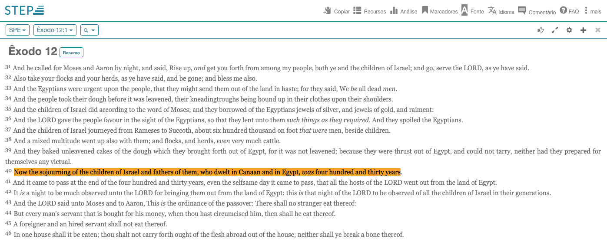

# Análise Cronológica dos Livros de Gênesis e Êxodo: Um Estudo Detalhado

## Introdução

A cronologia dos eventos narrados em Gênesis e Êxodo tem sido objeto de extenso debate entre estudiosos, teólogos e historiadores. Este estudo busca estabelecer uma linha do tempo coerente dos principais eventos, desde os patriarcas até o Êxodo, analisando referências bíblicas diretas, cálculos baseados nas idades dos personagens e considerações históricas. Através da análise de diferentes interpretações e abordagens, procuramos resolver aparentes contradições e apresentar uma cronologia consistente que se harmonize com os textos bíblicos.

## Disclaimer

Este estudo apresenta uma interpretação possível da cronologia dos livros de Gênesis e Êxodo, baseada em uma análise cuidadosa dos textos bíblicos e em cálculos derivados das idades e eventos mencionados nas Escrituras. Apesar dos esforços para estabelecer uma linha do tempo precisa e coerente, é importante reconhecer que existem outras teorias e interpretações cronológicas igualmente válidas no campo dos estudos bíblicos.

Diferentes tradições teológicas, descobertas arqueológicas e métodos de interpretação podem levar a conclusões cronológicas diversas. Alguns estudiosos propõem uma data mais tardia para o Êxodo (cerca de 1290-1250 a.C.), apesar de isso colocar em cheque a questão dos 480 anos até a construção do templo de Salomão, que vou abordar mais à frente. Outros tentam resolver esse ponto, questionando a literalidade dos números apresentados nas genealogias bíblicas, e há ainda aqueles que sugerem diferentes entendimentos para os 430 anos mencionados em Êxodo 12:40-41.

Este trabalho não pretende ser definitivo, mas sim contribuir para o diálogo contínuo sobre a interpretação histórica e cronológica dos textos bíblicos, assumindo uma posição mais literal dos números, porém reconhecendo a complexidade do tema e a riqueza das diversas abordagens acadêmicas e teológicas.

## 1. A Questão do Tempo no Egito

### 1.1 O Problema dos 430 Anos

O ponto de partida da investigação é a referência em Êxodo 12:40-41, que afirma: 

> *"Ora, o tempo que os filhos de Israel moraram no Egito foi de quatrocentos e trinta anos. E aconteceu que, ao fim dos quatrocentos e trinta anos, naquele mesmo dia, todos os exércitos do Senhor saíram da terra do Egito."* [Êxodo 12:40-41 ARC](https://www.bible.com/pt/bible/212/EXO.12.40-41)

Este período de 430 anos, entretanto, admite diferentes interpretações:

1. **Interpretação tradicional**: Os 430 anos referem-se exclusivamente ao tempo desde a chegada de Jacó e sua família ao Egito até o Êxodo liderado por Moisés.

2. **Interpretação da Septuaginta e do Novo Testamento**: Em Gálatas 3:17, Paulo menciona que a Lei veio 430 anos após a aliança de Deus com Abraão, sugerindo que este período inclui também o tempo dos patriarcas antes da escravidão no Egito.

> *"Ora, as promessas foram feitas a Abraão e ao seu descendente. Não diz: E aos descendentes, como se falando de muitos, porém como de um só: E ao teu descendente, que é Cristo. E digo isto: uma aliança já anteriormente confirmada por Deus, a lei, que veio quatrocentos e trinta anos depois, não a pode ab-rogar, de forma que venha a desfazer a promessa."* [Gálatas 3:16-17 ARA](https://www.bible.com/pt/bible/1608/GAL.3.16-17) 
 
### 1.2 A Construção do Templo de Salomão e a Datação Histórica

O versículo de 1 Reis 6:1 fornece uma referência temporal crucial para a construção do Templo de Salomão. Como existe outras fontes externas descrevendo a separação dos Reinos (Norte e Sul) de Israel, isso nos ajuda muito a situar esse evento na história

> *"No ano quatrocentos e oitenta, depois de saírem os filhos de Israel do Egito, Salomão, no ano quarto do seu reinado sobre Israel, no mês de zive (este é o mês segundo), começou a edificar a Casa do SENHOR."* [1Reis 6:1 ARA](https://www.bible.com/pt/bible/1608/1KI.6.1)
> 
> Registros assírios e babilônicos estabelecem uma cronologia precisa dos reis de Israel e Judá, fornecendo um contexto histórico confiável para datar o início do reinado de Salomão e, consequentemente, a construção do templo.

#### A Sincronização com Fontes Externas
A cronologia bíblica pode ser comparada a documentos históricos de civilizações antigas, principalmente da Assíria e Babilônia, que possuíam registros detalhados de eventos políticos e astronômicos. Alguns dos registros mais importantes incluem:

- O Cânone de Ptolomeu
- A Lista de Eponímia Assíria
- As Crônicas Babilônicas

Vamos aprofundar cada um abaixo.

#### O Cânone de Ptolomeu

O Cânone de Ptolomeu é uma lista de reis babilônicos e persas organizada pelo astrônomo Cláudio Ptolomeu no século II D.C. Embora tenha sido compilado tardiamente, ele é amplamente aceito porque combina com registros cuneiformes mais antigos, incluindo textos astronômicos que permitem datar eventos com precisão.

Referência Histórica:
- O Cânone lista os reinados dos monarcas babilônicos desde o período neobabilônico até o período persa.
- O reinado de Nabucodonosor II, que destruiu o templo de Salomão em 586 A.C., é bem documentado. A partir dessa data segura, é possível trabalhar de trás para frente e calcular a cronologia dos reis de Judá.

Aplicação à Datação de Salomão:
- A Bíblia afirma que o rei Ezequias recebeu uma ameaça de Senaqueribe da Assíria (2 Reis 18:13). O ataque assírio contra Judá é mencionado em registros históricos, permitindo datar com segurança o evento para 701 A.C..
- Ao retroceder na linha do tempo usando os reinados bíblicos, a ascensão de Salomão pode ser estimada em 970 A.C..

#### A Lista de Eponímia Assíria e o Eclipse de 763 A.C.

A Lista de Eponímia Assíria (ou "Limmu List") contém uma sequência de eventos registrados ano a ano, de eventos políticos, campanhas militares e eclipses solares e lunares. Um dos marcos mais importantes para essa argumentação, é o eclipse de Bur-Sagale, datado com precisão em 15 de junho de 763 A.C. e servindo como um ponto de referência confiável para alinhar a cronologia assíria com a história bíblica.

Referência Histórica:
- O eclipse é um evento astronômico fixo que serve como âncora para alinhar a cronologia assíria.
- O rei Jeú de Israel é mencionado na Estela Negra de Salmanasar III, datada de 841 A.C., fornecendo outra referência cruzada entre a Bíblia e a história assíria.

Aplicação à Datação de Salomão:
- A Bíblia menciona interações entre reis de Israel e Judá com impérios estrangeiros (Assíria, Babilônia, Egito). Quando essas interações podem ser ligadas a fontes extrabíblicas, os reinados podem ser datados com mais precisão.
- Utilizando a cronologia assíria como base, os estudiosos retrocedem na linha do tempo para alinhar os reinados bíblicos, chegando novamente à data aproximada de 970 A.C. para Salomão.

#### As Crônicas Babilônicas e as Sincronizações com os Reis de Israel e Judá

As Crônicas Babilônicas são registros cuneiformes que descrevem eventos políticos, militares, registros de reis incluindo a captura de reis de Judá pelos babilônios. Esse cruzamento com a Bíblia, também ajudam a estabelecer uma linha do tempo confiável dos reinos de Israel e Judá.

Referência Histórica:
- O cerco de Jerusalém por Nabucodonosor II é mencionado tanto na Bíblia (2 Reis 24:10-16) quanto nos registros babilônicos, fixando o evento em 597 A.C..
- O rei Acabe de Israel aparece em registros da batalha de Qarqar, travada contra o Império Assírio em 853 A.C., estabelecendo outra referência importante.

Aplicação à Datação de Salomão:
- A partir dessas referências históricas, os reinados dos reis de Judá e Israel podem ser calculados com base na duração mencionada na Bíblia.
- Retrocedendo na cronologia dos reis até Salomão, chega-se à data de 970 A.C. para o início do seu reinado.

#### Conclusão sobre a construção do templo e o Reinado de salomão

Com base nessas fontes, os historiadores conseguiram datar com precisão o reinado de reis como Acabe, Jeú e Ezequias, que possuem menções tanto na Bíblia quanto em registros externos. Ao trabalhar de trás para frente a partir dessas datas conhecidas, é possível estimar que o rei Salomão começou a reinar por volta de 970 A.C., e, quatro anos depois, iniciou a construção do templo, por volta de 966 A.C..

A cronologia bíblica não deve ser analisada isoladamente, mas sim em conjunto com fontes históricas externas que ajudam a validar e estabelecer datas aproximadas para eventos importantes. A sincronização do reinado de Salomão com registros assírios e babilônicos fortalece a estimativa de que sua ascensão ocorreu por volta de 970 A.C. e, consequentemente, a construção do templo teve início por volta de 966 A.C.. Nos próximos textos, aprofundaremos a análise da datação do Êxodo e dos 480 anos mencionados em 1 Reis 6:1.

<small>
#### Referências Bibliográficas para a Datação do Templo de Salomão

##### 1. O Cânone de Ptolomeu e a Cronologia Babilônica

- **PTOLOMEU, Cláudio.** *Almagesto*. 2nd century A.D.
    - O *Almagesto* de Ptolomeu contém o "Cânone de Reis", que lista monarcas babilônicos e persas, usado para estabelecer cronologias antigas.

- **THIEDE, Carsten Peter.** *The Cosmology of Ptolemy*. Routledge, 2005.
    - Analisa a precisão do Cânone de Ptolomeu e sua importância para a cronologia histórica.

- **WISEMAN, D. J.** *Chronicles of Chaldaean Kings (626–556 B.C.) in the British Museum*. London: The Trustees of the British Museum, 1956.
    - Apresenta textos cuneiformes que confirmam a sequência de reis babilônicos e sincronizam com eventos bíblicos.

- **THIELE, Edwin R.** *The Mysterious Numbers of the Hebrew Kings*. Grand Rapids, MI: Kregel Publications, 1994.
    - Estudo detalhado sobre a cronologia dos reis de Israel e Judá, incluindo a datação do reinado de Salomão.

##### 2. A Lista de Eponímia Assíria e o Eclipse de 763 A.C.

- **HUNGER, Hermann; STEPHANIE, Dalley.** *Astronomical Diaries and Related Texts from Babylonia*. Vienna: Austrian Academy of Sciences Press, 2001.
    - Contém registros astronômicos, incluindo o eclipse de Bur-Sagale em **763 A.C.**, usado para calibrar a cronologia assíria.

- **GRAYSON, A. K.** *Assyrian and Babylonian Chronicles*. Winona Lake, IN: Eisenbrauns, 2000.
    - Compilação de textos assírios que incluem listas reais e eventos históricos sincronizados com o calendário astronômico.

- **LARSON, David.** *Dating the Eclipse of Bur-Sagale: Implications for Assyrian Chronology*. Journal of Near Eastern Studies, 2018.
    - Estudo acadêmico sobre a datação do eclipse assírio e sua aplicação na cronologia bíblica.

- **LIPSCHITS, Oded.** *The Fall and Rise of Jerusalem: Judah Under Babylonian Rule*. Winona Lake, IN: Eisenbrauns, 2005.
    - Analisa os registros babilônicos e assírios para estabelecer conexões com a cronologia de Israel e Judá.

##### 3. As Crônicas Babilônicas e Sincronizações com os Reis de Israel e Judá

- **LUCKENBILL, Daniel David.** *Ancient Records of Assyria and Babylonia*. Chicago: University of Chicago Press, 1927.
    - Reúne inscrições reais assírias e babilônicas, incluindo menções a reis bíblicos como Jeú, Omri e Nabucodonosor.

- **ROST, Stefan.** *The Royal Inscriptions of Mesopotamia: Assyrian Periods*. Toronto: University of Toronto Press, 1998.
    - Análise das inscrições reais assírias, incluindo a *Estela Negra* de Salmanasar III, que menciona Jeú de Israel em **841 A.C.**.

- **WALTON, John H.** *Ancient Near Eastern Thought and the Old Testament: Introducing the Conceptual World of the Hebrew Bible*. Grand Rapids, MI: Baker Academic, 2006.
    - Examina a interação entre a Bíblia e fontes extrabíblicas, ajudando na datação dos eventos.

- **KITCHEN, Kenneth A.** *On the Reliability of the Old Testament*. Grand Rapids, MI: Eerdmans, 2003.
    - Defende a confiabilidade dos registros bíblicos e sua compatibilidade com documentos históricos do Antigo Oriente Próximo.

</small>

### 1.3 O Paradoxo Cronológico

Se adotarmos a cronologia tradicional que situa o Êxodo por volta de 1440-1436 a.C. (baseada em 1 Reis 6:1, que menciona que o templo de Salomão começou a ser construído 480 anos após o Êxodo), e se considerarmos literalmente os 430 anos de permanência no Egito, chegaríamos a aproximadamente 1870 a.C. para a chegada dos israelitas ao Egito.

Esta interpretação, no entanto, cria dois problemas fundamentais:

1. **Contradição com a narrativa de José**: Se a chegada ao Egito fosse em 1870 a.C., José teria nascido e vivido muito antes dessa data, o que contradiz toda a narrativa de Gênesis que coloca José como o responsável pela migração de sua família para o Egito.

2. **Inconsistência com Gálatas 3:17**: Paulo declara que a Lei foi dada 430 anos após a aliança com Abraão. Se considerarmos que os israelitas passaram esse tempo apenas no Egito, a aliança teria ocorrido muito antes da entrada de Jacó e sua família no país, resultando em uma contradição com o Novo Testamento. Além disso, esse entendimento estenderia o intervalo entre a aliança e a Lei para muito mais que 430 anos, já que o período de permanência no Egito seria apenas uma parte desse tempo.

Estas contradições sugerem que devemos adotar a segunda interpretação: os 430 anos mencionados em Êxodo incluem não apenas o tempo no Egito, mas todo o período desde a aliança de Deus com Abraão até o Êxodo. Esta visão harmoniza tanto os textos do Antigo quanto do Novo Testamento, e resolve as inconsistências cronológicas relacionadas à narrativa de José e dos patriarcas.

### 1.4 Evidências Textuais Adicionais

Vale notar que a própria Septuaginta (tradução grega do Antigo Testamento feita antes de Cristo) e o Pentateuco Samaritano trazem uma leitura diferente de Êxodo 12:40, afirmando que "a permanência dos filhos de Israel e de seus pais, que habitaram na terra de Canaã e na terra do Egito, foi de quatrocentos e trinta anos." Essa versão inclui explicitamente o tempo em Canaã no cálculo dos 430 anos, fortalecendo a interpretação que harmoniza os textos bíblicos.

Além disso, a relevância da Septuaginta é evidenciada pelo fato de que Jesus, Paulo, Mateus e outros autores do Novo Testamento frequentemente citam o Antigo Testamento utilizando essa tradução grega. Embora nem todas as citações sejam exclusivamente da Septuaginta, essa versão era amplamente reconhecida e usada na época. Em Gálatas 3:17, por exemplo, Paulo parece estar se baseando nessa tradição textual ao mencionar os 430 anos, o que reforça sua importância na interpretação do tempo de permanência de Israel antes do Êxodo.

Outras variações possiveis dessa tradução:

#### 1.4.1 Possíveis objeções:

> A Septuaginta e o Pentateuco Samaritano realmente têm essa leitura?

Sim, a Septuaginta e o Pentateuco Samaritano de Êxodo 12:40 inclui Canaã no tempo total de 430 anos.

##### 1.4.1.1 Septuaginta

> *"Ἡ δὲ κατοίκησις τῶν υἱῶν Ἰσραὴλ ἣν κατῴκησαν ἐν γῇ Αἰγύπτῳ καὶ ἐν γῇ Χανάαν ἔτη τετρακόσια τριάκοντα πέντε"* [Swete's Septuagint	Exodus 12.40](https://biblehub.com/sepd/exodus/12.htm#:~:text=40%E1%BC%A9%20%CE%B4%E1%BD%B2%20%CE%BA%CE%B1%CF%84%CE%BF%CE%AF%CE%BA%CE%B7%CF%83%CE%B9%CF%82%20%CF%84%E1%BF%B6%CE%BD%20%CF%85%E1%BC%B1%E1%BF%B6%CE%BD%20%E1%BC%B8%CF%83%CF%81%CE%B1%E1%BD%B4%CE%BB%20%E1%BC%A3%CE%BD%20%CE%BA%CE%B1%CF%84%E1%BF%B4%CE%BA%CE%B7%CF%83%CE%B1%CE%BD%20%E1%BC%90%CE%BD%20%CE%B3%E1%BF%87%20%CE%91%E1%BC%B0%CE%B3%CF%8D%CF%80%CF%84%E1%BF%B3%20%CE%BA%CE%B1%E1%BD%B6%20%E1%BC%90%CE%BD%20%CE%B3%E1%BF%87%20%CE%A7%CE%B1%CE%BD%CE%AC%CE%B1%CE%BD%20%E1%BC%94%CF%84%CE%B7%20%CF%84%CE%B5%CF%84%CF%81%CE%B1%CE%BA%CF%8C%CF%83%CE%B9%CE%B1%20%CF%84%CF%81%CE%B9%CE%AC%CE%BA%CE%BF%CE%BD%CF%84%CE%B1%20%CF%80%CE%AD%CE%BD%CF%84%CE%B5%C2%B7)
>
> *"E a habitação dos filhos de Israel, que habitaram na terra do Egito e na terra de Canaã, foi de quatrocentos e trinta e cinco anos."* [Google Tradutor](https://translate.google.com/?hl=pt-BR&tab=wT&sl=auto&tl=pt&text=%E1%BC%A9%20%CE%B4%E1%BD%B2%20%CE%BA%CE%B1%CF%84%CE%BF%CE%AF%CE%BA%CE%B7%CF%83%CE%B9%CF%82%20%CF%84%E1%BF%B6%CE%BD%20%CF%85%E1%BC%B1%E1%BF%B6%CE%BD%20%E1%BC%B8%CF%83%CF%81%CE%B1%E1%BD%B4%CE%BB%20%E1%BC%A3%CE%BD%20%CE%BA%CE%B1%CF%84%E1%BF%B4%CE%BA%CE%B7%CF%83%CE%B1%CE%BD%20%E1%BC%90%CE%BD%20%CE%B3%E1%BF%87%20%CE%91%E1%BC%B0%CE%B3%CF%8D%CF%80%CF%84%E1%BF%B3%20%CE%BA%CE%B1%E1%BD%B6%20%E1%BC%90%CE%BD%20%CE%B3%E1%BF%87%20%CE%A7%CE%B1%CE%BD%CE%AC%CE%B1%CE%BD%20%E1%BC%94%CF%84%CE%B7%20%CF%84%CE%B5%CF%84%CF%81%CE%B1%CE%BA%CF%8C%CF%83%CE%B9%CE%B1%20%CF%84%CF%81%CE%B9%CE%AC%CE%BA%CE%BF%CE%BD%CF%84%CE%B1%20%CF%80%CE%AD%CE%BD%CF%84%CE%B5&op=translate)

> *"ἡ δὲ κατοίκησις τῶν υἱῶν Ισραηλ ἣν κατῴκησαν ἐν γῇ Αἰγύπτῳ καὶ ἐν γῇ Χανααν ἔτη τετρακόσια τριάκοντα"* [Biblia Catolica - Septuaginta + NT - Ex.12-40](https://www.bibliacatolica.com.br/septuaginta/exodo/12/#:~:text=%E1%BC%A1%20%CE%B4%E1%BD%B2%20%CE%BA%CE%B1%CF%84%CE%BF%E1%BD%B7%CE%BA%CE%B7%CF%83%CE%B9%CF%82%20%CF%84%E1%BF%B6%CE%BD%20%CF%85%E1%BC%B1%E1%BF%B6%CE%BD%20%CE%99%CF%83%CF%81%CE%B1%CE%B7%CE%BB%20%E1%BC%A3%CE%BD%20%CE%BA%CE%B1%CF%84%E1%BF%B4%CE%BA%CE%B7%CF%83%CE%B1%CE%BD%20%E1%BC%90%CE%BD%20%CE%B3%E1%BF%87%20%CE%91%E1%BC%B0%CE%B3%E1%BD%BB%CF%80%CF%84%E1%BF%B3%20%CE%BA%CE%B1%E1%BD%B6%20%E1%BC%90%CE%BD%20%CE%B3%E1%BF%87%20%CE%A7%CE%B1%CE%BD%CE%B1%CE%B1%CE%BD%20%E1%BC%94%CF%84%CE%B7%20%CF%84%CE%B5%CF%84%CF%81%CE%B1%CE%BA%E1%BD%B9%CF%83%CE%B9%CE%B1%20%CF%84%CF%81%CE%B9%E1%BD%B1%CE%BA%CE%BF%CE%BD%CF%84%CE%B1)
>
> *"E a habitação dos filhos de Israel, que habitaram na terra do Egito e na terra de Canaã, foi de quatrocentos e trinta anos."* [Google Tradutor](https://translate.google.com/?hl=pt-BR&tab=wT&sl=auto&tl=pt&text=%E1%BC%A1%20%CE%B4%E1%BD%B2%20%CE%BA%CE%B1%CF%84%CE%BF%E1%BD%B7%CE%BA%CE%B7%CF%83%CE%B9%CF%82%20%CF%84%E1%BF%B6%CE%BD%20%CF%85%E1%BC%B1%E1%BF%B6%CE%BD%20%CE%99%CF%83%CF%81%CE%B1%CE%B7%CE%BB%20%E1%BC%A3%CE%BD%20%CE%BA%CE%B1%CF%84%E1%BF%B4%CE%BA%CE%B7%CF%83%CE%B1%CE%BD%20%E1%BC%90%CE%BD%20%CE%B3%E1%BF%87%20%CE%91%E1%BC%B0%CE%B3%E1%BD%BB%CF%80%CF%84%E1%BF%B3%20%CE%BA%CE%B1%E1%BD%B6%20%E1%BC%90%CE%BD%20%CE%B3%E1%BF%87%20%CE%A7%CE%B1%CE%BD%CE%B1%CE%B1%CE%BD%20%E1%BC%94%CF%84%CE%B7%20%CF%84%CE%B5%CF%84%CF%81%CE%B1%CE%BA%E1%BD%B9%CF%83%CE%B9%CE%B1%20%CF%84%CF%81%CE%B9%E1%BD%B1%CE%BA%CE%BF%CE%BD%CF%84%CE%B1&op=translate)

A maioria das citações do Antigo Testamento no Novo vem da Septuaginta, mas não todas.
Em alguns casos, os autores parecem seguir um texto hebraico ou paráfrase.
Porém, em Gálatas 3:17, Paulo provavelmente se baseia na tradição da Septuaginta, o que fortalece seu argumento.

##### 1.4.1.2 Pentateuco Samaritano - SPE (Samaritan Pentateuch in English)

> *"Now the sojourning of the children of Israel and fathers of them, who dwelt in Canaan and in Egypt, was four hundred and thirty years."* [SPE - Exodus 12.40](https://www.stepbible.org/?q=version=SPE@reference=%C3%8Axodo.12&options=HVLGUN#:~:text=40,and%20thirty%20years.)
 
##### 1.4.1.3 Massorético

A versão massorética, porém, não menciona Canaã, o que leva a diferentes interpretações.

> "וּמוֹשַׁב בְּנֵי יִשְׂרָאֵל אֲשֶׁר יָשְׁבוּ בְּמִצְרָיִם שְׁלֹשִׁים שָׁנָה וְאַרְבַּע מֵאוֹת שָׁנָֽה"
 [MapM - Aleppo pointed Masoretic OT in Hebrew - Ex 12.40](https://www.stepbible.org/?q=version=MapM@reference=Exod.12&options=HVLGUN#:~:text=40,%D7%95%D6%B0%D7%90%D6%B7%D7%A8%D6%B0%D7%91%D6%BC%D6%B7%D7%A2%20%D7%9E%D6%B5%D7%90%D7%95%D6%B9%D7%AA%20%D7%A9%D7%81%D6%B8%D7%A0%D6%B8%D6%BD%D7%94%D7%83)
> 
> *"E a permanência dos filhos de Israel no Egito foi de trinta e quatrocentos anos."* [Google Tradutor](https://translate.google.com/?sl=auto&tl=pt&text=%D7%95%D6%BC%D7%9E%D7%95%D6%B9%D7%A9%D7%81%D6%B7%D7%91%20%D7%91%D6%BC%D6%B0%D7%A0%D6%B5%D7%99%20%D7%99%D6%B4%D7%A9%D7%82%D6%B0%D7%A8%D6%B8%D7%90%D6%B5%D7%9C%20%D7%90%D6%B2%D7%A9%D7%81%D6%B6%D7%A8%20%D7%99%D6%B8%D7%A9%D7%81%D6%B0%D7%91%D7%95%D6%BC%20%D7%91%D6%BC%D6%B0%D7%9E%D6%B4%D7%A6%D6%B0%D7%A8%D6%B8%D7%99%D6%B4%D7%9D%20%D7%A9%D7%81%D6%B0%D7%9C%D6%B9%D7%A9%D7%81%D6%B4%D7%99%D7%9D%20%D7%A9%D7%81%D6%B8%D7%A0%D6%B8%D7%94%20%D7%95%D6%B0%D7%90%D6%B7%D7%A8%D6%B0%D7%91%D6%BC%D6%B7%D7%A2%20%D7%9E%D6%B5%D7%90%D7%95%D6%B9%D7%AA%20%D7%A9%D7%81%D6%B8%D7%A0%D6%B8%D6%BD%D7%94%D7%83&op=translate&hl=pt-BR)

###### Disclaimer

As citações bíblicas apresentadas neste material incluem diversas traduções e versões, algumas das quais podem pertencer a tradições doutrinárias distintas da minha interpretação. O objetivo dessas referências é exclusivamente comparativo e referencial, visando uma melhor compreensão do texto. Sua inclusão não implica concordância nem discordância com quaisquer outras afirmações ou doutrinas associadas a essas traduções.

## 2. A Cronologia de José e Jacó

### 2.1 José como Figura Central

A história de José fornece pontos de referência essenciais para estabelecer a cronologia. Sabemos que:

- José foi vendido como escravo aos 17 anos (Gênesis 37:2)
- Tornou-se governador do Egito aos 30 anos (Gênesis 41:46)
- Previu sete anos de fartura seguidos por sete anos de fome
- A família de Jacó chegou ao Egito durante a fome, quando José tinha entre 38-39 anos

### 2.2 A Idade de Jacó

Gênesis 47:28 nos informa que "depois de chegar ao Egito, Jacó viveu mais dezessete anos; portanto, viveu ao todo 147 anos." Isso significa que Jacó tinha 130 anos quando chegou ao Egito, permitindo-nos calcular:

- Quando José foi vendido como escravo aos 17 anos, Jacó tinha 108 anos
- Quando José se tornou governador aos 30 anos, Jacó tinha 122 anos
- Após os sete anos de fartura, José tinha 37 anos e Jacó 129 anos
- A família chegou ao Egito quando Jacó tinha 130 anos

### 2.3 Linha do Tempo de José

Considerando que a data do Êxodo está muito próxima de 1440 a.C., baseado na [construção do templo de Salomão](cronologia-genesis-exodo.md#12-a-construção-do-templo-de-salomão-e-a-datação-histórica) que Estabelecemos, então as seguintes datas para José: 

- 1686 a.C.: Nascimento de José
- 1669 a.C.: José vendido como escravo (17 anos)
- 1656 a.C.: José se torna governador do Egito (30 anos)
- 1649 a.C.: Início da fome (José com 37 anos)
- 1648-1647 a.C.: Chegada da família de Jacó ao Egito
- 1631 a.C.: Morte de Jacó no Egito (147 anos)

## 3. A Cronologia dos Patriarcas

### 3.1 A Aliança com Abraão e Gálatas 3:17

Um elemento crucial para nossa cronologia é a referência em Gálatas 3:17, que menciona que a Lei veio 430 anos após a aliança de Deus com Abraão. Se o Êxodo e a entrega da Lei ocorreram por volta de 1440 a.C., então a aliança teria sido feita em aproximadamente 1870 a.C.

Abraão teria recebido o chamado de Deus aos 75 anos (Gênesis 12:4), o que situa seu nascimento por volta de 1945 a.C. (1870 + 75 = 1945).

### 3.2 Abraão, Isaque e Jacó

Baseando-nos nas idades fornecidas pela Bíblia e trabalhando retroativamente a partir da chegada ao Egito:

- 1945 a.C.: Nascimento de Abraão
- 1870 a.C.: Aliança de Deus com Abraão
- 1845 a.C.: Nascimento de Isaque (Abraão com 100 anos)
- 1785 a.C.: Nascimento de Jacó e Esaú (Isaque com 60 anos)
- 1709 a.C.: Jacó chega a Harã com (76 anos)
- 1689 a.C.: Jacó retorna a Canaã após 20 anos em Harã

## 4. A Cronologia de Moisés e do Êxodo

### 4.1 Nascimento e Fuga de Moisés

Sabendo que Moisés tinha 80 anos durante o Êxodo (Êxodo 7:7) e que fugiu do Egito aos 40 anos (Atos 7:23-29), podemos calcular:

- 1520 a.C.: Nascimento de Moisés
- 1480 a.C.: Fuga de Moisés para Madiã
- 1440 a.C.: Êxodo

### 4.2 Os 430 Anos Revisitados

Com estas datas estabelecidas, podemos reavaliar os 430 anos mencionados em Êxodo 12:40-41. A chegada da família de Jacó ao Egito ocorreu por volta de 1648-1647 a.C., e o Êxodo ocorreu em 1440 a.C., o que significa que os israelitas passaram aproximadamente 208 anos no Egito.

Isso confirma que os 430 anos mencionados em Êxodo incluem não apenas o tempo de permanência no Egito, mas também o período desde a aliança de Deus com Abraão, como sugerido por Gálatas 3:17.

## 5. O Crescimento Populacional dos Israelitas

### 5.1 De 70 Pessoas a 603.550

O crescimento populacional de Israel no Egito, desde sua chegada até o Êxodo, é um aspecto fascinante da história bíblica, especialmente devido à grande quantidade de pessoas mencionada no livro de Números: 603.550 homens que estavam aptos para a guerra, sem contar mulheres e crianças. A Bíblia descreve um período de cerca de 208 anos, entre a chegada da família de Jacó ao Egito (aproximadamente em 1648 a.C.) e o Êxodo (cerca de 1440 a.C.), durante o qual o número de israelitas cresceu de 70 pessoas para centenas de milhares.

Esse crescimento aparentemente rápido desperta a curiosidade sobre como uma população tão pequena poderia ter se expandido de maneira tão significativa em um período relativamente curto.

Usando a fórmula de crescimento populacional exponencial (Pf = Pi × (1+r)^t):
- População inicial (P0): 70 pessoas
- População final (Pt): 603.550 pessoas
- Tempo (t): 208 anos

 
Calculamos que a taxa de crescimento anual necessária seria de aproximadamente 4,5%.

### 5.2 - Plausibilidade da Taxa de Crescimento

#### 5.2.1 - Comparação com taxas de crescimento populacional modernas

Para dar uma ideia de como uma taxa de 4,5% ao ano se compara com a realidade moderna, podemos observar algumas taxas de crescimento de populações mais recentes.

- Taxas de crescimento populacional modernas: Muitas nações em desenvolvimento têm taxas de crescimento populacional que variam de 1% a 3% ao ano, enquanto as nações desenvolvidas estão em crescimento muito mais lento, com taxas abaixo de 1%.

- Por exemplo, países com taxas altas, como Níger ou África Subsaariana, podem ter taxas de crescimento próximas de 3% a 4%, mas estas taxas são devidas a uma alta fecundidade, com muitas famílias tendo vários filhos, em contraste com as sociedades modernas, onde a fecundidade tende a ser menor devido a fatores como urbanização, acesso a métodos contraceptivos e maior educação.

#### 5.2.2 - Aumento populacional em sociedades antigas

Nas sociedades antigas, especialmente aquelas que viviam em condições desafiadoras, com limitações em termos de saúde, alimento e cuidados médicos, a taxa de crescimento demográfico seria significativamente mais baixa. Vários fatores influenciariam a taxa de crescimento:

- Alta mortalidade infantil: A mortalidade infantil era muito mais alta na Antiguidade devido à falta de cuidados médicos e à maior incidência de doenças. Muitas crianças não chegavam à idade adulta.

- Falta de recursos médicos: Doenças, malnutrição e epidemias poderiam reduzir a população, dificultando taxas de crescimento constantes e elevadas ao longo do tempo.

- Condições de vida: A maioria das sociedades antigas vivia em condições bastante simples, e as taxas de reprodução seriam mais influenciadas pela sobrevivência, do que por políticas de crescimento ou avanços tecnológicos.

#### 5.3 - Crescimento de populações antigas

A taxa de crescimento populacional em sociedades antigas costumava ser mais modesta. Uma taxa de 1% a 2% ao ano já seria considerada boa em um contexto antigo, especialmente por causa das limitações mencionadas anteriormente.

Uma taxa de crescimento de 4,5% ao ano é consideravelmente alta para padrões históricos. No entanto, para entender essa taxa e sua plausibilidade, é essencial considerar vários fatores culturais, sociais e espirituais que podem ter influenciado esse fenômeno:

#### 5.3.1 Poligamia e famílias numerosas

Com certeza, um fator relevante foi a poligamia — a prática de homens terem várias esposas, o que era comum nas culturas antigas, inclusive entre os israelitas. Um exemplo claro disso é Abraão com 4 mulheres, e também Jacó, que com elas, gerou 12 filhos. A prática da poligamia multiplicava as possibilidades de ter filhos, o que era uma grande vantagem para o crescimento populacional.  

Em sociedades onde a poligamia era a norma, um homem poderia ter muitos filhos, de modo que uma única família poderia ter um número significativo de membros em pouco tempo. Assim, a multiplicidade de esposas explicava o número crescente de filhos, e, consequentemente, o rápido aumento da população.

#### 5.3.2 Bênção divina

O favor divino sobre a nação de Israel é um tema recorrente nas Escrituras. Desde o êxodo de Abraão até a promessa feita a Isaac e Jacó, a Bíblia enfatiza que Deus abençoou a descendência de Abraão com a promessa de multiplicação. Esse fenômeno foi claramente expresso em passagens como Êxodo 1:7, que descreve o povo de Israel como sendo “frutífero e se multiplicando.”

A multiplicação de Israel não foi apenas um fenômeno natural; foi também uma benção divina, que se estendeu além das limitações naturais. A Bíblia afirma que a fertilidade e o crescimento de Israel foram resultado direto do favor de Deus. Essa benção não se limitou ao aumento da população, mas também incluiu prosperidade econômica e proteção divina, fatores que favoreceram a sobrevivência e o bem-estar da nação.

#### 5.3.3 O Contexto Favorável de Gósen

A região de Gósen, onde os israelitas se estabeleceram no Egito, contribuiu significativamente para o crescimento populacional do povo. Gósen era uma terra fértil e tranquila, localizada no delta do Rio Nilo, amplamente reconhecida por suas condições ideais para a agricultura e para sustentar uma grande população. Durante o período de permanência no Egito, os israelitas provavelmente viveram em um ambiente livre de conflitos, com abundância de recursos.

A atuação de José como governador do Egito foi crucial nesse contexto. Ele assegurou um lugar seguro e produtivo para sua família, o que certamente fomentou a prosperidade do povo de Israel. Sob sua gestão, os israelitas estavam protegidos de ameaças externas, bem alimentados e desfrutavam de relativa prosperidade econômica. Essa combinação de fatores possibilitou uma alta taxa de sobrevivência e um crescimento demográfico consistente durante o período em que José esteve no comando. Essa realidade, no entanto, só mudou em um momento posterior, quando passaram a ser escravizados.

#### 5.3.4 Casamento Precoce e Alta Fecundidade

Na sociedade antiga, especialmente entre os israelitas, o casamento precoce era uma prática comum. Mulheres frequentemente se casavam a partir dos 12, enquanto os homens, em média, se casavam a partir dos 16. Esse fenômeno permitia que as mulheres tivessem filhos em uma idade jovem, com poucos intervalos entre as gestações, o que resultava em uma alta fecundidade. 

Considerando que muitas mulheres se casavam cedo durante o maior período de fertilidade, isso permitia uma maior taxa de natalidade, especialmente dentro de famílias que tinham vários filhos. De fato, as famílias grandes eram altamente valorizadas naquela cultura. A alta taxa de fecundidade, combinada com casamentos precoces, propiciava um crescimento populacional considerável.

### 5.4 Conclusão

O crescimento populacional acelerado de Israel, que passou de 70 pessoas para mais de 600.000 em 208 anos, pode ser explicado através de uma combinação de fatores naturais, culturais e espirituais. A prática de casamentos precoces, a poligamia, a alta fecundidade e, acima de tudo, a benção divina, foram os principais motores desse crescimento. Além disso, o contexto favorável de Gósen, uma região próspera e segura, proporcionou as condições ideais para a sobrevivência e prosperidade dos israelitas.

Portanto, a taxa de ~4,5% ao ano de crescimento da população israelita durante esse período não é apenas plausível, mas realista, dado o cenário favorável, as práticas sociais e o favor divino. A história bíblica de Israel no Egito, longe de ser apenas uma narrativa religiosa, também revela como fatores humanos e espirituais podem interagir para criar condições extraordinárias de crescimento e prosperidade.

## 6. Argumentos Adicionais que Corroboram a Cronologia

### 6.1 As Idades dos Filhos de Jacó no Retorno a Canaã

Se Jacó chegou a Harã em aproximadamente 1709 a.C., trabalhou sete anos antes de se casar com Leia e Raquel (em 1702 a.C.), e retornou a Canaã após 20 anos (em 1689 a.C.), podemos calcular as idades aproximadas de seus filhos durante esta viagem:

- Rúben: 12 anos (no máximo)
- Simeão: 11 anos
- Levi: 10 anos
- Judá: 9 anos
- Dã: 9 anos (por Bila)
- Gade: 9 anos (por Zilpa)
- Naftali: 8 anos (por Bila)
- Aser: 8 anos (por Zilpa)
- Issacar: 8 anos
- Zebulom: 7 anos
- Diná: 6 anos
- José: 5 anos (no máximo)

Estas idades são consistentes com a narrativa bíblica, considerando que:
- Leia foi mãe dos quatro primeiros filhos
- As concubinas, Bila e Zilpa, só começaram a ter filhos depois que Leia parou de conceber
- Rúben provavelmente tinha pelo menos 4 anos quando Issacar nasceu (devido ao episódio das mandrágoras)
- José, o primeiro filho de Raquel, nasceu depois de Diná

Durante essa viagem, as idades aproximadas das esposas de Jacó seriam:
- Jacó: 97 anos
- Leia: 37 anos
- Raquel: 35 anos
- Zilpa: 33 anos
- Bila: 30 anos

Benjamim nasceu apenas nove anos após o retorno a Canaã (em 1680 a.C.), durante uma viagem.

### 6.2 O Episódio de Diná em Siquém (Gênesis 34)

Analisando o episódio de Diná em Gênesis 34, podemos estimar que este evento ocorreu aproximadamente 9 anos após a chegada da família a Siquém, quando Diná teria cerca de 15 anos de idade:

- A Bíblia indica que os próprios filhos de Jacó negociaram o casamento e impuseram a circuncisão
- Levi e Simeão, que lideraram o massacre, já não eram crianças
- Raquel ainda não havia dado à luz a Benjamim (que nasceria na viagem para Betel, no capítulo seguinte)
- A família permaneceu provavelmente pelo menos um ano em Betel
- O intervalo entre a chegada a Siquém e a venda de José (aos 17 anos) seria de aproximadamente 11 anos

Assim, as idades estimadas durante este episódio seriam:
- Rúben: 21 anos
- Simeão: 20 anos
- Levi: 19 anos
- Judá: 18 anos
- Dã: 18 anos
- Gade: 18 anos
- Naftali: 17 anos
- Aser: 17 anos
- Issacar: 17 anos
- Zebulom: 16 anos
- Diná: 15 anos
- José: 14 anos

### 6.3 As Idades no Momento da Venda de José

Com base nos cálculos anteriores e na informação explícita de que José foi vendido aos 17 anos (Gênesis 37:2), podemos estimar as idades de todos os irmãos neste momento crucial:

- Rúben: 24 anos
- Simeão: 23 anos
- Levi: 22 anos
- Judá: 21 anos
- Dã: 21 anos
- Gade: 21 anos
- Naftali: 20 anos
- Aser: 20 anos
- Issacar: 20 anos
- Zebulom: 19 anos
- Diná: 18 anos
- José: 17 anos
- Benjamim: 3 anos

Jacó teria 109 anos neste momento, o que é consistente com os cálculos baseados em sua idade quando chegou ao Egito (130 anos).

### 6.4 As Idades Quando José Tornou-se Governador

Quando José se tornou governador do Egito aos 30 anos (Gênesis 41:46), as idades aproximadas de seus familiares seriam:

- Rúben: 37 anos
- Simeão: 36 anos
- Levi: 35 anos
- Judá: 34 anos
- Dã: 34 anos
- Gade: 34 anos
- Naftali: 33 anos
- Aser: 33 anos
- Issacar: 33 anos
- Zebulom: 32 anos
- Diná: 31 anos
- José: 30 anos
- Benjamim: 16 anos

Jacó teria 122 anos, o que se alinha perfeitamente com os cálculos baseados em sua chegada ao Egito com 130 anos, após os sete anos de fartura e o início da fome.

### 6.5 As Idades no Momento da Morte de Jacó

No capítulo 48 de Gênesis, Jacó abençoa seus filhos antes de morrer. Este evento ocorreu 25 anos após José tornar-se governador:
- 30 anos: Idade de José ao se tornar governador
- + 7 anos: Período de fartura
- + 1 ano: Quando Jacó chegou ao Egito
- + 17 anos: Tempo que Jacó viveu no Egito antes de falecer

Neste momento, as idades aproximadas seriam:
- Rúben: 62 anos
- Simeão: 61 anos
- Levi: 60 anos
- Judá: 59 anos
- Dã: 59 anos
- Gade: 59 anos
- Naftali: 58 anos
- Aser: 58 anos
- Issacar: 58 anos
- Zebulom: 57 anos
- Diná: 56 anos
- José: 55 anos
- Benjamim: 41 anos

Jacó teria 147 anos, exatamente como relatado em Gênesis 47:28.

## 7. Conclusão

Após analisar cuidadosamente as referências bíblicas e reconciliar aparentes contradições, chegamos a uma cronologia coerente dos principais eventos de Gênesis e Êxodo:

- **Abraão**: Nascimento em 1945 a.C.; aliança com Deus em 1870 a.C. (aos 75 anos)
- **Isaque**: Nascimento em 1845 a.C. (Abraão com 100 anos)
- **Jacó**: Nascimento em 1785 a.C. (Isaque com 60 anos)
- **José**: Nascimento em 1686 a.C.; governador do Egito em 1656 a.C.
- **Entrada no Egito**: 1648-1647 a.C. (início do período de 208 anos no Egito)
- **Moisés**: Nascimento em 1520 a.C.; fuga para Madiã em 1480 a.C.
- **Êxodo**: 1440 a.C.

Esta cronologia harmoniza os 430 anos mencionados em Êxodo 12:40-41 com a interpretação de Gálatas 3:17, entendendo que este período abrange desde a aliança com Abraão até o Êxodo, incluindo tanto o tempo dos patriarcas em Canaã quanto os anos no Egito.

Os cinco argumentos adicionais apresentados fornecem verificações cruzadas que corroboram esta linha do tempo, demonstrando consistência interna em momentos-chave da narrativa: o retorno de Jacó a Canaã, o episódio de Diná em Siquém, a venda de José, sua ascensão a governador do Egito e a morte de Jacó. Em cada um desses momentos, as idades calculadas dos personagens se alinham perfeitamente com as informações explícitas fornecidas nas Escrituras.

O crescimento exponencial da população israelita durante esses anos, embora alto pelos padrões históricos, é coerente com o contexto bíblico de bênção divina, práticas culturais da época e condições favoráveis no Egito até o início da opressão.

Esta análise cronológica não apenas oferece uma linha do tempo consistente, mas também enriquece nossa compreensão do desenvolvimento do povo de Israel durante esse período formativo de sua história, fornecendo um quadro temporal coerente que respeita tanto o texto bíblico quanto as possibilidades históricas.