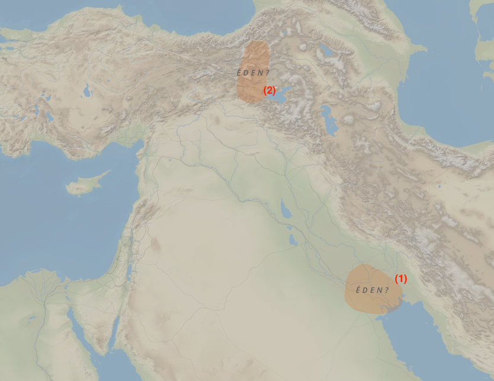

# Dia 01 — Gn 1–3

---

- Tempo total de Leitura: 13:45

1. Ler Genesis do capitulo 1 ao 3:
2. Assista a esse vídeo https://www.youtube.com/watch?v=Caad4veNpLo
3. Após Terminar, veja:

#### Quer ouvir uma narração desses capítulos?

- Cap 01: https://www.bible.com/pt/audio-bible/211/GEN.01.NTLH
- Cap 02: https://www.bible.com/pt/audio-bible/211/GEN.02.NTLH
- Cap 03: https://www.bible.com/pt/audio-bible/211/GEN.03.NTLH

## Onde?

Não sabemos ao certo, mas pela descrição existem 2 lugares positives para a localização do jardim do eden:

1. **Região entre os rios Tigre e Eufrates (Mesopotâmia)**: Corresponde ao atual Iraque e partes do Kuwait. Esta região é mencionada na Bíblia como o local onde esses rios fluem, o que sugere que o Éden poderia estar em algum ponto desta área extremamente fértil.
2. **Região da Turquia (nascentes dos rios)**: Alguns estudiosos sugerem que o Jardim do Éden poderia estar próximo das nascentes dos rios mencionados na Bíblia, localizadas na atual Turquia, especificamente na região montanhosa perto do planalto da Armênia.

## Quando?

Calcular uma data específica para o evento descrito em Gênesis 1, que trata da criação do mundo, é um desafio controverso e complexo, pois o texto bíblico não fornece datas concretas. No entanto, ao longo da história, muitos estudiosos e teólogos tentaram estimar quando os eventos de Gênesis 1 podem ter ocorrido, baseando-se em elementos das escrituras e interpretações tradicionais:

Na tradição judaico-cristã, algumas tentativas de cálculo da data de Gênesis 1 utilizam genealogias fornecidas na Bíblia, como as descritas em Gênesis 5 e 11, que traçam as linhagens desde Adão até Abraão. Este método é conhecido como cronologia histórica bíblica.

- No século XVII, o bispo James Ussher, calculou que a criação ocorreu em **4004 a.C.**, utilizando as genealogias e os períodos de tempo descritos na Bíblia. Ele partiu da ideia de que os "dias da criação" correspondem a dias literais e que a história da humanidade descrita nas escrituras começou logo após a criação.
- Outra abordagem considera que os "dias" de Gênesis 1 não correspondem a períodos literais de 24 horas, mas a eras ou períodos de tempo indefinidos. Nessa linha, não é possível calcular quando se passa esses capítulos.

## O primeiro sacrifício por causa do pecado

A narrativa da criação e do pecado em Gênesis 1-3 é fundamental para a compreensão da teologia cristã sobre pecado, redenção e sacrifício. No relato, Adão e Eva, ao desobedecerem a Deus, introduziram o pecado na humanidade. Como resultado de sua desobediência, eles se tornaram conscientes de sua nudez e sentiram vergonha (Gênesis 3:7). Para cobri-los, Deus fez vestimentas de peles, o que sugere que um sacrifício foi realizado — animais foram mortos para fornecer as roupas que cobriam a nudez e a vergonha do homem.

Este ato de Deus pode ser interpretado como o primeiro exemplo de sacrifício por causa do pecado. Ao sacrificar animais para fazer roupas para Adão e Eva, Deus estabeleceu um princípio que ecoaria ao longo das Escrituras: a ideia de que é necessário um sacrifício para a cobertura e remissão do pecado.

Esse conceito se desenvolveu de maneira mais explícita ao longo da história do povo de Israel, particularmente na Lei de Moisés. Os sacrifícios de animais tornaram-se um elemento central na adoração, servindo como um meio pelo qual o povo buscava expiação e reconciliação com Deus. A morte de um animal em sacrifício simbolizava a transferência dos pecados do povo para o animal, que, em seguida, sofria em seu lugar.

Essa ideia tem seu ápice no Novo Testamento que apresenta Jesus Cristo como o cumprimento dessas antigas promessas e símbolos. Jesus é o "Cordeiro de Deus" que tira o pecado do mundo (João 1:29). Seu sacrifício na cruz é a consumação do sistema de sacrifícios do Antigo Testamento.

> João 19:30 (NTLH): 30 Tendo‑o provado, Jesus disse: **― Está consumado!** Com isso, curvou a cabeça e entregou o espírito.

Jesus se ofereceu em sacrifício perfeito e completo para reconciliar a humanidade com Deus. Portanto, a narrativa do sacrifício feito por Deus, ao fazer as vestimentas para Adão e Eva, é uma antecipação do sacrifício redentor de Jesus Cristo. Assim, a morte de Jesus na cruz é vista não apenas como um ato de amor, mas também como o meio pelo qual a vergonha, o pecado e a separação da humanidade em relação a Deus são finalmente resolvidos. Esta conexão profunda entre o Antigo e o Novo Testamento ressalta a continuidade da obra de Deus na história da redenção, culminando em Cristo, que oferece a todos a possibilidade de uma nova vida e reconciliação com o Criador.

## Comentários sobre esses capítulos

- O texto bíblico revela que a **serpente** que apareceu a Eva era o próprio Satanás veja Ap 12:9 e 2Co 11:3

>"*O enorme dragão foi lançado fora do céu. Ele é aquela velha cobra, chamada Diabo ou Satanás, que leva todas as pessoas do mundo a pecar. Ele foi jogado sobre a terra, e os seus anjos também foram jogados junto com ele.*" [Apocalipse 12:9 NTLH](https://www.bible.com/pt/bible/compare/REV.12.9)

>"*Pois, assim como Eva foi enganada pelas mentiras da cobra, eu tenho medo de que a mente de vocês seja corrompida e vocês abandonem a devoção sincera e pura a Cristo.*" [2Coríntios 11:3 NTLH](https://www.bible.com/pt/bible/compare/2CO.11.3)

- No primeiro dia, Deus ordenou que a luz se separasse das trevas e, com isso, estabeleceu o ciclo Dia e Noite. Esse ato não deve ser confundido com a criação do sol, da lua e das estrelas no quarto dia.

- Em 2Coríntios 4:6, o apóstolo Paulo estabelece um paralelo da separação entre a luz e as trevas com a conversão do pecador.

>"*O Deus que disse: “Que da escuridão brilhe a luz” é o mesmo que fez a luz brilhar no nosso coração. E isso para nos trazer a luz do conhecimento da glória de Deus, que brilha no rosto de Jesus Cristo.*" [2Coríntios 4:6 NTLH](https://www.bible.com/pt/bible/compare/2CO.4.6)

- A coroa da obra de Deus foi a criação do homem à sua imagem e semelhança. Isso significa que o homem foi colocado na terra como representante de Deus e, de certa forma, partilha características semelhantes com o Senhor: Deus é uma Trindade (Pai, Filho e Espírito Santo), e o homem é um ser tripartite (corpo, alma e espírito); como Deus, o homem possui intelecto, juízo moral, poder de se comunicar com os outros e uma natureza emocional que transcende seus instintos. Não há indicação de semelhança física no texto. Ao contrário dos animais, o homem é um ser criador e adorador, e se comunica com clareza.

- O versículo 26 contempla ou até mesmo faz supor a existência da Trindade: “disse [no hebraico, o verbo está no singular] Deus [Elohim, no plural]: Façamos [plural] o homem à nossa imagem”.
  
- No final do primeiro capitulo, deixa claro que o homem era vegetariano. Essa situação vai mudar após o dilúvio.

>"*Para vocês se alimentarem, eu lhes dou todas as plantas que produzem sementes e todas as árvores que dão frutas.*" [Gênesis 1:29 NTLH](https://www.bible.com/pt/bible/compare/GEN.1.29)

- Assim como o homem os animais também eram herbívoros

>"*Mas, para todos os animais selvagens, para as aves e para os animais que se arrastam pelo chão, dou capim e verduras como alimento.
E assim aconteceu.*" [Gênesis 1:30 NTLH](https://www.bible.com/pt/bible/compare/GEN.1.30)
