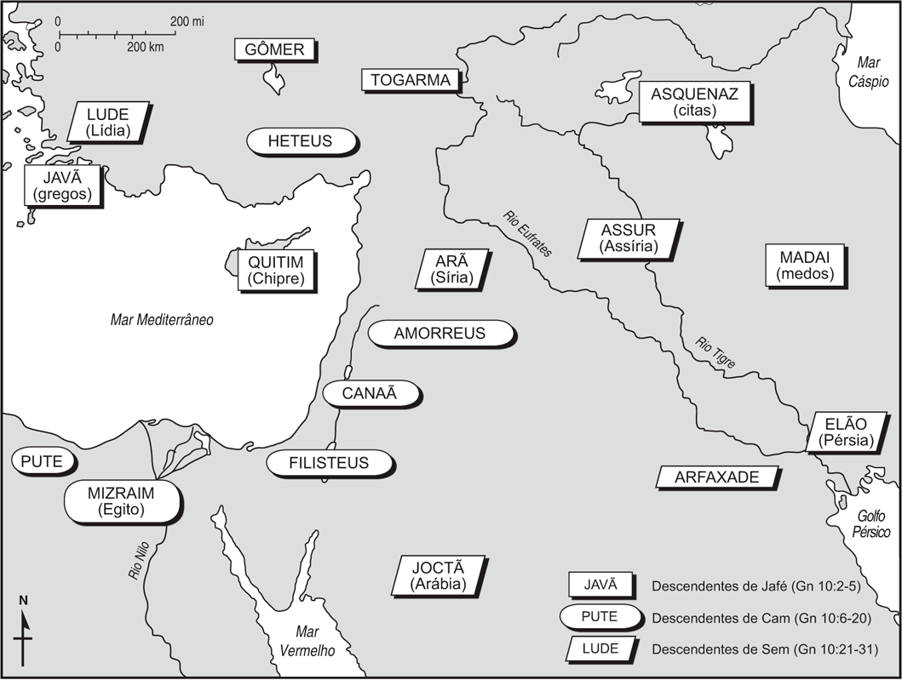

# Dia 04 — Gn 9–11.26

---

- Tempo total de Leitura: 11:05

1. Leia Genesis capitulo 9 até capitulo 11 verso 26

#### Quer ouvir uma narração desses capítulos?

- Cap 09: https://www.bible.com/pt/audio-bible/211/GEN.09.NTLH
- Cap 10: https://www.bible.com/pt/audio-bible/211/GEN.10.NTLH
- Cap 11: https://www.bible.com/pt/audio-bible/211/GEN.11.NTLH

## Quando?

### **1. Gênesis 9 – Após o Dilúvio**
Este capítulo começa imediatamente após o **Dilúvio**, quando Noé e sua família saem da arca. 

**Contexto temporal:** O Dilúvio, segundo a cronologia bíblica, ocorreu cerca de **1656 anos após a criação de Adão**, conforme as genealogias de Gênesis (Gênesis 5). Gênesis 9 ocorre logo após Noé descer da arca, provavelmente **ao redor do século 24-22 a.C.** (considerando uma leitura literal das genealogias).

### **Gênesis 10 – A Tabela das Nações**

Gênesis 10 é conhecido como a **"Tabela das Nações"**, onde são descritos os descendentes de Noé e como eles deram origem às diversas nações do mundo

**Contexto temporal:** Este relato abrange várias gerações após o dilúvio e descreve o processo de divisão da humanidade em diferentes famílias, línguas e territórios. É provável que o capítulo situe-se **alguns séculos após o Dilúvio**, ainda no início da história humana pós-diluviana.

### **3. Gênesis 11 – A Torre de Babel**

Este capítulo narra um evento significativo na história humana: a **construção da Torre de Babel**

**Contexto temporal:** A história da Torre de Babel ocorre provavelmente **algumas gerações após o Dilúvio**, durante o início da formação das nações e a multiplicação dos descendentes de Noé (talvez entre 200 e 400 anos após o Dilúvio, por volta de **2100 a.C.**).

## Onde? 

Como foi o espalhamento da terra:

## Mais informações sobre a descendência de Noé

O nome "Cam" em algumas traduções da Bíblia pode aparecer também como "Cão" ou Ham. As variações no nome ocorrem devido às diferenças na tradução do hebraico. O original seria “Cham”, soando algo como “Ram” ou “Rãm”.

Assim como Éber, em algumas traduções está Héber. (Origem dos Hebreus)

.png)

### As Origens das Nações a Partir dos Filhos de Noé

A narrativa bíblica que apresenta Sem, Cam e Jafé, os três filhos de Noé, como os ancestrais das nações que repovoaram a Terra após o Dilúvio.

### Os Descendentes de Sem: Povos Semitas

Os descendentes de Sem são tradicionalmente associados aos povos semitas, abrangendo hebreus, árabes, assírios e arameus. A Bíblia menciona cinco filhos de Sem: Elão, Assur, Arfaxade, Lude e Arã. Esses nomes estão associados às seguintes regiões e povos:

- **Elão**: Relacionado ao antigo Reino de Elam, situado no sudoeste do atual Irã.
- **Assur**: Vinculado aos assírios, que dominaram o norte da Mesopotâmia.
- **Arfaxade**: Ancestral dos hebreus e outros povos do Crescente Fértil.
- **Lude**: Associado aos lídios da Anatólia.
- **Arã**: Pai dos arameus, cuja língua aramaica foi amplamente usada no Oriente Próximo antigo.

O termo **"semitas"** tem origem no nome "Sem" e se refere às línguas e culturas derivadas de seus descendentes. Este termo ganhou notoriedade histórica no século XIX, principalmente no contexto do **anti-semitismo e o nazismo**, que inicialmente descrevia hostilidade contra os judeus, mas também incluía outros povos semitas. Já o termo **"hebreu"**, por exemplo, deriva de "`Eber`", um ancestral de Abraão mencionado na genealogia bíblica.

Linguisticamente, os povos semitas fazem parte da família afro-asiática. Sua influência cultural e religiosa moldou o desenvolvimento de civilizações na Mesopotâmia, Levante e Península Arábica.

### Os Descendentes de Cam: Povos Africanos e Cananeus

Cam é descrito como o ancestral de diversos povos africanos e do Oriente Próximo. Seus quatro filhos são: Cuxe, Mizraim, Pute e Canaã, associados a diferentes regiões:

- **Cuxe**: Relacionado à Núbia e à Etiópia, regiões ao sul do Egito.
- **Mizraim**: O nome hebraico para o Egito, vinculado à civilização egípcia.
- **Pute**: Associado aos povos do norte da África, como os líbios.
- **Canaã**: Pai dos cananeus, que habitavam a região correspondente ao atual Israel, Palestina, Líbano e partes da Síria.

Os **cananeus** desempenharam um papel central na história do Levante, influenciando a cultura e a religião das civilizações vizinhas. O termo "Canaã" frequentemente se refere a essas populações e às terras férteis que habitavam. Além disso, os **fenícios**, descendentes de Canaã, são conhecidos por sua expansão marítima e desenvolvimento do alfabeto que influenciou as línguas ocidentais.

### Os Descendentes de Jafé: Povos Indo-Europeus

Jafé é considerado ancestral dos povos indo-europeus, cujas línguas se espalharam por grande parte da Europa e Ásia. Seus filhos incluem Gomer, Magogue, Madai, Javã, Tubal, Meseque e Tiras, associados a diferentes grupos:

- **Gomer**: Relacionado aos cimérios e celtas.
- **Magogue**: Identificado com povos das estepes eurasiáticas.
- **Madai**: Associado aos medos, uma tribo iraniana. O termo "medo" originou-se dessas tribos do atual Irã.
- **Javã**: Ancestral dos gregos. O nome "Javã" aparece em textos antigos para descrever a Iônia, uma região grega.
- **Tubal e Meseque**: Relacionados a tribos da Anatólia.
- **Tiras**: Vinculado aos trácios da Europa Oriental.

Linguisticamente, as línguas indo-europeias formam uma das maiores famílias linguísticas do mundo, abrangendo idiomas como o sânscrito, grego, latim e suas derivações.

## Por que Deus confundiu as línguas na Torre de Babel?

A narrativa da Torre de Babel, registrada em **Gênesis 11:1-9**, é um divisor de águas na história da humanidade pós-diluviana. Após o Dilúvio, Deus havia expressamente ordenado que Noé e seus descendentes fossem **frutíferos, multiplicassem-se e enchessem a terra** (Gênesis 9:1). Esse mandamento reforçava o propósito original de Deus para a humanidade: espalhar-se por toda a criação, enchendo e dominando a terra (Gênesis 1:28). No entanto, a construção da Torre de Babel simbolizou uma **rebelião coletiva contra essa ordem divina**. Vamos explorar o que levou Deus a intervir, confundindo as línguas e dispersando os povos.

---

### A Contrariedade à Ordem Divina

O relato de Gênesis 11 mostra que, em vez de obedecer ao chamado de Deus de espalhar-se pela terra, os descendentes de Noé decidiram permanecer unidos em um único local, movidos pelo desejo de **autossuficiência e glória própria**. Eles disseram:

>"*Disseram umas às outras:
― Venham! Vamos fazer tijolos e queimá‑los bem.
Os tijolos serviram de pedras para eles, e o betume serviu de argamassa.*" [Gênesis 11:3 NVI](https://www.bible.com/pt/bible/compare/GEN.11.3)

>"*Depois, disseram:
― Venham! Vamos construir para nós uma cidade com uma torre que alcance os céus. Assim, o nosso nome ficará famoso e não seremos espalhados por toda a terra.*" [Gênesis 11:4 NVI](https://www.bible.com/pt/bible/compare/GEN.11.4)

#### Principais problemas nessa atitude:

1. **Um desafio direto à ordem de Deus:**  
   Ao desejarem "não serem espalhados pela face da terra", os habitantes de Babel estavam **desafiando diretamente o mandamento de Deus** dado a Noé e sua descendência (Gênesis 9:1). Em vez de cumprir o plano divino, preferiram permanecer em um só lugar, mostrando sua desobediência e falta de fé.

2. **Exaltação do homem acima de Deus:**  
   O desejo de construir "uma torre que alcance os céus" reflete uma tentativa de obter **autonomia** e **poder** sem a dependência de Deus. Buscavam fama e reconhecimento para si mesmos, dizendo: "Assim o nosso nome será famoso". Esse desejo de glória própria é um eco do mesmo problema que resultou na queda da humanidade no jardim do Éden: **o orgulho e a exaltação do homem (Gênesis 3:5)**.

3. **A união para o mal:**  
   A humanidade, ao unir-se em torno de seus próprios propósitos egoístas, mostrava sua inclinação ao pecado coletivo. Sem a intervenção divina, essa unidade resultaria em **mais pecado e destruição**, como já havia acontecido antes do Dilúvio (Gênesis 6:5). Deus sabia que "nada do que planejarem será impossível para eles" (Gênesis 11:6), indicando que o mesmo coração pecaminoso no Éden agora estava organizando-se em larga escala.

---

### Por que Deus interveio?

Diante da desobediência e da tentativa do povo de desafiá-lo, Deus decidiu intervir. Ele disse:

>"*Venham! Desçamos e confundamos a língua que falam, para que não entendam mais o que dizem uns aos outros.*" [Gênesis 11:7 NVI](https://www.bible.com/pt/bible/compare/GEN.11.7)

Existe uma certa ironia divina no uso do mesmo termo "Venham!", que os humanos usaram para se unirem na construção da cidade e da torre.

Aqui, Deus responde de forma irônica, ecoando as palavras humanas em uma perspectiva divina. Enquanto o "Venham!" humano era um pacto de **desobediência coletiva**, o "Venham!" de Deus é um **pacto de correção e soberania divina**, marcando Sua intervenção para frustrar os planos orgulhosos daqueles que rejeitavam Sua ordem.

Também existe um contraste entre "subir" e "descer": Os homens queriam construir uma torre que **"alcance os céus"** (Gênesis 11:4), mas Deus ironicamente **"desce"** (Gênesis 11:7) para confundir seus planos.

Muitos cristãos interpretam o uso do verbo no plural em "Venham!" como uma referência à **Trindade**, ou seja, à pluralidade de pessoas dentro da unidade de Deus (Pai, Filho e Espírito Santo). Essa interpretação se dá pelo fato de o verbo estar conjugado no plural, algo que também ocorre em outros momentos importantes do relato bíblico.

Essa intervenção teve, portanto, o propósito principal de cumprir Seu plano soberano. Deus havia ordenado que a humanidade se espalhasse pela terra, e Sua vontade não pode ser frustrada. É possível que, se os humanos tivessem obedecido à ordem de Deus, as línguas surgissem naturalmente, como parte do desenvolvimento humano. Ao confundir as línguas, Ele não apenas desfez a unidade em rebelião, mas também guiou a humanidade a seguir Seu plano redentor soberano ao povoar diferentes regiões do mundo e preparar o caminho para a Sua obra de salvar toda a criação.

### A lição da Torre de Babel

A Torre de Babel nos mostra que, quando a humanidade rejeita as ordens de Deus e busca sua própria glória.

#### Algumas lições que podemos tirar desse evento:

1. **Deus é soberano sobre a terra e os povos:**  
   Mesmo quando os humanos se unem para desafiar os planos de Deus, Sua vontade sempre prevalece. A confusão das línguas em Babel é um lembrete de que Deus conduz a história segundo Seus propósitos.

2. **A desobediência a Deus gera consequências:**  
   A ordem de espalhar-se pela terra foi ignorada, mas Deus garantiu que fosse cumprida através da dispersão de Babel. Isso nos ensina que, mesmo quando resistimos à vontade de Deus, Ele age para que Seus planos se cumpram.

3. **O perigo do orgulho humano:**  
   A tentativa de "ser como Deus" (subindo aos céus com a torre) e de obter fama própria reflete o mesmo pecado do jardim do Éden. Toda busca pela glória pessoal, independentemente de Deus, leva ao desastre.

4. **A graça de Deus na disciplina:**  
   Embora a confusão das línguas tenha sido um ato de juízo, também foi uma expressão da graça de Deus. Essa ação impediu que a humanidade se destruísse rapidamente em sua rebelião coletiva, dando espaço para que os propósitos redentores de Deus avançassem.

---

### A conexão com o plano redentor de Deus

Apesar da confusão e dispersão dos povos em Babel, o propósito de Deus avançou, culminando na escolha de Abraão e na formação da nação de Israel, que traria ao mundo o **Messias, Jesus Cristo**.

Curiosamente, a confusão das línguas é revertida, simbolicamente, no dia de **Pentecostes** (Atos 2:1-11), quando o Espírito Santo capacitou os apóstolos a falar em diferentes línguas, permitindo que o Evangelho fosse proclamado a todos os povos. Isso mostra que, enquanto Babel representou a separação e a desobediência, o Espírito Santo unifica a humanidade em Cristo, no plano de redenção de Deus.

---

### Conclusão

Deus confundiu as línguas na Torre de Babel para corrigir a desobediência da humanidade e garantir que Seus propósitos soberanos fossem cumpridos. Ele sabia que o orgulho e a rebelião uniriam os homens em ações ainda mais destrutivas, afastando-os ainda mais de Sua vontade. Mesmo assim, Seu ato não foi apenas de juízo, mas também de graça e misericórdia, preservando a humanidade para o plano redentor que viria em Cristo. A história de Babel nos lembra que a verdadeira unidade e a restauração do relacionamento humano só podem ser encontradas na fé em Seu plano eterno.

## Comentários sobre esses capítulos

- Apesar de ter desfrutado da graça de Deus, Noé pecou quando embriagou-se e ficou nu dentro de sua tenda. Cam viu a nudez do pai e contou a seus irmãos. Estes entraram na tenda e cobriram Noé, sem o verem nu.  Despertando Noé, proferiu maldição sobre Canaã. Aqui surge a pergunta: por que Noé amaldiçoou Canaã e não Cam? É possível que a inclinação perversa de Cam fosse ainda mais acentuada em Canaã. Nesse caso, a maldição era uma profecia sobre o comportamento imoral de Canaã e a punição apropriada. Outra explicação é que o próprio Canaã pode ter cometido alguma vulgaridade contra seu avô, fato que Noé só tenha ficado sabendo mais tarde. Noé soube o que lhe fizera o filho mais moço. Talvez o versículo 24 se refira ao neto mais moço, Canaã, e não ao filho mais moço, Cam. Na Bíblia, o termo “filho” com frequência significa “neto” ou outro descendente. Nesse episódio, Canaã não foi amaldiçoado por causa do pecado de seu pai, mas por causa de seu próprio pecado

