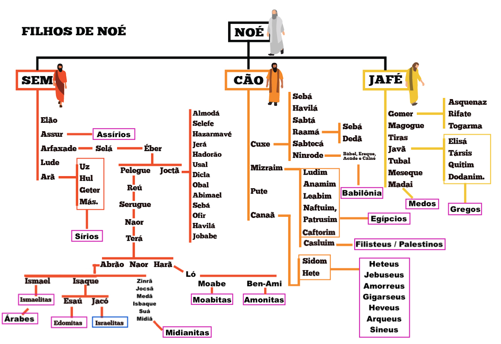

# Dia 04 — Gn 9–11.26

--- 

1. Leia Genesis capitulo 9 até capitulo 11 verso 26

## Mais informações sobre a descendência de Noé

O nome "Cam" em algumas traduções da Bíblia pode aparecer também como "Cão" ou Ham. As variações no nome ocorrem devido às diferenças na tradução do hebraico. O original seria “Cham”, soando algo como “Ram” ou “Rãm”.

Assim como Éber, em algumas traduções está Héber. (Origem dos Hebreus)

.png)

### As Origens das Nações a Partir dos Filhos de Noé

A narrativa bíblica que apresenta Sem, Cam e Jafé, os três filhos de Noé, como os ancestrais das nações que repovoaram a Terra após o Dilúvio.

### Os Descendentes de Sem: Povos Semitas

Os descendentes de Sem são tradicionalmente associados aos povos semitas, abrangendo hebreus, árabes, assírios e arameus. A Bíblia menciona cinco filhos de Sem: Elão, Assur, Arfaxade, Lude e Arã. Esses nomes estão associados às seguintes regiões e povos:

- **Elão**: Relacionado ao antigo Reino de Elam, situado no sudoeste do atual Irã.
- **Assur**: Vinculado aos assírios, que dominaram o norte da Mesopotâmia.
- **Arfaxade**: Ancestral dos hebreus e outros povos do Crescente Fértil.
- **Lude**: Associado aos lídios da Anatólia.
- **Arã**: Pai dos arameus, cuja língua aramaica foi amplamente usada no Oriente Próximo antigo.

O termo **"semitas"** tem origem no nome "Sem" e se refere às línguas e culturas derivadas de seus descendentes. Este termo ganhou notoriedade histórica no século XIX, principalmente no contexto do **anti-semitismo e o nazismo**, que inicialmente descrevia hostilidade contra os judeus, mas também incluía outros povos semitas. Já o termo **"hebreu"**, por exemplo, deriva de "`Eber`", um ancestral de Abraão mencionado na genealogia bíblica.

Linguisticamente, os povos semitas fazem parte da família afro-asiática. Sua influência cultural e religiosa moldou o desenvolvimento de civilizações na Mesopotâmia, Levante e Península Arábica.

### Os Descendentes de Cam: Povos Africanos e Cananeus

Cam é descrito como o ancestral de diversos povos africanos e do Oriente Próximo. Seus quatro filhos são: Cuxe, Mizraim, Pute e Canaã, associados a diferentes regiões:

- **Cuxe**: Relacionado à Núbia e à Etiópia, regiões ao sul do Egito.
- **Mizraim**: O nome hebraico para o Egito, vinculado à civilização egípcia.
- **Pute**: Associado aos povos do norte da África, como os líbios.
- **Canaã**: Pai dos cananeus, que habitavam a região correspondente ao atual Israel, Palestina, Líbano e partes da Síria.

Os **cananeus** desempenharam um papel central na história do Levante, influenciando a cultura e a religião das civilizações vizinhas. O termo "Canaã" frequentemente se refere a essas populações e às terras férteis que habitavam. Além disso, os **fenícios**, descendentes de Canaã, são conhecidos por sua expansão marítima e desenvolvimento do alfabeto que influenciou as línguas ocidentais.

### Os Descendentes de Jafé: Povos Indo-Europeus

Jafé é considerado ancestral dos povos indo-europeus, cujas línguas se espalharam por grande parte da Europa e Ásia. Seus filhos incluem Gomer, Magogue, Madai, Javã, Tubal, Meseque e Tiras, associados a diferentes grupos:

- **Gomer**: Relacionado aos cimérios e celtas.
- **Magogue**: Identificado com povos das estepes eurasiáticas.
- **Madai**: Associado aos medos, uma tribo iraniana. O termo "medo" originou-se dessas tribos do atual Irã.
- **Javã**: Ancestral dos gregos. O nome "Javã" aparece em textos antigos para descrever a Iônia, uma região grega.
- **Tubal e Meseque**: Relacionados a tribos da Anatólia.
- **Tiras**: Vinculado aos trácios da Europa Oriental.

Linguisticamente, as línguas indo-europeias formam uma das maiores famílias linguísticas do mundo, abrangendo idiomas como o sânscrito, grego, latim e suas derivações.