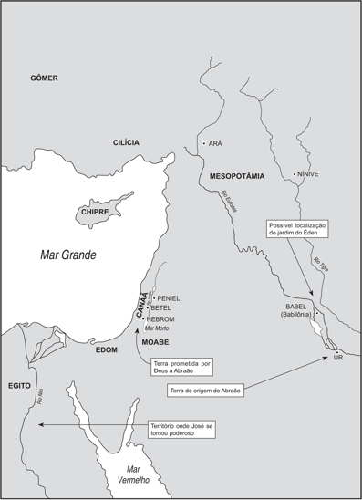
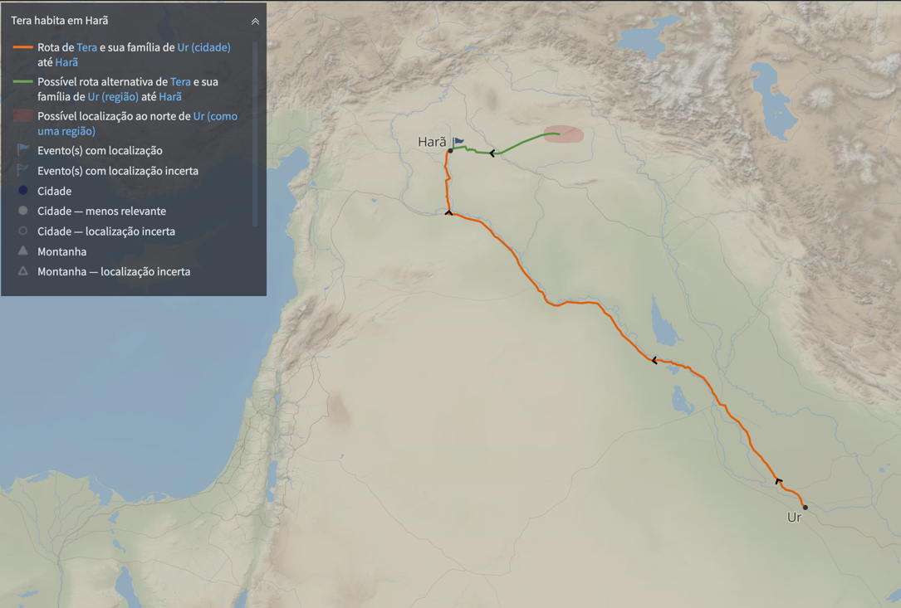
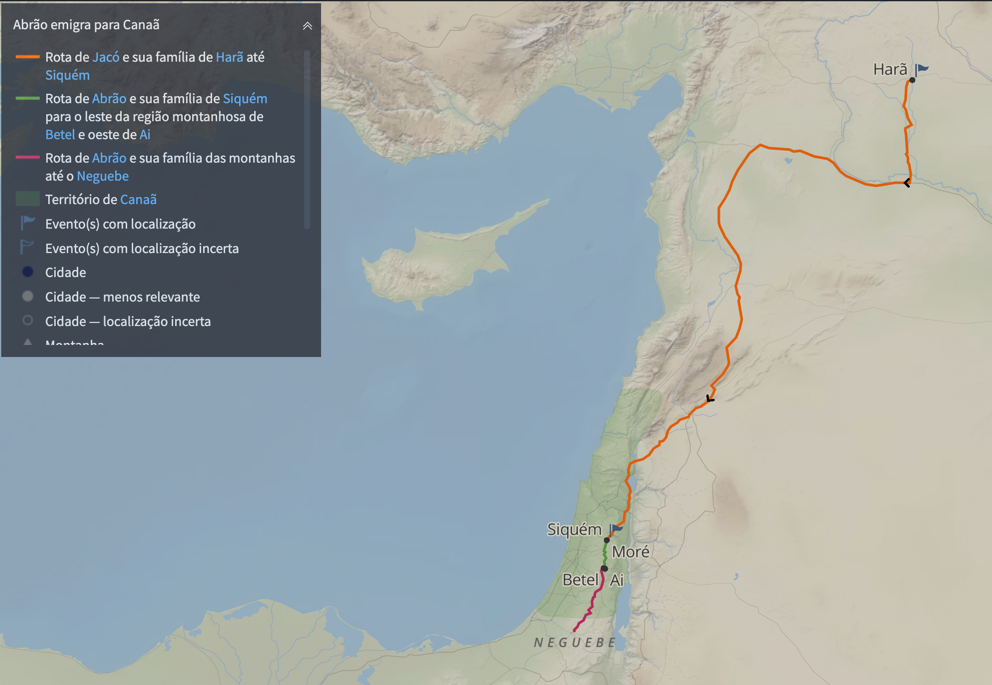

# Dia 05 — Gn 11.27–13

---

- Tempo total de Leitura: 10:00

1. Leia Genesis capitulo 11 a partir do verso 27 até capitulo 13.
2. Assista esse pequeno vídeo: https://www.youtube.com/watch?v=LnifIDKxdnA

#### Quer ouvir uma narração desses capítulos?

- Cap 11: https://www.bible.com/pt/audio-bible/211/GEN.11.NTLH
- Cap 12: https://www.bible.com/pt/audio-bible/211/GEN.12.NTLH
- Cap 13: https://www.bible.com/pt/audio-bible/211/GEN.13.NTLH

## Onde? 

## Quando?

Com base em um estudo mais detalhado, podemos concluir que o chamado de abraão ocorreu em 1870 a.C, quando ele tinha 75 anos. Logo ele nasceu em 1945 a.C.

Para ver como chego a essa conclusão confira o estudo detalhado: [cronologia-genesis-exodo.md](../../estudos/cronologia-genesis-exodo.md)

## Comentários sobre esses capítulos

- O Senhor chamou Abrão quando este ainda vivia em Ur, ele por fé seguiu a ordem de Deus.

>"*Pela fé, peregrinou na terra prometida como se estivesse em terra estranha; viveu em tendas, bem como Isaque e Jacó, coerdeiros da mesma promessa.*" [Hebreus 11:9 NVI](https://www.bible.com/pt/bible/compare/HEB.11.9)

A fé, contudo, tem seus deslizes. Por causa de uma fome que atingiu a região, Abrão deixou o lugar que Deus lhe indicara e fugiu para o Egito, símbolo do mundo. Essa mudança trouxe problemas a Abrão. Com isso em mente, Abrão convenceu Sarai a mentir e dizer que era sua irmã. É verdade que Sarai era meia-irmã de Abrão (20:12), mas ainda assim era uma mentira com propósito de enganar. Esse incidente chama atenção para o fato de que não devemos travar batalhas espirituais empunhando armas carnais, que os fins não justificam os meios e que é impossível pecar sem sofrer consequências.

- Deus não abandonou Abrão. Contudo, permitiu que sofresse as consequências de seu pecado. Ele foi humilhado publicamente e expulso em desonra.

