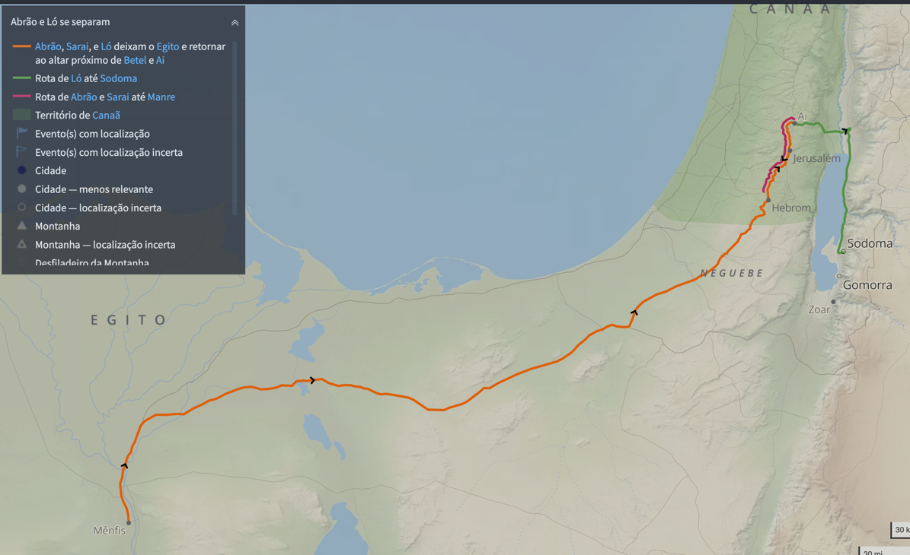
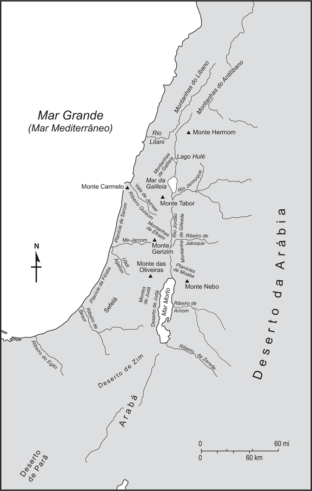

# Dia 06 — Gn 14–16

--- 

- Tempo total de Leitura: 11:04

1. Leia Genesis do Capitulo 14 até o capitulo 16
2. Assista esse vídeo: https://youtu.be/C-QGSqrySks

#### Quer ouvir uma narração desses capítulos?

- Cap 14: https://www.bible.com/pt/audio-bible/211/GEN.14.NTLH
- Cap 15: https://www.bible.com/pt/audio-bible/211/GEN.15.NTLH
- Cap 16: https://www.bible.com/pt/audio-bible/211/GEN.16.NTLH

## Onde? 

## A Promessa e a Aliança de Deus com Abrão: Fé, Justificação e Cumprimento Divino

O capítulo 15 de Gênesis é um marco fundamental na história de Abrão e no desenvolvimento do plano redentor de Deus. Nesse texto, vemos as ações soberanas de Deus em confirmar sua promessa de descendência e terra ao patriarca de Israel. O capítulo aborda tanto a confiança de Abrão na palavra de Deus quanto a natureza unilateral e incondicional da aliança divina. Analisemos em detalhe os eventos e seus significados.

---

### Abrão, a Promessa e a Fé (15:2-6)

Abrão vivia preocupado em sua condição pessoal, pois não tinha filhos, embora Deus lhe houvesse prometido anteriormente uma grande descendência (**Gênesis 12:2-3**). Na cultura da época, a falta de um herdeiro direto significava que seus bens e patrimônio seriam passados para um servo de sua casa, como o damasceno Eliézer. Isso era algo que entristecia Abrão, pois ele ansiava pelo cumprimento da promessa divina.

Em resposta, Deus reafirma Sua promessa de que Abrão não teria como herdeiro aquele servo, mas sim um filho que nasceria dele. Mais do que isso, sua descendência seria extraordinariamente numerosa, comparada às estrelas do céu, algo aparentemente impossível para a realidade humana, já que, tanto Abrão quanto Sarai, sua esposa, já haviam ultrapassado os limites naturais de geração de filhos.

Abrão, no entanto, **creu no Senhor**, e essa fé foi o que Deus contabilizou como justiça (**Gênesis 15:6**). Esse ato simbólico de justificação pela fé ecoa por toda a Bíblia, sendo mencionado em passagens como Romanos 4:3, Gálatas 3:6 e Tiago 2:23. Aqui aprendemos que a verdadeira justiça não é conquistada por obras humanas, mas atribuída por meio de uma fé genuína no Deus de promessas.

>"*Que diz a Escritura? “Abraão creu em Deus, e isso lhe foi atribuído como justiça.”*" [Romanos 4:3 NVI](https://www.bible.com/pt/bible/compare/ROM.4.3)

>"*Assim foi com Abraão: “Ele creu em Deus, e isso lhe foi atribuído como justiça”.*" [Gálatas 3:6 NVI](https://www.bible.com/pt/bible/compare/GAL.3.6)

>"*Cumpriu‑se a Escritura que diz: “Abraão creu em Deus, e isso lhe foi atribuído como justiça”, e ele foi chamado amigo de Deus.*" [Tiago 2:23 NVI](https://www.bible.com/pt/bible/compare/JAS.2.23)

Além disso, essa promessa também apresenta duas dimensões significativas de descendência:
- **A descendência natural** – Correspondente ao pó da terra (**Gênesis 13:16**), que representa os judeus de nascimento.
- **A descendência espiritual** – Simbolizada pelas estrelas do céu (**Gênesis 15:5**), referindo-se àqueles que, em Cristo, são justificados pela fé (**Gálatas 3:7**). Assim, todos os que creem tornam-se herdeiros da promessa de Abrão.

>"*Saibam, portanto, que aqueles que têm fé é que são filhos de Abraão.*" [Gálatas 3:7 NVI](https://www.bible.com/pt/bible/compare/GAL.3.7)

---

### A Confirmação da Aliança: Os Sacrifícios e a Graça Divina (15:7-21)

Para reafirmar Sua promessa a Abrão, Deus realiza um ato simbólico extraordinário, profundamente enraizado nos costumes orientais da época. Deus faz um pacto com Abrão, no qual sacrificar animais e passar por entre suas metades simbolizava a seriedade de uma aliança, como descrito em **Jeremias 34:18-19**. Contudo, neste caso, algo incomum ocorre: **somente Deus passa pelas metades dos animais**.

> "*Entregarei os homens que violaram a minha aliança e não cumpriram os termos da aliança que fizeram na minha presença quando cortaram o bezerro em dois e andaram entre as partes do animal; isto é, os líderes de Judá e de Jerusalém, os oficiais do palácio real, os sacerdotes e todo o povo da terra que andou entre as partes do bezerro*" [Jeremias 34:18-19 NVI](https://www.bible.com/pt/bible/compare/JER.34.18-19)

Essa passagem está representada pelo **fogareiro fumegante e a tocha de fogo**, símbolos da presença de Deus e Seu compromisso com o cumprimento da promessa. Abrão, por sua vez, não atravessa entre as metades; ele apenas observa. Isso indica que a aliança entre Deus e Abrão era **incondicional** – seu cumprimento dependia exclusivamente de Deus, não das ações de Abrão ou de sua descendência. Vamos ver mais sobre esse tipo de promessa mais a frente.

Assim, Deus estabelece, por graça, que Ele mesmo garantiria a realização dessa aliança: Abrão teria um filho, uma numerosa descendência e também a posse da terra prometida.

---

### Conclusão: Uma Promessa de Fé e Graça

O capítulo 15 de Gênesis nos ensina verdades fundamentais sobre o caráter de Deus e Sua interação com a humanidade:

1. **Justificação pela Fé:** Assim como Abrão foi declarado justo por crer na promessa de Deus, hoje somos justificados pela fé em Jesus Cristo, o cumprimento máximo das promessas divinas.

2. **A Atuação da Graça:** A aliança foi estabelecida e garantida exclusivamente por Deus, mostrando que Seu plano redentor não depende das obras humanas, mas de Sua fidelidade e soberania.

3. **Promessa e Cumprimento:** A palavra de Deus é eterna e infalível. Tanto a descendência natural (o povo de Israel) quanto a descendência espiritual (os que creem em Cristo) são frutos do pacto realizado com Abrão.

Assim, no chamado de Abrão e na aliança estabelecida por Deus, vemos o início de um plano que alcança a humanidade inteira e culmina na salvação oferecida em Cristo Jesus. Desde os tempos de Abrão, Deus demonstra que Sua graça e promessa são suficientes para aqueles que creem.

## Comentários sobre esses capítulos

- Treze anos antes dos principais acontecimentos descritos no capítulo 14, Quedorlaomer, rei de Elão (Pérsia), havia conquistado vários reinos nas planícies próximas ao mar Morto (mar Salgado). No décimo terceiro ano, porém, os cinco reis conquistados se rebelaram contra Quedorlaomer. Este, por sua vez, se aliou a outros três reis da região da Babilônia e marchou para o sul, seguindo a costa leste do mar Morto, e depois para o norte, pela costa oeste, passando pelas cidades de Sodoma e Gomorra e outras cidades da planície. A batalha ocorreu no vale de Sidim, onde havia muitos poços de betume. Os invasores derrotaram os rebeldes e marcharam para o norte, levando consigo espólios e prisioneiros de guerra, incluindo Ló, o sobrinho apóstata de Abrão.

- Quando Abrão recebeu notícias da captura de Ló, organizou uma força de trezentos e dezoito homens dos mais capazes e saiu em perseguição até Dã, no norte. Abrão conseguiu derrotá-los próximo a Damasco, na Síria, onde resgatou Ló e todos os espólios

- Nesse episódio, Abrão libertou Ló usando a espada. Mais tarde, ele o libertou novamente por meio de oração intercessora

- Na Bíblia, os nomes estão repletos de significado. Melquisedeque quer dizer “rei de justiça” e Salém (abreviação de Jerusalém) significa “paz”
