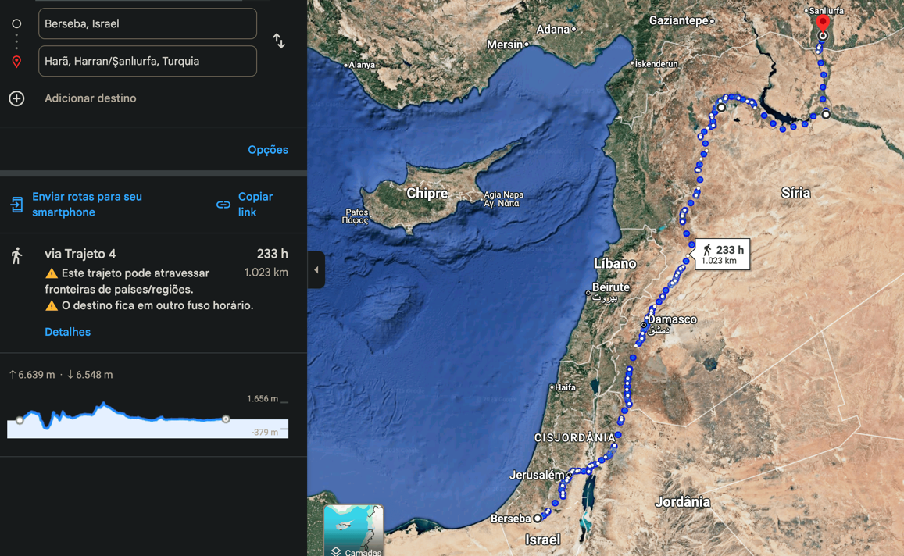

# Dia 10 — Gn 24

--- 

- Tempo total de Leitura: 11:54

1. Leia Genesis Capitulo 24

##### Quer ouvir uma narração desses capítulos?

- Cap 24: https://www.bible.com/pt/audio-bible/211/GEN.24.NTLH

---

## Onde?

O servo saiu de Berseba e foi até 
O caminho percorrido pelo servo Eliézer foi de mais ou menos 1.000 Km. Uma viagem que deve ter levado pelo menos 2 semanas.

Provavel rota do servo

Rota Atual

## Isaque e Rebeca: Um Paralelo entre Cristo e a Igreja

A narrativa do encontro entre Isaque e Rebeca oferece um dos paralelos mais belos e profundos da Bíblia, que aponta para Cristo e seu relacionamento com sua Igreja. Assim como Isaque desaparece da narrativa bíblica após o sacrifício simbólico no monte Moriá e só reaparece para encontrar sua noiva, Jesus, depois de seu sacrifício pelos nossos pecados, também reaparecerá para buscar a Igreja, sua noiva amada. Isso reforça a ideia de que o propósito final de Cristo é unir-se àqueles que foram escolhidos para serem Sua noiva.

### 7 Pontos de Conexão que mostram a perfeição desse paralelo

1. **O papel do servo tipificado como Espírito Santo:**  
   O servo de Abraão, enviado para buscar Rebeca, é uma figura que aponta para o Espírito Santo. Assim como o servo não falou de si mesmo, mas agiu em nome de Abraão, o Espírito Santo também glorifica Cristo. O Servo foi incumbido de encontrar e preparar a noiva para Isaque, o Espírito Santo está em ação neste momento, preparando e guiando a Igreja, adornando-a com dons e virtudes espirituais, para que esteja pronta no dia do encontro com Cristo.

> *“Quando o Espírito da verdade vier, ele os guiará em toda a verdade. Ele não falará por si mesmo, mas dirá tudo o que ouvir e anunciará a vocês as coisas que vão acontecer. Ele ficará sabendo da minha vontade e a ensinará a vocês, e assim me trará glória.”* (João 16:13–14, NTLH)

2. **A salvação pela graça**  
   Rebeca, que simboliza a Igreja, não fez nada para iniciar ou merecer os eventos que ocorreram. Todo o plano foi preparado por Abraão, executado pelo servo e culminou na união com Isaque. Primeiro, ela aceitou dar água ao servo de Abraão e demonstrou generosidade e hospitalidade ao dar também aos camelos, características de um coração gracioso, o que faz conexão com Mateus 25:35. Depois, o mais importante: quando questionada por sua família: “Você quer ir com este homem?”, sua resposta simples e direta: "Sim, quero” aceitando a proposta para ser a noiva de Isaque. Suas ações foram apenas aceitar e confiar, tendo fé no plano que lhe foi apresentado. Outro ponto nesse sentido, é que Rebeca ao se casar com Isaque, seria coerdeira, já que o herdeiro Legítimo da herança seria Isaque, isso é uma alegoria de sermos coerdeiros de Jesus, que é o herdeiro legítimo.

> *"Pois tive fome, e vocês me deram de comer; tive sede, e me deram água para beber; fui estrangeiro, e me receberam na sua casa."* (Mateus 25:35, NTLH)

> *“Se você disser com a sua boca: ‘Jesus é Senhor’ e no seu coração crer que Deus ressuscitou Jesus, você será salvo.”* (Romanos 10:9, NTLH)
 
> *“Pois pela graça de Deus vocês são salvos por meio da fé. Isso não vem de vocês, mas é um presente dado por Deus. A salvação não é o resultado dos esforços de vocês; portanto, ninguém pode se orgulhar de tê-la.”* (Efésios 2:8–9, NTLH)

> *"Ora, se somos filhos, somos também herdeiros, herdeiros de Deus e coerdeiros com Cristo; se com ele sofremos, também com ele seremos glorificados."* (Romanos 8:17 ARA)

3. **O Pagamento pelo Dote**

   Em Gênesis 24:56, lemos que foi feito um pagamento pelo dote da noiva, com objetos de prata e ouro. Da mesma forma, Cristo pagou um preço por Sua Igreja, oferecendo Seu sangue em sacrifício na cruz.

> *"Pois vocês sabem o preço que foi pago para livrá-los da vida inútil que herdaram dos seus antepassados. Esse preço não foi uma coisa que perde o seu valor como o ouro ou a prata. Vocês foram libertados pelo precioso sangue de Cristo, que era como um cordeiro sem defeito nem mancha."* (1Pedro 1:18-19 NTLH)

4. **O preparo da noiva**  
   Antes de encontrar Isaque, Rebeca foi adornada com presentes dados pelo servo, simbolizando os dons e a obra do Espírito Santo na vida dos crentes, preparando-os para o encontro com Cristo.

> *“Fiquemos alegres e felizes! Louvemos a sua glória! Porque chegou a hora da festa de casamento do Cordeiro, e a noiva já se preparou para recebê-lo.”* (Apocalipse 19:7, NTLH)

5. **O amor exclusivo de Isaque por Rebeca**  
   Isaque amou Rebeca desde o instante em que a viu e, diferentemente de outros patriarcas, nunca teve outras esposas. Isso reflete o amor incondicional e exclusivo de Cristo por Sua Igreja, que foi demonstrado ao dar Sua vida por ela (Ef 5:25). Esse amor é eterno e imutável, não baseado em méritos humanos, mas na graça divina.

> *"Marido, ame a sua esposa, assim como Cristo amou a Igreja e deu a sua vida por ela. Ele fez isso para dedicar a Igreja a Deus, lavando-a com água e purificando-a com a sua palavra. E fez isso para também poder trazer para perto de si a Igreja em toda a sua beleza, pura e perfeita, sem manchas, ou rugas, ou qualquer outro defeito."* (Efésios 5:25–27, NTLH)

6. **A jornada da noiva ao encontro do noivo**  
   Rebeca empreendeu uma longa jornada, guiada pelo servo, para encontrar Isaque. Da mesma forma, a Igreja está em uma jornada espiritual, conduzida pelo Espírito Santo, rumo ao encontro final com Cristo.

   > *“Pois vivemos pela fé e não pela visão.”* (2 Coríntios 5:7, NTLH)
> 
7. **A tradição do casamento judaico antigo**

   No contexto bíblico e cultural judaico, o noivo construía uma casa para ele e sua noiva, frequentemente anexada à casa de seus pais, como parte do processo de preparação para o casamento. A noiva, então, aguardava pacientemente, sem saber a data exata em que o noivo viria para buscá-la, pois ele estava aguardando o momento certo para concluir a construção e voltar para ela. Esse simbolismo de espera e surpresa é fundamental tanto no casamento judaico quanto nas analogias feitas nas escrituras sobre o relacionamento entre Cristo e a Igreja. Lembre-se da Parabola das 10 virgens em [Mateus 25.1-13](https://www.bible.com/pt/bible/211/MAT.).

## Conclusão

A história de Isaque e Rebeca é muito mais do que um relato de amor humano; ela é um retrato divinamente inspirado do relacionamento entre Cristo e Sua Igreja. Cada detalhe, desde o planejamento de Abraão até o encontro final entre Isaque e Rebeca, aponta para o plano redentor de Deus, que culmina no retorno de Cristo para buscar aqueles que O amam e aguardam Sua vinda. Que essa narrativa nos inspire a viver como uma noiva preparada, adornada pela graça e ansiosa pelo dia em que veremos nosso Noivo face a face.

## Comentários sobre esses capítulos

- Abraão fez que seu servo jurasse encontrar uma esposa (que não fosse cananeia) para Isaque e não o deixasse ir morar na Mesopotâmia. Colocar a mão por baixo da coxa implicava que, caso o juramento fosse quebrado, a criança que viesse a nascer ou que havia nascido daquela “coxa” e encarregaria de vingar a traição cometida. A isto chamavam de “jurar pela posteridade” e tem uma aplicação muito especial aqui, pois a missão do servo é garantir a posteridade de Abraão por meio de Isaque
