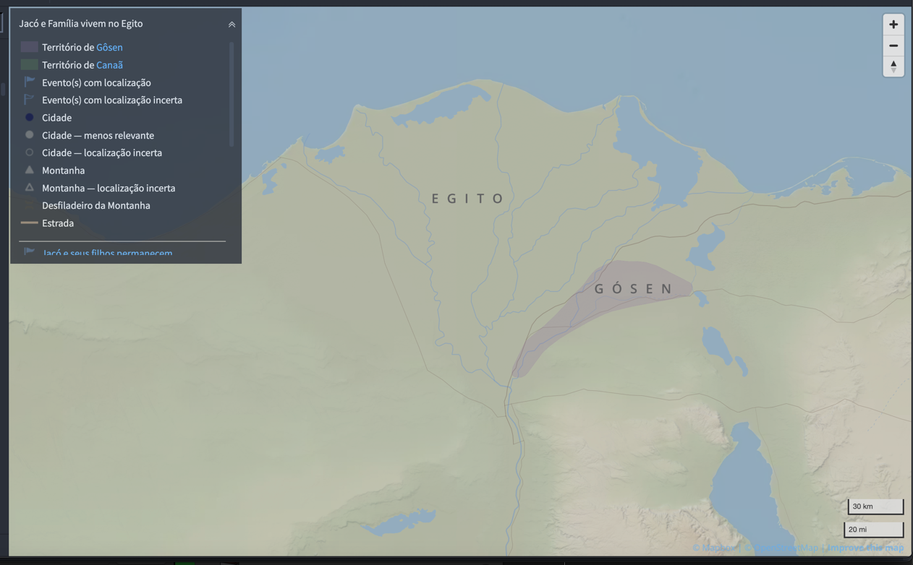
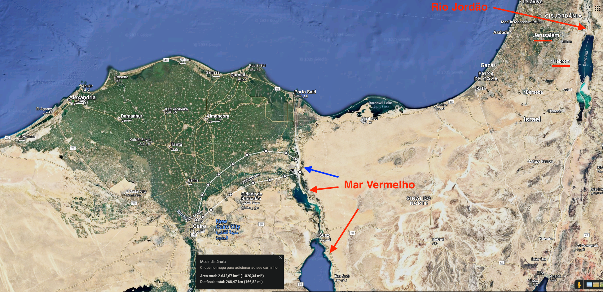

# Dia 22 — Gn 47-48

--- 

- Tempo total de Leitura: 10:52

1. Leia Genesis capítulo 47 até o final do capítulo 48.

##### Quer ouvir uma narração desses capítulos?

- Cap 47: https://www.bible.com/pt/audio-bible/211/GEN.47.NTLH
- Cap 48: https://www.bible.com/pt/audio-bible/211/GEN.48.NTLH

---

## Onde?

Os capítulos 47 e 48 se passam no Egito, eles foram habitar a terra de Gósen. Não se sabe ao certo a extensão dessa região, mas acreditasse que ficasse para parte oriental do delta do nilo, no sentido do mar vermelho. Atualmente esse território pode se extender por mais de 2.500 km².

Pode parecer pequeno esses trechos que foram canalizados do mar vermelho, mas é por conta da escala, que dessa distãncia está 1cm para 20km. Veja um zoom na seta azul

Aqui um zoom na seta azul, antes quase não dava pra ver, mas esse pequeno trecho de mar vermelho, tem mais de 1km de largura

## Quando?

No capítulo 48, estamos no ano 1631 a.C.. Nesse ponto da história estamos tão longe do nascimento de Jesus pra frente, quanto do nascimento de Noé pra trás, que teria nascido por volta do ano 2900 a.C. 

Conforme calculado no [dia 19](dia19.md#quando), esse capítulo ocorre 25 anos após José se tornar governador. O cálculo é baseado na seguinte sequência:

30 anos → Idade de José ao se tornar governador.
+7 anos → Tempo de fartura.
+1 ano → Ano em que Jacó chega ao Egito.
+17 anos → Tempo que Jacó viveu no Egito antes de falecer.
Totalizando 25 anos após a nomeação de José como governador.

Baseando-nos nesses cálculos e nos anteriores, podemos estimar as idades de seus irmãos e de seu pai, com uma margem de certeza bastante considerável:

- Rúben: 62 anos
- Simeão: 61 anos
- Levi: 60 anos
- Judá: 59 anos
- Dã: 59 anos
- Gade: 59 anos
- Naftali: 58 anos
- Aser: 58 anos
- Issacar: 58 anos
- Zebulom: 57 anos
- Diná: 56 anos
- José: 55 anos
- Benjamim: 41 anos

- Jacó teria 147 anos

## Comentários sobre esses capítulos

- Tanto o povo do Egito quanto os de Canaã gastaram todo o seu dinheiro em alimento. Por isso, José passou a aceitar gado como pagamento. Em razão disso, acabou comprando quase toda a terra do Egito (exceto a terra que pertencia aos sacerdotes egípcios). Além disso, forneceu sementes ao povo para plantarem. Em troca, exigiu um quinto da produção como aluguel da terra, um acordo bastante justo.

- Jacó providenciou para que a tribo de José recebesse uma porção dobrada de terra em Canaã durante a divisão territorial entre as tribos após a conquista. Portanto, tecnicamente, José foi abençoado como se possuísse o direito de primogenitura. Qualquer descendência que nascesse depois deles pertenceria a José, não a Jacó, e habitaria nos territórios distribuídos a Efraim ou Manassés. O versículo 7 explica o motivo de Jacó adotar os filhos de José como seus: eles eram netos de sua amada esposa Raquel, cuja morte o patriarca considerou prematura. É por isso que posteriormente teremos as tribos de Efraim e Manassés como partes das 12 tribos de Israel. (Tecnicamente são 13, se contarmos Levi, mas esse é um detalhe para mais tarde.)

- Jacó abençoou seus netos e entregou o direito de primogenitura a Efraim, o mais jovem. José tentou corrigir o que achava ser um engano do pai, apontando para Manassés, o primogênito, porém, Jacó declarou ter feito isso propositadamente. Quantas lembranças devem ter passado pela mente de Jacó naquele momento! Anos atrás, seu pai o abençoou por engano, sendo Jacó o mais novo. Agora, Jacó abençoava o mais jovem, não por ignorância, mas porque desfrutava de comunhão com o Senhor, aquele que conhecia o futuro. Israel sabia, pela fé, que seus descendentes retornariam à terra prometida. Novamente, nessa família, vemos o mais novo recebendo a porção do mais velho.
