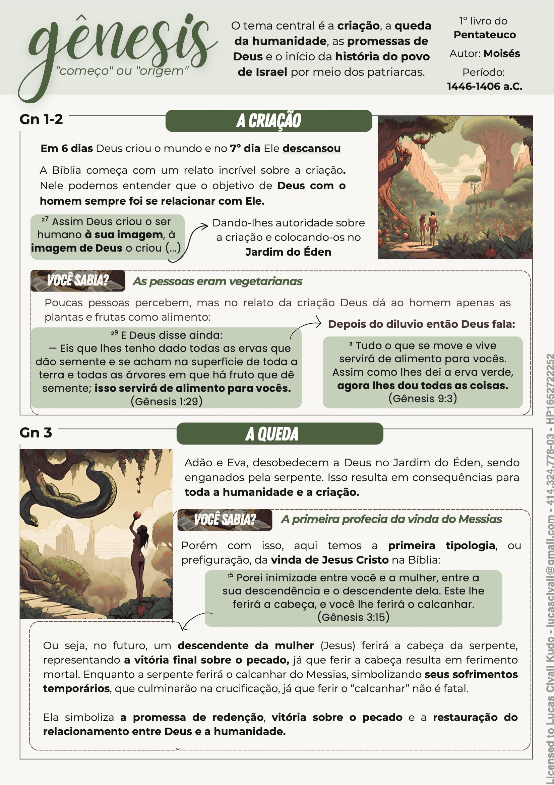
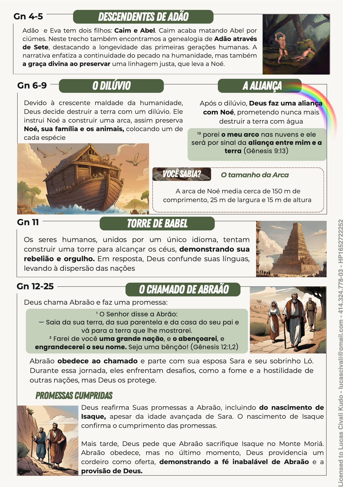

# Gênesis

--- 

Autor: A autoria deste livro não é declarada, mas tradicionalmente é atribuía a Moisés

## Resumo

Gênesis, o primeiro livro da Bíblia, começa com a criação do universo por Deus. Detalha a
formação da humanidade com Adão e Eva no Éden, seguido pela queda deles por conta da
desobediência. O livro abrange o dilúvio, com Noé construindo a arca, e a dispersão da humanidade na
Torre de Babel. Gênesis, então, focaliza os patriarcas, destacando Abraão e sua jornada de fé, a história de
Isaque e Jacó, incluindo a narrativa de José no Egito. O livro conclui com a morte de José, marcando o
início da escravidão israelita no Egito.

Podemos dizer que os principais propósitos do livro de Gênesis são:
- Revelar a soberania de Deus na criação do universo. 
- Ensinar ao povo de Israel sobre os propósitos eternos de Deus. 
- Explicar a origem da humanidade e do pecado. 
- Mostrar como foi a vida dos patriarcas do povo de Israel. 
- Revelar o início da história da redenção, apresentando um conceito totalmente monoteísta, ou seja, crença em um único Deus, que é soberano e criador de todas as coisas.