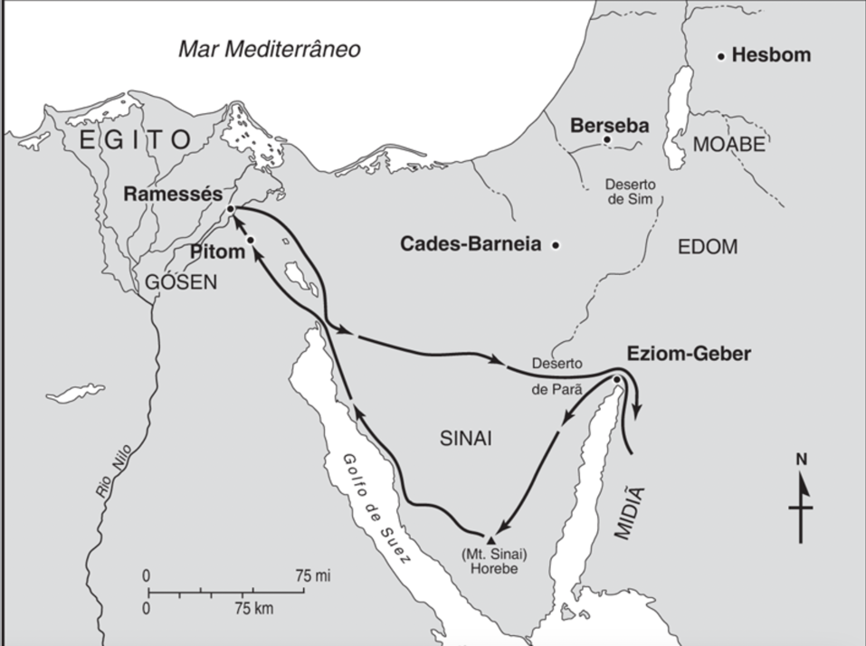
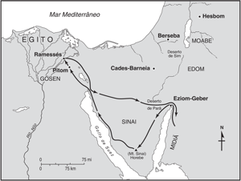

# Dia 24 — Ex 03-04

--- 

- Tempo total de Leitura: 11:06

1. Leia Êxodo capítulo 03 até o final do capítulo 04.

##### Quer ouvir uma narração desses capítulos?

- Cap 03: https://www.bible.com/pt/audio-bible/211/EXO.3.NTLH
- Cap 04: https://www.bible.com/pt/audio-bible/211/EXO.4.NTLH

---

## Onde?

As histórias de Êxodo 3 e 4 se passam principalmente no deserto perto do monte Horebe, também conhecido como o monte Sinai. É nesse cenário que Moisés encontra a sarça ardente e Deus fala com ele, instruindo-o a voltar ao Egito para libertar o povo de Israel da escravidão. Moisés também recebe vários sinais para provar ao povo que ele foi enviado por Deus.

## Quando?

Aproximadamente no ano 1440 a.C. Nesse momento da história, Moises tem 80 anos.

## O nome de Deus - YHWH (Eu sou o que sou) 

## O princípio da obediência

## Comentários sobre esses capítulos

- A palavra “santa” aparece pela primeira vez no texto bíblico. Ao retirar as sandálias, Moisés reconheceu que aquele lugar era santo.

- A sarça representa a glória de Deus. Para permanecer ali, Moisés precisava tirar as sandálias e ficar descalço. A sarça também pode prefigurar Jeová habitando com seu povo, sem consumi-lo.

- Os judeus consideram o tetragrama YHWH uma palavra muito sagrada para ser pronunciada.

- Moisés não gostou da ideia de falar com Faraó e, para se justificar, apelou para suas imperfeições humanas. O Senhor, porém, disse que estaria presente e prometeu que Moisés o serviria naquele monte (Sinai).

- Na lista de deficiências que Moisés apresentou a Deus estavam:

>
> - incompetência (3:11)
> - falta de informação (3:13)
> - falta de autoridade (4:1)
> - dificuldade de se expressar (4:10)
> - incapacidade de se apresentar (4:13)
> - o fato de não ter obtido sucesso anteriormente (5:23)
> - falta de aceitação (6:12)

- Difícil encontrar uma lista de imperfeições mais completa que essa. Contudo, em vez de essa aparente demonstração de humildade agradar a Deus, ela o deixou furioso: “Então, se acendeu a ira do Senhor contra Moisés” (4:13). Ora, as desculpas de Moisés para sua incapacidade eram justamente as razões que levaram Deus a escolhê-lo para aquela missão.

- A jornada de três dias pelo deserto, a fim de sacrificarem ao Senhor, Não se tratava de uma tentativa de enganar Faraó, mas um teste para comprovar a disposição do governante em relação ao povo. Essa viagem também serviria para impedir que os egípcios observassem o sacrifício de animais, uma vez que estes eram sagrados para esse povo. Deus sabia, porém, que Faraó só os deixaria partir se compelido por demonstrações de poder divino. Os prodígios a que se refere o versículo 20 seriam as pragas com as quais Deus feriria o Egito.

- Moisés deveria ter obedecido com fé, pois o Senhor nunca nos pede algo sem antes nos conceder a capacidade necessária para cumprir sua vontade. Porém Moisés recusou o plano inicial de Deus e preferiu ficar em segundo plano, tendo Arão como porta-voz. Pensou que Arão o ajudaria; mais tarde, porém, o irmão se tornou um empecilho quando levou o povo a adorar o bezerro de ouro.

- O cajado de moises, era claramente um objeto comum, e não devia haver nada de especial nele, já que, o Senhor utilizava objetos comuns para realizar as obras extraordinárias, a fim de que todos percebam claramente que o poder provém de Deus e não do objeto.

- antes de pedir que outros lhe obedecessem, o próprio Moisés tinha de aprender o significado da obediência. De acordo com o texto, Moisés não havia circuncidado o filho (Gérson ou Elié zer), possivelmente para agradar Zípora. Por causa disso, Deus quis matar Moisés, talvez por meio de uma doença fatal. Porém, Zípora circuncidou o filho e, com isso, salvou a vida do marido

