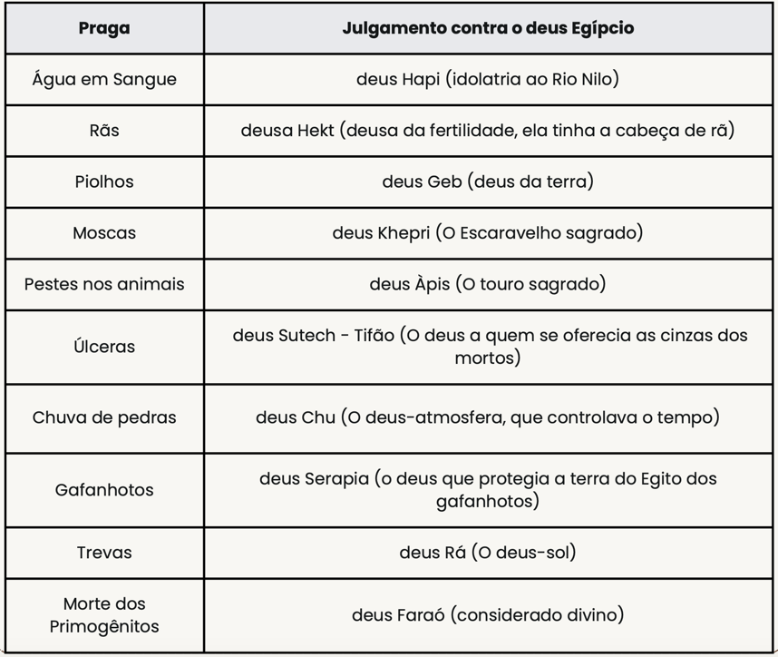

# Dia 27 — Êxodo 08-10

--- 

- **Tempo total de leitura:** 18:47

1. Leia Êxodo, do capítulo 8 ao final do capítulo 10.

##### Quer ouvir uma narração desses capítulos?

- [Capítulo 08](https://www.bible.com/pt/audio-bible/211/EXO.8.NTLH)
- [Capítulo 09](https://www.bible.com/pt/audio-bible/211/EXO.9.NTLH)
- [Capítulo 10](https://www.bible.com/pt/audio-bible/211/EXO.10.NTLH)

---

## Onde acontece?

Esses 3 capítulos se passam basicamente no Egito.

---

## As 10 Pragras

Cada praga tinha um propósito e não era simplesmente aleatória. Os Egípcios cultuavam muitos deuses, e cada deus tinha um propósito e uma forma de adoração. O Deus dos hebreu mostrou então, que tinha autoridade sobre todos os outros deuses do egíto juntos.

## Comentários sobre os capítulos

- Na verdade, o hebraico original traz literalmente enxames (ou “misturas”), com o nome específico dos insetos (moscas) tendo sido fornecido pelos tradutores. É provável que esses enxames fossem uma mistura de vários tipos de insetos. Considerando que todas as pragas eram dirigidas contra os falsos deuses do Egito (além do Nilo, quase todos os seres vivos no Egito eram adorados como deuses), é possível que se tratasse de enxames de besouros, o que representaria um ataque direto contra Khepri, conforme mostrando na imagem acima.

- Todas as tentativas de explicar as pragas de uma perspectiva natural acabam se mostrando incongruentes, por exemplo, a quinta praga, que foi a peste nos animais, foi um julgamento discriminatório que não pode ser explicado por fenómenos naturais, já que afetou todos os rebanhos egípcios, mas não aos rebanhos dos israelitas. 
  

- Nem todos os animais egípcios foram destruídos, pois Deus menciona alguns animais sobreviventes nos versículos 19 e 20, e outros animais morreram mais adiante, na noite da última praga (12:29b).

- Rá, deus egípcio do sol, era o maior deus do panteão egípcio: veja o quão terrível era isso na cabeça do egípcio da época do êxodo, nesse vídeo curto: https://youtu.be/dONUndDWlZA.