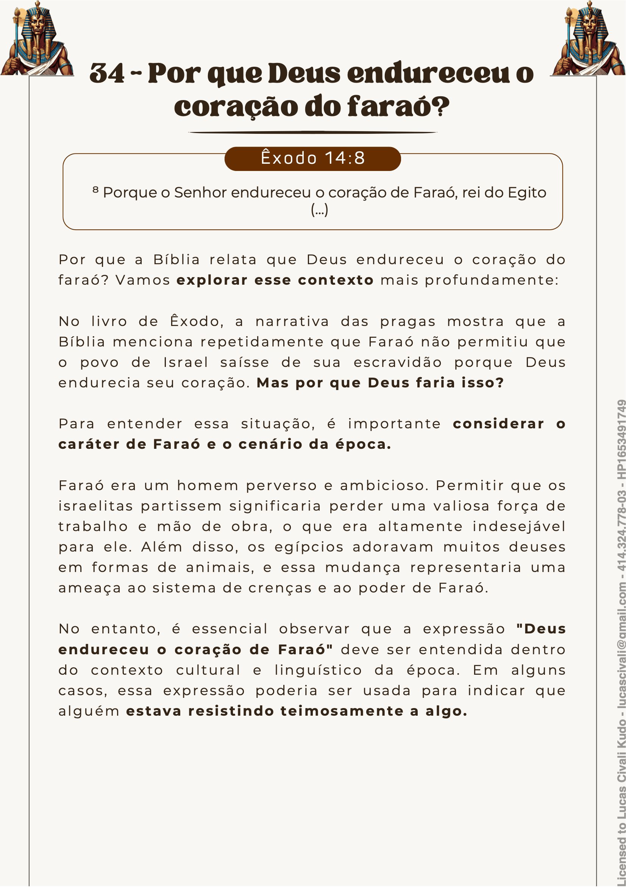
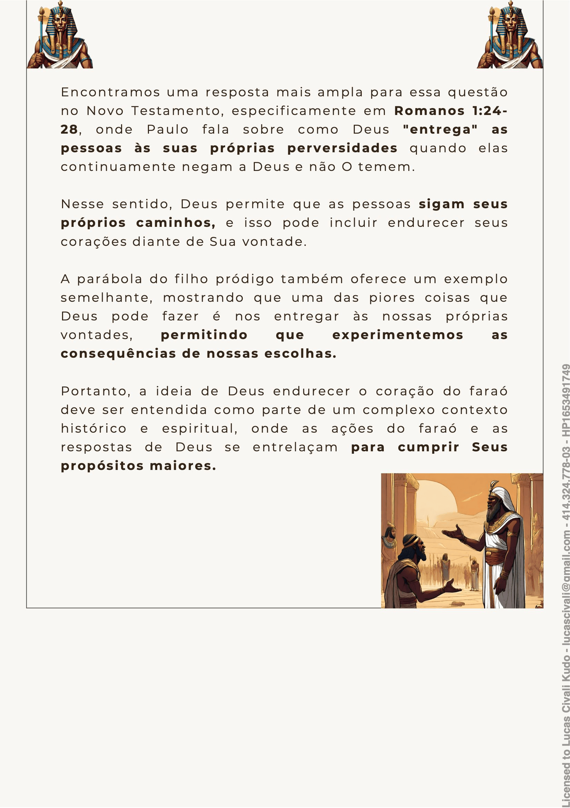
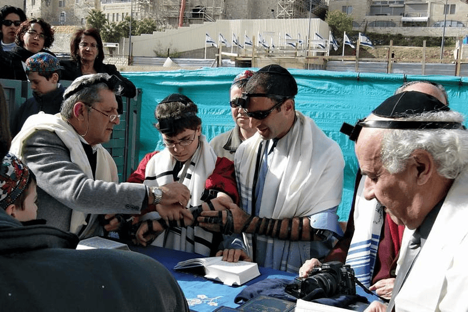
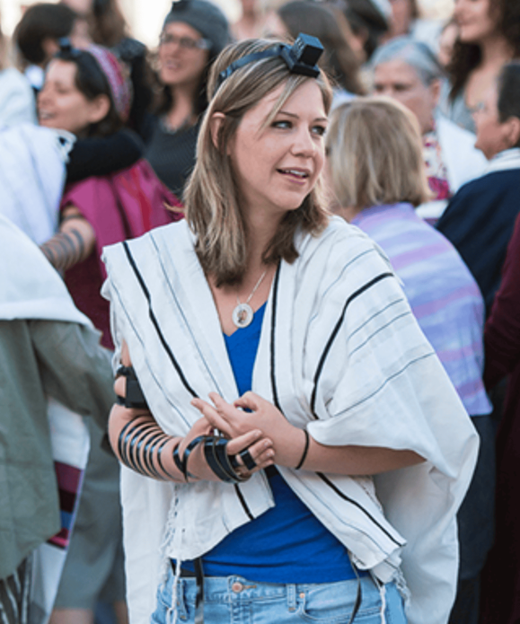
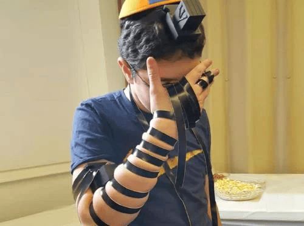

# Dia 29 — Êxodo 13-14

--- 

- **Tempo total de leitura:** 10:50

1. Leia Êxodo, do capítulo 13 ao final o capítulo 14.

##### Quer ouvir uma narração desses capítulos?

- [Capítulo 13](https://www.bible.com/pt/audio-bible/211/EXO.13.NTLH)
- [Capítulo 14](https://www.bible.com/pt/audio-bible/211/EXO.14.NTLH)

---

## Onde acontece?

Nos capítulos 13 e 14, os israelitas eles partem para Pi-Hairote. Entenda do caminho feito nesse pequeno vídeo: https://youtu.be/hXbrZ36h4qs

---
## Coração de Faraó

## A Abertura do Mar Vermelho

Apesar de tudo o que tinham visto e vivido até aquele momento da história (e vamos ouvir essa frase muitas vezes daqui para frente), os israelitas reclamaram com Moisés. Mesmo após testemunharem as dez pragas, serem libertos da escravidão e terem literalmente o "Anjo do Senhor" os guiando em forma de uma coluna de fumaça durante o dia e de fogo à noite, o povo demonstrou uma total falta de fé—uma atitude que se tornaria recorrente ao longo da jornada. 

Mas, mesmo diante da incredulidade do povo, Deus, com sua paciência e poder, deu mais uma demonstração incontestável de sua soberania: Ele abriu o Mar Vermelho, um dos maiores milagres do Antigo Testamento. E o mais interessante é a forma como esse milagre aconteceu, onde a Bíblia nos dá detalhes desse evento nos versos 20 e 21:

> *"[...] Assim, durante a **`noite inteira`**, o exército egípcio não conseguiu chegar perto dos israelitas."*
> *"[...] O vento soprou a **`noite inteira`** e fez o mar virar terra seca."*

Ou seja, os israelitas acamparam à beira do mar durante a noite, e Deus os protegeu de maneira tão sobrenatural que os egípcios não conseguiram se aproximar. Foi nesse período que o Senhor enviou um vento poderoso, que soprou a noite inteira até abrir o mar. Isso nos mostra que o milagre não foi instantâneo, mas um processo que levou provavelmente horas para se concretizar.

Outro fato interessante, que corrobora essa ideia, aparece nos versos 24 e 25:

> *"Logo **`antes de amanhecer`**, [...] o Senhor olhou para o exército dos egípcios e fez [...] com que as rodas dos carros ficassem atoladas."*

Esse trecho nos revela que os egípcios entraram no mar ainda de madrugada, perseguindo os hebreus. E o ponto final desse evento ocorre nos versos 27 e 28:

> *"Moisés estendeu a mão sobre o mar, e, **`quando amanheceu`**, o mar voltou ao normal. Os egípcios tentaram escapar das águas, porém o Senhor os jogou dentro do mar. As águas voltaram e cobriram os carros de guerra, os cavaleiros e todo o exército egípcio que havia perseguido os israelitas no mar. E não sobrou nenhum egípcio com vida."*

Com isso, podemos deduzir que o povo começou a atravessar o mar no final da madrugada e terminou com o nascer do sol. Imagine a grandiosidade desse momento! Milhares de homens, mulheres e crianças caminhando durante a noite, em meio ao mar, vendo as águas erguidas como muralhas dos dois lados, enquanto o vento soprava ao redor. O medo inicial dava lugar à maravilha, à certeza de que Deus estava agindo em favor deles. Aquele era, sem dúvida, um momento definitivo: o marco da libertação completa da escravidão e o início de uma nova vida como povo de Deus.

Essa cena extraordinária não apenas demonstrou o poder divino, mas também apontava para um evento ainda maior que aconteceria séculos depois: a salvação em Cristo. Assim como os israelitas foram salvos das mãos dos egípcios ao atravessar o mar, nós também somos libertos do domínio do pecado e da morte por meio da cruz e da ressurreição de Jesus. O Mar Vermelho se abriu para dar passagem ao povo de Deus, e o sepulcro se abriu para dar à humanidade uma nova esperança.

Se para os hebreus aquela travessia significou o fim da escravidão e o começo de uma nova jornada rumo à Terra Prometida, para nós, a obra de Cristo na cruz representa o fim do jugo do pecado e o início da vida eterna ao lado de Deus. O mar se fechou sobre os egípcios, que, nesta analogia, representam o pecado, selando a vitória do Senhor sobre seus inimigos, assim como a ressurreição de Jesus selou, de uma vez por todas, a derrota do pecado e da morte.

A travessia do Mar Vermelho foi, sem dúvida, uma das maiores manifestações do poder de Deus no Antigo Testamento. No entanto, a maior de todas foi a ressurreição de Cristo, o verdadeiro êxodo espiritual que nos conduz da morte para a vida, da escravidão para a liberdade e do desespero para a esperança.

## Comentários sobre os capítulos

- Deus salvou os primogênitos dos israelitas; portanto, os primogênitos do povo, incluindo os animais, deveriam ser consagrados a Deus, ou seja, pertenceriam ao Senhor. Os filhos primogênitos se tornaram sacerdotes de Deus até a escolha da tribo de Levi para esse serviço. Os primogênitos dos animais limpos tinham de ser sacrificados a Deus no prazo de até um ano. O primogênito dos animais imundos (como a jumenta) não podia ser sacrificado ao Senhor; portanto, deveria ser resgatado por meio da morte de um cordeiro, o que significa que um cordeiro tinha de morrer em seu lugar. Se a cria da jumenta não fosse resgatada, esta deveria ser morta por desnucamento. Ou seja, tratava-se de uma escolha: resgate ou destruição.

- O verso 16 do cap 13 junto com deuteronômio 6, posteriormente foi interpretado como algo literal pelos judeus que começaram a fabricar filactérios (pequenos recipientes, tipo uma caixinha, feitos de couro contendo trechos da Palavra de Deus), a fim de amarrá-los na testa e nos pulsos. 

> *"Isso será como uma lembrança, como alguma coisa amarrada nas mãos ou na testa. E nos fará lembrar que com o seu grande poder o SENHOR nos tirou do Egito."* [Êxodo 13:16 NTLH](https://www.bible.com/pt/bible/211/EXO.13.NTLH)

- Contudo, o sentido espiritual desses versículos é agir (mão) e pensar (cabeça) todo o tempo em conformidade com a Palavra de Deus. Veja essa explicação, nesse pequeno vídeo: https://youtu.be/nSVBRx_--uQ

- A presença do Senhor com seu povo era representada por uma coluna de nuvem durante o dia e uma coluna de fogo durante a noite. “Essas colunas eram milagres constantes”. Representavam a glória de Deus, literalmente guiando seu povo e o protegendo dos inimigos.