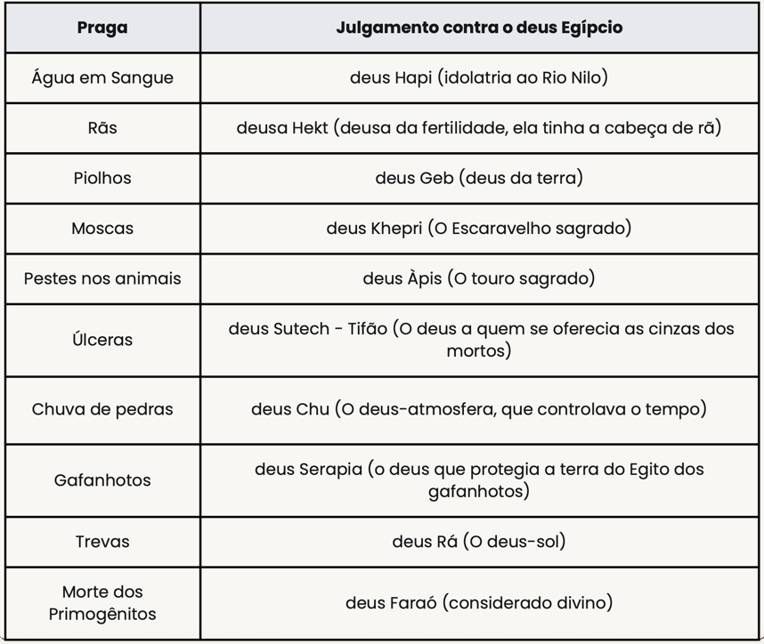

# Dia 28 — Êxodo 11-12

--- 

- **Tempo total de leitura:** 11:51

1. Leia Êxodo, do capítulo 11 ao final do capítulo 12.
2. Assista esse vídeo: https://youtu.be/dONUndDWlZA.

##### Quer ouvir uma narração desses capítulos?

- [Capítulo 11](https://www.bible.com/pt/audio-bible/211/EXO.11.NTLH)
- [Capítulo 12](https://www.bible.com/pt/audio-bible/211/EXO.12.NTLH)

---

## Onde acontece?

Esses 2 capítulos se passam basicamente no Egito.

---
## Coração de Faraó

## A Décima praga

O livro de Êxodo, especialmente nos capítulos 11 e 12, relata a última e mais severa das pragas que Deus enviou sobre o Egito: a morte dos primogênitos. Essa passagem não apenas narra um evento crucial na história do povo de Israel, mas também aponta para Cristo e a salvação pela fé de maneira profunda e simbólica.

No capítulo 11, Deus anuncia a Moisés que enviaria a décima praga sobre o Egito, resultando na morte de todos os primogênitos, desde o filho de Faraó até o filho do escravo, bem como dos animais. Esse juízo divino demonstrava o poder e a justiça de Deus, mas também servia para libertar o povo de Israel da escravidão.

Já no capítulo 12, Deus institui a Páscoa como meio de proteção para os israelitas. Cada família deveria sacrificar um cordeiro sem defeito e passar seu sangue cobrindo os umbrais das portas de suas casas. O sangue serviria como sinal para que o anjo destruidor poupasse os primogênitos daquela casa. Esse juízo divino não fez distinção entre egípcios e israelitas; a morte dos primogênitos atingiria a todos indiscriminadamente. No entanto, Deus também revelou um meio de escape: qualquer um que seguisse sua instrução seria poupado, não tendo relação com o mérito ou origem. Aqueles que ignoraram essa provisão, fossem egípcios ou israelitas, sofreram as consequências do juízo. Esse princípio aponta para a justiça de Deus, que julga a todos igualmente, mas também para Sua misericórdia, que provê um caminho de redenção para aqueles que confiam em Sua palavra.

O cordeiro prefigura Jesus, o "Cordeiro de Deus que tira o pecado do mundo" (João 1:29). Assim como o sangue do cordeiro protegeu os israelitas do juízo de Deus, o sangue de Cristo derramado na cruz nos livra da condenação eterna. A Páscoa do Antigo Testamento encontra seu cumprimento na morte e ressurreição de Jesus, conforme ensinado por Paulo em 1 Coríntios 5:7: "Porque Cristo, nossa Páscoa, foi sacrificado por nós".

Além disso, a salvação pela fé é claramente demonstrada nesse relato. Os israelitas não foram salvos por suas boas obras ou por sua nacionalidade, mas porque confiaram (tiverem fé) na palavra de Deus e aplicaram o sangue do cordeiro em suas casas. Da mesma forma, a salvação em Cristo não é conquistada por esforços humanos, mas recebida pela fé em Seu sacrifício (Efésios 2:8-9).

Portanto, Êxodo 11 e 12 revelam o plano redentor de Deus desde os tempos antigos. A libertação de Israel da escravidão egípcia é um retrato da libertação do pecado proporcionada por Cristo. O sangue do cordeiro pascal aponta para o sacrifício perfeito de Jesus, e a necessidade de fé para a salvação é reafirmada tanto no Antigo quanto no Novo Testamento. Essa passagem nos convida a confiar em Cristo, nosso verdadeiro Cordeiro Pascal, cuja morte e ressurreição garantem nossa redenção e vida eterna.

## Comentários sobre os capítulos

- A primeira Páscoa deveria ser celebrada em espírito de partida imediata para uma viagem, um lembrete de que somos peregrinos, temos uma longa jornada pela frente e, portanto, não devemos carregar muito peso. A palavra “Páscoa” provém do hebraico pesah, que significa “passar por cima”, isto é, o Senhor passou por cima das casas marcadas com sangue.

- Contentes por finalmente se livrarem dos israelitas, os egípcios lhes deram tudo o que pediram. Para os hebreus, porém, aqueles tesouros representavam um pagamento justo por todo o trabalho que realizaram para Faraó.

- Deus salvou os primogênitos dos israelitas; portanto, os primogênitos do povo, incluindo os animais, deveriam ser consagrados a Deus, ou seja, pertenceriam ao Senhor. Os filhos primogênitos se tornaram sacerdotes de Deus até a escolha da tribo de Levi para esse serviço. Os primogênitos dos animais limpos tinham de ser sacrificados a Deus no prazo de até um ano. O primogênito dos animais imundos (como a jumenta) não podia ser sacrificado ao Senhor; portanto, deveria ser resgatado por meio da morte de um cordeiro, o que significa que um cordeiro tinha de morrer em seu lugar. Se a cria da jumenta não fosse resgatada, esta deveria ser morta por desnucamento. Ou seja, tratava-se de uma escolha: resgate ou destruição.

William MacDonald, Comentário Bíblico Popular: Antigo Testamento, 2a edição (São Paulo: Mundo Cristão, 2011), 60.

William MacDonald, Comentário Bíblico Popular: Antigo Testamento, 2a edição (São Paulo: Mundo Cristão, 2011), 60.