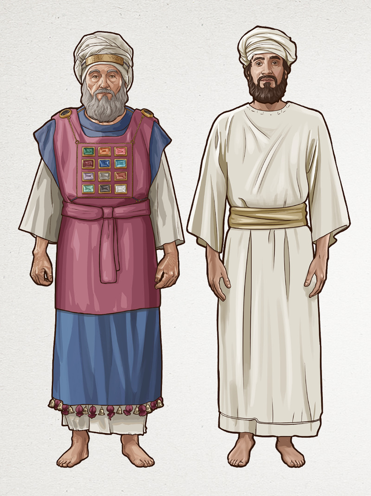

# Dia 32 — Êxodo 17-19

--- 

- **Tempo total de leitura:** 13:18

1. Calma não comece a ler, vamos fazer diferente dessa vez.

Alguns livros contêm detalhes bem específicos, difíceis de memorizar. Entre eles, estão leis que regulamentavam o comportamento do povo, abrangendo aspectos éticos, morais, comerciais e até normas sobre escravidão e acidentes. Veja um exemplo:

> **"28 — Se um boi chifrar um homem ou uma mulher, e a pessoa morrer, o boi deverá ser morto a pedradas, e ninguém comerá a sua carne. Mas o dono do boi não será castigado. Porém, se o boi tinha o costume de chifrar as pessoas, e o seu dono sabia disso e não o prendeu, e o boi matar algum homem ou alguma mulher, o boi será morto a pedradas. E o seu dono também será morto."**

Essas leis são peculiares e detalhadas, e, à primeira vista, podem parecer de pouca utilidade para quem está começando a estudar a Bíblia. No entanto, toda a Escritura é inspirada e tem um propósito. Algumas passagens exigem maior dedicação e aprofundamento para que seu significado seja plenamente compreendido, especialmente porque muitas delas fazem mais sentido à medida que se adquire um conhecimento mais abrangente das Escrituras. Veja um exemplo interessante:

A lei referente ao boi que matasse alguém determina que o proprietário do animal poderia ser morto caso soubesse do comportamento agressivo do boi e não tomasse providências. No entanto, havia a possibilidade de salvar sua própria vida mediante o pagamento de uma indenização:

> **"No entanto, se deixarem que o dono pague uma multa para salvar a sua vida, então ele terá de pagar tudo o que for exigido. 31 Se um boi matar um menino ou uma menina, o dono será julgado por esta mesma lei. 32 Se um boi chifrar um escravo ou uma escrava, o dono receberá como pagamento trinta siclos de prata, e o boi será morto a pedradas."**

Perceba que há um preço a ser pago como compensação pelo dano causado. O valor da indenização variava conforme a vítima: um homem, uma criança ou um escravo. No entanto, a Bíblia menciona especificamente o preço de um escravo: **30 siclos de prata**.=

Um siclo era uma unidade de peso que correspondia a aproximadamente **12 gramas**, 30 siclos, seria algo como 360 gramas de prata, um valor muito próximo ao das moedas usadas no Templo no tempo de Jesus.

Agora veja o detalhe!! A Bíblia nos revela que o preço de um escravo era **30 siclos de prata**—o mesmo valor pelo qual Judas traiu Jesus. Moisés, ao registrar esse detalhe na Lei, estava apontando profeticamente para o futuro. Moises não mencionou somente o valor por um escravo, por ao acaso, mas prefigurava o preço que seria pago pela vida de Cristo, mostrando que Ele, seria vendido pelo mesmo valor de um escravo segundo a Lei de Moisés.

Esses detalhes são profundamente enriquecedores e revelam a grandiosidade e perfeição do plano de Deus para a redenção do mundo. No entanto, como vimos, são nuances sutis que exigem grande esforço de memorização e uma compreensão mais ampla das Escrituras. Como o objetivo deste plano é fornecer uma visão geral da história bíblica, deixaremos de lado algumas dessas passagens muito específicas, que demandam maior atenção ou que agregam pouco à narrativa principal, para nos focarmos nos aspectos fundamentais que mostram o propósito central da bíblia.

Faremos uma leitura apenas dos títulos das passagens para compreender o contexto desses versos, utilizando outros recursos que nos permitam obter uma visão geral. Dessa forma, resumiremos o conteúdo e focaremos nos trechos mais relevantes.

2. Leia Êxodo, do capítulo 20 do verso 1 até o verso 21
3. Assistam esse pequeno vídeo: https://youtu.be/rzRlIUg7Xl4.
3. Depois pule (lembre-se de ler os títulos enquanto estiver pulando) para o capítulo 23 verso 20 até o verso 33 
4. Depois pule para o capítulo 25 e leia somente o verso 8 e 9.
5. Depois pule para o capítulo 30. verso 11 até 16.

Esses são os temas abordados durante esse capitútlos:

### Leis

1. Leis acerca dos escravos (21:1–11)
2. Leis acerca dos ferimentos pessoais (21:12–36)
3. Leis acerca do furto e de danos à propriedade (22:1–6)
4. Leis acerca da desonestidade (22:7–15)
5. Leis acerca da sedução (22:16–17)
6. Leis acerca das obrigações civis e religiosas (22:18–23:19)
7. Leis acerca da posse da terra (23:20–33)

### Instruções para a construção do tabernáculo (25–27)

1. Coleta de materiais (25:1–9)
2. A arca da aliança (25:10–16)
3. O propiciatório (25:17–22) // A tampa da arca era chamada propiciatório
4. A mesa dos pães da proposição (25:23–30)
5. O candelabro e seus acessórios (25:31–40)
6. O tabernáculo (26)
7. O altar do holocausto (27:1–8
8. O átrio (27:9–19)
9. O azeite para o candelabro (27:20–21)

### O sacerdócio (28–29)

1. As vestes sacerdotais (28)

Essas vestes, com suas cores, ornamentos etc., representam as glórias de Cristo, nosso Sumo Sacerdote. A família de Arão foi escolhida para exercer o ofício sacerdotal. Na parte da frente da estola, havia um peitoral que continha doze pedras preciosas, cada uma com o nome de uma tribo.

<small>Sumo Sacerdote a esquerda -- Sacerdote comum a direita</small>

2. A cerimônia de consagração dos sacerdotes (29
3. O altar do incenso (30:1–10)
4. O pagamento do resgate (30:11–16)
5. A bacia para lavar (30:17–21)
6. O óleo para a unção (30:22–33)
7. O incenso (30:34–38)
8. Os artífices capacitados por Deus (31:1–11)

## Onde acontece?

Todos esse capítulos acontecem no Monte Sinai.

## Comentários sobre os capítulos

- O povo deveria lavar suas vestes e evitar ter relações sexuais como forma de preparação para a revelação de Deus. Essa ordem tinha o objetivo de ensinaer-lhes sobre a importância da pureza na presença de Deus. As pessoas estavam proibidas de se aproximar do monte Sinai. Ninguém podia tocá-lo, nem mesmo os animais, sob pena de morte.

- Jesus classificou os Dez Mandamentos em duas categorias: uma se referindo ao amor de Deus, e outra relacionada ao próximo (Mt 22:37–40).

