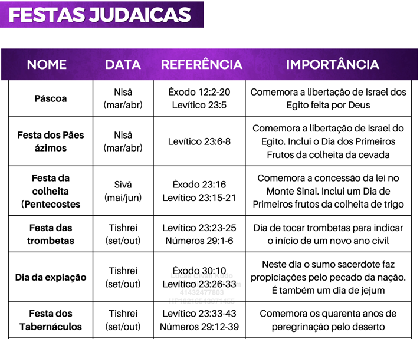

# Dia 37 — Levítico 10;16 / Números 01

---

- **Tempo total de leitura:** 10:20

1. Leia Levítico, do capítulo 10 até o verso 11.
2. Vamos pular para o capítulo 16 (lembre-se de ler os títulos enquanto estiver pulando)
3. Leia Levítico, do capítulo 16.
4. Vamos pular para o número capítulo 01 (lembre-se de ler os títulos enquanto estiver pulando)
5. Leia Números capítulo 01 verso 01 até verso 03, depois do verso 44 até o verso 54 (fim do cap 01).

| **TRIBO**     | **VERSÍCULOS** | **CONTAGEM** |
|---------------|----------------|--------------|
| Rúben         | 20–21          | 46.500       |
| Simeão        | 22–23          | 59.300       |
| Gade          | 24–25          | 45.650       |
| Judá          | 26–27          | 74.600       |
| Issacar       | 28–29          | 54.400       |
| Zebulom       | 30–31          | 57.400       |
| Efraim        | 32–33          | 40.500       |
| Manassés      | 34–35          | 32.200       |
| Benjamim      | 36–37          | 35.400       |
| Dã            | 38–39          | 62.700       |
| Aser          | 40–41          | 41.500       |
| Naftali       | 42–43          | 53.400       |
| **Total**     |                | **603.550**  |

6. Assista esse vídeo: https://www.youtube.com/watch?v=bR5qA3fmpEM

## Onde acontece?

Acontecem no Monte Sinai.

## A Oferta do Fogo Estranho: Tentativas Humanas de Substituir a Obra Expiatória de Cristo

---

A história de Nadabe e Abiú, relatada em Levítico 10, é uma passagens muito impactante. Ao oferecerem fogo estranho perante o Senhor, esses dois sacerdotes desobedeceram diretamente à instrução divina e sofreram as mais severas consequências. Este evento não apenas traz um alerta claro sobre a seriedade da santidade de Deus, mas também carrega um simbolismo profundo que aponta diretamente para a obra expiatória de Cristo na cruz. Ao refletirmos sobre essa narrativa, percebemos que Nadabe e Abiú nos mostram, por meio de seu erro, uma tentativa de se aproximar de Deus por outro meio que não o caminho estabelecido por Ele — algo que, no contexto central das Escrituras, representa uma rejeição à obra redentora de Jesus.

Lembre-se de que tudo o que acontece com o povo de Israel nessas passagens do pentateuco, carrega um simbolismo que aponta para Jesus no Novo Testamento. De forma geral, cada evento traz lições e simbolismos nos quais Deus, através de um subtexto ("nas entrelinhas"), revela Seu plano de redenção.

No caso da morte de Nadabe e Abiú, é importante lembrar que o fogo do altar havia sido aceso pelo próprio Deus, consumindo os sacrifícios oferecidos, conforme descrito em Levítico 9.

>"*Saiu fogo da presença do SENHOR que consumiu o holocausto e as porções de gordura sobre o altar. Quando todo o povo viu isso, gritou de alegria e prostrou‑se com o rosto em terra.*" [Levítico 9:24 NVI](https://www.bible.com/pt/bible/compare/LEV.9.24)

Esses sacrifícios representavam a aceitação do sistema estabelecido por Deus para reconciliar o povo com Ele. Quando Nadabe e Abiú usaram fogo estranho — ou seja, um fogo que não foi aceso por Deus, ao consumar os sacrifícios expiatórios, essa ação simbolizou uma tentativa de se aproximar Dele por meio de algo diferente do sistema que Ele havia estabelecido.

O subtexto dessa narrativa então nos sugere, que o ato deles representou uma tentativa de se aproximar de Deus por meio de algo que não fosse a obra expiatória de Cristo na cruz. Esses eventos demonstram que qualquer tentativa de se achegar a Deus fora de Sua provisão — seja pelos méritos humanos, obras ou um caminho distinto do que Ele determinou — é inaceitável diante de Sua santidade. 

>"*Jesus respondeu:
― Eu sou o caminho, a verdade e a vida. Ninguém vem ao Pai, a não ser por mim.*" [João 14:6 NVI](https://www.bible.com/pt/bible/compare/JHN.14.6)

Adicionalmente, o uso do "fogo estranho" por Nadabe e Abiú ressalta a autojustificação como um perigo espiritual. Em oposição à dependência do desejo soberano de Deus, seu gesto representava a substituição da obediência humilde por um ato que refletia independência e presunção. Toda a narrativa reforça que, no plano divino, a salvação jamais pode ser alcançada por esforço ou mérito humano, mas é exclusivamente baseada na provisão graciosa de Deus — um tema manifesto de maneira perfeita no sacrifício de Jesus na cruz.

---

## Conclusão

A narrativa do fogo estranho oferecido por Nadabe e Abiú serve como um poderoso lembrete de que é impossível nos aproximarmos de Deus por meios alternativos ou próprios. Aqueles dois sacerdotes, tendo ignorado as orientações específicas sobre como entrar em Sua presença, acabaram exemplificando os esforços humanos inúteis de buscar Deus fora do caminho que Ele estabeleceu, seja por displicência, ignorância ou  rebeldia intencional. 

Essa atitude revela a gravidade de se desviar do caminho da salvação, por meio da Fé em Jesus. No plano divino, Jesus Cristo é o único mediador entre Deus e os homens. Todo o sistema sacrificial do Antigo Testamento foi um prenúncio do sacrifício perfeito de Cristo, o Cordeiro de Deus que tira o pecado do mundo. Qualquer tentativa de acessar a presença de Deus fora dessa perfeita obra expiatória é, no fundo, uma rejeição da graça de Deus.

Que essa história nos leve a refletir e a confiar completamente na suficiência da cruz, reconhecendo que não há outro caminho para a reconciliação com Deus além de Jesus Cristo. Por meio de Sua obra perfeita, somos aceitos e temos livre acesso à presença do Pai, não por mérito próprio, mas pelo sacrifício d’Aquele que morreu em nosso lugar. Que o "fogo estranho" sirva de lição eterna: a verdadeira adoração e reconciliação com Deus só podem ocorrer nos termos que Ele mesmo estabeleceu, culminando na cruz do Calvário.

## Resumo das Leis:

As leis do Antigo Testamento foram dadas por Deus ao povo de Israel e podem ser categorizadas em três grandes grupos: **leis cerimoniais**, **leis civis** e **leis morais**. Cada uma dessas categorias tem um propósito específico e uma aplicação diferente dentro do contexto bíblico e histórico. Vamos explorar cada uma delas:

---

### **1. Lei Cerimonial**

A **lei cerimonial** tratava dos rituais religiosos e cerimônias de culto que o povo de Israel deveria seguir. Essas leis eram centradas no tabernáculo e no templo, envolvendo os sacerdotes e os sacrifícios. Elas tinham como propósito ensinar ao povo sobre a santidade de Deus e a seriedade do pecado, além de apontar para a redenção futura que seria realizada em Jesus Cristo.

- **Exemplo:** O sacrifício de animais para o perdão de pecados. Segundo essas leis, o sacerdote deveria oferecer sacrifícios de ovelhas, cabras, bois ou pombas no tabernáculo para expiação dos pecados do povo. Esse ritual incluía também a oferta de incenso e outros elementos simbólicos.

---

### **2. Lei Civil**

A **lei civil** diz respeito às regulamentos que governavam a organização social e o cotidiano do povo de Israel. Essas leis visavam assegurar justiça, ordem e equilíbrio entre as pessoas, tratando de questões como propriedade, casamento, crime, punição, compensações e responsabilidade comunitária.

- **Exemplo:** A lei de restituição por danos. Se alguém prejudicasse outra pessoa, intencionalmente ou por acidente, deveria pagar uma compensação equivalente ao dano causado. Por exemplo, se uma lesão fosse intencional, o valor da compensação seria maior; já em caso de acidente, as consequências eram menos severas.

---

### **3. Lei Moral**

A **lei moral** reflete o caráter e a vontade de Deus em relação à conduta ética dos seres humanos. Essas leis são universais e atemporais, sendo aplicáveis a todos os povos, em qualquer época. A base da lei moral está nos **Dez Mandamentos**, dados por Deus a Moisés no Monte Sinai.

- **Exemplo:** Os Dez Mandamentos.
    - **Primeira parte:** Relaciona-se com o relacionamento do ser humano com Deus, como "Não terás outros deuses diante de mim" e "Santificar o sábado".
    - **Segunda parte:** Refere-se ao relacionamento do ser humano com os outros, como "Não matarás", "Não cometerás adultério", "Honra teu pai e tua mãe", entre outros.
---

Essas três categorias de leis revelam diferentes aspectos do relacionamento de Deus com o povo de Israel e de sua natureza justa e santa. Na perspectiva cristã, enquanto as leis cerimoniais e civis já não são seguidas diretamente, a lei moral continua sendo um alicerce para a ética cristã e o chamado à santidade. 

Em suma, todas essas categorias de leis no Antigo Testamento apontam para Jesus Cristo, que é o cumprimento perfeito da lei. A lei cerimonial prefigurava Sua obra redentora como o sacrifício definitivo, a lei civil refletia a justiça e o governo divino que Ele instauraria, e a lei moral revela Seu caráter santo e impecável. Em Jesus, a graça e a verdade se manifestam de forma plena, oferecendo ao ser humano não apenas o cumprimento das exigências da lei, mas também a reconciliação e a vida eterna. Ele é a realização de tudo o que a lei simbolizava e o caminho pelo qual todos podem se aproximar de Deus.

## Festas Judaicas

William MacDonald, Comentário Bíblico Popular: Antigo Testamento, 2a edição (São Paulo: Mundo Cristão, 2011), 112.

## Comentários sobre os capítulos

- É nesse contexto do "fogo estranho" que surge uma famosa frase muito conhecida dentro de ambientes teológicos cristocêntricos: **"A Teologia não esfria o crente, ela só apaga o fogo estranho."**

- O dia mais importante do calendário judaico era o Dia da Expiação.