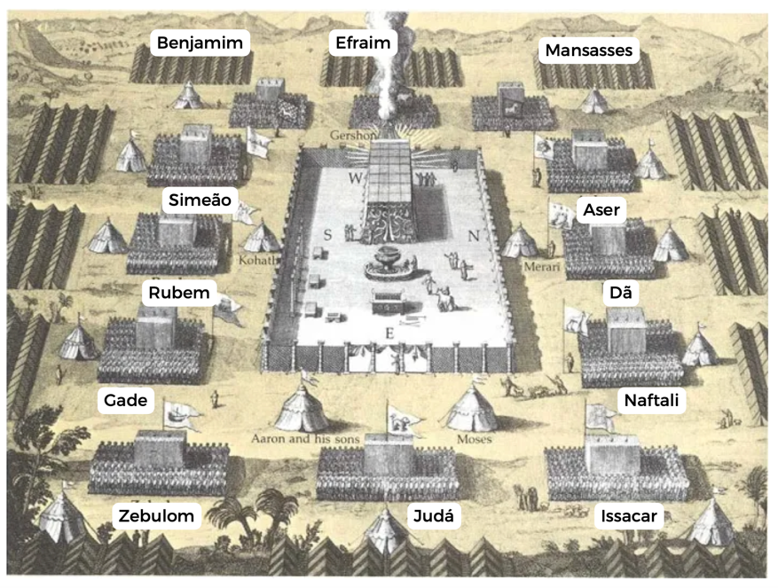

# Dia 38 — Números 05;09-10

---

- **Tempo total de leitura:** 10:20

1. Vamos pular para Números capítulo 05 (lembre-se de ler os títulos enquanto estiver pulando)
2. Leia Números capítulo 05 verso 01 até verso 04.
3. Vamos pular para Números capítulo 09 (lembre-se de ler os títulos enquanto estiver pulando)
4. Leia Números capítulo 09 até final.
5. Leia Números capítulo 10 do verso 11 até o final.
6. Assista esse vídeo: https://youtu.be/9TpOOZNLfEI

## Onde acontece?

No final do capítulo 10, finalmente os israelitas partem do Monte Sinai, um ano e um mês depois de terem saído do Egito.

## Organização do acampamento

## Comentários sobre os capítulos

- Hobabe era cunhado de Moisés. Reuel (também chamado Jetro) era pai de Hobabe e, portanto, sogro de Moisés. É bem provável que Hobabe, por ser um midianita, estava familiarizado com o deserto. Talvez essa seja a razão de Moisés o haver convidado para acompanhar os israelitas (“e servirás de guia”). Porém, esse convite demonstrou falta de fé, uma vez que Deus havia prometido conduzir pessoalmente o povo.

