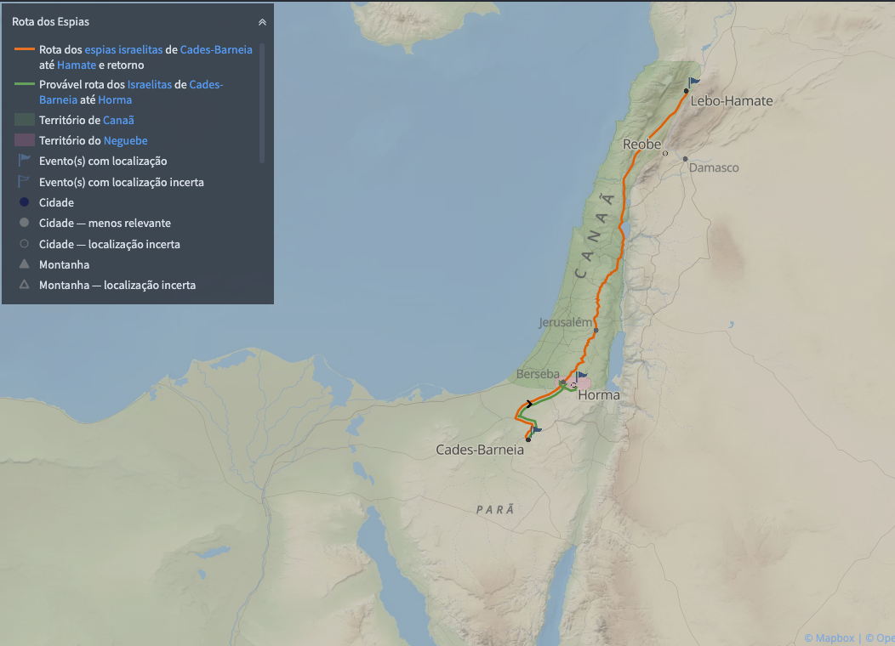

# Dia 40 — Números 13-14

---

- **Tempo total de leitura:** 12:35

1. Leia Números capítulo 13 até final do capítulo 14.

## Onde acontece?

Os capítulos 13 e 14 do livro de Números se passam em uma região crítica da narrativa da peregrinação dos israelitas: o deserto de Parã, mais especificamente próximo a Cades-Barnéia (ou apenas Cades), que fica na borda sul da terra de Canaã.

* Os espias vão desde o sul de Canaã até Reobe, na direção de Hamate, que fica no extremo norte da terra prometida.
* Entre os doze espias, dez não estavam confiantes nas promessas de Deus

## A falta de fé em Deus 

A reação do povo em Cades é um retrato profundo da incredulidade humana. Diante do relatório dos espias, o povo não apenas se desespera, mas rejeita explicitamente o Senhor. Murmuram, acusam Moisés e Arão, e chegam ao ponto de planejar um novo líder que os leve de volta ao Egito (Nm 14.1–4). E mais: querem apedrejar Josué e Calebe por ousarem confiar em Deus (v. 10).

O ápice da rebeldia não está apenas no medo dos gigantes, mas na rejeição da identidade de Deus. Eles preferem voltar para a terra da escravidão — um Egito devastado pelas pragas, onde o primogênito de cada família havia morrido, onde o exército fora destruído no mar Vermelho. Que recepção esperavam do novo Faraó? A incredulidade cega a memória e perverte o julgamento. O povo não questiona os obstáculos da terra prometida, mas o caráter do Deus que os guiava.

Essa atitude revela uma teologia distorcid, como observado por Moisés em sua intercessão (Nm 14.17–19), o problema do povo não era apenas moral, mas doutrinário: eles não conheciam de fato o Senhor. Enquanto Moisés baseia sua oração na autorrevelação divina. O povo projeta em Deus suas próprias limitações, medos e desejos — moldando uma imagem de Deus conforme seus anseios carnais. Essa distorção teológica afasta o povo do Deus vivo e os conduz por caminhos perigosos, onde a idolatria do coração se disfarça de prudência, e a rebelião se apresenta como bom senso.

Como vimos antes, novamente vemos que a intercessão de Moisés atua como um tipo claro de Cristo. Ele se coloca entre Deus e o povo, apelando não aos méritos da congregação — mas ao caráter revelado do Senhor: misericordioso, longânimo e cheio de graça. Se fosse por mérito, depois de tanta bondade, sinais e milagres testemunhados, o que caberia àquela geração seria apenas destruição. A rebelião em Cades não foi fruto de ignorância, mas de recusa consciente em confiar e ter fé no Deus que se revelara com poder.

Ainda assim, Moisés clama pela misericórdia de Deus. Ele roga ao Senhor com base naquilo que o próprio Deus dissera sobre si mesmo em Êxodo 34.6–7. 

>"*Então Deus passou diante de Moisés e disse em voz alta:
— Eu sou o SENHOR, o Deus Eterno! Eu tenho compaixão e misericórdia, não fico irado com facilidade, e a minha fidelidade e o meu amor são tão grandes, que não podem ser medidos. Cumpro a minha promessa a milhares de gerações e perdoo o mal e o pecado. [...]*" [Êxodo 34:6-7 NTLH](https://www.bible.com/pt/bible/compare/EXO.34.6-7)

Moisés não esperou um novo sinal, nem confiou em uma sensação interior — ele apelou à revelação objetiva da Palavra do Senhor. Sua intercessão não se apoia em desculpas humanas sobre o pecado do povo, mas na fidelidade divina à Sua promessa. Cristo, nosso Mediador, também se coloca entre Deus e os culpados — não apenas rogando, mas oferecendo-se a si mesmo para sofrer as consequências que deveriam ser nossas, pelos pecados que de fato cometemos, e pelo juízo que verdadeiramente merecíamos. Se Moisés impediu a destruição de todo um povo, Cristo assegura eternamente nossa reconciliação.

### A resposta de Deus

A resposta divina vem em duas camadas: juízo e graça. Deus não destrói a nação, mas determina que aquela geração morrerá no deserto (Nm 14.28–35). Trata-se de uma punição pedagógica e pactual — não necessariamente condenatória em termos eternos. Como em muitos outros trechos do Antigo Testamento, vemos aqui um vislumbre do que seria plenamente revelado nos evangelhos: a incredulidade conduz à morte, mas a fé em Deus conduz à vida. Isso se torna evidente no contraste entre o destino de Josué e Calebe e o do restante do povo.

Sob essa perspectiva, compreendemos que esses eventos são uma sombra — silhuetas que apontam para o evangelho, ainda sem os contornos plenos e os detalhes que só seriam revelados em Cristo. Assim, a punição daquela geração, além de seu caráter corretivo, tem um valor tipológico: ilustra a seriedade da incredulidade e a centralidade da fé. Por isso, é provavél que muitos ali tenham sido salvos pela fé, mesmo que tenham sofrido as consequências temporais de sua desobediência. Isso nos ensina que o perdão de Deus não anula, necessariamente, a disciplina de Deus.

Josué e Calebe, por outro lado, são preservados. A Escritura diz que Calebe tinha “outro espírito” (Nm 14.24) — ou seja, uma disposição distinta, fruto da obra de Deus em seu interior. Eles confiaram no Senhor contra a corrente da incredulidade. Eles não esperaram a maioria da congregação se convencer; não se apoiaram na estrutura, nem nos líderes de cada tribo — confiaram unicamente na Palavra que Deus já havia dito. Como diz Hebreus 3, eles representam os que, pela fé, entram no descanso prometido. A terra de Canaã, nesse contexto, aponta para a nova criação: o descanso eterno em Cristo.

>"*Por isso, como diz o Espírito Santo:
“Se hoje vocês ouvirem a voz de Deus,
não sejam teimosos
como foram os seus antepassados
quando se revoltaram contra ele,
no dia em que eles o puseram à prova
no deserto.*" [Hebreus 3:7-8 NTLH](https://www.bible.com/pt/bible/compare/HEB.3.7-8,11)
>
>"*Eu fiquei irado e fiz este juramento:
‘Eles nunca entrarão na Terra Prometida,
onde eu lhes teria dado descanso!’ ”*" [Hebreus 3:11 NTLH](https://www.bible.com/pt/bible/compare/HEB.3.11)

>"*E de quem é que Deus estava falando quando fez este juramento: “Eles nunca entrarão na Terra Prometida, onde eu lhes teria dado descanso”? Ele estava falando das pessoas que se revoltaram. Portanto, vemos que elas não puderam entrar na Terra Prometida porque não tiveram fé.*" [Hebreus 3:18-19 NTLH](https://www.bible.com/pt/bible/compare/HEB.3.18-19)

>"*Meus irmãos, cuidado para que nenhum de vocês tenha um coração tão mau e descrente, que o leve a se afastar do Deus vivo. Pelo contrário, enquanto esse “hoje” de que falam as Escrituras Sagradas se aplicar a nós, animem uns aos outros, a fim de que nenhum de vocês se deixe enganar pelo pecado, nem endureça o seu coração. Pois seremos companheiros de Cristo se continuarmos firmes até o fim na confiança que temos tido desde o princípio.*" [Hebreus 3:12-14 NTLH](https://www.bible.com/pt/bible/compare/HEB.3.12-14)

O autor de Hebreus aplica diretamente esse episódio à igreja (Hb 4.1-2): Onde a incredulidade de Israel é um espelho para cada geração.

>"*Deus nos deixou a promessa de que podemos receber o descanso de que ele falou. Portanto, tenhamos muito cuidado para que Deus não julgue que algum de vocês tenha falhado, deixando assim de receber esse descanso. Pois, assim como aquelas pessoas ouviram, também nós ouvimos a boa notícia. Elas ouviram a mensagem, porém ela não lhes fez nenhum bem porque, quando a ouviram, não a receberam com fé.*" [Hebreus 4:1-2 NTLH](https://www.bible.com/pt/bible/compare/HEB.4.1-2)

### Conclusões

Podemos concluir, portanto, que:

* Um conceito distorcido de Deus conduz à ruína espiritual.
* A verdadeira fé resiste ao medo e não se baseia em sinais visíveis ou situações favoráveis, mas nas promessas imutáveis de Deus.
* A salvação é garantida por um Mediador perfeito — e não por qualquer nível de fidelidade humana, por mais sincera que seja.
* A fidelidade do homem, ainda que real, nunca será suficiente — seja em boas obras, zelo religioso ou obediência. Somente o Mediador perfeito pode garantir a salvação.
* A graça soberana é a origem da perseverança dos santos.

Assim como o povo foi provado em Cades, também nós somos chamados a crer, mesmo quando a fé parece irracional aos olhos naturais. Entrar no descanso prometido não é questão de bravura, nem de merecimento religioso, mas de confiança em Cristo — o verdadeiro Mediador,  nos conduz não à sombra, mas à luz do verdadeiro descanso revelado em Si mesmo: a terra definitiva onde não haverá mais deserto, nem incredulidade, nem juízo — apenas descanso eterno em Deus.

## Comentários sobre os capítulos

* A passagem sobre o envio dos espiões, indica que o envio dos espias foi ordenado pelo Senhor. Contudo, o texto em Deuteronômio 1:19–22 sugere que a ordem partiu do povo. Sem dúvida, a ordem de Deus era uma resposta ao pedido do povo, ainda que demonstrassem incredulidade

>"*Ali eu disse a vocês: “Agora estamos na região montanhosa dos amorreus, a terra que o nosso Deus nos está dando. Portanto, vão e tomem posse dessa terra que está diante de vocês, como o SENHOR, o Deus dos nossos antepassados, mandou. Não tenham medo, nem se assustem.” Aí todos vocês chegaram perto de mim e disseram: “Seria bom que mandássemos na frente de nós alguns homens para espionarem a terra e trazerem informações a respeito do caminho que devemos seguir e das cidades que vamos encontrar lá.”*" [Deuteronômio 1:20-22 NTLH](https://www.bible.com/pt/bible/compare/DEU.1.20-22)

* O Senhor ameaçou abandonar os israelitas e criar uma nova nação a partir de Moisés, novamente! (v. 11–12)

* O período de quarenta anos foi estabelecido em razão dos quarenta dias que os espias gastaram na expedição (v. 34). Mas esse período representa um arredondamento, uma vez que o número exato da peregrinação no deserto foi cerca de 38 anos (Dt 2:14). O total de quarenta anos se refere ao período completo desde a saída do povo do Egito até a entrada em Canaã

>"*Passaram‑se trinta e oito anos desde a época em que partimos de Cades-Barneia e atravessamos o vale de Zerede, período no qual pereceu no acampamento toda aquela geração de homens de guerra, conforme o SENHOR lhes havia jurado.*" [Deuteronômio 2:14 NVI](https://www.bible.com/pt/bible/compare/DEU.2.14)

* Conforme a narrativa, o povo tentou o Senhor dez vezes (v. 22): Vamos conferir os episódios um por um para validar:
  * 1- Mar Vermelho – Êxodo 14:11–12
  * 2- Mara (águas amargas) – Êxodo 15:23
  * 3- Deserto de Sim (murmuração por comida) – Êxodo 16:2
  * 4- Desobediência quanto ao maná (não guardar o sábado) – Êxodo 16:20
  * 5- Desobediência quanto ao maná (sair no sábado) – Êxodo 16:27
  * 6- Refidim (água de Massá e Meribá) – Êxodo 17:1–7
  * 7- Bezerro de ouro no Horebe – Êxodo 32:7
  * 8- Taberá (fogo do Senhor por causa das queixas) – Números 11:1–3
  * 9- Quibrote-Haatavá (murmuração por carne) – Números 11:4–34
  * 10- Cades (rejeição do relatório dso espiões e desejo de voltar ao Egito) – Números 14

* Após ouvir a sentença de Deus, o povo demonstrou remorso e disse a Moisés que agora obedeceria ao Senhor e entraria na terra prometida. Moisés, no entanto, alertou que era tarde demais, pois o Senhor já não os acompanhava. Se insistissem na missão, seriam derrotados. Mesmo assim, o povo desconsiderou o aviso, subiu ao alto do monte e tentou atacar, mas foi vencido pelos povos pagãos que habitavam Canaã.

