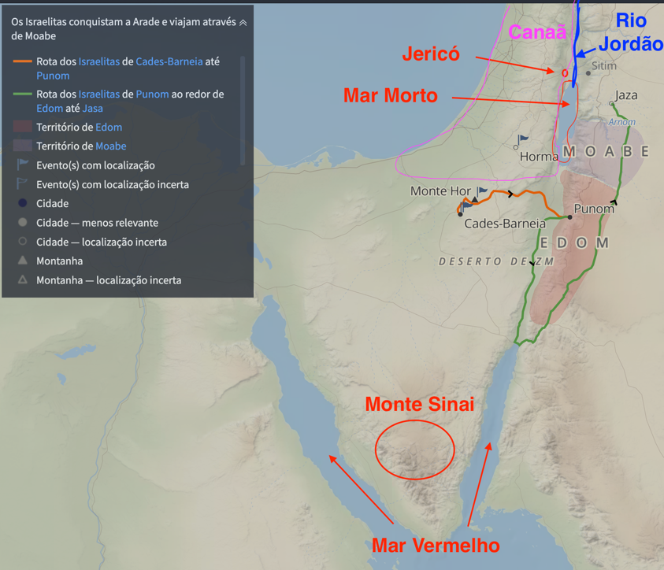

# Dia 43 — Números 20-21
---

- **Tempo total de leitura:** 12:22

1. Leia Números capítulo 20 até o final do capítulo 21.

## Quando e onde acontece?

Existe um salto de tempo grande, entre o capítulo 19 e o capítulo 20. Pode não parecer mais se passaram 38 anos entre um capítulo e outro. Isso é confirmado pelo contexto histórico, pela morte das figuras importantes, e pela descrição mais a frente de quando esses personagens morreram. Veja os argumentos:

1. Números 33:38
   “E subiu Arão, o sacerdote, ao monte Hor, conforme o mandado do Senhor, e morreu ali no quadragésimo ano da saída dos filhos de Israel da terra do Egito, no quinto mês, no primeiro dia do mês.”

Este versículo declara explicitamente que Arão morreu no ano 40, e isso ocorre em Números 20:28. Como o livro de Números começa no segundo ano da saida do egito, (Números 1:1), e a maioria dos capítulos anteriores ocorre nesse início da jornada, fica claro que há uma lacuna de aproximadamente 38 anos entre o início do deserto, que é a questão de quando os espias voltam e o povo é castigado e o momento da morte de Arão.

Então 38 anos depois do episódio dos espias em Canaã, o povo de Israel retorna a Cades, no deserto de Zim. Este retorno é significativo, pois é o mesmo local de onde os espias haviam partido anteriormente, marcando um ciclo completo de sua peregrinação no deserto e dando fim a punição do povo. Sabemos que o fim desse castigo estava encerrado por que existe um outro versiculo que deixa isso claro: 

>"*Passaram‑se trinta e oito anos desde a época em que partimos de Cades-Barneia e atravessamos o vale de Zerede, período no qual pereceu no acampamento toda aquela geração de homens de guerra, conforme o SENHOR lhes havia jurado.*" [Deuteronômio 2:14 NVI](https://www.bible.com/pt/bible/compare/DEU.2.14)

Exatamente o contexto dos capítulos 20 em diante de Números. Isso reforça a lacuna de tempo.

A narrativa prossegue então, onde o povo tenta, sem sucesso, atravessar o território de Edom. Após essa recusa, ocorre um evento marcante: a morte de Arão no Monte Hor, seguida por um período de luto de 30 dias.

Após esse período, a jornada continua a partir do Monte Hor. O povo é forçado a fazer um desvio pelo caminho do Mar Vermelho para contornar Edom. 

O mar Vermelho (v. 4) não se refere ao golfo que os israelitas cruzaram na fuga do Egito, mas a uma porção desse mar conhecido como golfo de Ácaba. O caminho do mar Vermelho, porém, talvez seja o nome de uma rota.

A rota segue através de várias regiões: passando pelos vales de Zered e Arnom. Durante este percurso, Israel conquista vitórias militares significativas, derrotando Siom, rei dos amorreus, e Ogue, rei de Basã.

Daqui em diante, não há como saber o caminho exato que os filhos de Israel percorreram do monte Hor às campinas de Moabe. Números 21:10–22:1, contudo, descreve as paradas ao longo do caminho. O Livro das Guerras do Senhor (v. 14) provavelmente era um registro histórico que se perdeu, tratando das primeiras guerras de Israel. 

A jornada completa se estende por alguns meses. A primeira etapa, até a morte de Arão no Monte Hor, dura aproximadamente um mês e meio. A segunda etapa, que culmina nos Campos de Moabe próximo ao rio Jordão, leva algumas semanas adicionais, período que inclui os deslocamentos, batalhas e a ocupação dos territórios conquistados.

Esta trajetória representa não apenas uma movimentação geográfica, mas um período de transformação para o povo de Israel, mesclando momentos de perda e luto com conquistas territoriais importantes, marcando o fim de uma geração e o início de uma nova fase na história do povo.

## Entre a Rocha e a Serpente

Após quase quatro décadas de peregrinação, estavam novamente diante da Terra Prometida, tão próximos quanto antes, mas ainda distantes em espírito, repetindo os mesmos erros de incredulidade. Miriã morre ali, marcando simbolicamente o encerramento daquela geração que pereceu no deserto, ceifada pela justa disciplina de Deus. Mais de seiscentas mil pessoas morreram nesse intervalo silencioso entre Números 19 e 20, um tempo de julgamento no qual Israel colheu o amargo fruto da sua desconfiança e rebeldia contra o Senhor.

Mesmo com o passar das gerações, os padrões de comportamento persistem. A nova geração, seguindo os passos dos pais, volta a murmurar contra Moisés e Arão diante da escassez de água. Deus, na sua misericórdia, instrui Moisés a tomar o cajado de Arão, e a falar à rocha para que dela jorrasse água. No entanto, Moisés, impelido por sua impaciência e ira, fala de forma ríspida ao povo, chamando-os de rebeldes, e fere a rocha duas vezes com o seu cajado.

Este erro de Moisés foi mais do que um simples deslize de conduta. A rocha, como o apóstolo Paulo nos ensina, era uma figura de Cristo. Em Êxodo 17, no episódio de Massá e Meribá, a rocha havia sido ferida por ordem de Deus, como tipo do Messias que seria ferido uma única vez no Calvário. Lembre-se do [dia 31](../2-Exodo/dia31.md#água-da-rocha-).

Mas agora, a ordem era falar à rocha, isso nos trás a reflexão, e podemos dizer de forma indireta, que após o sacrifício consumado de Cristo, o dom do Espírito — simbolizado pela água — é concedido mediante a Palavra, não por novo sofrimento. Ao ferir a rocha novamente, Ao agir fora do que Deus tinha dito, mesmo com boa intenção e ainda crendo no poder de Deus, Moisés distorceu a imagem de Deus diante do povo. Por isso, ele e Arão receberam o juízo divino de que não entrariam na terra prometida, pela suaa incredulidade e falha em santificar a Deus diante do povo. O local foi chamado Meribá, ou Meribá-Cades, mesmo nome do episódio anterior. Tal lição é profunda: a fidelidade a palavra de Deus (às Escrituras) deve ser completa, não parcial nem ajustada à voz do povo ou à emoção do momento.

O capítulo seguinte continua a narrativa da peregrinação com mais murmurações por parte do povo, agora devido às duras condições da viagem. Em resposta, o Senhor envia serpentes, cujo veneno mata muitos israelitas. Quando o povo reconhece seu pecado e clama por intercessão, Deus ordena que Moisés construa uma serpente de bronze e a levante sobre uma haste: qualquer um que fosse mordido e olhasse para ela viveria. Aqui se revela, mais uma vez, a interação entre juízo e graça. A serpente, símbolo do mal e da maldição, é usada por Deus como meio de cura, apontando para o paradoxo da cruz, onde Cristo, “feito pecado por nós”, é levantado para que, por meio da fé, tenhamos vida eterna. Isso é forte, a vida está em olhar para a cruz, e sabemos disso por que O próprio Senhor Jesus interpreta este evento em João 3, explicando a Nicodemos que: 

>"*— Assim como Moisés, no deserto, levantou a cobra de bronze numa estaca, assim também o Filho do Homem tem de ser levantado, para que todos os que crerem nele tenham a vida eterna. Porque Deus amou o mundo tanto, que deu o seu único Filho, para que todo aquele que nele crer não morra, mas tenha a vida eterna. Pois Deus mandou o seu Filho para salvar o mundo e não para julgá-lo.
— Aquele que crê no Filho não é julgado; mas quem não crê já está julgado porque não crê no Filho único de Deus.*" [João 3:14-18 NTLH](https://www.bible.com/pt/bible/compare/JHN.3.14-18)

No entanto, esse símbolo, que serviu à vida num momento de crise e tem esse simbolismo tão interessante, posteriormente se tornou objeto de idolatria entre os israelitas. Já no reinado de Ezequias, foi destruído (2 Reis 18:4), pois havia se transformado em pedra de tropeço. Tal episódio adverte contra o perigo de distorcer os meios de graça em ídolos, desviando a fé do Deus que salva para os instrumentos por Ele usados no passado.

>"*[...] Também fez em pedaços a cobra de bronze que Moisés havia feito e que era chamada de Neustã. Até aquela época o povo de Israel queimava incenso em honra dela.*" [2Reis 18:4 NTLH](https://www.bible.com/pt/bible/compare/2KI.18.4)

Prosseguindo em sua jornada, Israel começa finalmente a avançar com vitórias sobre os seus inimigos. Este avanço só foi possível porque Deus estava com eles, lembrando-nos da soberania divina: toda a vitória pertence ao Senhor, e nenhuma bênção é resultado da força humana, mas da graça que opera segundo a vontade do Pai. 

Os eventos narrados em Números 20 e 21, ainda que duros, testemunham não apenas o juízo justo de Deus sobre o pecado, mas também Sua misericórdia abundante, Seu compromisso com a santidade, e Sua fidelidade imutável. Eles nos lembram que seguir à Palavra de Deus deve ser reverente e precisa, que Cristo foi ferido uma vez por todas por nosso resgate, e que olhar para Ele com fé é o único meio de vida e salvação.

## Comentários sobre os capítulos

- Arão morreu e foi substituído por seu filho Eleazar. Arão não morreu por meio de praga ou fogo do céu, como se fosse um malfeitor. Faleceu com honra e conforto. Não foi eliminado de Seu povo, como se costuma dizer sobre aqueles que morrem pela mão da justiça divina, mas recolhido ao seu povo, como quem morre nos braços da graça divina.

-  O rei de Edom, recusou deixar passar a Israel em segurança, apesar de os israelitas garantirem que não comeriam, não beberiam, nem tomariam nenhuma provisão dos edomitas. Posteriormente, durante o reinado de Saul, Israel lutou contra os edomitas e os venceu.

- Os Edomitas eram parantes distantes do povo de Israel, 5 gerações de distancia um dos outros. Descendentes de Esaú (irmão gêmeo de Jacó), representam o cumprimento de uma antiga profecia dada à Rebeca. Quando ela estava grávida dos gêmeos, o Senhor revelou que em seu ventre havia dois povos que entrariam em conflito. Este episódio em Números, onde os Edomitas negam passagem aos israelitas (descendentes de Jacó), demonstra como essa antiga profecia se concretizou, evidenciando a contínua rivalidade entre as duas nações irmãs.

- Os moabitas, também tinha um grau de parentesco com os israelitas, pois eram descendentes de Ló, sobrinho de Abraão, mais ou menos 7 gerações de distancia entre esses dois povos. Entretanto, assim como os edomitas, também se recusaram a permitir a passagem do povo de Israel por suas terras. Esta atitude hostil por parte de povos aparentados demonstra como os laços familiares ancestrais já não tinham mais influência significativa nas relações políticas e territoriais daquela época, evidenciando as complexas dinâmicas entre as nações da região durante o período do êxodo.

- O poema dos versos 27 a 30 do capitulo 21,parece dizer o seguinte: os amorreus haviam acabado de tomar Hesbom dos midianitas; agora, Israel tomou a cidade dos amorreus. Ou seja, se os conquistadores dessa cidade de Moabe foram conquistados, então Moabe deveria ser um povo fraco. É possível que o provérbio também seja citado como evidência de que a terra estava sob controle total de Seom, o rei amorreu, e, portanto, não era mais território moabita e sim território amorreu. Era importante esse fato, pois Israel não tinha permissão para tomar a terra de Moabe (Dt 2:9).

>"*― Então, o SENHOR me disse: “Não perturbem os moabitas nem provoquem uma guerra com eles, pois não darei a vocês parte alguma da terra deles como possessão, pois já entreguei a região de Ar aos descendentes de Ló”.*" [Deuteronômio 2:9 NVI](https://www.bible.com/pt/bible/compare/DEU.2.9)

- O rei amorreu Seom, também negou permissão para passar pela terra. Porém, como aconteceu com Faraó, Seom teve o coração endurecido por Deus como descreve (Dt 2:30).

>"*“Pedimos licença para passar pelo seu país. Prometemos andar somente pela estrada, sem sair dela*" [Deuteronômio 2:27 NTLH](https://www.bible.com/pt/bible/compare/DEU.2.27,30)
>
> "*Mas o rei Seom não deixou, pois o SENHOR, nosso Deus, fez com que Seom ficasse teimoso e rebelde. Deus fez isso para que nós pudéssemos derrotar o rei Seom e conquistar a terra dele, que é nossa até hoje.*" [Deuteronômio 2:30 NTLH](https://www.bible.com/pt/bible/compare/DEU.2.30)

- Existe outro detalhe, que também é uma profecia de genesis 15, que cumpre aqui. Lembra quando Deus fez promessas a abração? Deus disse a Abraão que a sua descendência voltaria para a terra de Canaã, e quando falou dos amorreus, disse que, quando a iniquidade desse povo estivesse completa que eles seriam castigados, então de certa forma, o povo de Deus foi instrumentos para julgar essas nações por seus pecados.

>"*Depois de quatro gerações, os seus descendentes voltarão para cá; pois eu não expulsarei os amorreus até que eles se tornem tão maus, que mereçam ser castigados.*" [Gênesis 15:16 NTLH](https://www.bible.com/pt/bible/compare/GEN.15.16)