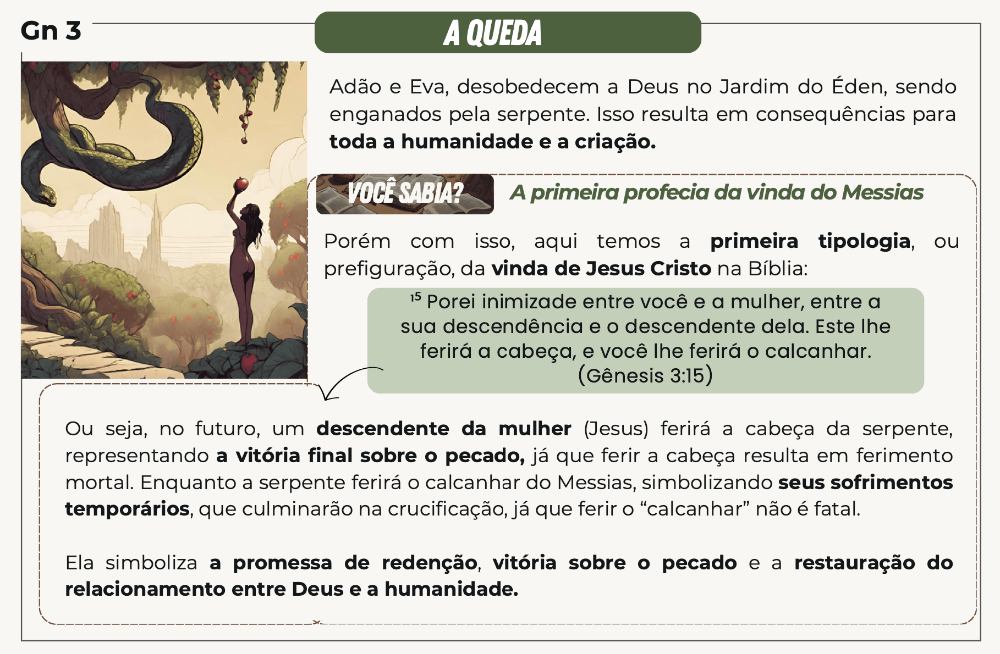

# Dia 01 — Gn 1–3

1. Ler Genesis do capitulo 1 ao 3:
2. Assista a esse vídeo https://www.youtube.com/watch?v=Caad4veNpLo
3. Após Terminar, veja:

## Quem era a serpente?

O texto bíblico revela que a **serpente** que apareceu a Eva era o próprio Satanás veja Ap 12:9 e 2Co 11:3

## O primeiro sacrifício por causa do pecado

A narrativa da criação e do pecado em Gênesis 1-3 é fundamental para a compreensão da teologia cristã sobre pecado, redenção e sacrifício. No relato, Adão e Eva, ao desobedecerem a Deus, introduziram o pecado na humanidade. Como resultado de sua desobediência, eles se tornaram conscientes de sua nudez e sentiram vergonha (Gênesis 3:7). Para cobri-los, Deus fez vestimentas de peles, o que sugere que um sacrifício foi realizado — animais foram mortos para fornecer as roupas que cobriam a nudez e a vergonha do homem.

Este ato de Deus pode ser interpretado como o primeiro exemplo de sacrifício por causa do pecado. Ao sacrificar animais para fazer roupas para Adão e Eva, Deus estabeleceu um princípio que ecoaria ao longo das Escrituras: a ideia de que é necessário um sacrifício para a cobertura e remissão do pecado.

Esse conceito se desenvolveu de maneira mais explícita ao longo da história do povo de Israel, particularmente na Lei de Moisés. Os sacrifícios de animais tornaram-se um elemento central na adoração, servindo como um meio pelo qual o povo buscava expiação e reconciliação com Deus. A morte de um animal em sacrifício simbolizava a transferência dos pecados do povo para o animal, que, em seguida, sofria em seu lugar.

Essa ideia tem seu ápice no Novo Testamento que apresenta Jesus Cristo como o cumprimento dessas antigas promessas e símbolos. Jesus é o "Cordeiro de Deus" que tira o pecado do mundo (João 1:29). Seu sacrifício na cruz é a consumação do sistema de sacrifícios do Antigo Testamento.

> João 19:30 (NTLH): 30 Tendo‑o provado, Jesus disse: **― Está consumado!** Com isso, curvou a cabeça e entregou o espírito.

Jesus se ofereceu em sacrifício perfeito e completo para reconciliar a humanidade com Deus. Portanto, a narrativa do sacrifício feito por Deus, ao fazer as vestimentas para Adão e Eva, é uma antecipação do sacrifício redentor de Jesus Cristo. Assim, a morte de Jesus na cruz é vista não apenas como um ato de amor, mas também como o meio pelo qual a vergonha, o pecado e a separação da humanidade em relação a Deus são finalmente resolvidos. Esta conexão profunda entre o Antigo e o Novo Testamento ressalta a continuidade da obra de Deus na história da redenção, culminando em Cristo, que oferece a todos a possibilidade de uma nova vida e reconciliação com o Criador.

## Comentários sobre esses capítulos

- No primeiro dia, Deus ordenou que a luz se separasse das trevas e, com isso, estabeleceu o ciclo Dia e Noite. Esse ato não deve ser confundido com a criação do sol, da lua e das estrelas no quarto dia.

- Em 2Coríntios 4:6, o apóstolo Paulo estabelece um paralelo da separação entre a luz e as trevas com a conversão do pecador.

> Pois Deus, que disse: “Das trevas resplandeça a luz”, ele mesmo brilhou em nossos corações, para iluminação do conhecimento da glória de Deus na face de Cristo. (NVI)

- A coroa da obra de Deus foi a criação do homem à sua imagem e semelhança. Isso significa que o homem foi colocado na terra como representante de Deus e, de certa forma, partilha características semelhantes com o Senhor: Deus é uma Trindade (Pai, Filho e Espírito Santo), e o homem é um ser tripartite (corpo, alma e espírito); como Deus, o homem possui intelecto, juízo moral, poder de se comunicar com os outros e uma natureza emocional que transcende seus instintos. Não há indicação de semelhança física no texto. Ao contrário dos animais, o homem é um ser criador e adorador, e se comunica com clareza.

- O versículo 26 contempla ou até mesmo faz supor a existência da Trindade: “disse [no hebraico, o verbo está no singular] Deus [Elohim, no plural]: Façamos [plural] o homem à nossa imagem”.
  
- No final do primeiro capitulo, deixa claro que o homem era vegetariano. Essa situação mudou após o dilúvio (cf. 9:1–7).

> *"Eis que lhes dou todas as plantas que nascem em toda a terra e produzem sementes, e todas as árvores que dão frutos com sementes. Elas servirão de alimento para vocês."* (Gênesis 1:29 NVI)

- Assim como o homem os animais também eram herbívoros

> *"E dou todos os vegetais como alimento a tudo o que tem em si fôlego de vida: a todos os grandes animais da terra, a todas as aves do céu e a todas as criaturas que se movem rente ao chão”. E assim foi."* (Gênesis 1:30 NVI)

