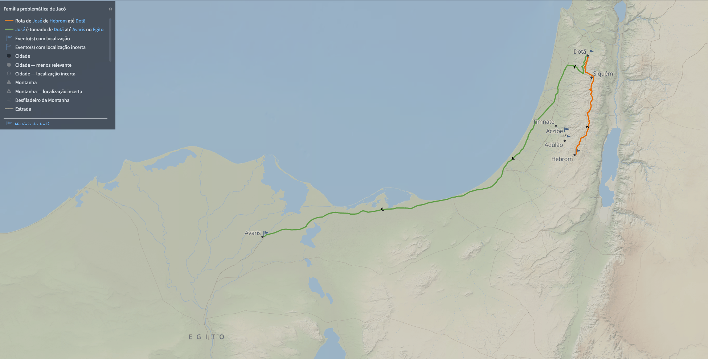

# Dia 11 — Gn 25–26

--- 

- Tempo total de Leitura: 11:38

1. Leia Genesis capitulo 25 até o final do capitulo 26

##### Quer ouvir uma narração desses capítulos?

- Cap 25: https://www.bible.com/pt/audio-bible/211/GEN.25.NTLH
- Cap 26: https://www.bible.com/pt/audio-bible/211/GEN.26.NTLH

---

## Onde?

> *"Abraão deixou tudo o que tinha para Isaque, mas deu presentes para os filhos das suas concubinas. E, antes de morrer, separou-os de Isaque e mandou que fossem morar na terra do Oriente"* (Gênesis 25:5-6 NTLH)

A Terra do oriente, ficava ao sudeste de Hebrom, onde fica o deserto da Arábia, um local predominantemente árido e desértico. Atualmente, há várias cidades importantes nessa macro-região, incluindo Meca e Medina, que são cidades sagradas para o Islã. O que faz sentido do ponto de vista da narrativa bíblica, já que Ismael, um dos filhos de Abraão, é considerado pai do povo árabe. 

Também é nessa região onde Midiã, outro filho de Abraão com Quetura, vai formar o povo dos Midianitas. Além desses dois povos diretamente descententes de abraão, também é pra onde Esaú, filho de Isaque vai. Ele constroi uma nação que vai virar Edom. Esses dois povos, Midiãnitas e Edomitas, vão aparecer varias vezes, posteriormente na história, onde frequentemente vão entrar em conflito com o povo de Israel, sendo descritos como inimigos em várias passagens. 

Observação: Moabe ao norte de Edom e Amom, vem da decendencia de Ló com suas prórpia, suas filhas. Lembre-se de Gn 19.

> *"Assim, as duas filhas de Ló ficaram grávidas do próprio pai. A mais velha teve um filho, a quem deu o nome de Moabe. Ele foi o pai dos moabitas de hoje. A mais nova também teve um filho e pôs nele o nome de Ben-Ami. Ele foi o pai dos amonitas de hoje."* (Gênesis 19:36-38 NTLH)

O principal centro urbano dos amonitas era a cidade Rabat-Ammon, que hoje é conhecida como Amã, a capital da Jordânia. A cidade de Amã tem seu nome derivado de Ammon.

### A vida de Isaque

Isaque reagiu da mesma forma que seu pai e fez Rebeca se passar por sua irmã diante dos homens de Gerar. É a triste história da fraqueza do pai refletida no filho. A mentira de Isaque foi descoberta e repreendida; então ele confessou. A confissão conduz à bênção, e Isaque começou a enriquecer em Gerar. Sua prosperidade chegou a tal ponto que Abimeleque, rei de Gerar naquela ocasião, pediu que Isaque fosse embora.

Os filisteus entupiram os poços que Abraão havia cavado (ato hostil, a fim de mostrar que os forasteiros não eram bem-vindos). Isaque tornou a abrir os poços e houve briga com os filisteus em Eseque (“contenda”) e Sitna (“inimizade”). Isaque decidiu se mudar para longe daquele povo e dessa vez não houve brigas quando cavou outro poço.

## Direito da Primogenitura

É muito provavel que Isaque tenha crescido ouvindo as história do seu avó Abraão. Já que quando ele morreu Jacó tinha 15 anos. Ou seja ele provavelmente sabia da Profecia de Deus feita para seu avó e depois para seu pai, que atrávez da decendencia deles, viria a benção para todas os povos da Terra. Provavelmente por isso ele queria o direito da primogenitura. 

Como primogênito, Esaú tinha direito à porção dupla dos bens de seu pai, isto é, deveria receber duas vezes mais herança do que qualquer outro filho. Ele também se tornaria o chefe da tribo ou da família. Esses privilégios estavam relacionados ao “direito de primogenitura”, que, no caso de Esaú, ainda incluiria a honra de se tornar ancestral do Messias, que ele perdeu quando trocou pelo prato de comida.

Uma coisa ficou muito clara: Jacó valorizou o direito de primogenitura e o privilégio de participar da linhagem piedosa, enquanto Esaú preferiu satisfazer o apetite da carne em detrimento das bênçãos espirituais.
Em vez de criticar o modo com que Jacó tratou seu irmão, o capítulo encerra enfatizando o desprezo de Esaú por seu direito de primogenitura. Os descendentes de Esaú, os Edomitas, se tornaram inimigos mortais de Israel. A destruição final dos edomitas foi decretada em Obadias, mais de 1000 anos depois.

## Comentários sobre esses captitulos

- Abraão tinha 86 anos quando Ismael nasceu (Gênesis 16:16).
- Abraão tinha 100 anos quando Isaque nasceu (Gênesis 21:5). Ou seja Ismael era 14 anos mais velho que Isaque.
- Quando sara morreu, Abraão tinha 137 anos. e Isaque 37.
- Isaque se casou com 40, 3 anos depois da morte de Sara.
- O verso 9, fala que Seus filhos, Isaque e Ismael, o sepultaram na caverna de Macpela. Nessa época os filhos de Isaque Esaú e Jacó tinham 15 anos, é provável pela idade, que estavam junto com seu Pai e seu tio Ismael.
- Rebeca, amava mais a Jacó. Talvez Jacó tenha crescido como um “filhinho da mamãe”.
- Esaú implorou tanto por aquele ensopado que acabou ganhando o apelido de “vermelho” (Edom). O apelido pegou de tal forma que seus descendentes passaram a ser conhecidos como edomitas.
- É muito provável que Abraão so tenha se casado oficialmente com Sara. Quetura na verdade seria uma concubina. Em 1Crônicas 1:32, fala que Quetura era cuncubina e não casada como está em Genesis 25. A realidade é que muitas traduções traduzem a palavra לקח "lqh" (soa como Lekar) como casou, porém ela tem mais o sentidos de Tomou ou pegou. Esse ponto é importante por que mostra que o único herdeiro por direto de Abraão era Isaque.

Sentido dessa palavra

Veja como essa mesma palavra foi traduzida em diferentes lugares:

Provavelmente a Almeida Corrigida e Fiel é que traz a tradução mais coerente com o fato dela ser uma concubina e não uma esposa, traduzindo para "tomou".

- Era um costume do Antigo Oriente que o chefe de um clã ou tribo tivesse várias mulheres, além da esposa principal. Ele podia também ter esposas secundárias e concubinas. A diferença estava no status legal dos filhos: os filhos das esposas secundárias tinham direito à herança e à riqueza do patriarca, enquanto os filhos das concubinas não possuíam esse direito de forma garantida, a menos que recebessem algo por generosidade do chefe do clã.