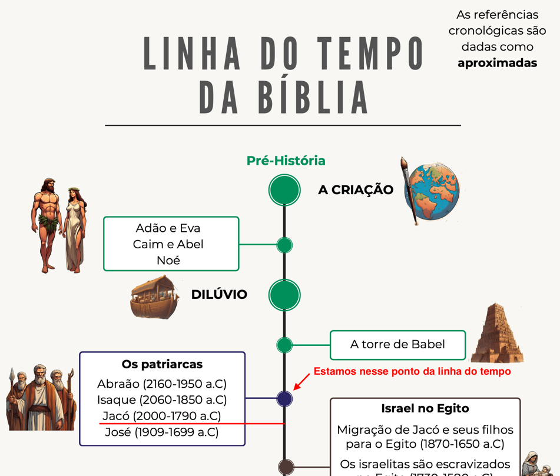
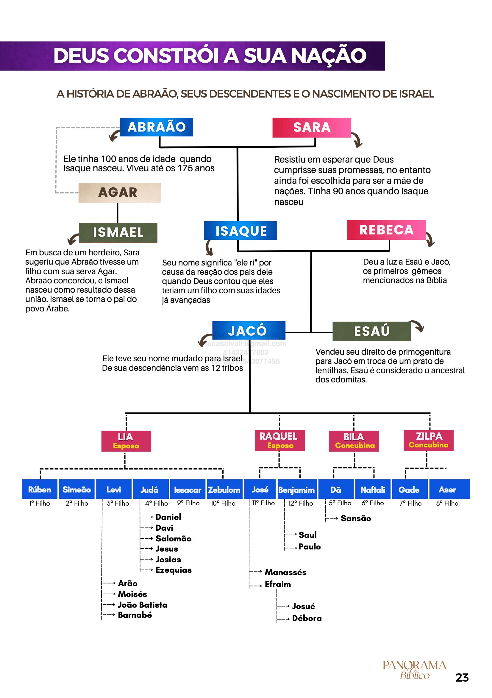

# Dia 13 — Gn 29–30

--- 

- Tempo total de Leitura: 12:48

1. Leia Genesis capitulo 29 até o final do capitulo 30

##### Quer ouvir uma narração desses capítulos?

- Cap 29: https://www.bible.com/pt/audio-bible/211/GEN.29.NTLH
- Cap 30: https://www.bible.com/pt/audio-bible/211/GEN.30.NTLH!

---

## Onde?

A história toda do 29 e 30 se passa em Harã, na casa do seu Tio Labão, irmão de sua Mãe Rebeca, para onde Jacó foi capítulo 28.

## Quando?

## Abraão, Isaque e Jacó e seus filhos

## Comentários sobre esses captitulos

- Jacó tinha 77 anos quando partiu de Berseba para Harã. Serviu o tio Labão por vinte anos. Quando ele voltar pra canaã ele terá 97 anos.

- De acordo com o costume da época, a noiva só podia entrar no quarto do noivo na noite de núpcias. Entrava vestida com um véu e, provavelmente, somente depois que o quarto estivesse em total escuridão. Podemos imaginar a ira de Jacó quando descobriu na manhã seguinte que sua esposa era Lia!

- Jacó recebeu Raquel como esposa depois de uma semana, porém teve que servir mais sete anos depois disso. Jacó semeou engano e agora estava colhendo o que plantou! 

- Quando o Senhor percebeu que Lia era desprezada (menos amada que Raquel), compensou essa deficiência lhe concedendo filhos. Lia reconheceu o auxílio do Senhor, conforme se percebe nos nomes que deu aos filhos (v. 32–33,35).

- Também de Lia procedem os sacerdótes (Levi), a linhagem real (Judá) e Cristo.

- Desesperada para ter um filho em seu colo, Raquel entregou Bila, sua serva, para servir de esposa ou concubina a Jacó. Ainda que esse tipo de coisa fosse comum naqueles dias, na verdade tratava-se de uma atitude contrária à vontade de Deus.

- As mandrágoras que Rúben encontrou eram um fruto parecido com o tomate que, conforme os supersticiosos da época, auxiliava no tratamento da esterilidade feminina. Considerando que Raquel era estéril, não espanta seu enorme desejo de ficar com as tais mandrágoras. Em troca delas, Raquel concordou em deixar Lia viver como esposa de Jacó (parece que Lia, por alguma razão desconhecida, perdera seus privilégios de esposa). 

- Finalmente, Raquel concebeu e deu à luz seu primeiro filho, que recebeu o nome de José (“aumentador”), expressando a fé de que Deus lhe daria outro filho.

- Labão aceitou a proposta de Jacó, mas fez de tudo para que não desse certo. Labão separou todos os animais que se enquadravam na descrição de Jacó e pediu a seus filhos que os pastoreassem, sabendo que aqueles animais provavelmente iriam se reproduzir com as características descritas por Jacó. O restante do rebanho foi entregue para Jacó pastorear. Além disso, Labão separou os dois rebanhos por uma distância de três dias de viagem, tornando impossível ao rebanho dos malhados (pastoreado por seus filhos) se misturar e procriar com o rebanho dos que não tinham manchas (pastoreado por Jacó)
