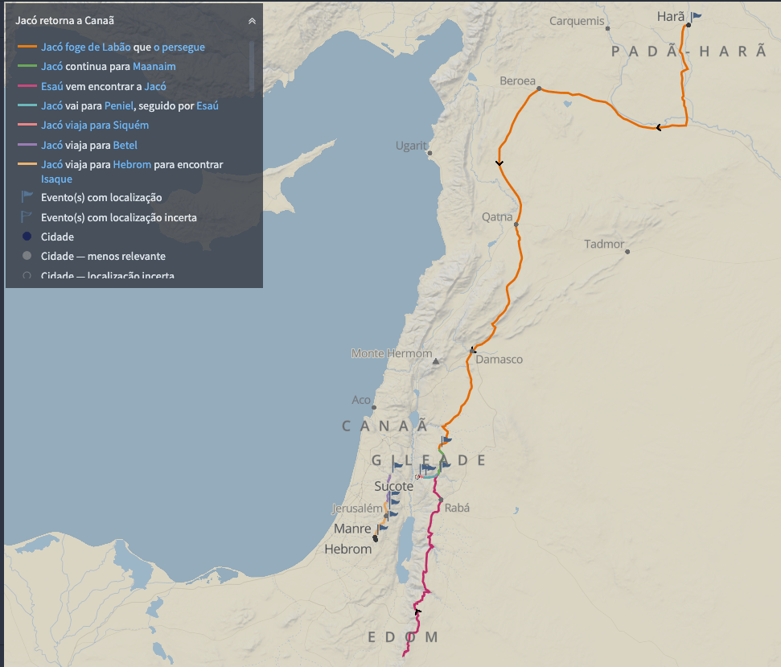
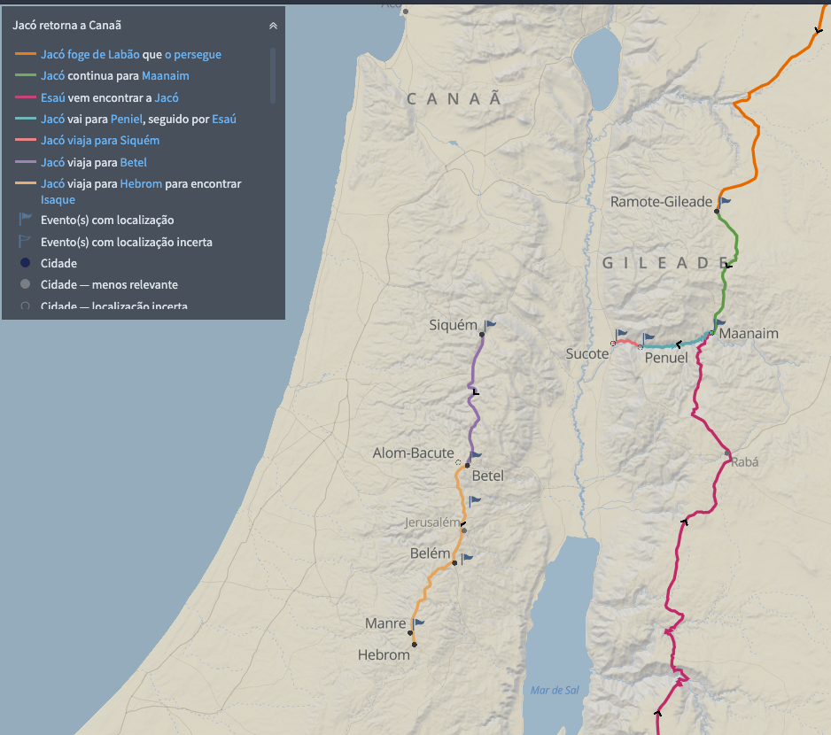

# Dia 14 — Gn 31–32

--- 

- Tempo total de Leitura: 12:26

1. Leia Genesis capitulo 31 até o final do capitulo 32
2. Assista esse vídeo: https://www.youtube.com/watch?v=f_yWA_AIcGI&t=25s

##### Quer ouvir uma narração desses capítulos?

- Cap 31: https://www.bible.com/pt/audio-bible/211/GEN.31.NTLH
- Cap 32: https://www.bible.com/pt/audio-bible/211/GEN.32.NTLH!

---

## Onde?

Em Gênesis 31, Jacó decide deixar Harã, onde passou 20 anos, e retornar à sua terra natal, Canaã, por instrução de Deus. Ele parte com sua família e rebanhos. Ao se aproximar de Canaã, em Gênesis 32, Jacó se preocupa com o reencontro com seu irmão Esaú e envia mensageiros para apaziguá-lo. Ele cruza o rio Jaboque, onde tem um encontro sobrenatural, lutando com Deus, o que resulta em sua mudança de nome para Israel. Essa jornada reflete tanto seu deslocamento físico quanto sua transformação espiritual.

## Quando? 

Aproximadamente em 1709 a.C., Jacó chegou a Harã, onde trabalhou por sete anos antes de se casar com Lia e Raquel em 1702 a.C. Considerando que ele teve que trabalhar esses sete anos antes de se casar, e levando em conta que uma gestação dura, no máximo, cerca de nove meses, é razoável concluir que Rúben, o primogênito, teria no máximo 12 anos na época da viagem de volta a Canaã.

Veja essas considerações abaixo:
- Lia, a primeira esposa de Jacó, foi a mãe dos quatro primeiros filhos: Rúben, Simeão, Levi e Judá.
- Somente depois de Lia não conseguir mais ter filhos é que as concubinas, Bila e Zilpa, começaram a ter relações com Jacó, cada um representando uma esposa.
- Rúben, o primogênito, provavelmente tinha pelo menos 4 anos, ou talvez um pouco mais, no momento do nascimento de Issacar. Isso se deve ao contexto da colheita das mandrágoras e das trocas entre Lia e Raquel, que ocorreram durante uma intensa rivalidade pela fertilidade. 
- Essas trocas foram feitas após as concubinas já estarem grávidas, refletindo a competição familiar em busca de mais descendêntes. 
- José, o primeiro filho de Raquel, só nasceu depois de Diná, a última filha de Lia.

Considerando esses fatores acima, aqui estão as idades aproximadas de cada filho de Jacó na viagem de volta a Canaã, 20 anos após sua chegada em Harã e considerando que Rubén foi o primeiro que nasceu logo depois do casamento com Lia. As idades podem variar 1 ano a mais ou a menos.

- Rúben: 12 anos (No máximo)
- Simeão: 11 anos
- Levi: 10 anos
- Judá: 9 anos
- Dã: 9 anos (por Bila)
- Gade: 9 anos (por Zilpa)
- Naftali: 8 anos (Por Bila)
- Aser: 8 anos (Por Zilpa)
- Issacar: 8 anos 
- Zebulom: 7 anos
- Diná: 6 anos
- José: 5 anos (No máximo)

A viagem de retorno para Canaã ocorreu em 1689 a.C., enquanto Benjamim, o filho mais novo de Jacó e Raquel, nasceu apenas em 1680 a.C., ou seja, nove anos após o retorno.

Durante essa viagem, as idades aproximadas das esposas de Jacó eram as seguintes:

- Jacó: 97 anos
- Lia: 37 anos
- Raquel: 35 anos
- Zilpa: 33 anos
- Bila: 30 anos

Devido à riqueza de Jacó, que incluía seus filhos, animais e servos que o acompanhavam, é provável que a viagem tenha levado muito mais tempo do que o habitual. Viajar com um grande número de pessoas e animais, tende a ser muito mais lento do que viajar sozinho ou em grupos pequenos, só lembrar que jacó deu pelo 580 animais para Ezaú, imagina o tamanho dessa "comitiva". Assim, é razoável supor que a viagem tenha durado talvez até meses para ser concluída.

## Comentários sobre esses capítulos

- Jacó, percebendo a inveja de Labão, recebeu de Deus a ordem de retornar a Canaã. Ele explicou a Raquel e Lia como Labão o havia enganado, mencionou o voto que fizera e compartilhou que Deus o favorecera. As esposas concordaram em acompanhá-lo na jornada.

- Antes de fugir, Raquel roubou os ídolos de seu pai, Labão, e os escondeu. Esses ídolos representavam liderança e garantiam ao marido o direito sobre os bens do pai da esposa. Como Labão tinha filhos homens, o furto de Raquel foi um ato grave, destinado a proteger a posse das propriedades de Labão para seu marido, Jacó.

- Labão propôs um pacto a Jacó, que não era uma aliança de amizade, mas um acordo entre dois trapaceiros. O pacto incluía uma cláusula de não-agressão, de não tomar outras esposas e de não ultrapassar a fronteira do monte para atacar um ao outro, entre outras coisas.

- Jacó se lembrou de Esaú e fez uma oração por desespero e necessidade de proteção divina, porém não confiou totalmente em Deus, pelo contrário, ele enviou três rebanhos, um de cada vez, totalizando 580 animais, para serem entregues como presentes a Esaú, esperando que isso aplacasse a ira do irmão. Jacó demonstrou incredulidade ao recorrer a essa estratégia, ou, no mínimo, uma mistura de fé e incredulidade.

- Jacó passou a noite em Peniel e teve uma experiência transformadora, lutando com um homem que era na verdade, Deus. Durante a luta, o Senhor rompéu o nervo na perna de Jacó, deixando-o manco para sempre. Embora tenha perdido a luta física, ele obteve uma vitória espiritual ao reconhecer sua fraqueza e confessar que seu nome era Jacó, um "vigarista". No final, Deus mudou seu nome para Israel, significando "aquele que luta com Deus" entre outros significados.