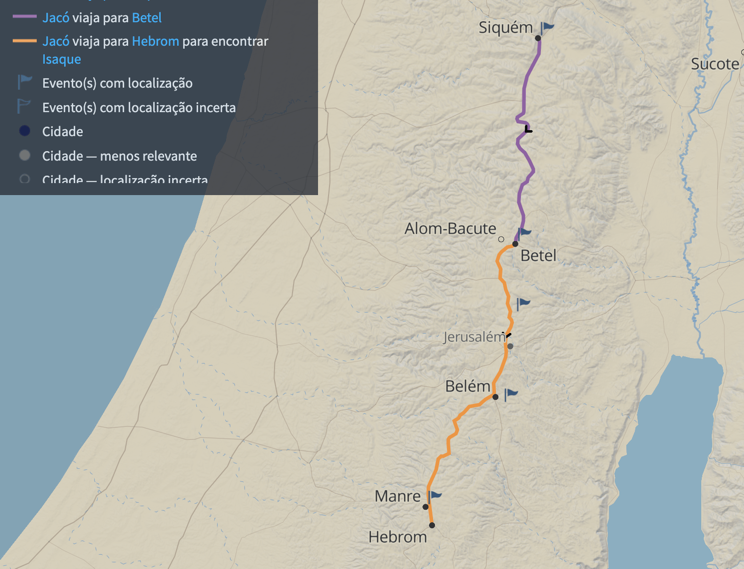

# Dia 16 — Gn 35

--- 

- Tempo total de Leitura: 05:00

1. Leia Genesis capitulo 35.8 até o final.
2. Leia o [resumo do Cap 36](#resumo-do-cap-36), pois vamos pular.
3. Veja esse Vídeo: https://www.youtube.com/watch?v=H0s00rFvQJU

##### Quer ouvir uma narração desses capítulos?

- Cap 35: https://www.bible.com/pt/audio-bible/211/GEN.35.NTLH

---

## Onde?

Jacó e sua família partiram de Betel em direção ao sul e, durante a viagem, Raquel faleceu ao dar à luz Benjamim. O local tradicionalmente identificado como sua sepultura ainda pode ser visto na estrada que liga Jerusalém a Belém. Surge então uma questão: por que Raquel não foi sepultada junto a Abraão, Sara e Rebeca na caverna de Macpela, em Hebrom? Não temos essa resposta.

## Resumo do Cap 36.

- O Cap 36 é basicamente genealogias de Esaú, que vão habitar a terrra de Edom, situada ao sudeste do mar Morto. Essa genealogia representa o cumprimento da promessa de que Esaú seria líder de uma nação (25:23).

- Nenhum dos descendentes de Esaú é mencionado como homem fiel a Deus; antes, perderam-se na obscuridade dos que abandonam o Deus vivo. Desfrutaram riqueza e fama neste mundo, mas nada  guardaram  para a eternidade.

## Comentários sobre esses capítulos

- Raquel morreu após ter dado à luz um menino. a quem chamou de Benoni (“filho da minha tristeza”). Jacó, porém, mudou o nome de seu décimo segundo filho para Benjamim (“filho da minha mão direita”).

- O texto faz uma breve menção ao pecado de Rúben com Bila, concubina de seu pai, pecado que o fez perder o direito de primogenitura. Essa foi transferida para José, vamos ver isso mais a frente.

- Embora o versículo 26 declare que todos nasceram em Padã-Arã, na verdade Benjamim (v. 24) é exceção, pois nasceu em Canaã (v. 16–19).

- Jacó retornou a Hebrom a tempo de rever seu pai, Isaque, antes da morte deste. Rebeca, sua mãe, falecera alguns anos antes. Esse capítulo menciona o funeral de três pessoas: Débora, a ama de Rebeca (v. 8), Raquel (v. 19) e Isaque (v. 29).

