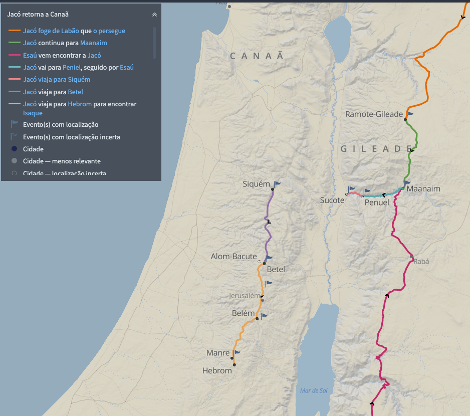

# Dia 15 — Gn 33–34

--- 

- Tempo total de Leitura: 09:17

1. Leia Genesis capitulo 31 até o final do capitulo 32

##### Quer ouvir uma narração desses capítulos?

- Cap 31: https://www.bible.com/pt/audio-bible/211/GEN.31.NTLH
- Cap 32: https://www.bible.com/pt/audio-bible/211/GEN.32.NTLH!

---

## Onde?

Em Gênesis 31, Jacó decide deixar Harã, onde passou 20 anos, e retornar à sua terra natal, Canaã, por instrução de Deus. Ele parte com sua família e rebanhos. Ao se aproximar de Canaã, em Gênesis 32, Jacó se preocupa com o reencontro com seu irmão Esaú e envia mensageiros para apaziguá-lo. Ele cruza o rio Jaboque, onde tem um encontro sobrenatural, lutando com Deus, o que resulta em sua mudança de nome para Israel. Essa jornada reflete tanto seu deslocamento físico quanto sua transformação espiritual.

## Comentários sobre esses capítulos

- Mesmo depois do que aconteceu em Penuel, quando percebeu a aproximação de Esaú, Jacó voltou a ter medo e passou a agir por instinto, organizando a disposição de sua família para maximizar proteção àqueles a quem mais amava. Esaú, porém, demonstrou tranquilidade e cortesia e ficou muito animado quando viu Jacó, suas esposas e seus filhos. Jacó parece ter demonstrado subserviência excessiva, ao se colocar como servo de Esaú. Além disso, alguns acreditam que Jacó tenha recorrido ao exagero e à bajulação.

- Vinte anos antes, quando Deus lhe apareceu em Betel, Jacó prometeu que se o Senhor lhe ajuda-se na viagem, ele entregaria o dízimo de sua riqueza ao Senhor e que faria de Betel a casa de Deus (28:20–22). Em vez de retornar para Betel e cumprir seus votos, Jacó se distanciou cerca de cinquenta quilômetros e foi morar na região fértil de Siquém, provavelmente porque ali havia pasto para seu rebanho. Deus só voltou a falar diretamente com Jacó vários anos depois, quando o chamou para cumprir seus votos (35). Nesse meio tempo, ocorreram os trágicos acontecimentos registrados no capítulo 34.
