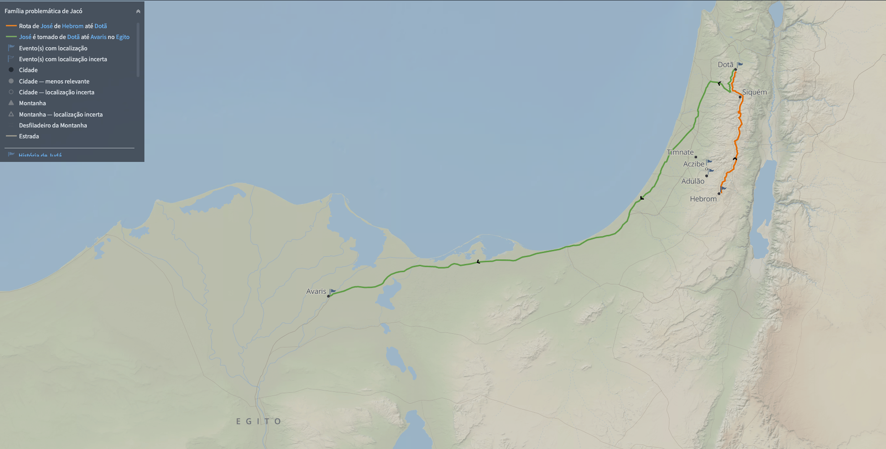

# Dia 17 — Gn 37

--- 

- Tempo total de Leitura: 05:00

1. Leia Genesis capítulo 37

##### Quer ouvir uma narração desses capítulos?

- Cap 37: https://www.bible.com/pt/audio-bible/211/GEN.37.NTLH

---

## Onde?

O verso 12 cap 37, diz que eles os irmãos estavam cuidando do rebanho perto de Siquém, isso era longe de hebrom, pelo menos 4 dias de viagem. Quando se perdeu, procurou ajuda e um homem indicou que eles estavam em Dotã, ainda mais ao norte de Siquém. De Dotã, ele foi vendido e seguiu rumo ao Egito, uma viagem de semanas.

## Quando?

Com base nessas referências que construimos até agora, essas são as idades estimadas dos filhos de Jacó durante o episódio da venda de José.

- Rúben: 24 anos (No máximo)
- Simeão: 23 anos
- Levi: 22 anos
- Judá: 21 anos
- Dã: 21 anos
- Gade: 21 anos
- Naftali: 20 anos
- Aser: 20 anos
- Issacar: 20 anos
- Zebulom: 19 anos
- Diná: 18 anos
- José: 17 anos (Está explicito)
- Benjamim: 3 anos

- Jacó teria 109 anos

## Rúben tinha alguma afeição por José? 

Observamos que Rúben parecia demonstrar alguma preocupação por José, pelo menos mais do que os outros irmãos. Quando decidiram jogar José na cisterna, Rúben inicialmente sugeriu que não o matassem, mas o colocassem na cisterna, com a intenção de resgatá-lo mais tarde e devolvê-lo ao pai (Gênesis 37:21-22). À primeira vista, isso pode sugerir que ele tinha algum afeto por José, mas também pode ser interpretado como uma tentativa de evitar um possível castigo de Jacó caso algo acontecesse ao irmão.

Como primogênito, Rúben provavelmente estava mais consciente de sua responsabilidade sobre os irmãos, especialmente em uma família onde o primogênito exercia um papel de liderança. A ideia de que ele temia falhar na responsabilidade de cuidar de José e depois ter que explicar ao pai o que aconteceu é bastante plausível. Quando Rúben retorna e encontra a cisterna vazia, sua reação de horror faz sentido, pois ele seria o primeiro a enfrentar as consequências de uma falha nesse cuidado. Essa preocupação é reforçada pelo que ele diz no versículo 30:

> *"Ele voltou para o lugar onde os seus irmãos estavam e disse: — O rapaz não está mais lá! E agora o que é que eu vou fazer?”* (Gênesis 37:30 NTLH)

Aqui, fica claro que a principal preocupação de Rúben é com o que ele fará agora, diante da ausência de José. Isso sugere que sua ação não foi movida por afeto por José, mas por uma sensação de responsabilidade sobre ele, acompanhada pelo medo das repercussões de sua falha.

## José e sacrifício do Bode

Para acobertar o ato, resolveram matar um bode e molharam a túnica de José com seu sangue. Esse ato dos irmãos de José pode ser visto como um tipo simbólico que aponta para Cristo. A cena pode ser analisada como uma analogia de como, na Nova Aliança, o sangue de Cristo foi derramado para cobrir o pecado da humanidade. Assim como os irmãos de José usaram o sangue de um animal para "limpar" a culpa deles perante o pai, o sacrifício de Cristo, o Cordeiro de Deus, oferece perdão e a "limpeza" dos nossos pecados diante de Deus.

É evidente que o sangue do bode não trouxe verdadeira redenção para os irmãos de José, pois foi um ato superficial, uma tentativa de "limpeza" que não tratou a verdadeira questão do pecado que os irmãos cometeram. Eles estavam tentando escapar das consequências de sua ação cruel contra José, e o sacrifício do bode não fez com que a culpa que carregavam fosse expiada.

No entanto, isso nos leva a uma verdade importante: o sangue dos animais, mesmo com seu simbolismo no Antigo Testamento, nunca foi suficiente para remir completamente os pecados da humanidade. Mas o sangue de Cristo, derramado na cruz, traz verdadeira purificação e salvação.

No contexto do Antigo Testamento, os sacrifícios de animais eram uma sombra do verdadeiro sacrifício que viria com Cristo. O sangue de touros, bodes e cordeiros não podia remover o pecado, mas era um símbolo da promessa de um sacrifício perfeito, capaz de trazer verdadeira redenção. Como diz a Carta aos Hebreus:

> *"A lei dada por Moisés não é um modelo completo e fiel das coisas verdadeiras; é apenas uma sombra das coisas boas que estão para vir. [...] Pois o sangue de touros e de bodes não pode, de modo nenhum, tirar os pecados de ninguém."* (Hebreus 10:1 e 4 NTLH)

Esses sacrifícios apenas apontavam para a necessidade de algo maior e mais definitivo. No caso dos irmãos de José, o sangue do bode não solucionou o problema deles nem restaurou o relacionamento com Jacó. Eles permaneceram com a culpa e o peso da ação que haviam cometido. Na verdade, a mentira se tornou mais um fardo sobre eles, pois mentir ao pai gerou um sofrimento emocional e moral adicional. Essa comparação novamente nos ensina sobre o custo do pecado: a morte. Como em Gênesis 3, há necessidade de um sacrifício para cobrir o pecado.

Agora, ao pensarmos na redenção verdadeira que vem através de Cristo, vemos que o sacrifício de Jesus é o único que traz a verdadeira remissão dos pecados. O sangue de Cristo, diferente dos sacrifícios dos animais, não encobre os nossos pecados ou os mascara de maneira superficial; ao contrário, ele traz uma purificação real, eterna e definitiva. Jesus, o Cordeiro de Deus, não foi sacrificado para enganar ninguém, mas para restaurar nossa relação com Deus de forma profunda e verdadeira.

Jesus não esconde a nossa culpa; ele a leva sobre si e a paga de maneira justa, tornando possível para nós a verdadeira reconciliação com Deus. O sangue de Cristo é eficaz porque, ao contrário do sacrifício dos animais, ele não apenas apaga a culpa momentaneamente, mas oferece uma redenção eterna, resolvendo a questão do pecado de forma completa e levando-nos a uma reconciliação genuína com Deus.

## Comentários sobre esses capítulos

- Logo no segundo versículo, vemos que José não compactuava com os pecados dos irmãos, e entregava eles para o Pai, provavelmente isso foi o que começou a gerar a Raiva dos Irmãos. 

- A túnica talar de mangas compridas era sinal do carinho especial do pai, fato que despertou ciúmes e ódio nos irmãos.

- José e os ismaelitas eram parentes, uma vez que os ismaelitas eram descendentes de Ismael, meio-irmão de Isaac, pai de Jacó (avô de José), seria algo como primos de segundo grau.
