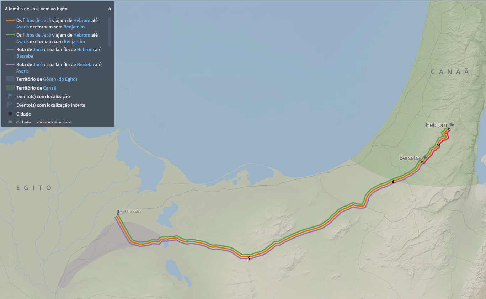

# Dia 18 — Gn 38-40

--- 

- Tempo total de Leitura: 16:09

1. Leia Genesis capítulo 41 até o final do capítulo 42.

##### Quer ouvir uma narração desses capítulos?

- Cap 41: https://www.bible.com/pt/audio-bible/211/GEN.41.NTLH
- Cap 42: https://www.bible.com/pt/audio-bible/211/GEN.42.NTLH

---

## Onde?

Os capítulos 40 e 41 do livro de Gênesis se passam no Egito, durante o período em que José está preso e posteriormente ascende ao poder.

## Quando?

José foi vendido como escravo aos 17 anos (Gênesis 37:2) e se tornou governador do Egito aos 30 anos (Gênesis 41:46). Ele previu 7 anos de fartura e 7 anos de fome. Como a fome durou 7 anos, e eles foram antes do final, é provável que tenham chegado entre o 1º e o 2º ano da fome, quando José tinha 38 ou 39 anos. Sendo assim, essas são as idades aproximadas dos seus irmãos e pai quando ele se torna governador:

- Rúben: 46 anos
- Simeão: 45 anos
- Levi: 44 anos
- Judá: 43 anos
- Dã: 43 anos
- Gade: 43 anos
- Naftali: 42 anos
- Aser: 42 anos
- Issacar: 42 anos
- Zebulom: 41 anos
- Diná: 40 anos
- José: 39 anos
- Benjamim: 25 anos

- Jacó teria 131 anos

## Judá e Tamar

O primeiro erro de Judá foi casar-se com uma cananeia, filha de Sua, com quem teve três filhos: Er, Onã e Selá. Quando Er se casou com Tamar, sua perversidade levou o Senhor a matá-lo.

Pela tradição, Onã deveria gerar descendência para seu irmão, mas recusou-se repetidamente, movido pelo egoísmo. Sua atitude impediu a continuidade da linhagem messiânica, e o Senhor o puniu com a morte. Com medo de perder Selá, Judá instruiu Tamar a aguardar, mas nunca teve a intenção de dar-lhe seu filho em casamento, provavelmente Judá via Tamar como uma mulher amaldiçoada.

Quando percebeu que havia sido enganada, Tamar disfarçou-se de prostituta, e atraiu Judá, que sem reconhecê-la, deitou-se com ela e deixou seu selo, cordão e cajado como garantia de pagamento. Quando tentou recuperar os objetos, a "prostituta" havia desaparecido.

Meses depois, Tamar foi acusada de adultério e condenada à morte. No entanto, revelou os pertences de Judá, provando que ele era o pai da criança. Ela deu à luz gêmeos: Perez, ancestral da linhagem messiânica, e Zera.

Jesus, vem pela linhagem de Perez, e esse episódio mostra como Deus usa até mesmo os erros humanos para cumprir Seu plano.

## José Governador

Não parece estranho que Faraó tenha colocado um prisioneiro hebreu para governar todo o Egito, baseado apenas na interpretação de um sonho, sem nem mesmo ter condições de verificar sua veracidade?

A resposta para isso se encontra em Provérbios 21:1. José se tornou o primeiro de muitos judeus piedosos a ocupar posições de destaque em governos gentios.

> *"Para o SENHOR Deus, controlar a mente de um rei é tão fácil como dirigir a correnteza de um rio."* (<a href="https://www.bible.com/pt/bible/211/PRO.21.NTLH" target="_blank" onclick="window.open(this.href, 'popup', 'width=600,height=400'); return false;">Provérbios 21 (NTLH)</a>)

## Comentários sobre esses capítulos
- A repetição ou duplicação do sonho indicava que a coisa foi estabelecida por Deus e, portanto, ocorreria sem dúvida (Deus se apressa a fazê-la). Comprovação disso pode ser percebida nos dois sonhos de José sobre seu futuro 
  <a href="https://www.bible.com/pt/bible/211/GEN.37.NTLH#:~:text=sonho%20que%20tive.-,7Sonhei,-que%20est%C3%A1vamos%20no" target="_blank" onclick="window.open(this.href, 'popup', 'width=600,height=400'); return false;">(37:6–9)</a>
 e nas visões semelhantes em <a href="https://www.bible.com/pt/bible/211/DAN.2.NTLH" target="_blank" onclick="window.open(this.href, 'popup', 'width=600,height=400'); return false;">Daniel 2</a>
  e <a href="https://www.bible.com/pt/bible/211/DAN.7.NTLH" target="_blank" onclick="window.open(this.href, 'popup', 'width=600,height=400'); return false;">Daniel 7</a>
  . O número dois na Bíblia representa testemunho.

- José respondeu a Faraó de modo semelhante ao copeiro e ao padeiro na prisão. “Não está isso em mim; mas Deus dará resposta favorável” (v. 16; cf. 40:8). Essa humildade tornou possível ao Senhor confiar uma grande responsabilidade a José, sem receio de que isso corrompesse o caráter de seu servo.

- Faraó alterou o nome de José para Zafenate-Paneia. Não há certeza sobre o significado desse nome. Alguns acreditam que seja “Salvador do mundo”; outros dizem que provavelmente significa “Deus fala” e “Deus vive”.

- A abundância dos primeiros sete anos foi tão grande, que se tornou impossível manter registro exato de toda a produção. Nesse período, nasceram os dois filhos de José: Manassés (“que causa esquecimento”) e Efraim (“duplamente frutífero”). Ou seja, José passou a prosperar depois que esqueceu os males cometidos contra ele.

- Jacó enviou dez filhos para buscar alimento. Somente Benjamim ficou, pois Jacó o considerava o único filho vivo de sua amada esposa Raquel. Ao chegarem em casa e contarem a história, nem mesmo a oferta de Rúben de dar a vida de seus dois filhos como garantia do retorno de Benjamim convenceu o patriarca a deixá-lo partir, pois temia que ele sofresse algum desastre no caminho. A fome gravíssima, porém, forçou Jacó a agir. De certa forma os 7 anos de fome acabou sendo a forma que Deus encontrou para reúnir a família de José, servindo duas vezes com propósitos diferentes, antes foi o que tornou josé governador.

- José tratou asperamente seus irmãos: acusou-os de serem espiões e os lançou em prisão. Três dias depois, decidiu que Simeão permaneceria detido, enquanto os outros nove deveriam retornar a Canaã e trazer Benjamim, o irmão mais novo. José os despachou com amplo suprimento de cereal e comida para o caminho, além de lhes restituir o dinheiro que haviam levado para pagar os cereais. A narrativa mostra claramente o amor e a compaixão de José por seus irmãos (v. 24a,25), bem como o peso que aumentava no coração dos irmãos da culpa pelo pecado que tinham cometido contra ele vinte anos antes (v. 21–22). A intenção de José, obviamente, era forçar os irmãos a se confessarem culpados.

- A caminho de casa, um dos irmãos encontrou seu dinheiro dentro do saco de cereal. Isso causou pânico geral, pois temeram ser acusados de roubo. Ao chegarem em casa e contarem a história, cada um encontrou o dinheiro que havia levado, e o temor aumentou.

